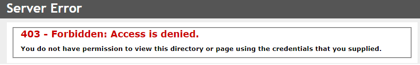
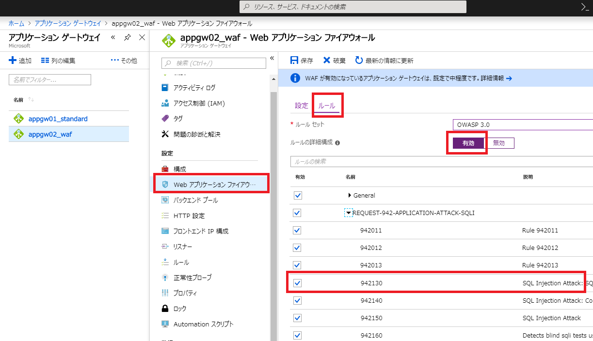

こんにちは、Azure サポートチームの山崎です。
今回は Application Gateway で Web アプリケーション ファイアウォール（ WAF ） 機能をご利用の際によくお問い合わせをいただく "949110" ルールについてご紹介します。

## ■ WAF 機能で検知した情報をログから確認したい
一般的な WAF の導入シナリオとして、WAF 機能をいきなり本番環境に導入してしまうとフォールスポジティブや (誤検知) フォールスネガティブ (見逃し) に合致してしまう可能性があります。
そのため、まずは本番導入前に通信の破棄は行わず、検知のみを行ってログ情報からフォールスポジティブ、フォールスネガティブが発生していないか確認したいというご要望を多くいただきます。
Application Gateway の WAF 機能でも検知モード、ログ出力に対応しており、以下を設定することで導入前のテストを実施いただけます。

 
### 検知モード / 防止モード
検知モードでは脆弱性の診断は実施されますが、対象の通信が異常と判定された場合でも通信をブロックせず、後述の Firewall ログにログを保存します。
防止モードでは異常と判定された通信をログに保存しつつ、通信もブロックします。

（設定例）[Azure ポータル] Application Gateway 設定の [Web アプリケーション ファイアウォール] から設定します。

### Firewall ログ
脆弱性を検知したログを保存するためには、診断ログの "ApplicationGatewayFirewallLog" を設定します。

（設定例）[Azure ポータル] Application Gateway 設定の \[診断ログ\] から設定します。

## ■ Firewall ログについて
以下は OWASP 3.0 を利用し SQL Injection Attack を検知した際の Firewall ログです。脆弱性が検知された通信毎にログが記録されます。1 つの通信に対して複数の脆弱性を検知した場合には、複数の情報が出力されます。
複数検知されたかどうかについては "time", "requestUri", "clientIp" の項目が同じかどうかで判断することが可能です。

<pre>
{
  "records": [
    {
      "resourceId": "/SUBSCRIPTIONS/xxxxxxxxxxxxxxxx/RESOURCEGROUPS/APPGW_TEST01/PROVIDERS/MICROSOFT.NETWORK/APPLICATIONGATEWAYS/APPGW02_WAF",
      "operationName": "ApplicationGatewayFirewall",
      "time": "2018-10-29T10:01:31.3790913Z",
      "category": "ApplicationGatewayFirewallLog",
      "properties": {
        "instanceId": "ApplicationGatewayRole_IN_0",
        "clientIp": "167.220.232.101",
        "clientPort": "0",
        "requestUri": "//?=!@rx%20%5E0$",
        "ruleSetType": "OWASP",
        "ruleSetVersion": "3.0",
        "ruleId": "942130",
        "message": "SQL Injection Attack: SQL Tautology Detected.",
        "action": "Blocked",
        "site": "Global",
        "details": {
          "message": "Warning. Pattern match \"(?i:([\\\\s'\\\"`\\\\(\\\\)]*?)([\\\\d\\\\w]++)([\\\\s'\\\"`\\\\(\\\\)]*?)(?:(?:=|<=>|r?like|sounds\\\\s+like|regexp)([\\\\s'\\\"`\\\\(\\\\)]*?)\\\\2|(?:!=|<=|>=|<>|<|>|\\\\^|is\\\\s+not|not\\\\s+like|not\\\\s+regexp)([\\\\s'\\\"`\\\\(\\\\)]*?)(?!\\\\2)([\\\\d\\\\w]+)))\" at ARGS:.",
          "data": "Matched Data: rx ^0 found within ARGS:: !@rx ^0$",
          "file": "rules/REQUEST-942-APPLICATION-ATTACK-SQLI.conf",
          "line": "554"
        },
        "hostname": "1fe5ea76-fd34-480c-9b8d-a0b0d35cd19e.cloudapp.net"
      }
    },
    {
      "resourceId": "/SUBSCRIPTIONS/xxxxxxxxxxxxxxxx/RESOURCEGROUPS/APPGW_TEST01/PROVIDERS/MICROSOFT.NETWORK/APPLICATIONGATEWAYS/APPGW02_WAF",
      "operationName": "ApplicationGatewayFirewall",
      "time": "2018-10-29T10:01:31.3790913Z",
      "category": "ApplicationGatewayFirewallLog",
      "properties": {
        "instanceId": "ApplicationGatewayRole_IN_0",
        "clientIp": "167.220.232.101",
        "clientPort": "0",
        "requestUri": "//?=!@rx%20%5E0$",
        "ruleSetType": "OWASP",
        "ruleSetVersion": "3.0",
        "ruleId": "949110",
        "message": "Mandatory rule. Cannot be disabled. Inbound Anomaly Score Exceeded (Total Score: 5)",
        "action": "Blocked",
        "site": "Global",
        "details": {
          "message": "Access denied with code 403 (phase 2). Operator GE matched 5 at TX:anomaly_score.",
          "data": "",
          "file": "rules/REQUEST-949-BLOCKING-EVALUATION.conf",
          "line": "57"
        },
        "hostname": "1fe5ea76-fd34-480c-9b8d-a0b0d35cd19e.cloudapp.net"
      }
    }
  ]
}
</pre>

## ■ "949110" ルールの検知
OWASP 3.0 ではスコア判定方式で対象の通信を判定しており、スコアを超えた（ = 異常通信と判定した）場合に "949110" が判定されます。上記 Firewall ログの例では SQL Injection Attack を検知した "942130" と、スコア判定によりスコアを超えたことを示す "949110" の 2 つが検知されています。

ここで、例えば今回脆弱性として検知された通信について、実はフォールスポジティブで誤検知されてしまったため、検知を無効化して通信を許可したい場合、以下設定による個別の検知ルールの無効化が可能です。

 
### 個別ルールの設定 (無効化、有効化)
Firewall ログから検知した "ruleId" を確認し、同じ番号のルールを探して検知の無効化、有効化を設定することができます。

（設定例）[Azure ポータル] Application Gateway 設定の [Web アプリケーション ファイアウォール] から設定します。

よくあるお問い合わせとして、同様に "949110" を無効化しようと設定を確認したところ、"949110" の設定項目がないというお問い合わせをいただきます。

ご確認いただいた通り、"949110" については WAF 設定で有効/無効を切り替えることは出来ませんが、今回の例の場合、SQL Injection Attack を検知した "942130" を無効化いただければ、"949110" も検知されなくなります。前述の通り、OWSAP 3.0 ではスコア判定方針でスコアを超えた場合に "949110" が検知されますが、"942130" を無効化いただくことでスコア判定のスコアに加算されないため "949110" でも検知されなくなるためです。

そのため、"949110" については個別に無効化する必要はなく、"949110" とともに検知されたルールをご確認いただき、無効化いただくことで制御することが可能です。

> \[参考\] OWASP 2.2.9 ではスコア判定方式ではないため "949110" が Firewall ログに出力されることはありません。

## ■ Firewall ログで検知しているのに通信がブロックされない
OWASP 3.0 で防止モードご利用の際、Firewall ログで脆弱性を検知しているにも関わらず通信がブロックされない場合があります。
（ログ例）
<pre>
    {
      "resourceId": "/SUBSCRIPTIONS/xxxxxxxxxxxxxxxx/RESOURCEGROUPS/APPGW_TEST01/PROVIDERS/MICROSOFT.NETWORK/APPLICATIONGATEWAYS/APPGW02_WAF",
      "operationName": "ApplicationGatewayFirewall",
      "time": "2018-10-29T11:39:47.2243486Z",
      "category": "ApplicationGatewayFirewallLog",
      "properties": {
        "instanceId": "ApplicationGatewayRole_IN_0",
        "clientIp": "167.220.232.101",
        "clientPort": "0",
        "requestUri": "/vendor/bootstrap/css/bootstrap.min.css.map",
        "ruleSetType": "OWASP",
        "ruleSetVersion": "3.0",
        "ruleId": "920350",
        "message": "Host header is a numeric IP address",
        "action": "Blocked",
        "site": "Global",
        "details": {
          "message": "Warning. Pattern match \"^[\\\\d.:]+$\" at REQUEST_HEADERS:Host.",
          "data": "40.114.66.69",
          "file": "rules/REQUEST-920-PROTOCOL-ENFORCEMENT.conf",
          "line": "791"
        },
        "hostname": "40.114.66.69"
      }
    }
</pre>

通信が異常と判定された場合には "949110" が検知されますので、上記のログのような "920350" で検知し、スコア加算されたとしても、異常と判定されるスコアを超えない場合には通信はブロックされず、許可される場合があります。
そのため、通信がブロックされたかどうかを確認する場合には "949110" が同時に検知されているかどうかを Firewall ログからご確認ください。

> スコア判定の基準については OWASP で管理されており、OWASP CRS の各ルールや、その判定条件についてはサポートチームとしては回答が出来かねますため、GitHub のリポジトリをご参照いただくか、OWASP コミュニティのメーリングリスト等へご相談いただけますと幸いです。
>
> \[参考\] [Application Gateway で利用できる WAF について ](https://jpaztech.github.io/blog/archive/applicationgaetway-waf-01/)

以上、ご参考になれば幸いです。