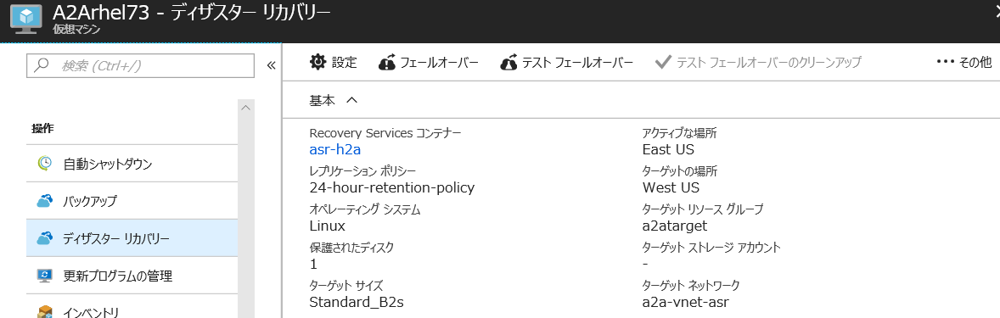
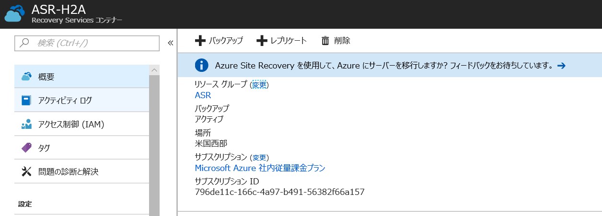
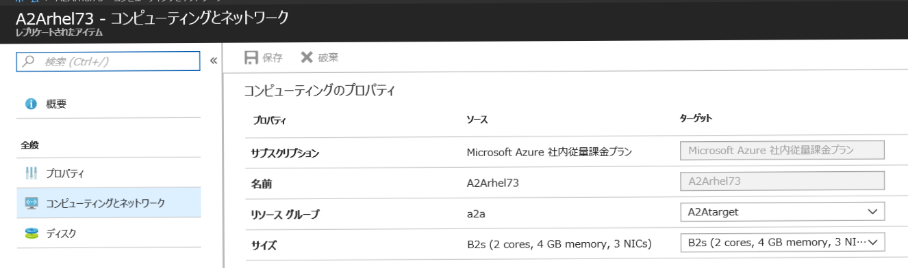
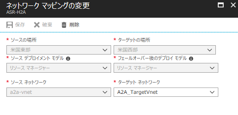

こんにちは、Azure Site Recovery テクニカル サポート チームです。

今回は、ASR (Azure Site Recovery) で Azure リージョン間で Azure VM レプリケーションが有効化された際に、レプリケーション先の "ターゲット リソース グループ" などの表示名がすべて小文字で表示される問題についてご紹介いたします。

**// 表示名がすべて小文字となるリソース**
- Recovery Services コンテナー
- ターゲット リソース グループ
- ターゲット ネットワーク

## ■ 既知の問題について

ASR でレプリケーションが有効化された VM について、Azure Portal から [Virtual Machines] - [対象の VM] - [ディザスター リカバリー] の順に進み、レプリケーションの情報を確認します。
下図のように「ターゲット リソース グループ」と「ターゲット ネットワーク」、「Recovery Services コンテナー」の表示名がすべて小文字で表示されます。

## ■ 影響

こちらは、表示上の問題であり VM や ASR レプリケーションの動作に影響はございません。

## ■ 対処策

本問題につきましては、今後修正されるよう対応を進めております。
レプリケーション情報につきましてご心配の場合には、下記 Recovery Services コンテナーから情報をご確認下さいますようお願いいたします。

**// Recovery Services コンテナー名**

上記、VM のディザスター リカバリーの項目の Recovery Services コンテナー名 (上図では asr-h2a) をクリックし、対象の Recovery Services コンテナーへ移動することで、正しい表示名にて Recovery Services コンテナー名を確認できます。

**// ターゲット リソース グループ**

上記 Recovery Services コンテナーから、[レプリケートされたアイテム] – [対象の VM 名] を選択し、[コンピューティングとネットワーク] から正しい表示名にてターゲット先のリソース グループ名を確認できます。

**// ターゲット ネットワーク**

Recovery Services コンテナーから、[Site Recovery インフラストラクチャ] - [ネットワーク マッピング] を選択し、リージョン間で作成されているマッピング情報を選択することで、正しい表示名にてターゲット先の仮想ネットワーク名を確認できます。

本問題につきましては対応を進めてまいりますが、修正完了までは上記対処にて情報をご確認下さい。

