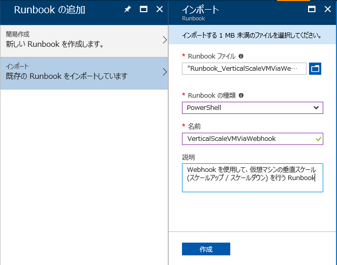
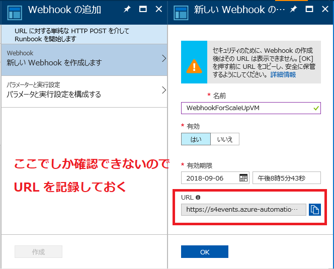
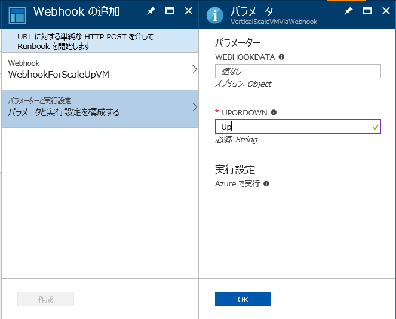
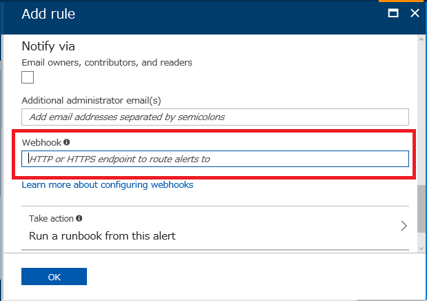

こんにちは、Azure サポートチームの山口です。

今回は Azure 仮想マシンのインスタンス サイズを垂直スケール（スケールアップ / スケールダウン）するための Runbook をご紹介したいと思います。

## ■ はじめに

突然ですが、お使いの Azure 仮想マシンは、トラフィックが少なくなる夜間や休日などの間、無駄に強力なパワーで稼働していませんか？

同じインスタンス サイズで静的に固定された仮想マシンは、ワークロードが少ない時間帯が来るとコンピューティング リソースが余ってしまいます。それだけでなく、ワークロードが増加する時間帯にはリソースが枯渇し、サーバーダウンにつながる恐れもあります。

この手の問題に対処する一番シンプルな方法は、想定される最大の負荷に耐えられるインスタンス サイズにあらかじめ設定しておくことですが、これは費用の観点から見るとベストな方法といえないこともあります。なぜなら、耐えられる負荷の量が大きくなると、掛かるコストも高くなるからです。

「負荷がかかる時間になれば自動的にスケールアップし、負荷が少ない時にはスケールダウンする」といったインスタンス サイズの動的スケーリングは、コスト最適化を実現する上では必ず考慮すべき対策のひとつです。

与えられたワークロードに必要な分のコンピューティング リソースだけを割り当て続けることが出来れば、必要最低限の出費だけで済みますよね。:) この記事では、そんな動的スケーリングを実現するための Runbook を紹介したいと思います！

## ■ スケールアップ / ダウン後のインスタンス サイズの取得

まずは、インスタンス サイズを与えると、スケールアップ（スケールダウン）した後のインスタンス サイズを返す PowerShell の関数から紹介します。

後のセクションでこの関数を使った Runbook を説明しますので、「とにかく速く動的な垂直スケールを実現したい！」という方はこのセクションを飛ばして頂いても構いません。

関数中のデフォルトのスケール セット <span style="color:red;">$Default_VerticalScaleTable</span> は、本記事執筆時における東日本 / 西日本リージョンで利用可能なすべてのインスタンス サイズに対応しています。しかしながら、インスタンス サイズ名や利用可能なインスタンス サイズは、今後変更される可能性もございますのでご注意ください。

### PowerShell スクリプト
```PowerShell
Function Get-UpOrDownScaledVmSize {
    Param (
        [Parameter(Mandatory = $true)]
        [String] $VmSize,
        [Parameter(Mandatory = $true)]
        [String] $UpOrDown,
        [Parameter(Mandatory = $false)]
        [Object] $VerticalScale
    )

    # デフォルトのスケール セット
    $Default_VerticalScaleTable = @(
        ("Basic_A0", "Basic_A1", "Basic_A2", "Basic_A3", "Basic_A4"),
        ("Standard_A0", "Standard_A1", "Standard_A2", "Standard_A3"),
        ("Standard_A4", "Standard_A5", "Standard_A6", "Standard_A7"),
        ("Standard_A8", "Standard_A9", "Standard_A10", "Standard_A11"),
        ("Standard_A1_v2", "Standard_A2m_v2", "Standard_A2_v2", "Standard_A4m_v2", "Standard_A4_v2", "Standard_A8m_v2", "Standard_A8_v2"),
        ("Standard_D1", "Standard_D2", "Standard_D3", "Standard_D4"),
        ("Standard_D11", "Standard_D12", "Standard_D13", "Standard_D14"),
        ("Standard_D1_v2", "Standard_D2_v2", "Standard_D3_v2", "Standard_D4_v2", "Standard_D5_v2"),
        ("Standard_D11_v2", "Standard_D12_v2", "Standard_D13_v2", "Standard_D14_v2", "Standard_D15_v2"),
        ("Standard_D2_v2_Promo", "Standard_D3_v2_Promo", "Standard_D4_v2_Promo", "Standard_D5_v2_Promo"),
        ("Standard_D11_v2_Promo", "Standard_D12_v2_Promo", "Standard_D13_v2_Promo", "Standard_D14_v2_Promo"),
        ("Standard_DS1", "Standard_DS2", "Standard_DS3", "Standard_DS4"),
        ("Standard_DS11", "Standard_DS12", "Standard_DS13", "Standard_DS14"),
        ("Standard_DS1_v2", "Standard_DS2_v2", "Standard_DS3_v2", "Standard_DS4_v2", "Standard_DS5_v2"),
        ("Standard_DS11_v2", "Standard_DS12_v2", "Standard_DS13_v2", "Standard_DS14_v2", "Standard_DS15_v2"),
        ("Standard_DS2_v2_Promo", "Standard_DS3_v2_Promo", "Standard_DS4_v2_Promo", "Standard_DS5_v2_Promo"),
        ("Standard_DS11_v2_Promo", "Standard_DS12_v2_Promo", "Standard_DS13_v2_Promo", "Standard_DS14_v2_Promo"),
        ("Standard_F1", "Standard_F2", "Standard_F4", "Standard_F8", "Standard_F16"),
        ("Standard_F1s", "Standard_F2s", "Standard_F4s", "Standard_F8s", "Standard_F16s"),
        ("Standard_H8", "Standard_H16", "Standard_H8m", "Standard_H16m", "Standard_H16r", "Standard_H16mr"),
        ("Standard_NV6", "Standard_NV12", "Standard_NV24"),
        ("Standard_G1", "Standard_G2", "Standard_G3", "Standard_G4", "Standard_G5"),
        ("Standard_GS1", "Standard_GS2", "Standard_GS3", "Standard_GS4", "Standard_GS5"),
        ("Standard_L4s", "Standard_L8s", "Standard_L16s", "Standard_L32s")
    )

    # -VerticalScaleSets パラメタでスケール セットが渡されていたら、そちらを使用
    if ($VerticalScale) {
        $VerticalScaleTable = @(, $VerticalScale)
    } else {
        $VerticalScaleTable = $Default_VerticalScaleTable
    }

    # 現在の VM サイズが格納されているスケール セットを取得
    $TargetVerticalScale = $null

    foreach ($VS in $VerticalScaleTable) {
        if ($VS -contains $VmSize) {
            $TargetVerticalScale = $VS
            break
        }
    }

    if (!$TargetVerticalScale) {
        throw "No available vertical scale found that contains the given VmSize."
    }

    # スケール アップ
    if ($UpOrDown -like "*Up*") {
        # スケール アップ後の VmSize のインデックスの検索
        for ($i = 0; $i -lt $TargetVerticalScale.Count; $i++) {
            if ($TargetVerticalScale[$i] -eq $VmSize) {
                $TargetIdx = $i + 1
                break
            }
        }

        if ($TargetIdx -ge $TargetVerticalScale.Count) {
            throw "There exists no available VmSize which instance size is larger than current one."
        }
    }

    # スケール ダウン
    elseif ($UpOrDown -like "*Down*") {
        # スケール ダウン後の VmSize のインデックスの検索
        for ($i = 0; $i -lt $TargetVerticalScale.Count; $i++) {
            if ($TargetVerticalScale[$i] -eq $VmSize) {
                $TargetIdx = $i - 1
                break
            }
        }

        if ($TargetIdx -lt 0) {
            throw "There exists no available VmSize which instance size is smaller than current one."
        }
    }
    else {
        throw "Unknown -UpOrDown parmeter passed."
    }
    Write-Output $TargetVerticalScale[$TargetIdx]
}
```

### パラメータ
```PowerShell
Get-UpOrDownScaledVmSize -VmSize "VmSize" -UpOrDown "Up or Down" [-VerticalScale "ArrayList of VmSize
```

**VmSize**
- スケールアップ / ダウンする前の仮想マシンのインスタンス サイズを指定します。

**UpOrDown**
- スケールアップ / ダウンのどちらをするかを選択します。
- <span style="color:red;">Up</span> や <span style="color:red;">ScaleUp</span> を指定すると、スケールアップされたインスタンス サイズを、<span style="color:red;">Down</span> や <span style="color:red;">ScaleDown</span> を指定すると、スケールダウンされたインスタンス サイズを出力します。

**VerticalScale**
- スケールアップ / ダウンするための垂直スケール セット（VM サイズのリスト）を指定します。
- 例えば、<span style="color:red;">-VerticalScale @("Basic_A0", "Standard_A3", "Standard_H16")</span> と指定した場合は、Basic_A0 -> Standard_A -> Standard_H16 の順番でスケールアップしていくような垂直スケール セットを意味します。
- このパラメータは省略可能であり、省略した場合、デフォルトで定められた垂直スケール セットを利用してスケールアップ / ダウンを行います。

### 使用例

1. デフォルトの垂直スケール セットを利用する例
```PowerShell
> $VM = Get-AzureRmVM -ResourceGroupName SampleResourceGroup -Name WinServer2016
> Get-UpOrDownScaledVmSize -VmSize $VM.HardwareProfile.VmSize -UpOrDown Up 
Standard_DS3_v2
```
1. 指定した垂直スケール セットを利用する例
```PowerShell
> Get-UpOrDownScaledVmSize -VmSize "Standard_A3" -UpOrDown "Down" -VerticalScale @("Basic_A0", "Standard_A3", "Standard_H16") 
Basic_A0
```

## ■ PowerShell Runbook

前のセクションで紹介した関数を使用した PowerShell Runbook をご紹介します。
以下の Runbook PowerShell スクリプト（テキストファイル）を保存してお使いください。

なお、文字コードは utf-8 を使用しております。お使いのブラウザによっては、直接開くと文字化けすることがありますので、ご注意ください。

- [Runbook_VerticalScaleVMViaWebhook（テキストファイル）](https://jpaztech.github.io/blog/archive/automation-runbook-webhook/Runbook_VerticalScaleVMViaWebhook.txt)

### 設定方法

1. **Automation アカウントに Runbook をインポートする**
   - 上記の URL からスクリプトファイルをダウンロードして、保存しておきます。
   - Azure ポータルにログインして、Runbook をインポートしたい Automation アカウントの [Runbook] ブレードを表示します。
     Automation アカウントがない場合、[Azure Automation アカウントを作成する | Microsoft Docs](https://docs.microsoft.com/ja-jp/azure/automation/automation-quickstart-create-account) を参考に、新規に作成してください。
   - [Runbook] ブレードを表示したら、[Runbook の追加] ボタンを押して、以下の画像のように、先程ダウンロードしたファイルをインポートします。<br>
   
   <br>
1. **Runbook に Webhook を追加する**
   まずは、VM をスケールアップするための Webhook を作成してみましょう。
   - インポートした Runbook の [概要] から、[Webhook] ボタンを押して Webhook を新たに追加します。
   - 「新しいWebhook を作成します」Webhook の名前、有効期限などを設定します。スケールアップのための Webhook を作成するので、画像の例では名前を "WebhookForScaleUpVM" に設定して、他はデフォルトのままにしました。
     また、後の手順で使用しますので、**<span style="color:red;">必ず URL のメモを取っておいてください</span>**。このタイミングを逃すと URL は確認できなくなり、折角作成した Webhook が無駄になってしまいます。<br>
   
   <br>
   - 「パラメータと実行設定を構成する」Runbook に渡されるパラメータを設定します。
     <span style="color:red;">WebhookData</span> は、Webhook が Runbook の起動を指示する時に渡されるパラメータなので、ここでは何も指定しません。
     <span style="color:red;">UpOrDown</span> は、スケールアップ / ダウンを指定するパラメータです。<span style="color:red;">Up</span> でスケールアップ、<span style="color:red;">Down</span> でスケールダウンしますが、今はスケールアップのための Webhook を作成しているので <span style="color:red;">Up</span> を指定しておきます。<br>
   
   <br>
   - 最後に [作成] を押すと、スケールアップのための Webhook が作成されます。<br>
1. **アラート ルールを作成する**
   続いて、手順 2 で作成した、スケールアップのための Webhook を呼ぶためのアラート ルールを作成していきます。
   - [Virtual Machines] から、アラート ルールを作成したい仮想マシンを選択し、[アラート ルール] ブレードを表示します。
   - [Add metric alert] ボタンを押して、アラート ルールを新規作成します。
   - [Add rule] パネルが開いたら、名前やアラートを通知するメトリックの設定を行います。今はスケールアップのアラートを作成しているので、例えば CPU 使用率が 75 % を超えたら通知がいくような、ワークロードの増加を検知する設定が望ましいでしょう。
     設定方法の詳細は『Azure Monitorでの『[Azure サービス メトリック アラートの作成 - Azure Portal](https://docs.microsoft.com/ja-jp/azure/azure-monitor/platform/alerts-classic-portal)』をご覧ください。
   - ここで、先程メモしておいた Webhook の URL を忘れずに記入してください。この設定によって、アラートが通知されるタイミングで Webhook も同時に呼ばれるので、Runbook が実行されます。<br>
   
   <br>
   - 最後に [OK] を押すと、アラート ルールが作成されます。<br><br>
1. **スケールダウンも同様に**
   - 以上でスケールアップのための Webhook の設定は終了です。
   - スケールダウンの Webhook も、手順 2 における <span style="color:red;">UpOrDown</span> パラメータの指定が <span style="color:red;">Down</span> となることを除けば、まったく同様の手順で設定できます。

## ■ さいごに

いかがでしたでしょうか。以上が、仮想マシンのメトリックを監視して、垂直スケール（スケールアップ / スケールダウン）を実行する Automation Runbook の紹介でした。

詳細についてもっと詳しく知りたい方は、下記の公式ドキュメント等をご覧いただくか、お気兼ねなく我々サポートまでお問合せください。

### 参考リンク

- webhook を使用した Azure Automation の Runbook の開始
  [https://docs.microsoft.com/ja-jp/azure/automation/automation-webhooks](https://docs.microsoft.com/ja-jp/azure/automation/automation-webhooks)
- 仮想マシン スケール セットの使用を開始する
  [https://docs.microsoft.com/ja-jp/azure/virtual-machine-scale-sets/virtual-machine-scale-sets-vertical-scale-reprovision](https://docs.microsoft.com/ja-jp/azure/virtual-machine-scale-sets/virtual-machine-scale-sets-vertical-scale-reprovision)
- Azure Automation を使用して Windows VM を垂直方向にスケーリングする
  [https://docs.microsoft.com/ja-jp/azure/virtual-machines/windows/vertical-scaling-automation](https://docs.microsoft.com/ja-jp/azure/virtual-machines/windows/vertical-scaling-automation)
