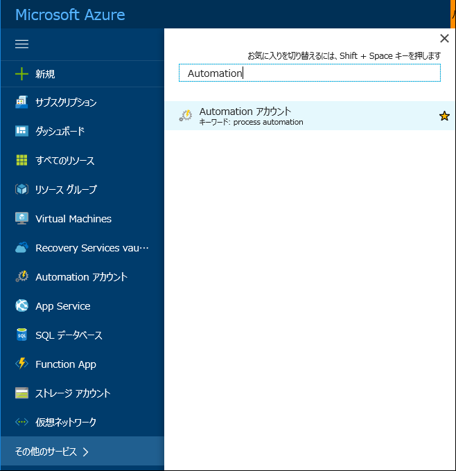
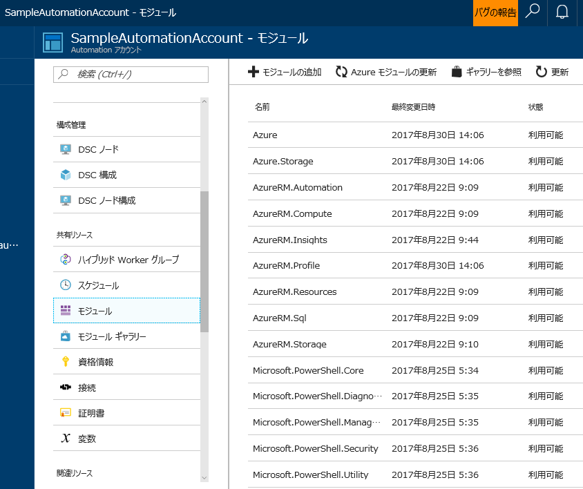
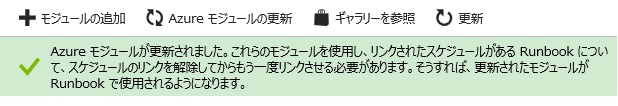
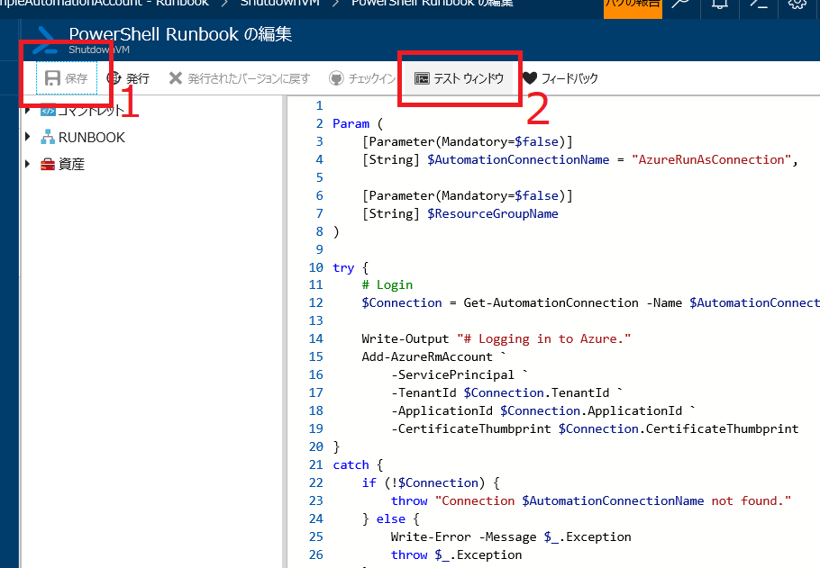
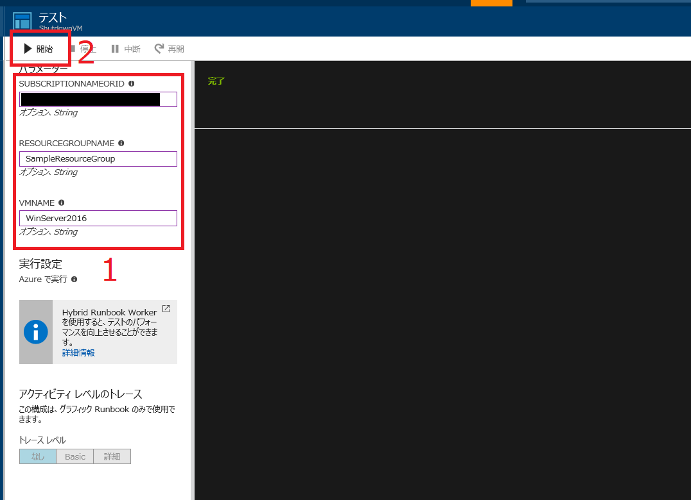
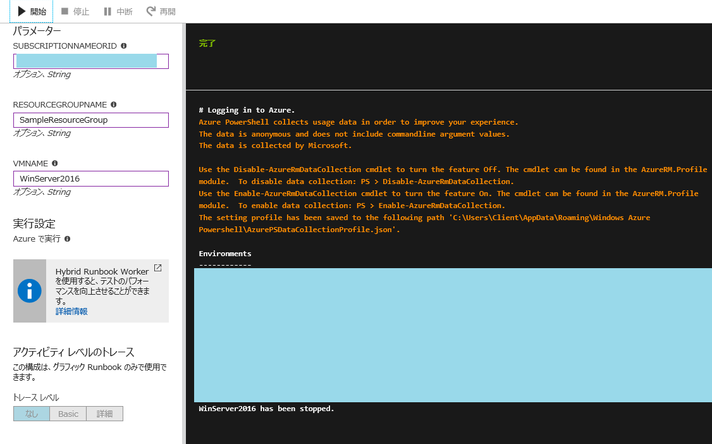
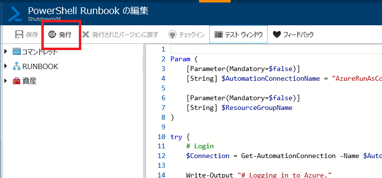
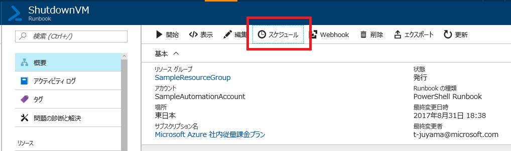
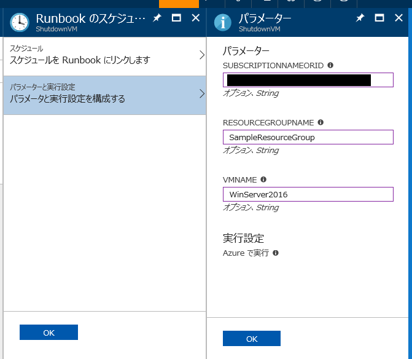
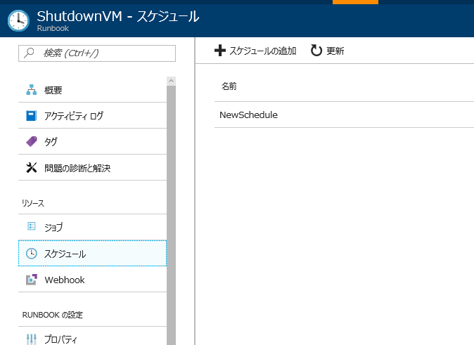

こんにちは、Azure サポートチームの山口です。
今日は、Azure Automation を使用して、サブスクリプション内の Azure VM を自動停止する Runbook の実装方法をご紹介させていただきます。

## ■ はじめに

この記事は、４つのセクションで構成されています。

1. **Automation アカウントの作成**
   Azure Automation 機能を使用するのに必須である Automation アカウントを作成する手順を紹介します。<br><br>
1. **Azure モジュールの更新**
   Runbook を実行する環境を構築します。
   Azure モジュールを最新版に更新していないと、PowerShell 上では正常に動作するスクリプトコードが、Runbook として実行した場合にエラーを返す可能性があります。
   もしそのような状況に陥っているのであれば、このセクションを見直してみてください。<br><br>
1. **Runbook の作成 / テスト**
   Azure VM を自動停止する PowerShell スクリプトの Runbook を作成して、それが正しく動くかテストします。
   今回は、動作する PowerShell スクリプトを用意していますので、Azure Automation が簡単に実装できることをぜひ体感してみてください。<br><br>
1. **スケジュールの設定**
   作成した Runbook を定期的に実行するためのスケジュール設定を行います。
   このスケジュール機能によって、例えば、毎日退社の時間になれば全 VM を自動停止させるような構成が作成できます。

## ■ Automation アカウントの作成

1. ポータルにアクセス
   - まず、Azure Portal (https://ms.portal.azure.com/) にアクセスし、サブスクリプション管理ロールのメンバー かつ サブスクリプションの共同管理者であるアカウントを使用してログインします。<br><br>
1. Automation アカウントの追加
   - [その他のサービス] から [Automation アカウント] を選択して、[Automation アカウント] ブレードを表示します。<br>
      
      <br>
   - [追加] をクリックし、Automation アカウント作成に必要な情報を入力します。実行時に Runbook が Azure へログインするのに必要となる接続資産と証明書資産を作成するために、[Azure 実行アカウントの作成] オプションで [はい] が選択されていることを確認してください。<br>
   
   <br>
   - 最後に [作成] ボタンをクリックすると、 Automation 実行アカウントとともに Automation アカウントが作成されます。

<参考>
- スタンドアロン Azure Automation アカウントを作成する
  [https://docs.microsoft.com/ja-jp/azure/automation/automation-create-standalone-account](https://docs.microsoft.com/ja-jp/azure/automation/automation-create-standalone-account)

## ■ Azure モジュールのアップデート

Runbook で Azure PowerShell モジュールのコマンドレットを使用して Azure リソースを管理する場合、モジュールを最新に保つために 1 か月に 1 回程度この更新プロセスを実行してください。

**<span style="color:red;">Azure モジュールを最新版に更新していないと、PowerShell 上では正常に動作するスクリプトコードが、Runbook として実行した場合にエラーを返す可能性があります。</span>**

- [Automation アカウント] パネルの [モジュール] ブレードを選択します。<br>
  
  <br>
- [Azure モジュールの更新] ボタンを押すと確認画面が表示されるので、[はい] を選択してモジュールの更新を開始します。モジュールの更新には数分かかる場合がありますので注意してください。<br>
  
  <br>
- 以下のようなメッセージか、モジュールのVERSIONが上がっていることが確認できたら、モジュールの更新は完了です。<br>
  
  <br>

<参考>
- Azure Automation の Azure PowerShell モジュールを更新する方法
  [https://docs.microsoft.com/ja-jp/azure/automation/automation-update-azure-modules](https://docs.microsoft.com/ja-jp/azure/automation/automation-update-azure-modules)

## ■ Runbook の作成 / テスト

ここからが本記事のメイントピックです。作成したばかりの Automation アカウントに、 Azure VM を自動停止させる Runbook を追加してみましょう。

1. Runbook の新規作成
   - 先程作成した Automation アカウントのパネルを開きます。
   - ハブから [Runbook] を選択して、[Runbook の追加] ボタンをクリックします。<br>
     
     <br>
   - [新しい Runbook を作成します。] を選択します。
   - Runbook の [名前] を入力し、[Runbook の種類] は [PowerShell] を選択します。
   - [作成] をクリックして Runbook を作成すると、[PowerShell Runbook の編集] が自動で開かれます。<br>
     
     <br>
1. Runbook の編集
   - 以下のスクリプトをコピーして、Runbook に貼り付けます。<br>
     **概要**
     この Runbook は、Azure にログインして指定された VM を停止させます。
     停止する VM の範囲は、次の2つの条件で指定できます。
     1. サブスクリプション
        SubscriptionNameOrId パラメータを用いて、どのサブスクリプションに対して停止の動作を行うかを指定することができます。
     2. リソースグループ名と VM 名
        ResourceGroupName, VMName パラメータによって、サブスクリプションの選択だけでなく、さらに3パターンの適用範囲の制御を行うことができます。
        - サブスクリプション内の、すべての VM
        - サブスクリプション内の、特定のリソースグループ内の、すべての VM
        - サブスクリプション内の、特定のリソースグループ内の、特定の名前を持つ VM<br><br>
     **パラメータ**
     - SubscriptionNameOrId : サブスクリプション名、または ID（省略可）
     - ResourceGroupName : リソースグループ名（省略可）
     - VMName : 仮想マシン名（省略可）<br><br>
```PowerShell
Param (
    [Parameter(Mandatory=$false)]
    [String] $SubscriptionNameOrId,
    [Parameter(Mandatory=$false)]
    [String] $ResourceGroupName,
    [Parameter(Mandatory=$false)]
    [String] $VMName
)

try {
    # 自動作成された接続資産（実行アカウント）を利用して Azure にログイン
    $AutomationConnectionName = "AzureRunAsConnection"
    $Connection = Get-AutomationConnection -Name $AutomationConnectionName

    Write-Output "# Logging in to Azure."

    Add-AzureRmAccount `
        -ServicePrincipal `
        -TenantId $Connection.TenantId `
        -ApplicationId $Connection.ApplicationId `
        -CertificateThumbprint $Connection.CertificateThumbprint
} 
catch {
    if (!$Connection) {
        throw "Connection $AutomationConnectionName not found."
    } else {
        Write-Error -Message $_.Exception
        throw $_.Exception
    }
}

# 指定した場合は、サブスクリプションを選択
if ($SubscriptionNameOrId) {
    $Subscriptions = Get-AzureRmSubscription | Where {$_.Name -Eq $SubscriptionNameOrId -Or $_.Id -Eq $SubscriptionNameOrId}
    if ($Subscriptions.Count -Eq 1) {
        # Select-AzureRmSubscription -SubscriptionName $Subscriptions[0].Id >0
        Get-AzureRmSubscription -SubscriptionId $Subscriptions[0].Id | Set-AzureRmContext
    }
    else {
        if ($Subscriptions.Count -Eq 0) {
            throw "No accessible subscription found with name or ID [$SubscriptionNameOrId]. Check the parameters and ensure user is a co-administrator on the target subscription."
        } else {
            throw "More than one accessible subscriptions found with name or ID [$SubscriptionNameOrId]. Please ensure your subscription names are unique, or specify the ID instead."
        }
    }
}

# リソースグループを指定した場合は、そのリソースグループ内の Azure VM を取得
# 指定しない場合は、全 VM を取得
if ($ResourceGroupName) {
    if ($VMName) {
        $VMs = Get-AzureRmVM -Name $VMName -ResourceGroupName $ResourceGroupName
    } else {
        $VMs = Get-AzureRmVM -ResourceGroupName $ResourceGroupName
    }
} else {
    $VMs = Get-AzureRmVM
}
foreach ($VM in $VMs) {
    # VM を停止
    $StopRtn = $VM | Stop-AzureRmVM -Force -ErrorAction SilentlyContinue
    # 正常に VM が停止したかの確認＆ステータスの出力
    if ($StopRtn.Status -ne 'Succeeded') {
        Write-Output ($VM.Name + " failed to stop.")
        Write-Error ($VM.Name + " failed to stop. Error was:") -ErrorAction Continue
        Write-Error (ConvertTo-Json $StopRtn.Error) -ErrorAction Continue
    }
    else {
        Write-Output ($VM.Name + " has been stopped.")
    }
}
```
<br>

   - [保存] ボタンを押して Runbook を更新したら、同じく [PowerShell Runbook の編集] パネルの [テストウィンドウ] を押して、Runbook をテストしてみましょう。<br>
     
   <br>
1. Runbook のテスト
   - テストウィンドウを開いたら、必要なパラメータを入力していきます。
   - 入力し終えたら [開始] を押して、テストを開始します。<br>
     
   <br>
   - Runbook の実行が完了するまで待ちます。成功すると、以下のような画面が表示され、指定された VM が停止されています。<br>
     
   <br>
   - 以上で Runbook の実行テストは完了です。

**<span style="color:red;">この [テスト] ブレードを利用した Runbook のテストは、実行待ちの時間がかかる場合があります。あらかじめ PowerShell 上で正常に動くことが確認できたスクリプトコードが、正しく Runbook 上でも動作するかを確認する環境として、[テスト] ブレードを使用することを推奨します。</span>**

<参考>
- Azure Automation での Runbook の作成またはインポート 
  [https://docs.microsoft.com/ja-jp/azure/automation/automation-creating-importing-runbook](https://docs.microsoft.com/ja-jp/azure/automation/automation-creating-importing-runbook)

## ■ スケジュールの設定

1. Runbook の発行
   - Runbook はスケジュールを設定する前に必ず発行する必要があります。スケジュールを組みたい Runbook の編集パネルを表示し、[発行] ボタンを押します。<br>
   
   <br>
   - 発行が終了したら [Runbook の編集] パネルを閉じて、Runbook の [概要] パネルに戻ります。<br><br>
1. スケジュールの作成
   - [スケジュール] を押して、[Runbook のスケジュール設定] 画面を出します。<br>
   
   <br>
   - [スケジュールを Runbook にリンクします] → [新しいスケジュールを作成します] を選択し、スケジュールの名前、開始時刻、間隔などを入力してから [作成] ボタンを押します。<br>
   
   <br>
   - 続いて、Runbook の実行時に、Runbook に渡されるパラメータを設定していきます。指定し終えたら、[OK] を押してスケジュールの設定を完了させます。<br>
   
   <br>
   - Runbook のスケジュールが正しく設定できていれば、[スケジュール] ブレードに先程作成したスケジュールが表示されます。
     この画面が確認できれば、すべての作業は終了です。あとは Runbook が設定されたスケジュール通りに動くか、経過を追ってチェックしてみてください。Runbook の出力結果は、[ジョブ] ブレードで確認することが出来ます。<br>
   

## ■ まとめ

以上が、Azure Automation の世界を体験するための簡単なフローになります。何回か Runbook を作成していると、この一連の操作がいかに簡単なのか、より実感できると思います。今回は Azure VM を停止させるシンプルな Runbook の例を紹介しましたが、より複雑で保守性に優れた Runbook も作成することができます。より詳細な情報が知りたい方は、ぜひ公式ドキュメントもご覧ください。

- Azure Automation
  [https://azure.microsoft.com/ja-jp/services/automation/](https://azure.microsoft.com/ja-jp/services/automation/)
- Automation のドキュメント
  [https://docs.microsoft.com/ja-jp/azure/automation/](https://docs.microsoft.com/ja-jp/azure/automation/)

Azure Automation の魅力をより多くのお客様に使っていただけるために、今後も実用的な Runbook を随時公開して参りますので、是非ご期待ください。