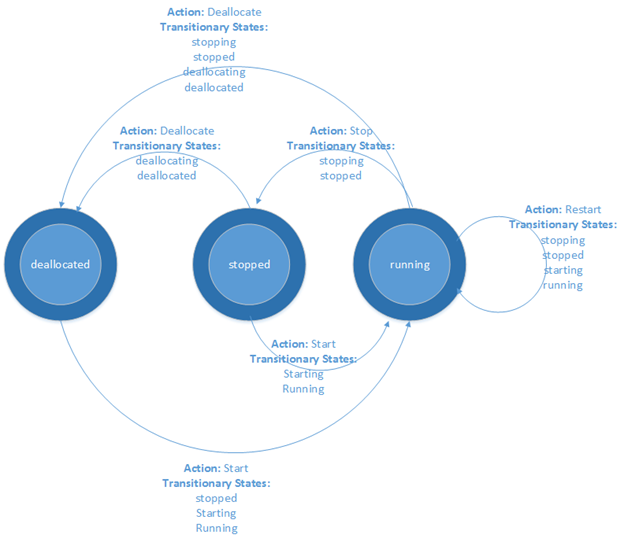

こんにちは、Azure テクニカル サポート チームの山口です。

今回は Azure Automation を使用して、Azure 仮想マシンを起動 / 停止（割り当て解除）する PowerShell Runbook を紹介したいと思います。
本記事は、主にスクリプトコードの紹介となります。ポータル上での Runbook の作成方法やスケジュール設定については、以下の記事を参考にしてください。

- Azure Automation で VM を自動停止する
  [https://jpaztech.github.io/blog/archive/automation-vm-auto-deallocate/](https://jpaztech.github.io/blog/archive/automation-vm-auto-deallocate/)


## ■ Runbook

### PowerShell Runbook

以下は、Azure 仮想マシンを起動 / 停止（割り当て解除）する PowerShell Runbook のスクリプトコードです。

```PowerShell
Param (
  [Parameter(Mandatory=$false)]
  [String] $SubscriptionNameOrId,
  [Parameter(Mandatory=$false)]
  [String] $ResourceGroupName,
  [Parameter(Mandatory=$false)]
  [String] $VMName,
  [Parameter(Mandatory=$false)]
  [Bool] $StartVM = $true
)

Function Get-AzureRmVMPowerState {
  Param (
    [Parameter(Mandatory=$true)]
    [Object] $VM
  )

  $instanceView = Get-AzureRmVM -ResourceGroupName $VM.ResourceGroupName -Name $VM.Name -Status
  $status = $instanceView.Statuses | Where Code -Like "PowerState*"
  $status = $status.Code -Replace "PowerState/",""

  Write-Output $status
}

try {
  # 自動作成された接続資産（実行アカウント）を利用して Azure にログイン
  $automationConnectionName = "AzureRunAsConnection"
  $connection = Get-AutomationConnection -Name $automationConnectionName

  Write-Output "# Logging in to Azure..."

  $account = Add-AzureRmAccount `
  -ServicePrincipal `
  -TenantId $connection.TenantId `
  -ApplicationId $connection.ApplicationId `
  -CertificateThumbprint $connection.CertificateThumbprint

  Write-Output "Done."
}
catch {
  if (!$connection) {
    throw "Connection $automationConnectionName not found."
  } else {
    Write-Error -Message $_.Exception
    throw $_.Exception
  }
}

# actionName - $StartVM パラメタに指定された、アクションの名前
# desiredPowerState - アクション後になるべき VM の電源状態
if ($StartVM) {
  $actionName = "start"
  $desiredPowerState = "running"
} else {
  $actionName = "stop"
  $desiredPowerState = "deallocated"
}

Write-Output "`n# Begin to $actionName specified Virtual Machines..."

# 指定した場合は、サブスクリプションを選択
if ($SubscriptionNameOrId) {
  $subscriptions = Get-AzureRmSubscription | Where {$_.Name -Eq $SubscriptionNameOrId -Or $_.Id -Eq $SubscriptionNameOrId}

  if ($subscriptions.Count -Eq 1) {
    # Select-AzureRmSubscription -SubscriptionName $subscriptions[0].Id >0
    Get-AzureRmSubscription -SubscriptionId $subscriptions[0].Id | Set-AzureRmContext
  } else {
    if ($subscriptions.Count -Eq 0) {
      throw "No accessible subscription found with name or ID [$SubscriptionNameOrId]. Check the parameters and ensure user is a co-administrator on the target subscription."
    } else {
      throw "More than one accessible subscriptions found with name or ID [$SubscriptionNameOrId]. Please ensure your subscription names are unique, or specify the ID instead."
    }
  }
}

# リソースグループを指定した場合は、そのリソースグループ内の Azure VM を取得
# 指定しない場合は、全 VM を取得
if ($ResourceGroupName) {
  if ($VMName) {
    $VMs = Get-AzureRmVM -Name $VMName -ResourceGroupName $ResourceGroupName
  } else {
    $VMs = Get-AzureRmVM -ResourceGroupName $ResourceGroupName
  }
} else {
  $VMs = Get-AzureRmVM
}

foreach ($VM in $VMs) {
  Write-Output ("`n[ $($VM.ResourceGroupName) > $($VM.Name) ]")

  # VM の電源状態を取得する
  $powerState = Get-AzureRmVMPowerState -VM $VM

  # 電源状態が running (resp. deallocated) でなければ、起動 (resp. 停止) する
  if ($powerState -ne $desiredPowerState) {
    # 望ましい電源状態に VM の状態を変更
    if ($StartVM) {
      $result = $VM | Start-AzureRmVM -ErrorAction SilentlyContinue -ErrorVariable err
    } else {
      $result = $VM | Stop-AzureRmVM -Force -ErrorAction SilentlyContinue -ErrorVariable err
    }

    # 正常に VM が起動 (停止) したかの確認 ＆ ステータスの出力
    if ($result.Status -ne 'Succeeded') {
      Write-Error -Message "$($VM.Name) failed to $actionName. Error message is as follows:"
      Write-Output $err
    } else {
      Write-Output "$($VM.Name) has been $($actionName)ed."
    }
  }
  # 既に running (resp. deallocated) 状態なので、起動 (resp. 停止) しない
  else {
    Write-Output "$($VM.Name) is already $desiredPowerState."
  }
}
```

### パラメータ

この Runbook で指定できるパラメータは 4 つあります。

- **<span style="color:red;">SubscriptionNameOrId</span>**
  - 対象の VM が存在するサブスクリプションの、名前かIDを指定します。
  - このパラメータは省略可能で、省略した場合、デフォルトのサブスクリプションが指定されます。
- **<span style="color:red;">ResourceGroupName</span>**
  - 対象の VM が存在するリソースグループの名前を指定します。
  - このパラメータは省略可能で、省略した場合、サブスクリプション内のすべての VM が対象となります。
- **<span style="color:red;">VMName</span>**
  - 対象となる VM の名前を指定します。
  - なお、このパラメータは、リソースグループを <span style="color:red;">ResourceGroupName</span> で指定している場合に限り考慮され、リソースグループの指定がなければ、指定を省略した場合と同じ動作になります。
  - このパラメータは省略可能で、省略した場合、以下の VM が対象となります。
    - リソースグループを指定している場合、指定したリソースグループ内のすべての VM 
    - リソースグループを指定していない場合、サブスクリプション内のすべての VM
- **<span style="color:red;">StartVM</span>**
  - この Runbook が、対象の VM の起動をするか / 割り当て解除をするかを選択します。
  - デフォルトでは <span style="color:red;">$True</span> (起動) が指定されていて、<span style="color:red;">$false</span> を指定すると VM の割り当て解除をします。


## ■ 起動、停止（割り当て解除）のコマンドレット

この PowerShell Runbook では、次の PowerShell コマンドレットを用いて VM の起動 / 停止（割り当て解除）を実現しています。

### VM の起動
```
Start-AzureRmVM -ResourceGroupName "リソースグループ名" -Name "VM 名"
```

### VM の停止（割り当て解除）
```
Stop-AzureRmVM -ResourceGroupName "リソースグループ名" -Name "VM 名" -Force
```

### パラメータ

- <span style="color:red;">ResourceGroupName</span>, <span style="color:red;">Name</span> には、それぞれ VM がデプロイされているリソースグループ名、VM の仮想マシン名を指定します。
- <span style="color:red;">Force</span> オプションは、確認画面を出さずに強制的に停止（割り当て解除）を実行するために指定します。

VM の再起動、更新、削除などの、VM の管理に関わる PowerShell コマンドレットについては、以下のドキュメントを参照ください。

- Azure Virtual Machines 用の一般的な PowerShell コマンド - VM の管理
  [https://docs.microsoft.com/ja-jp/azure/virtual-machines/windows/ps-common-ref#manage-vms](https://docs.microsoft.com/ja-jp/azure/virtual-machines/windows/ps-common-ref#manage-vms)


## ■ Azure VM の停止、割り当て解除について



仮想マシン内で OS のシャットダウンを実行するだけでは、**<span style="color:red;">「停止済み (stopped)」状態となりますが、仮想マシンが「停止済み」の状態でも、コンピューティング料金は発生します。</span>**

課金を停止するには、Azure ポータルから VM を停止するか、PowerShell コマンドレットによって「割り当て解除済み (deallocated)」状態にしてください。「割り当て解除済み」状態になった VM は CPU およびメモリが解放され、課金を停止することができます。

仮想マシンの課金についての詳細は、以下の公式ブログ、ドキュメントを参照ください。

- 仮想マシンの課金の仕組み
  [https://docs.microsoft.com/en-us/archive/blogs/dsazurejp/23](https://docs.microsoft.com/en-us/archive/blogs/dsazurejp/23)
- Virtual Machines の料金詳細
  [http://azure.microsoft.com/ja-jp/pricing/details/virtual-machines/](https://docs.microsoft.com/en-us/archive/blogs/dsazurejp/23)


## ■ さいごに

以上、指定された VM の起動 / 停止（割り当て解除）を実行する PowerShell Runbook の紹介でした。Azure Automation について、より詳細な情報が知りたい方は以下のリンクをご覧ください。

- Azure Automation
  [https://azure.microsoft.com/ja-jp/services/automation/](https://azure.microsoft.com/ja-jp/services/automation/)
- Automation のドキュメント
  [https://docs.microsoft.com/ja-jp/azure/automation/](https://docs.microsoft.com/ja-jp/azure/automation/)
