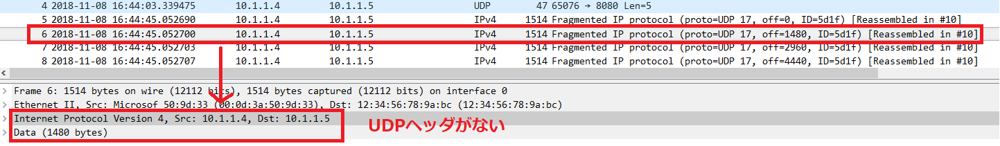
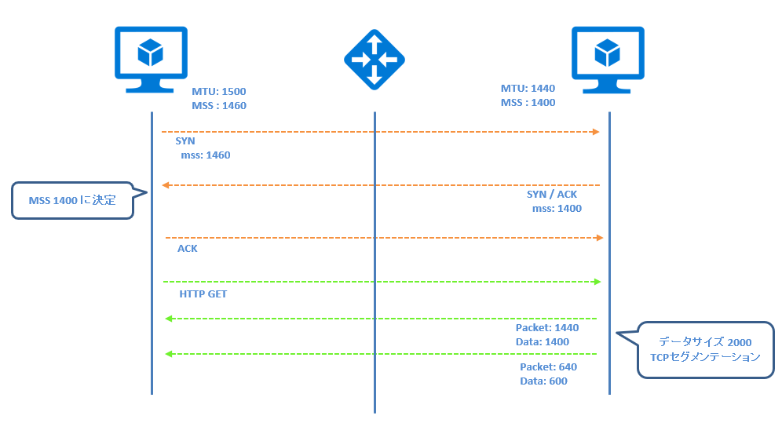
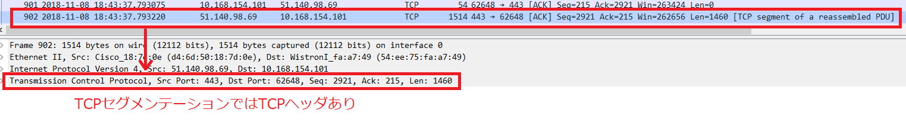

こんにちは、Azure サポートチームの山崎です。

今回は Azure Load Balancer で IP フラグメンテーションされたパケットが通信できない場合の理由と対策についてご紹介します。

## IPフラグメンテーションとは
通信を行う際に一度に送信できるパケットのサイズは決まっており、サイズ（MTU）を超える大きなパケットは複数のパケットに分割されます。この分割処理をIPフラグメンテーションと呼びます。

> MTU: １回で送信可能なパケットサイズ（IPヘッダまでのサイズ）

## Azure Load Balancer で IP フラグメントされた通信が未サポートの理由
Azure Load Balancer でサポートされている通信はドキュメントに記載のとおり、TCP と UDP のみサポートされています。

https://docs.microsoft.com/ja-jp/azure/load-balancer/load-balancer-overview#limitations

> **制限事項**
> 
> Load Balancer は TCP または UDP 製品であり、これらの特定の IP プロトコルに対する負荷分散とポート フォワーディングを行います。 負荷分散規則と受信 NAT 規則は TCP および UDP についてサポートされており、ICMP を含む他の IP プロトコルについてはサポートされていません。

フラグメントされたパケットは以下のようなパケットになり、TCP、UDP ヘッダがありません。

Azure Load Balancer では TCP、UDP のみサポートされており、TCP、UDP ヘッダないフラグメントされた IP パケットを処理できないため未サポートとなります。

（例）フラグメントされたパケット

## 対策
対策として、IP フラグメンテーションを防ぐため、MTU や MSS を調整いただくことで対策できる場合があります。

よくいただくご質問として、「データが大きい通信はすべて通信できないのでは？」、「経由するすべてのネットワーク機器で MTU を調整することは不可能なのでは？」という質問をいただきます。

（例）MTU より大きいデータは IP フラグメンテーションされるため Azure Load Balancer 経由では送信できない？

（例）クライアントとサーバ側で MTU を調整しても間のネットワーク機器で IP フラグメンテーションされる？

よくいただくご質問のとおり、経由するすべての機器で MTU を調整することはできませんが、TCP 通信では 3 Way Handshake 実施時に MSS を利用して送信可能なデータサイズを調整します。

> MSS: データサイズの最大値（IP ヘッダ、TCP ヘッダは含まない）

（例）3 Way Handshake 時に MSS が調整される

MSS を超えるデータの通信を行う場合、TCP セグメンテーションによりデータが分割されますので、１つのパケットサイズが MTU を超えることはなく、IPフラグメントが発生することを回避できます。

TCP セグメンテーションされたパケットは以下のように TCP ヘッダが付与されておりますので、データは分割されて送信されますが、Azure Load Balancer で処理することができます。

一般的に MSS のサイズは MTU - 40 (TCP ヘッダ + IP ヘッダ) となり、MTU を小さくすることで 3 Way Handshake でやりとりされる MSS も小さくなり、IP フラグメントが発生する可能性が低くなります。また、オンプレミス側のネットワーク機器で MSS 値を設定することもできるデバイスがありますので、対策としてご検討いただければ幸いです。

以上、ご参考になれば幸いです。