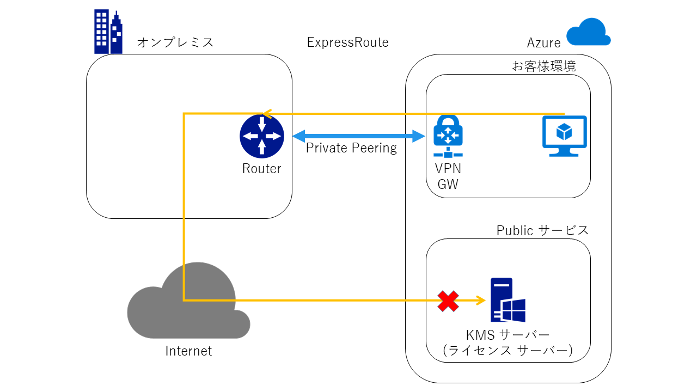

> [!WARNING]
> 本記事は、投稿より時間が経過しており、**一部内容が古い可能性があります。**

こんにちは。Azure サポートの宇田です。

今回は ExpressRoute を利用している環境で、Azure VM でライセンス認証に失敗するという事象についてご紹介します。

## 概要

ExpressRoute を利用する環境では、デフォルト ルートを ExpressRoute に向ける、いわゆる強制トンネリング (Forced Tunneling) と呼ばれる仕組みを使用して、Azure 仮想ネットワークからのパケットを強制的にオンプレミス側へとルーティングすることができます。強制トンネリングが有効な環境では、インターネットへ出る通信は、オンプレミスのネットワークを経由して出ていきますが、Azure VM における Windows のライセンス認証で使用される KMS サーバーは、Azure 内からの通信しか受け付けません。こうした理由により、KMS サーバーとの通信が確立できず、ライセンス認証に失敗します。

こうした現象が発生しないようにするためには、以下の UDR による対処が必要です。

また、Windows のライセンス認証のほかにも、RHEL や SUSE の更新サーバーに接続できないといった現象も、同様の理由により発生します。いずれの場合についても、関連が疑われる場合は、下記の通りルーティングの見直しなど検討頂ければと思います。

## 対処策: ユーザー定義ルート (UDR) を設定する

ユーザー定義ルート (UDR) 機能を使い明示的に KMS サーバー向けのルーティングを設定することでも、対処が可能です。KMS サーバーの IP アドレス (kms.core.windows.net: 23.102.135.246) に対し、Azure PowerShell にて以下の手順でルーティングの設定を実行ください。これにより KMS サーバーへの通信を強制トンネリングの対象から除外し、直接インターネット経由で通信させ、認証が成功するように構成できます。

~~※ KMS サーバーの IP アドレスは、現時点で変更の予定はありませんが、将来変更される可能性があります。~~

### クラシック (ASM) 環境の場合

<pre># 新規でルート テーブルを作成します
New-AzureRouteTable -Name "<ルート テーブル名>" -Label "<ルート テーブルの説明>" -Location "<リージョン名>"

# 作成したルート テーブルの情報を取得します
$rt = Get-AzureRouteTable -Name "<ルート テーブル名>"

# ルートを定義します
Set-AzureRoute -RouteTable $rt -RouteName "<ルート名>" -AddressPrefix "23.102.135.246/32" -NextHopType Internet
Set-AzureRoute -RouteTable $rt -RouteName "<ルート名>" -AddressPrefix "20.118.99.224/32" -NextHopType Internet
Set-AzureRoute -RouteTable $rt -RouteName "<ルート名>" -AddressPrefix "40.83.235.53/32" -NextHopType Internet

# 上記で定義したルートをサブネットに対して適用します
Set-AzureSubnetRouteTable -VirtualNetworkName "<仮想ネットワーク名>" -SubnetName "<サブネット名>" -RouteTableName "<ルート テーブル名>"</pre>

### リソース マネージャー (ARM) 環境の場合

<pre># 仮想ネットワークの情報を取得します
$vnet = Get-AzureRmVirtualNetwork -ResourceGroupName "<VNET のリソース グループ名>" -Name "<VNET 名>"

# 新規でルート テーブルを作成し、ルートを定義します
$RouteTable = New-AzureRmRouteTable -Name "<ルート テーブル名>" -ResourceGroupName "<ルート テーブルのリソース グループ名>" -Location "<リージョン>"
Add-AzureRmRouteConfig -Name "<追加するルート名>" -AddressPrefix 23.102.135.246/32 -NextHopType Internet -RouteTable $RouteTable
Add-AzureRmRouteConfig -Name "<追加するルート名>" -AddressPrefix 20.118.99.224/32 -NextHopType Internet -RouteTable $RouteTable
Add-AzureRmRouteConfig -Name "<追加するルート名>" -AddressPrefix 40.83.235.53/32 -NextHopType Internet -RouteTable $RouteTable
Set-AzureRmRouteTable -RouteTable $RouteTable

# 上記で定義したルートをサブネットに対して適用します
$forcedTunnelVNet = $vnet.Subnets | ? Name -eq "<設定対象のサブネット名>"
$forcedTunnelVNet.RouteTable = $RouteTable
Set-AzureRmVirtualNetwork -VirtualNetwork $vnet</pre>

**2022/07/26 追記**
以下でアナウンスされた通り、新たに azkms.core.windows.net という KMS サーバーが追加されています。また、既存の kms.core.windows.net の IP アドレスが 2023/03/01 までに変更される予定です。そのため、UDR では 23.102.135.246 のほかに 20.118.99.224、40.83.235.53 のルートも追加で設定が必要となりましたのでご注意ください。

* 一般提供:Azure Global Cloud の新しい KMS DNS
https://azure.microsoft.com/ja-jp/updates/new-kms-dns-in-azure-global-cloud/

**2022/07/26 追記ここまで**

## 参考リンク

本投稿は以下のブログをもとに、一部内容を追記してご紹介しています。

* Azure VM may fail to activate over ExpressRoute
https://blogs.msdn.microsoft.com/mast/2015/12/01/azure-vm-may-fail-to-activate-over-expressroute/

また、2015 年 12 月以前に作成した Windows Server 2012 R2 に限って、以下の事象も報告されています。あわせてご参照ください。

* Azure 環境に展開される Windows Server 2012 R2 のライセンス認証ができない
https://blogs.technet.microsoft.com/askcorejp/2015/12/08/azure-windows-server-2012-r2/

この他、ExpressRoute 環境に限らず、 Firewall 等の機能において送信ポート 1688 を制限されている場合も、ライセンス認証に失敗します。こちらのポートについては、Firewall 等にて拒否しないようにご留意ください。

**2016/10/31 追記**
**現在、NSG で TCP 1688 の通信を制限した場合に、意図せずライセンス認証ができなくなることを避けるため、Azure 基盤側で明示的に通信が許可されるように機能改善が行われました。(OS が持つ Firewall 機能など、NSG 以外で TCP 1688 を制限された場合は、引き続きライセンス認証に失敗いたしますので、その点はご留意ください。)**

* ネットワーク セキュリティ グループ (NSG) について
https://azure.microsoft.com/ja-jp/documentation/articles/virtual-networks-nsg/(抜粋)
ライセンス (キー管理サービス): VM で実行される Windows イメージには、ライセンスを適用する必要があります。ライセンスを適用するために、そのような問い合わせを処理するキー管理サービスのホスト サーバーには要求が送信されます。この要求は、ポート 1688 を通じて送信されます。

**2016/10/31 追記ここまで**
