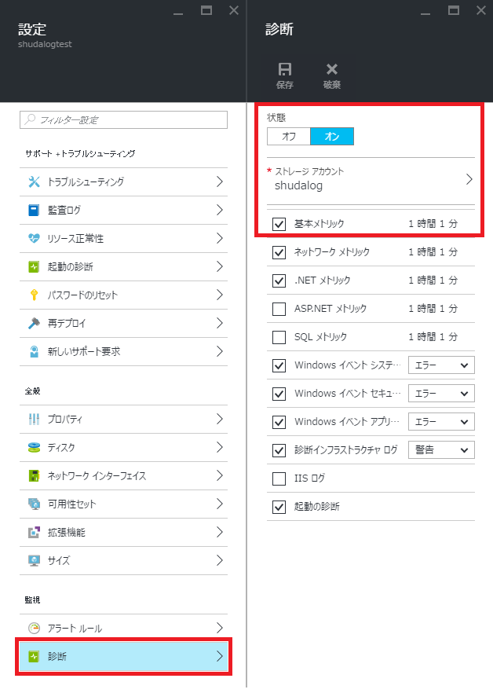
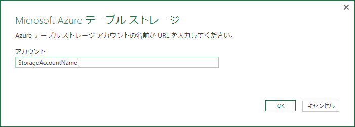
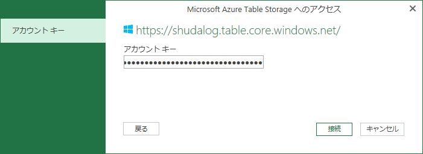
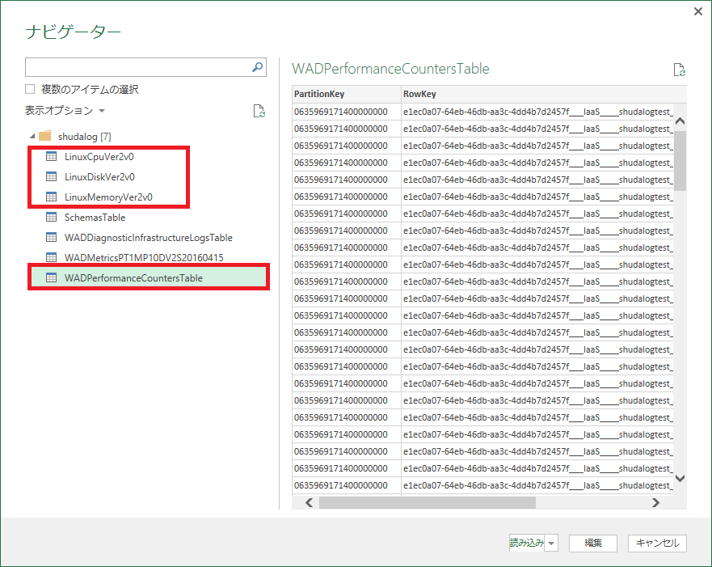
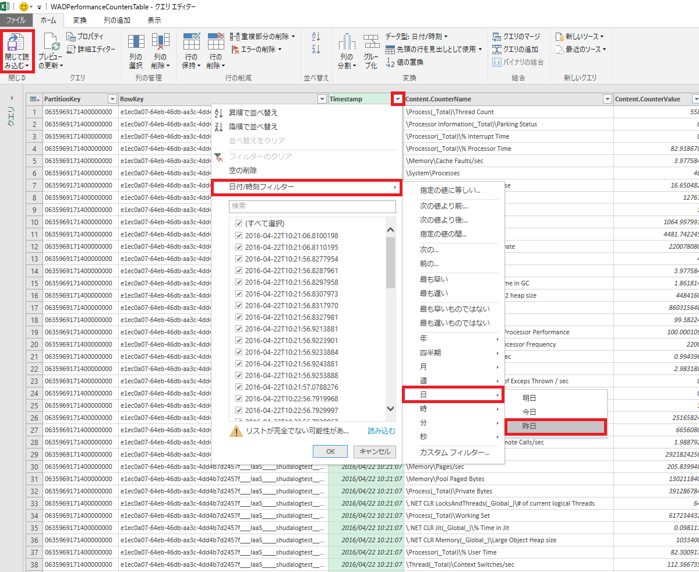
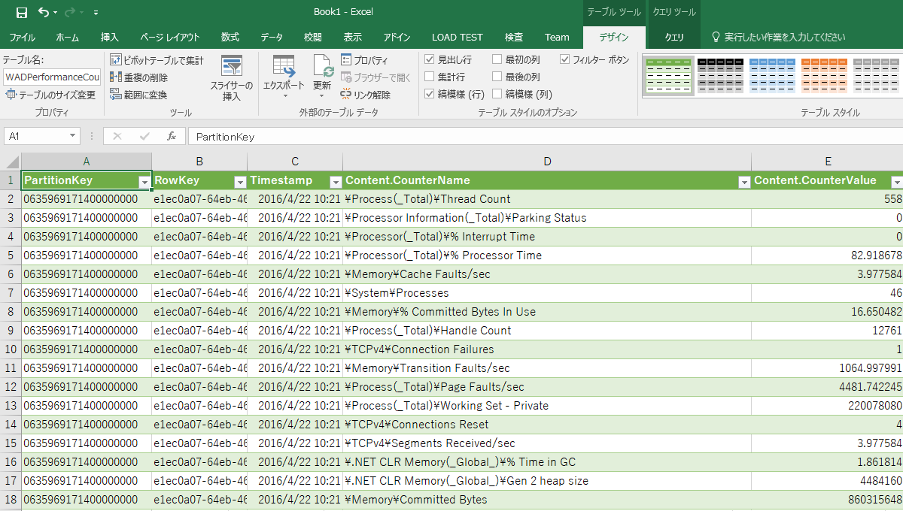

> [!WARNING]
> 本記事は、投稿より時間が経過しており、**一部内容が古い可能性があります。**

こんにちは。Azure サポートの宇田です。
今回は Azure 仮想マシン等のパフォーマンス ログを解析する方法についてご紹介します。

## Azure 上の仮想マシンで診断ログを有効にする

Azure 上の仮想マシンでパフォーマンス ログを採取するには、事前に診断ログを有効化しておく必要があります。

仮想マシンの設定から、[診断] を開き、[オン] としたうえでログ記録先のストレージを選択します。
パフォーマンス ログをとるには、[基本メトリック] をはじめとする各種 “メトリック” にチェックし、[保存] するだけです。
(Windows / Linux や、仮想マシンに導入されたエージェントのバージョンによって表示されるメトリックに差異があります)

なお、[起動の診断] も仮想マシンに接続できない際のトラブルシューティングに便利ですので、一緒に有効化しておきましょう。

* [仮想マシンがつながらない場合のトラブルシュート (Windows) – 診断構成をして OS の挙動を確認する方法](https://jpaztech1.z11.web.core.windows.net/%E4%BB%AE%E6%83%B3%E3%83%9E%E3%82%B7%E3%83%B3%E3%81%8C%E3%81%A4%E3%81%AA%E3%81%8C%E3%82%89%E3%81%AA%E3%81%84%E5%A0%B4%E5%90%88%E3%81%AE%E3%83%88%E3%83%A9%E3%83%96%E3%83%AB%E3%82%B7%E3%83%A5%E3%83%BC%E3%83%88(Windows).html)

## 保存されたログを確認する

採取されたログは、指定したストレージ アカウントの Table に記録されています。

各種ストレージ エクスプローラーでも Table ストレージの生データを確認する事ができますが、ログが膨大になると表示が重くなりますので、日付などでフィルターできる Visual Studio か Excel (2013 or 2016) がおすすめです。

今回は Excel 2016 を使って、読み込んだデータをもとにグラフ化する所までをご紹介します。

1. Excel 2016 にて、[データ] – [新しいクエリ] – [Azure から] – [Microsoft Azure テーブル ストレージから] と選択します。
(Excel 2013 の場合は [POWER QUERY] – [その他のソースから] – [Windows Azure テーブル ストレージから] と選択します。)

2. 続いて、ストレージ アカウントとアカウント キーを入力して接続します。

3. 正常に接続できた場合にはプレビュー画面が表示されますので、Windows の場合は WADPerformanceCountersTabke を、
Linux の場合は Linux~ から始まるテーブルを選択し、[編集] を選択します。
(下図で Ver2v0 となっている通り、Agent のバージョンによっては、テーブル名が異なる場合があります)

4. クエリ エディターが表示されますので、Content 列を展開してすべての列を表示します。

5. 任意の列で項目をフィルターします。(下図では TimeStamp 列で前日分のみにフィルターしています)
フィルターを設定したら、[閉じて読み込む] を選択して実際にデータを読み込みます。

6. クエリ エディターでフィルターした条件に合致するデータのみが表示されます。(先の例でいうと前日分のデータだけ)

7. あとは、CounterName でパフォーマンス カウンターを絞るなどして、通常の Excel 画面上でグラフ化をするなり、
ピボット テーブルにして整理するなり、お好みでどうぞ。

いかがでしたでしょうか。

ログが膨大になって、読み込みに時間がかかるときは、是非フィルターを活用して頂ければと思います。
それでは。
