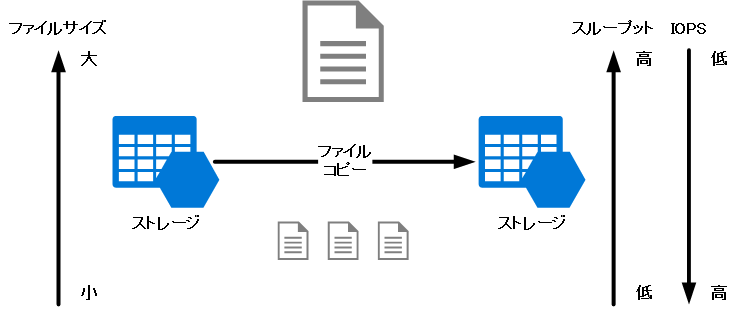
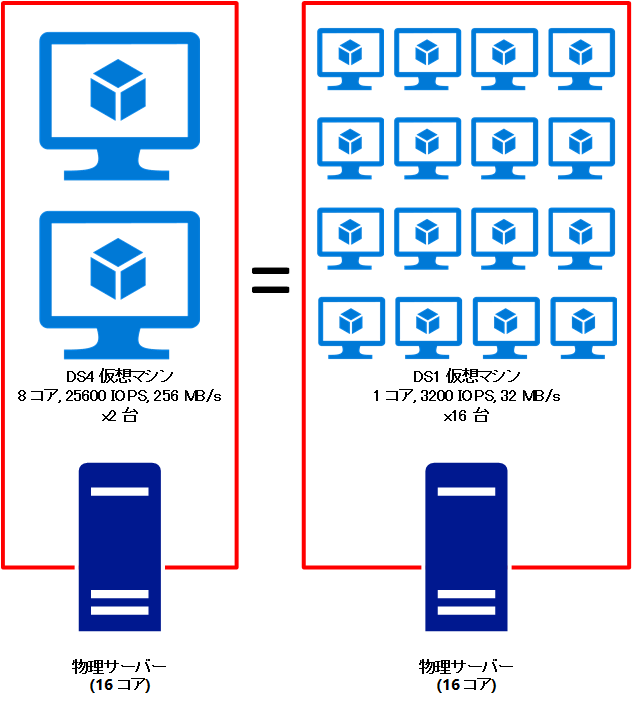

> [!WARNING]
> 本記事は、投稿より時間が経過しており、**一部内容が古い可能性があります。**

(2016/07/28 “[補足] ストレージに発行された IO 要求数などの確認方法” 項を追記)

Azure サポートの宇田です。今回は Azure 上の仮想マシンにおけるストレージのパフォーマンスについて、よくあるお問い合わせいただく内容や、設計の際にご留意頂きたい点をご紹介したいと思います。例えば、SQL Server などのデータベースや、SharePoint の大規模環境などを構成する場合、以下のような状況に直面した or している方は少なくないのではないでしょうか。

* Azure VM でディスクが遅い
* Premium Storage を使っているにもかかわらずディスク性能が出ない

## 1. そもそもディスクの性能とは

ディスクの性能を測定するうえでは、**”スループット”** と **“IOPS”** の二つの指標を正しく把握することが重要です。**スループット**とは、転送速度 (30 MB/s など) のことで、ファイルのコピーをした際に目にしていると思います。一方の **IOPS (I/O per sec)** は、1 秒あたりの I/O 要求の数を示し、ベンチマーク ツール等ではスループットとあわせて IOPS の測定も行うものが多くあります。

実際にデータを読み書きする際には、大別すると **“4 KB などの小さなファイルを多数読み書きする場合”** と、**”数 MB や数 GB などの大きなファイルを少数読み書きする場合”** の二つに分けられます。前者の様に小さなファイルに多数のアクセスを行う場合、1 秒あたりに多くの I/O 要求を処理することができますので、一般的に IOPS の値は高くなります。ただし、多数のファイルを読み書きできたとしても、個々のファイルが小さいことから、スループットは伸び悩む形になるでしょう。逆に後者のように大きなファイルにアクセスする場合には、IOPS は伸び悩みますが、実際の転送速度 (スループット) は高くなる傾向となるかと思います。

(イメージ図: ファイル サイズとスループット、IOPS の傾向)

こうしたディスクの詳しい仕組みについては、弊社社員の以下ブログが詳しく説明しています。是非あわせてご覧いただければと思います。

* IOPS の数値は高いのにスループットが低いんですけど？
http://blog.ryukiy.net/2015/06/12/premium-storage-part2/

## 2. Azure ストレージの概要

Azure ストレージについて具体的なイメージがついていない方もいるかもしれませんが、端的にいうとデータは仮想マシンが配置されるサーバーとは独立したストレージ サーバー上に保管されます。このため、仮想マシン (ないしホストする物理サーバー) から見るとネットワーク越しでアクセスする形となるため、オンプレミスの物理サーバーやクライアント PC と比較すると応答速度や性能面がどうしても劣りがちになります。

Azure のデータセンター内には膨大な数の物理サーバーが稼働していますので、そのうちのどのサーバーからでもストレージ上のデータにアクセスできるようにするというクラウドのアーキテクチャ上、単純に物理サーバー上にデータを置いておけばいいという訳ではないため、その点はご理解をいただきたいと思います。逆に言えば、仮想マシンをホストする物理サーバーと、ストレージが分かれていることによって、仮想マシンのサイズ変更や VHD からの再作成ができるという点がメリットとしてはあげられるかと思います。

(イメージ図: Azure ではストレージと Hyper-V ホストは独立しています)

## 3. Azure ストレージの制限事項

Azure ストレージには Blob (Binary large object) / Queue / Table / Files の 4 種類のストレージ機能が用意されています。このうち、仮想マシンが利用するのは Page Blob ですが、Blob とストレージ アカウントのそれぞれに IOPS 等の制限があることをご存知でしょうか。

パブリック クラウドである Microsoft Azure では、ストレージに限らず各種リソースは世界中のお客様で共有しています。このため、特定のお客様環境における過負荷が、他のお客様環境に影響しない様、ストレージ アカウントや個々の Blob (ファイル) ごとに制約が設けられています。詳細な制限事項については以下のドキュメントに記載がありますが、要約すると後述のような制限が設けられています。

* Azure サブスクリプションとサービスの制限、クォータ、制約
https://azure.microsoft.com/ja-jp/documentation/articles/azure-subscription-service-limits/

* Azure Storage のスケーラビリティおよびパフォーマンスのターゲット
https://azure.microsoft.com/ja-jp/documentation/articles/storage-scalability-targets/

Standard ストレージの場合

* ストレージ アカウントあたり 20000 IOPS
* VHD ファイルあたり 500 IOPS もしくは 60 MB/s (Basic VM の場合は 300 IOPS)

Premium ストレージの場合

* ストレージ アカウントあたり 50 Gbps 以下
* P10 (128 GB) のディスク: 500 IOPS もしくは 100 MB/s
* P20 (512 GB) のディスク: 2300 IOPS もしくは 150 MB/s
* P30 (1 TB) のディスク: 5000 IOPS もしくは 200 MB/s

**2019/03/13 追記: 現在は 4 TB, 7500 IOPS, 250 MB/s の P50 や、さらに上位の SKU もプレビュー提供が行われています。**

こうした制約があるため、Standard ストレージで 1 つのストレージ アカウントに VHD ファイルが 40 本以上存在する環境の場合には、十分に注意が必要です。全てのディスクが MAX の 500 IOPS を必要とする場面は多くないとは思いますが、1 ストレージあたり 40 本を超えている場合には、ある仮想マシンのディスクの高負荷が他の仮想マシンのディスク アクセスを制限する可能性がある点、お気を付けいただければと思います。

また、Premium ストレージの場合には、上記に加えて仮想マシンのサイズに応じた制約も設けられています。詳細は下記ページの DS / GS シリーズの欄をご覧頂ければと思いますが、例えば DS1 の VM では、せっかく Premium Storage を使っても 3200 IOPS もしくは 32 MB/s が上限です。これは、仮想マシンをホストする物理サーバーの帯域を複数の仮想マシンで共有している為です。例えば 16 コアの物理サーバー上では DS1 (1 コア) の仮想マシンは 16 台まで動作できてしまいますので、16 台で帯域を奪い合わないよう、コア数に応じて制限をかけているといった具合です。

* 仮想マシンのサイズ
https://azure.microsoft.com/ja-jp/documentation/articles/virtual-machines-size-specs/

(イメージ図: 1 台の物理サーバーを共有するため、1 台あたりの帯域は限られる)

## 4. ディスク性能が出ない場合に何ができるか

Azure ストレージや仮想マシンのサイズに応じた留意点をご紹介してきましたが、1つのディスク性能がアプリケーションやサイジングで期待する性能を満たせない場合には、どのようにすればよいでしょう。限られた制約の中でパフォーマンスを上げるのであれば、ディスクのスケールアウトによる解決策として、RAID-0 構成 (ストライピング) を実施し、マルチスレッドによる処理の並列化、アプリケーション側のアルゴリズムの再考等を導入すればある程度の改善は見込めます。しかし、この環境で検証をしても要件を満たせない場合には、ディスク自体をスケールアップして、Premium ストレージというより高速なストレージを使う必要があります。

また、OS に実装済みのコマンドによるファイル操作や、パッケージ製品などでアプリケーションの改修によるチューニングが行えない場合ついては、多くの場合 Azure ストレージの設定やチューニングで高速化を行う事は困難です。これは OS のコマンドであれば書き込み・読み込みなどが既定で最適化されているためで、さらなる改善のための現実的な対処策としては、Premium ストレージなどより高速なストレージをお使いいただくのが得策です。それでも性能不足となる場合には 、さらに RAID-0 構成 (ストライピング) を組み合わせるのがよいかと思います。

上記のほか、Azure ストレージにおける唯一の設定ポイントとしてホスト キャッシュがありますが、これを有効化すればキャッシュが効くため高速化する一方、予期せぬ障害の際にはデータが消失するリスクがあります。キャッシュのデータは揮発性ですので、万が一の際にキャッシュからディスクに書き戻されていないデータは消失する可能性があります。このため、頻繁に書き込み処理が発生し、整合性が取れなくなると困るファイル (例えばデータベース等) については、書き込みのホスト キャッシュを設定してはいけません。

## まとめ

以上でご説明した一連の流れをまとめると、ディスク性能が出ない場合には以下のような点を事前に確認ください。

1. スループットと IOPS のどちらの性能がどの程度必要なのかを明確化
2. ストレージ アカウントや、仮想マシンのサイズに伴う制限を確認
3. より高速なディスクへの変更や、RAID-0 構成にして対処
4. 期待する性能になったかを再検証

そして、より具体的な対処策としては、以下のような順で構成変更を頂ければと思います。

1. Standard ストレージを使用している場合には、Premium ストレージへ移行
2. Premium ストレージの場合には、ディスク サイズを拡張して、P20 や P30 へ変更
3. P30 の Premium ストレージでも性能不足な場合には、P30 で RAID-0 を構成

**2019/03/13 追記: 現在は 4 TB, 7500 IOPS, 250 MB/s の P50 や、さらに上位の SKU もプレビュー提供が行われています。**

## 参考リンク

* Microsoft Azure Storage のパフォーマンスとスケーラビリティに対するチェック リスト
https://azure.microsoft.com/ja-jp/documentation/articles/storage-performance-checklist/

* Azure Premium Storage: 高パフォーマンスのための設計
https://azure.microsoft.com/ja-jp/documentation/articles/storage-premium-storage-performance/

* Azure Virtual Machines における SQL Server のパフォーマンスに関するベスト プラクティス
– I/O パフォーマンスに関する考慮事項
https://azure.microsoft.com/ja-jp/documentation/articles/virtual-machines-sql-server-performance-best-practices/#io

* Azure Premium Storage への移行
https://azure.microsoft.com/ja-jp/documentation/articles/storage-migration-to-premium-storage/

## [補足] ストレージに発行された IO 要求数などの確認方法

制限を超えた IO 要求が発生していたかどうかについては、OS のパフォーマンス ログを採取することで、推測することができます。Windows OS の場合は、以下のパフォーマンス カウンターによって IOPS を確認することができます 。

* Disk Reads/sec
* Disk Writes/sec
* Disk Transfers/sec

「Disk Transfers/sec」が Reads と Writes の合計ですので、まずはこちらをご覧いただき、上記 3. 項のに記載しました、環境に応じた IOPS の制限に抵触しているかを判断いただければと思います。

ただし注意点として、ホスト キャッシュが有効な場合は、OS から見ると制限値を超えた性能が出る場合もございますので、カウンターの合計値からだけでは、本当に制限値を超えていたかを判断することはできません。その場合は、IO 要求を完了するまでの合計時間を示す、以下のカウンターを確認します。

* Average Disk sec/Read
* Average disk sec/Write

制限を超えた IO 要求が発生すると、スロットリングが発生して IO 要求が待ち状態になり、ストレージから応答が返るまでの時間が増幅します。上記のカウンターを確認し、IO 要求の完了までにかかる時間が大きくなっていた場合は、制限を超えた IO 要求が待ち状態になっていたのではないか、ということが推測できます。

– 参考資料

* アプリケーションのパフォーマンス要件を評価するためのカウンター
https://azure.microsoft.com/ja-jp/documentation/articles/storage-premium-storage-performance/#-4
