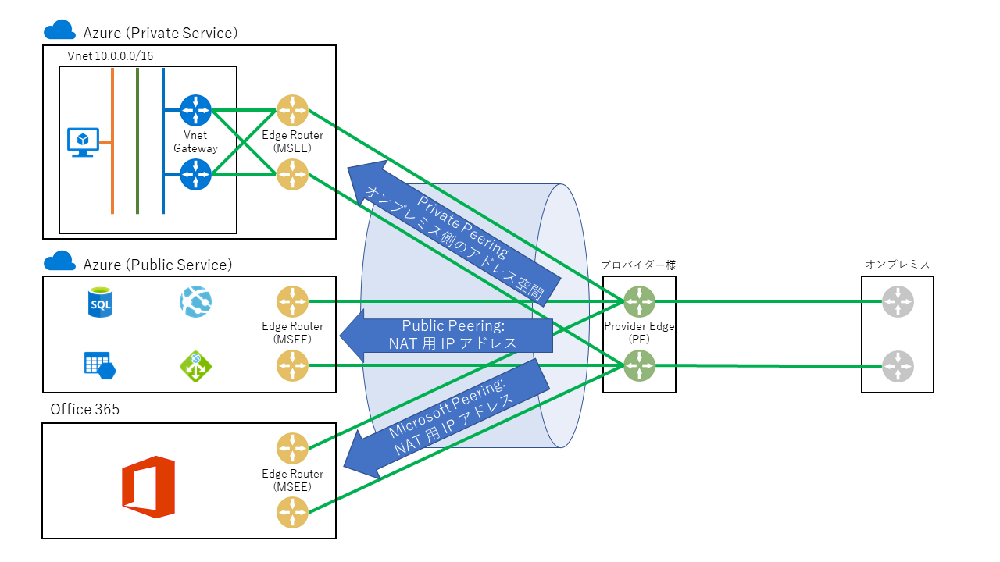
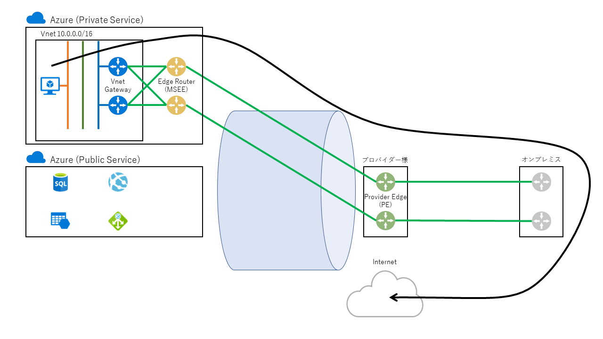
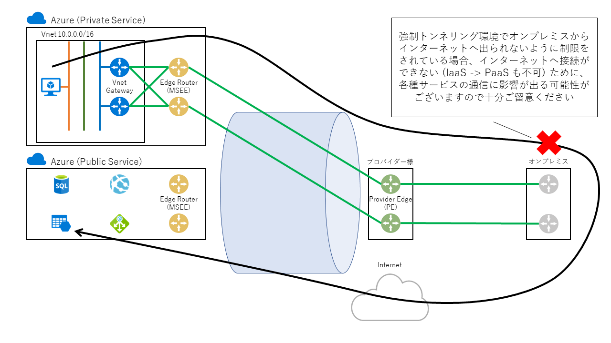
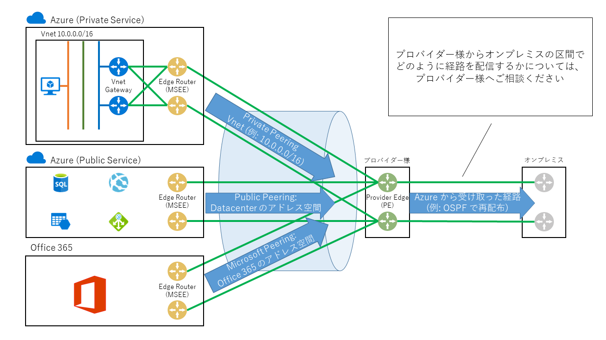
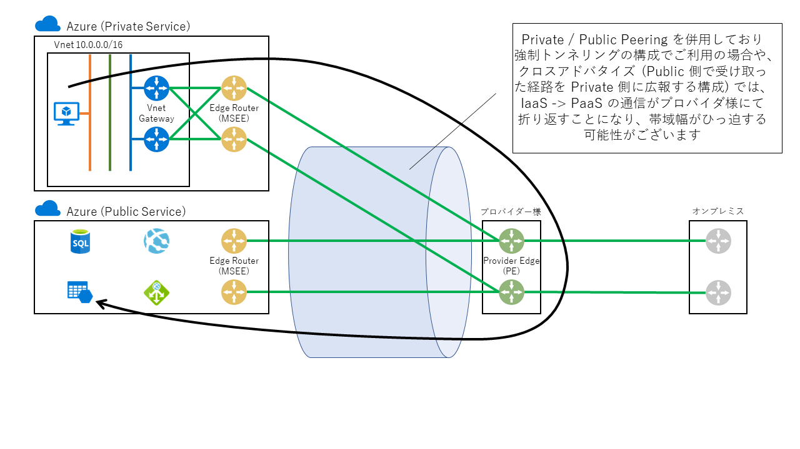

> [!WARNING]
> 本記事は、投稿より時間が経過しており、**一部内容が古い可能性があります。**

こんにちは。Azure サポートの宇田です。
詳説 Azure ExpressRoute Part 2 では、ルーティング制御について詳しく取り上げます。

* [Part1: ExpressRoute を導入する前に](./archive/expressroute-deep-dive-part1.md)
* Part2: ExpressRoute のルーティング制御について
* [Part3: ExpressRoute の導入手順について](./archive/expressroute-deep-dive-part3.md)
* [Part4: ExpressRoute の冗長構成について](./archive/expressroute-deep-dive-part4.md)
* [Part5: ExpressRoute の増速やプロバイダー変更について](./archive/expressroute-deep-dive-part5.md)
* [Part6: ExpressRoute の各種上限値について](./network/expressroute-deep-dive-part6.md)

## ExpressRoute のルーティング基礎

Part.1 でも説明した通り、ExpressRoute では BGP (Border Gateway Protocol) を用いてプロバイダー様のエッジルーター (PE) と経路を交換します。(BGP という単語が聞きなれない方は、JPNIC さんが公開されている「[インターネット10分講座：BGP](https://www.nic.ad.jp/ja/newsletter/No35/0800.html)」ほかをご参照ください。)

もう少し具体的に、3 種類のピアリングでどのような経路交換が行われるかを見てみましょう。

### (Azure 側から広報される経路)

* Private Peering: ExpressRoute に接続された仮想ネットワークのアドレス空間が広報されます
* Public Peering: Azure の各データセンターが保有する Public IP アドレス空間が広報されます
* Microsoft Peering: Office 365 で使用される Public IP アドレス空間が広報されます

### (オンプレミス / プロバイダー側から広報していただく経路)

* Private Peering: ExpressRoute 経由で通信されたいオンプレミス側のアドレス空間を広報ください
* Public Peering: オンプレミス側で NAT に使用される Public IP のアドレスを広報ください
* Microsoft Peering: オンプレミス側で NAT に使用される Public IP のアドレスを広報ください

## Private Peering におけるルーティングに関する考慮事項

この際、「Azure に対して、どのような経路を広報するか」および「Azure から受け取った経路をオンプレミスへどのように広報するか」について、事前に熟考が必要です。

### Azure に対して、どのような経路を広報するか

Azure とオンプレミスの端末間で通信を行うためには、オンプレミス側から正しく経路が広報されている必要があります。

代表的な構成例としては、以下のようなパターンが多いかと思います。

* オンプレミスで使用しているアドレス空間を細かく広報する (192.168.X.0/24, 192.168.Y.0/24, 192.168.Z.0/24 …)
* オンプレミスで使用しているアドレス空間をサマライズして広報する (10.0.0.0/8, 172.16.0.0/12, 192.168.0.0/16 など)
* デフォルト ルート (0.0.0.0/0) を広報する (強制トンネリングと呼ばれる構成)

ここで最も注意をしなくてはいけないのは、三点目のデフォルト ルートを広報する場合です。

通常、ExpressRoute に接続されていない仮想ネットワークでは、Azure から直接インターネットへ出れるようにルーティングされます。しかしながら ExpressRoute を構成して PE からデフォルト ルートを広報した場合には、全ての IP アドレス宛ての通信がオンプレミスへとルーティングされることになり、Azure からは直接インターネットへ出ることができません。このため、仮想ネットワーク上の Azure VM では、下図のようにオンプレミス側からインターネットへと抜ける経路をたどることになります。

したがって、当然ですがオンプレミス側からインターネットへと出られない構成においては、Azure VM もインターネットへ接続できなくなります。(セキュリティの観点から、あえてこうした構成とされるお客様もいらっしゃいます。)

また、強制トンネリングを構成された環境では、Windows のライセンス認証で用いられる KMS に影響が生じます。こちらについては以下にて詳しくご紹介しておりますので、併せてご参照ください。

* ExpressRoute 環境でライセンス認証ができない事象について
https://jpaztech.github.io/blog/archive/azure-vm-may-fail-to-activate-over-expressroute/

### Azure から受け取った経路をオンプレミスへどのように広報するか

他方で、Azure 側から受け取った経路をどのようにオンプレミスへ広報するかも検討が必要です。

Azure は ExpressRoute プロバイダー様のエッジ ルーターまで BGP で経路を広報するのみとなりますので、必要に応じて他の経路制御プロトコル (OSPF 等) にて再配布を行う必要があります。これらオンプレミス側のルーティングに関しては、Azure 側で制御できるものではありませんので、オンプレミスのネットワーク管理者様およびプロバイダー様と事前にご相談ください。

## Private / Public Peering の共存環境でのルーティングに関する考慮事項

Private Peering と Public Peering を併用されている場合、プロバイダー様のルーター (PE) では Private Peering 経由で受け取った経路情報と、Public Peering 経由で受け取った経路情報を保持しています。この際、Public Peering 側から受け取った経路 (Azure の Public IP アドレス帯) を Private Peering へ再配布するようなクロスアドバタイズと呼ばれる構成を行いますと、IaaS -> PaaS の通信が下図のようにプロバイダー様で折り返すような経路をたどることになります。

こうしたルーティングでも通信自体は全く問題はありませんが、プロバイダー様で折り返して ExpressRoute を往復することになるため、帯域が逼迫する恐れがあることと、従量課金プランをご利用の場合には費用が増加することとなりますので十分ご留意ください。一例としては、Azure バックアップなどの拡張機能が行う通信において、Azure VM (Private IP) から Azure Storage (Public IP) へと通信が行われますので、バックアップの際に大量のトラフィックが生じた場合などで問題が顕在化しやすいかと存じます。

ExpressRoute はあくまでも Azure とお客様のオンプレミス環境を接続するサービスという位置づけになりますので、プロバイダー様のルーターから Azure へと広報される経路は、あくまでもオンプレミス側で利用されているもののみとしていただくのがよろしいかと存じます。

以上、詳説 Azure ExpressRoute Part 2 をお届けしました。

今回取り上げた内容に関しては、事前の考慮不足で構築スケジュールに影響が生じたり、ExpressRoute の接続後のトラブルにつながる場合もありますので、設計段階から十分にご検討いただければ幸いです。
