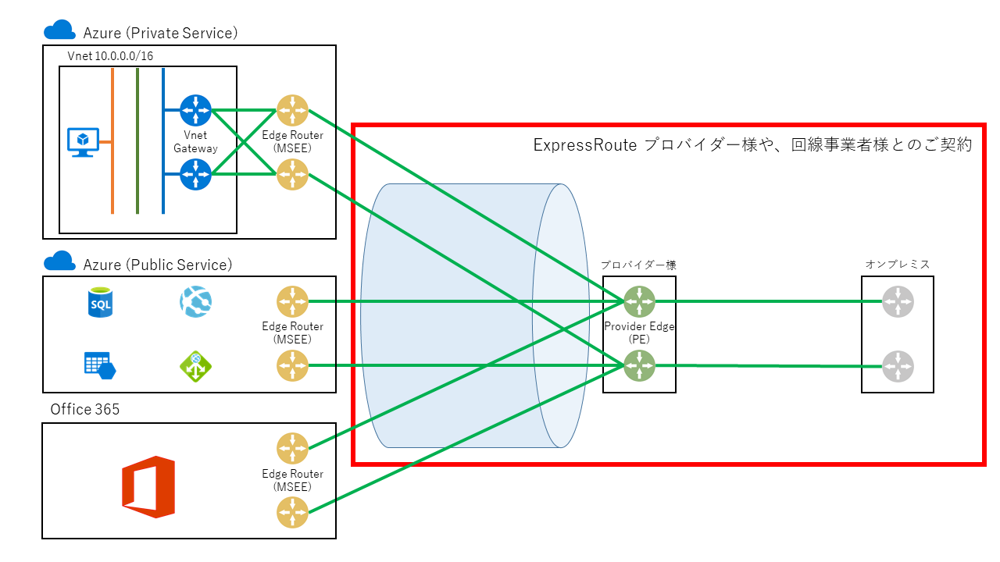
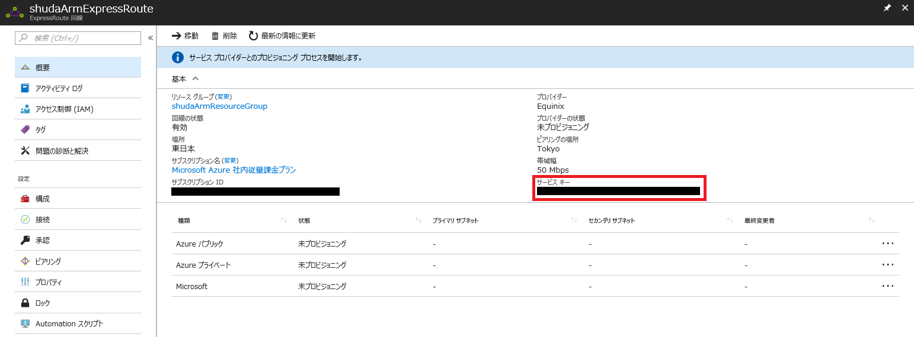
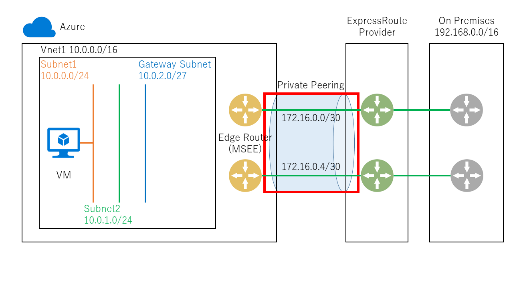
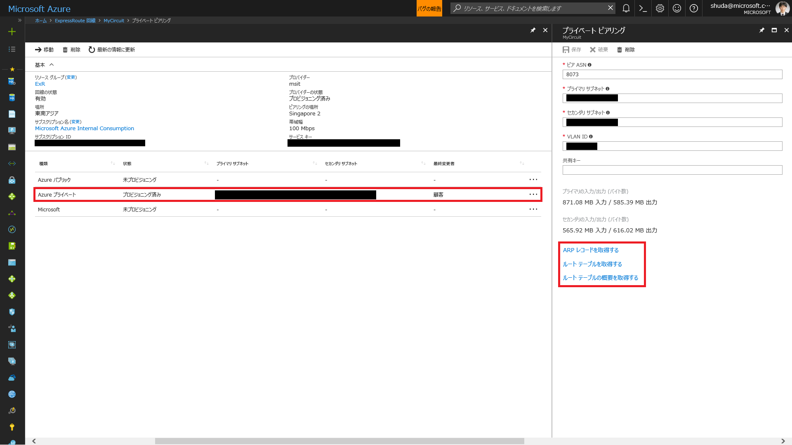
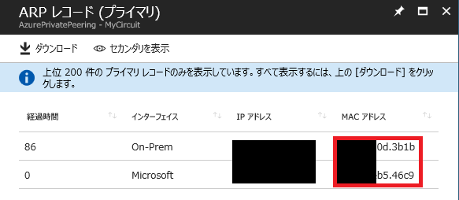
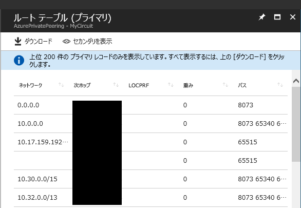
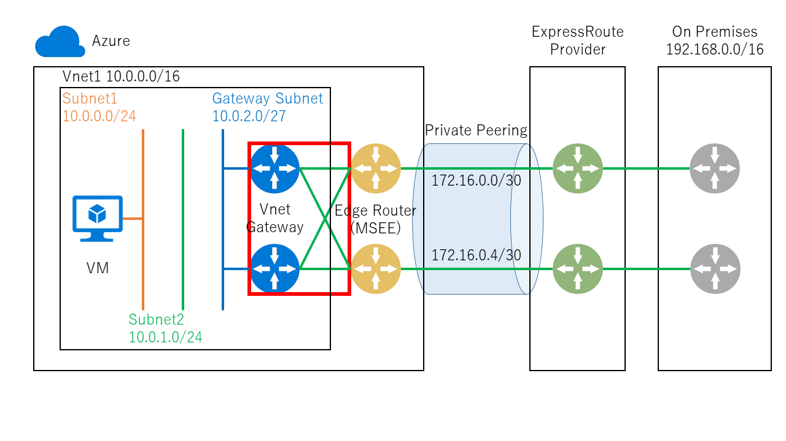

> [!WARNING]
> 本記事は、投稿より時間が経過しており、**一部内容が古い可能性があります。**

こんにちは。Azure サポートの宇田です。
今回は、実際に ExpressRoute を導入される際の流れをご紹介したいと思います。

* [Part1: ExpressRoute を導入する前に](./archive/expressroute-deep-dive-part1.md)
* [Part2: ExpressRoute のルーティング制御について](./archive/expressroute-deep-dive-part2.md)
* Part3: ExpressRoute の導入手順について
* [Part4: ExpressRoute の冗長構成について](./archive/expressroute-deep-dive-part4.md)
* [Part5: ExpressRoute の増速やプロバイダー変更について](./archive/expressroute-deep-dive-part5.md)
* [Part6: ExpressRoute の各種上限値について](./network/expressroute-deep-dive-part6.md)

## ExpressRoute の申し込み

今回は、シンプルに Private Peering のみで ExpressRoute を構築する場合で説明していきます。ご利用のプロバイダー様や構成によって、細かい順序が異なる可能性もございますので、あくまでも一例として捉えていただければと思います。

「[Part1: ExpressRoute を導入する前に](./archive/expressroute-deep-dive-part1.md)」でもご紹介したように、ExpressRoute は Azure とプロバイダー様の間をつなぐサービスです。このため、ExpressRoute を導入される場合は、Microsoft とは別に ExpressRoute のプロバイダー様とのご契約をいただく事になります。

Azure 側で最初に実行する作業として、Azure のポータル等から [ExpressRoute 回線] というリソースを作成します。これにより、個々の ExpressRoute を識別するための Service Key という ID が発行されますので、こちらをプロバイダー様へお知らせいただき、プロバイダー様での設定作業等をいただく事になります。なお、[ExpressRoute 回線] を作成して Service Key が発行された時点で課金が開始されることになりますので、その点はご留意ください。(Azure 側のエッジルーターでリソースを予約した状態となるため)

* ExpressRoute 回線の作成と変更
https://docs.microsoft.com/ja-jp/azure/expressroute/expressroute-howto-circuit-portal-resource-manager

プロバイダー様で初期設定作業が完了すると、ExpressRoute 回線の状態が “Provisioned” という表示に変化し、この時点から Azure 側の設定ができるようになります。(逆に言えば、”Not Provisioned” の状態では作業ができませんので、プロバイダー様からのご連絡をお待ちください。)

なお、ExpressRoute (Azure ～ プロバイダー様の間) とは別に、プロバイダー様 ～ オンプレミス間のアクセス回線側も準備が必要です。こちらについては Azure とは独立して任意のタイミングで構成いただけますので、プロバイダー様やオンプレミス側のネットワーク担当者様へご相談ください。

## Private Peering の構成

L3 のプロバイダー様をご利用の場合は、上記の通り回線が Provisioned になり、プロバイダー様での各種設定が完了した時点で、Private Peering の構成 (プロバイダー様のルーターの設定含む) が完了しているかと思います。

他方で L2 プロバイダー様をご利用の場合には、対向側のルーターの設定や、各種 Peering についてもお客様側で実施いただく事になります。細かい手順は以下のドキュメントを参照いただければと思いますが、プロバイダー様から通知される VLAN ID と、対向のルーターで設定される AS 番号、Peering 用の /30 のアドレス空間 2 つを Azure ポータルから設定ください。なお、ここで設定する /30 のアドレス空間については、オンプレミスと Azure のいずれでも使用していない (重複しない) アドレス空間をご設定ください。

Peering 用の /30 のアドレス空間を、仮想ネットワークのアドレス空間と重複する形で払い出してしまうお客様が時折いらっしゃいますが、この場合、後の接続作業で失敗しますので、重複しないようご注意ください。

* ExpressRoute 回線のピアリングの作成と変更を行う
https://docs.microsoft.com/ja-jp/azure/expressroute/expressroute-howto-routing-portal-resource-manager

Private Peering の構成が完了したら、ARP レコード (L2) とルート テーブル (L3) で疎通確認を行いましょう。(プライマリ、セカンダリ共に正常なことを確認ください。)

* Resource Manager デプロイメント モデルでの ARP テーブルの取得
https://docs.microsoft.com/ja-jp/azure/expressroute/expressroute-troubleshooting-arp-resource-manager

* ExpressRoute 接続の検証
https://docs.microsoft.com/ja-jp/azure/expressroute/expressroute-troubleshooting-expressroute-overview

ARP 解決ができていない (Azure 側のエッジルーターから、対向であるプロバイダー ルーターの MAC アドレスが引けていない) 場合は、VLAN ID などに誤りが無いかを確認ください。

他方で、ARP 解決はできているものの、オンプレミス側からルートを受け取れていないという場合は、オンプレミス側のルーターから BGP で正しく経路を広報しているかなどをご確認ください。

## ExpressRoute 回線と仮想ネットワークの接続

続いて、ExpressRoute 回線と仮想ネットワークを接続します。

S2S VPN を接続されたことのある方は、ほぼ同様の手順なのでイメージしやすいと思いますが、各仮想ネットワークに VNET Gateway を構成し、ExpressRoute との “接続” を行います。この際、GatewaySubnet のアドレス空間については、/27 以上で作成する事を強く推奨します。(ExpressRoute 回線のみの場合には /28 でも問題ありませんが、次回ご紹介する VPN との共存環境の場合に /27 以上が必須となるため。)

詳しい手順は以下のドキュメントを参照ください。なお、ExpressRoute 回線と仮想ネットワークが異なるサブスクリプションの場合には、”承認” を行った上で接続することとなりますので、「別のサブスクリプション内の仮想ネットワークを回線に接続する」のセクションにある手順に沿って実施いただければと思います。

* ExpressRoute 回線に仮想ネットワークを接続する
https://docs.microsoft.com/ja-jp/azure/expressroute/expressroute-howto-linkvnet-portal-resource-manager

## 接続完了後の疎通確認

ここまでの作業が完了し、プロバイダー様とオンプレミス間のアクセス回線も開通していれば、オンプレミスと Azure VM 間で疎通が可能になっているはずです。実際にオンプレミス側から RDP や SSH などで接続できるかを確認しましょう。

もし疎通ができない場合には、以下の点などを順番に確認していただければと思います。

* Private Peering において、ARP 解決が出来ているか (前述の通り)
* Private Peering でオンプレミス側から受け取っているルート (経路) に、オンプレミス側の接続元 IP が含まれているか
* オンプレミス側の Firewall 機器などで通信制限が行われていないか (オンプレミス側のネットワーク担当者様へご確認ください)
* 接続先の Azure VM に対して設定された NSG (Subnet / NIC とも) で通信をブロックしていないか
* 接続先の Azure VM 内で、OS の Firewall やアンチウイルス製品で通信をブロックしていないか

特に多いのはオンプレミス側から経路情報を受け取っていない場合かと思いますが、こうした場合にはプロバイダー様のルーターから Azure へ経路が広報されていない可能性があります。(もしくは更に先のオンプレミス側にあるルーターから経路が広報されていない等もあります) プロバイダー様やオンプレミス側のネットワーク担当者様まで確認を依頼いただければと思います。

以上、ご参考になれば幸いです。
