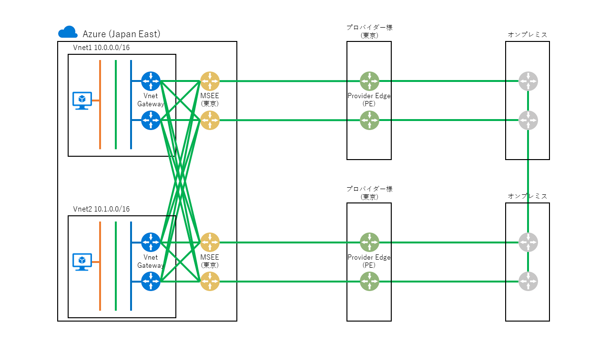
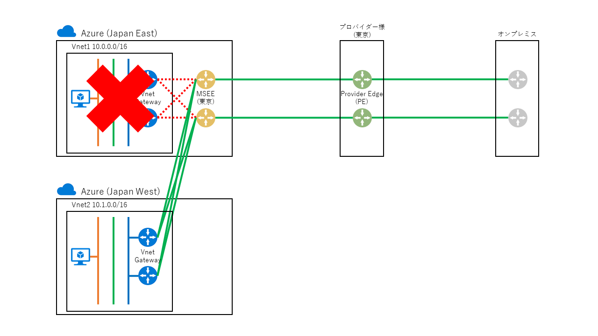
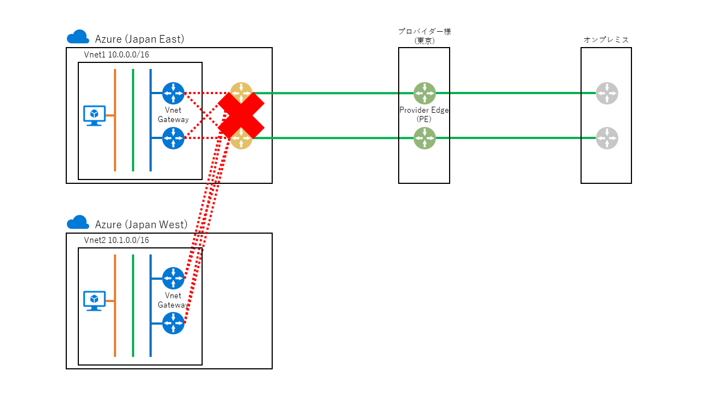
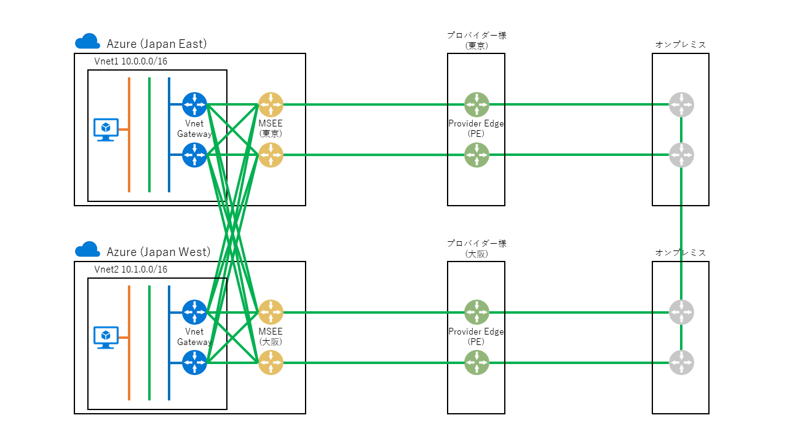

> [!WARNING]
> 本記事は、投稿より時間が経過しており、**一部内容が古い可能性があります。**

こんにちは。Azure サポートの宇田です。
今回は、ExpressRoute を複数ご契約いただく場合の留意点や、冗長構成の考慮点についてご説明します。

* [Part1: ExpressRoute を導入する前に](./archive/expressroute-deep-dive-part1.md)
* [Part2: ExpressRoute のルーティング制御について](./archive/expressroute-deep-dive-part2.md)
* [Part3: ExpressRoute の導入手順について](./archive/expressroute-deep-dive-part3.md)
* Part4: ExpressRoute の冗長構成について
* [Part5: ExpressRoute の増速やプロバイダー変更について](./archive/expressroute-deep-dive-part5.md)
* [Part6: ExpressRoute の各種上限値について](./network/expressroute-deep-dive-part6.md)

## 単一の ExpressRoute 回線を契約した場合

まず初めに、シンプルに 1 回線だけ契約された場合からご説明します。

ExpressRoute を東京でご契約いただいた場合、既定 (Premium Add-on なし) の状態で、以下の図のように東日本・西日本リージョンの仮想ネットワークに接続が可能です。

## ExpressRoute 回線を複数契約された場合

次に、ExpressRoute 回線を東京で 2 回線ご契約される場合を考えてみます。
(システム毎に回線を分離したい場合や、キャリア冗長としたい場合など)

以下のドキュメントに記載がある通り、1 つの仮想ネットワークには最大で 4 つまで ExpressRoute 回線を接続出来ます。
(異なる場所の ExpressRoute 回線であれば、最大 16 回線まで接続できます。)

* 1 つの仮想ネットワークを複数の ExpressRoute 回線に接続できますか。
https://docs.microsoft.com/ja-jp/azure/expressroute/expressroute-faqs#can-i-have-one-virtual-network-connected-to-more-than-one-expressroute-circuit

> はい。 1 つの仮想ネットワークを、同じ場所の最大 4 つの ExpressRoute 回線に、または異なるピアリングの場所の最大 16 の ExpressRoute 回線に接続できます。

なお、以前はすべて別の場所 (東京・大阪など) でご契約いただいた ExpressRoute  回線が必要でした。そのため、2 回線ともに東京でご契約いただいた場合、1 つの仮想ネットワークに東京の 2 つの ExpressRoute 回線を接続していただくことができませんでした。ただ、現在は制限が緩和され同一の場所で契約された複数の ExpressRoute 回線を接続可能になっていますので、特別な考慮は不要となりました。

## 大規模災害時などの疎通性の考え方

最後に、災害時の DR を考慮する際の留意点についてご説明します。

まず大前提として、Azure のリージョン (東日本・西日本リージョン) と、ExpressRoute の接続場所 (東京・大阪) は、必ずしも同一のデータセンター内とは限りません。(海外ですと、Azure リージョンが存在しない地域でも ExpressRoute の接続場所が用意されている場合がございます。)

* 地理的リージョン内の Azure リージョンと ExpressRoute の場所の対応
https://docs.microsoft.com/ja-jp/azure/expressroute/expressroute-locations#azure-regions-to-expressroute-locations-within-a-geopolitical-region

これを踏まえ、大規模災害時などに東京の ExpressRoute 回線経由で西日本リージョンの仮想ネットワークへ接続出来るのかという点ですが、どこが被災したかによって状況が異なりますので、以下にそれぞれご紹介できればと思います。

### Azure のデータセンターが被災した場合

データセンター側が被災したものの、ExpressRoute の接続場所 (MSEE) は無事という場合は、以下の図のように ExpressRoute 経由で西日本リージョンへ接続が可能と想定されます。

### ExpressRoute の接続場所 (MSEE) が被災した場合

一方で、ExpressRoute の接続場所が被災した場合は、以下の図のように MSEE 経由で西日本リージョンへ通信を行うことができなくなることが想定されます。

### ExpressRoute 回線自体も DR 対策を検討される場合

上記のような大規模災害時を想定し、ExpressRoute 回線の冗長化を検討される場合は、東京・大阪で 1 回線ずつご契約いただき、東日本・西日本リージョンの仮想ネットワークに対してメッシュでの接続をご検討ください。

この時、Azure とオンプレミス間は 2 つの経路で接続できる状態になりますが、既定の状態では等コストですので、アクティブ / アクティブな状態となり、両経路とも利用されることになります。

意図的に一方の経路を優先させたい (通常時は東京側を利用したい) という場合には、Azure からオンプレミスと、オンプレミスから Azure の双方向で、以下のように経路制御をいただければと思います。

* Azure -> オンプレミス方向の経路制御
Azure としては、プロバイダー様の PE ルーターから広報される BGP の経路情報に基づいてルーティングを行っています。
意図的に東京側を優先してオンプレミスへルーティングしたいという場合は、AS Path プリペンドでの経路制御をご検討ください。
具体的には、大阪の PE ルーターから広報する経路情報に AS Path を追加して、遠回りの経路と見せかけることで制御できますので、プロバイダー様 (L2 プロバイダー様の場合は、PE ルーターの管理者様) までご相談をいただければと思います。

* オンプレミス -> Azure 方向の経路制御
オンプレミス側で、東京・大阪のどちらの ExpressRoute 回線へルーティングするかは、お客様のネットワーク構成に依存します。
Azure 側からは制御できませんので、お手数ですがオンプレミス側のネットワーク管理者様や、プロバイダー様までご相談ください。

以上、ご参考になりましたら幸いです。
