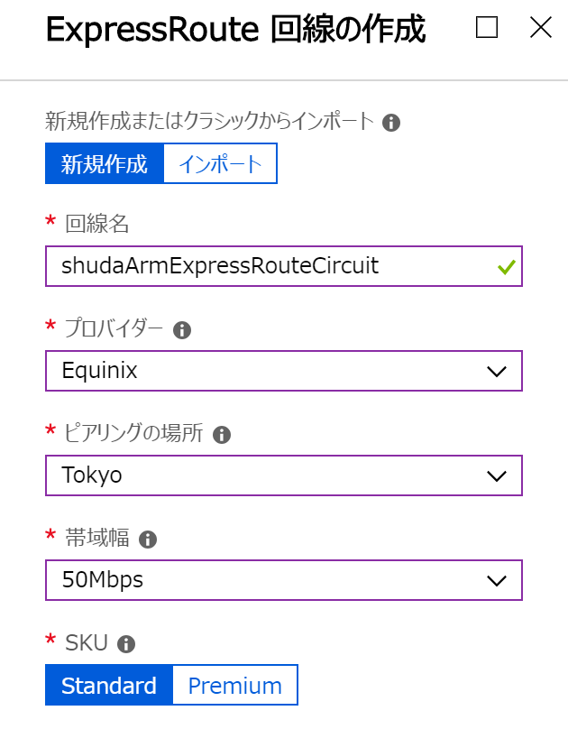
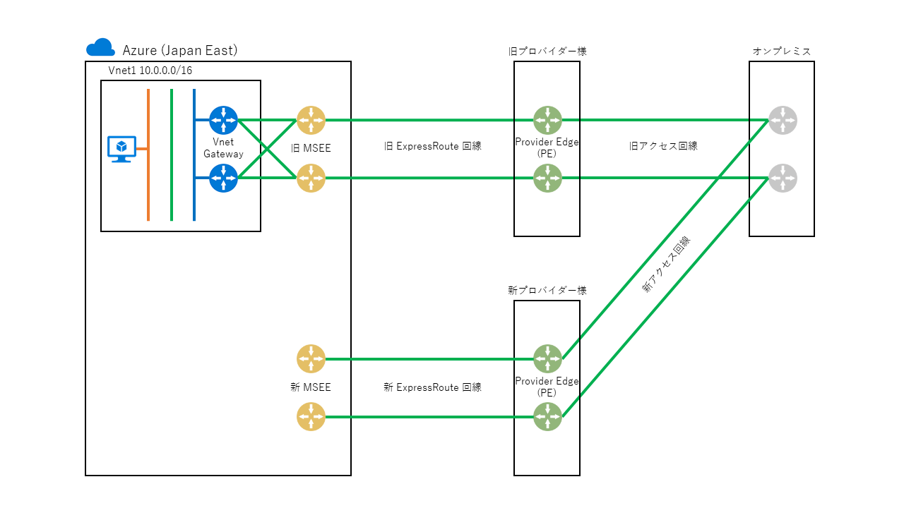

> [!WARNING]
> 本記事は、投稿より時間が経過しており、**一部内容が古い可能性があります。**

こんにちは。Azure サポートの宇田です。
今回は ExpressRoute 回線の増速や、プロバイダー変更の際の手順についてご紹介いたします。

* [Part1: ExpressRoute を導入する前に](./archive/expressroute-deep-dive-part1.md)
* [Part2: ExpressRoute のルーティング制御について](./archive/expressroute-deep-dive-part2.md)
* [Part3: ExpressRoute の導入手順について](./archive/expressroute-deep-dive-part3.md)
* [Part4: ExpressRoute の冗長構成について](./archive/expressroute-deep-dive-part4.md)
* Part5: ExpressRoute の増速やプロバイダー変更について
* [Part6: ExpressRoute の各種上限値について](./network/expressroute-deep-dive-part6.md)

## ExpressRoute 回線を増速される場合

例えば、ExpressRoute 回線を 50 Mbps でご契約いただいている状況から、Azure の本格利用に伴って帯域使用率が逼迫してきたため、200 Mbps 等へ増速されたいといった状況があるかと思います。何らかの理由で ExpressRoute 回線の増速を検討される場合、Azure とプロバイダー様の双方で変更が必要となりますので、それぞれ以下のような点にご留意をいただければと思います。

### Azure 側での変更作業

Azure としてはドキュメントに記載のある通りダウンタイム無しで設定変更をいただけますので、特に考慮事項はなく Azure Portal 等で速度を変更いただくのみで作業は完了となります。

* ExpressRoute 回線の変更
https://docs.microsoft.com/ja-jp/azure/expressroute/expressroute-howto-circuit-portal-resource-manager#modify

**※ 警告メッセージや、上記ドキュメントの [重要] にも記載のある通り、増速は可能ですが減速は出来ません。(また、従量制課金を無制限に変更した場合に、戻すことは出来ません) 誤って設定をされた場合は、ExpressRoute 回線を新規に構築しなおす必要が生じますので、十分ご注意ください。**

### プロバイダー様での変更作業

一方で、プロバイダー様でもルーターの構成変更などが必要になることが見込まれます。(Azure とプロバイダー様間の ExpressRoute の部分に加え、プロバイダー様とオンプレミス間のアクセス回線も増速が必要になる場合もあるかと存じます)

プロバイダー様によっては、サービス仕様や料金計算の都合でそのまま増速いただくことが出来ず、新規に ExpressRoute 回線を作り直す必要がある場合もございますので、ご契約いただいているプロバイダー様へも事前にご確認をいただけますようお願いいたします。

なお、前述のドキュメントにも「既存のポートの容量が不十分な場合、ExpressRoute 回線の再作成が必要になる可能性があります。 その場所に使用可能な追加の容量がない場合、回路をアップグレードすることはできません。」と記載がある通り、Azure とプロバイダー様をつなぐ回線に帯域幅の余裕がない場合は増速いただけません。Azure とプロバイダー様のエッジルーター間は物理的には 10 Gbps などの回線で接続されておりますが、その中に複数のお客様の ExpressRoute 回線が収容されておりますので、例えば既存のお客様で合計 9 Gbps 以上を使用している状況下で、50 Mbps の回線を 1 Gbps などに増速されようとしても、帯域の余裕がなく増速ができないといったことも極まれに発生する可能性があります。こうした点についても、念のため事前にプロバイダー様までご確認いただけましたら幸いでございます。

## ExpressRoute 回線のプロバイダー様を変更される場合

次に、ExpressRoute 回線のプロバイダー様を切り替える場合についてご紹介します。

ExpressRoute 回線は、以下の図のようにリソース作成時にプロバイダー様や接続場所を指定いただく必要があるため、プロバイダー様が変更になる場合は新規に再作成いただく必要がございます。したがって旧回線とは別に、新しく ExpressRoute 回線リソースを作成いただき、新しく採番されたサービス キーを使って、移行後のプロバイダー様に 2 回線目をご契約いただくことになります。

プロバイダー様の切り替えに伴うネットワークのダウンタイムを最小化したい場合は、まずは旧回線を残したままの状態で、新回線のプロバイダー様と開通作業を完了ください。(以下の図のように、VNET との接続を行う手前の段階までは既存の環境に影響を及ぼさずにご実施いただけるかと思います。)

なお、新旧のプロバイダー様で PE ルーターから Azure 側に広報する経路情報に差異がございますと、切り替えの前後でトラブルになる場合がございます。[Part2: ExpressRoute のルーティング制御について](./archive/expressroute-deep-dive-part2.md)もご参考にいただき、新旧のプロバイダー様で PE ルーターから BGP で広報する経路に差異が生じないか事前に新旧の両プロバイダー様へご確認いただくことを推奨いたします。

上記のように、新旧 2 つの ExpressRoute 回線が用意できましたら、夜間や週末などの業務影響のない時間帯で、旧 ExpressRoute 回線と VNET Gateway 間の接続リソースを削除して切断し (赤線部分)、改めて新 ExpressRoute 回線との接続を行っていただければと思います。(切り替え後に何らか問題が発生した場合は、旧回線への切り戻しもご検討ください)

なお、上記はあくまでも ExpressRoute 回線のプロバイダー様を変更される場合を想定しております。ExpressRoute のプロバイダー様からオンプレミスの拠点間の接続部分 (アクセス回線のキャリア様) を変更される場合は、Azure としては特に差異は生じませんので、切り替え手順や影響の有無は ExpressRoute ならびにアクセス回線のプロバイダー様へご確認・ご相談いただければと思います。

以上、ご参考になりましたら幸いです。
