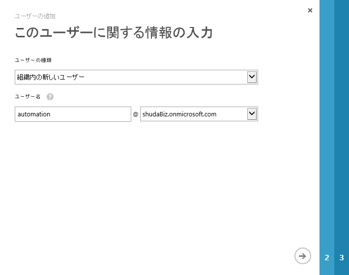
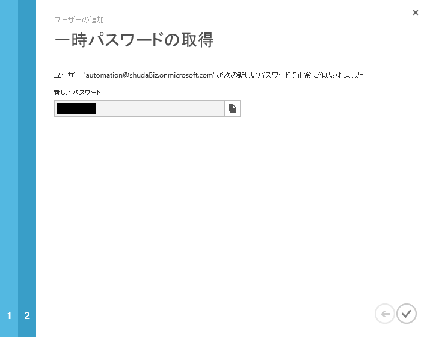
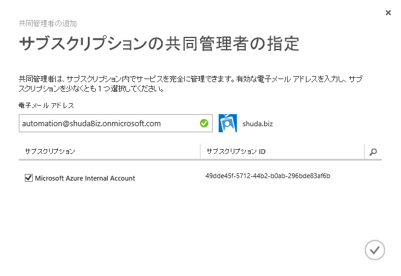
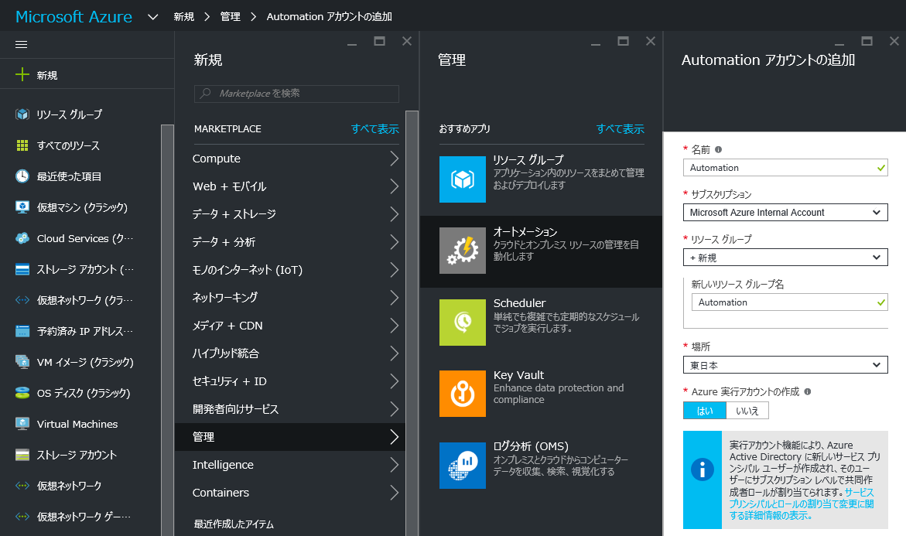
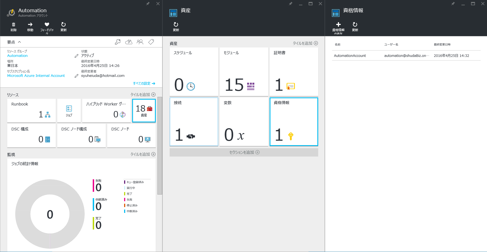
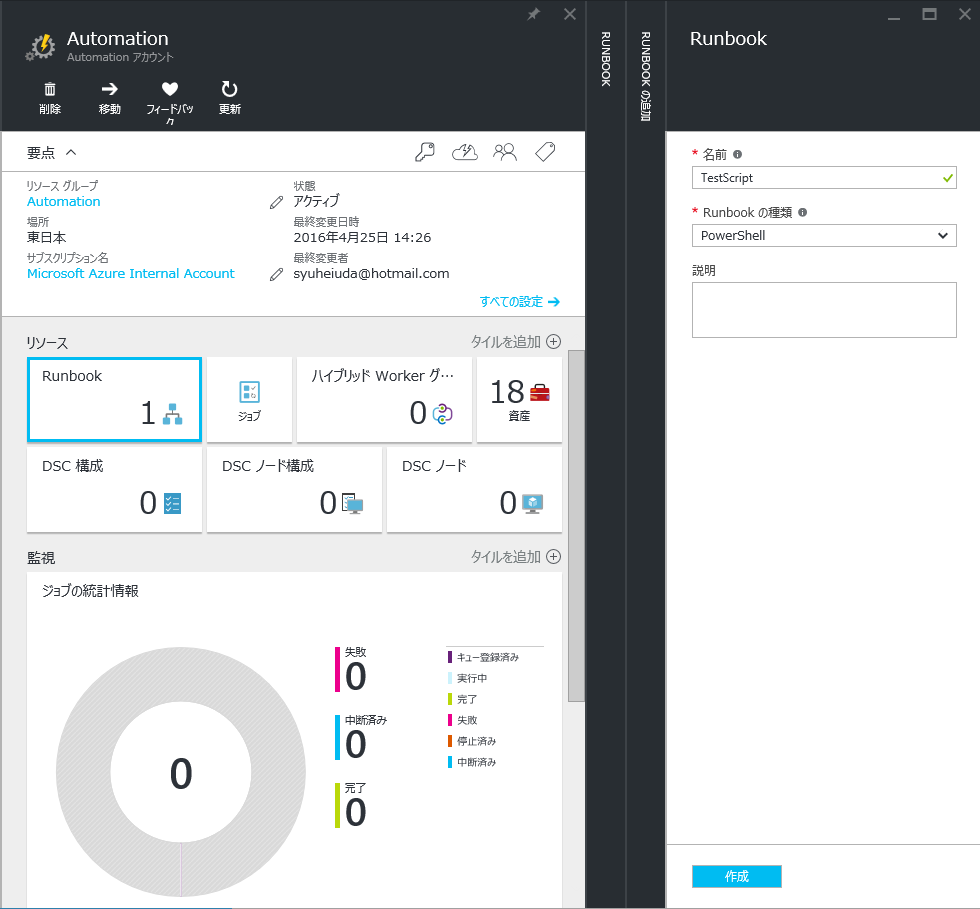
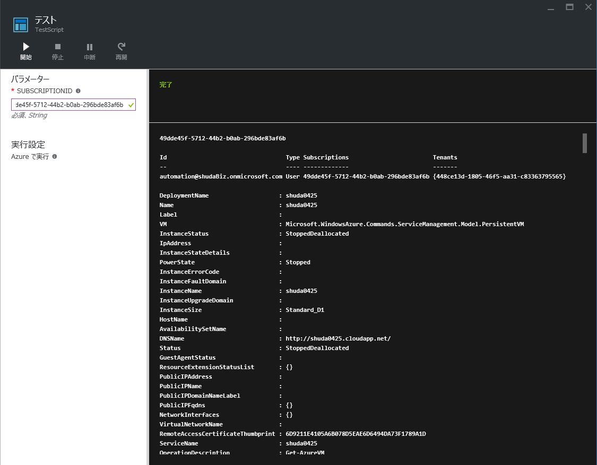

> [!WARNING]
> 本記事は、投稿より時間が経過しており、**一部内容が古い可能性があります。**

こんにちは、Azure サポートの宇田です。

日々のお問い合わせの中で、「Azure Automation で管理を自動化したいが、どのようにすれば良いかわからない。」という声を伺う機会が増えてきましたので、まずは概要のみですがご紹介したいと思います。

## 事前準備: Azure AD にユーザーアカウントを作成する

Azure Automation で利用する資格情報には、Microsoft アカウントを利用することができません。
このため、事前に Azure AD でユーザーを作成し、共同管理者として設定を行います。

1. Azure Active Directory 上に Automation 用のユーザーを新規作成します。(AAD のみクラシック ポータルで作業が必要です。)
なお、Azure Automation で使用するユーザーについては、Multi-Factor Authentication を有効化しないようにご留意ください。

2. ユーザーを作成して一時パスワードを取得したら、一旦サインアウトするか異なるブラウザー (InPrivate ブラウズ) などでログインし、パスワードを変更します。パスワードを変更後は画面は閉じてしまって問題ありません。

3. 管理ポータルに戻り、新規作成したユーザーを共同管理者に設定します。

以上で事前準備は完了になります。

なお、Azure Resource Manager (ARM) 環境の場合には、Automation アカウント作成時に実行アカウントを作成して使用できます。 ただ、こちらは RBAC の仕組みを利用している為、クラシック (ASM: Azure Service Management) 環境の管理には利用出来ません。 詳しくは以下のドキュメントをご覧ください。

* Azure 実行アカウントを使用した Runbook の認証
https://azure.microsoft.com/ja-jp/documentation/articles/automation-sec-configure-azure-runas-account/

## Azure Automation アカウントを用意し、Runbook を作成する

続いて、Azure Automation のアカウントを用意し、Runbook を作成していきます。

1. [新規] – [管理] – [オートメーション] より、任意の名称で Automation アカウントを作成します。

2. Azure Automation では、資格情報やスケジュール、変数などを [資産] として保持しています。任意の名前と、先に Azure AD 上に作成したユーザー名・パスワードを入力して作成します。なお、ここで指定した [名前] は後程スクリプト内で使用しますので、忘れずにメモをお願いします。

3. 続いて、Runbook を作成します。既定で AzureAutomationTutorial というサンプルも作成されていますが、今回は新規で Runbook を作成します。

4. Runbook の編集画面にて、Azure PowerShell と同様にスクリプトを記載していきます。Azure Automation 固有の設定として、ログイン処理は先に作成した [資格情報] を参照します。

<pre># 入力パラメーターの定義
param(
    [Parameter(Mandatory = $true)]
    [string]$SubscriptionId
)

# 保存した資格情報の [名前] を指定します
$credential = Get-AutomationPSCredential –Name "AutomationAccount"

# 入力パラメーターを表示します
echo $SubscriptionId

# ASM 環境の場合 (認証、サブスクリプション選択、仮想マシン一覧の表示)
Add-AzureAccount -Credential $credential
Select-AzureSubscription -SubscriptionId $SubscriptionId
Get-AzureVM

# ARM 環境の場合 (認証、サブスクリプション選択、仮想マシン一覧の表示)
Login-AzureRmAccount -Credential $credential
Select-AzureRmSubscription -SubscriptionId $SubscriptionId
Get-AzureRmVM</pre>

5. スクリプトを [保存] し、[テスト ウインドウ] を開きます。 先の例では param で入力パラメーターを定義していますので、テスト ウインドウにもテキストボックスが表示されていることが確認できるかと思います。[開始] をクリックして、しばらく待つと実行結果が表示されます。

6. 問題なくスクリプトが動作することが確認できたら、編集画面で [発行] をクリックします。

7. 発行後、Runbook を [開始] することで手動実行が可能です。スケジュール実行する場合には、[スケジュール] を作成し、入力パラメーターがある場合には、同じく設定を行います。

8. 実行結果は、[ジョブ] のページから確認することができます。[出力] にコンソール ログが出ますので、エラーになった際はこちらを元にデバッグしていただければと思います。

と、ここまで書いた所でデプロイ王子のブログを見つけました。
こちらも併せてご参考になれば幸いです。

* デプロイ王子のクラウド寺子屋 – Azure 仮想マシンのバックアップを自動化しよう
https://www.kzmx.net/azure/1104/
