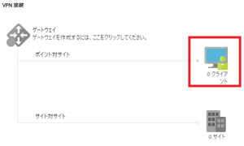
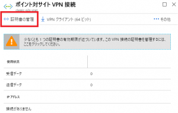
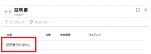
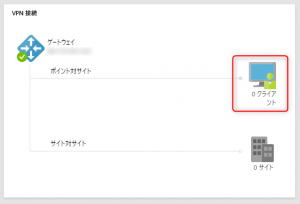
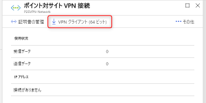
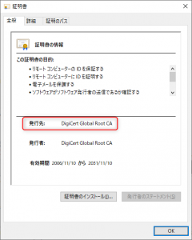

> [!WARNING]
> 本記事は、投稿より時間が経過しており、**一部内容が古い可能性があります。**

Azure 仮想ネットワーク ゲートウェイを使ってポイント対サイト VPN（P2S VPN）のサービスをご利用いただいているお客様に影響が出る可能性があるメンテナンスについて、弊社サイトにてアナウンスさせていただきました。

Transition from self-signed to public CA certificates for P2S gateways
https://docs.microsoft.com/en-us/azure/vpn-gateway/vpn-gateway-point-to-site-gateway-public-ca

このメンテナンスの内容を正しく理解いただくため、今回のメンテナンスの技術的な背景や事前にご協力いただきたい作業について、本ブログにて補足させていただきます。

## 背景

### P2S VPN で利用される証明書について

P2S VPN は、SSL を利用した SSTP という VPN プロトコルを使って動作いたします。
このため、P2S VPN クライアントと仮想ネットワーク ゲートウェイ間で SSL を確立するための、サーバー証明書が仮想ネットワーク ゲートウェイ側に設定されます。

この証明書はお客様が作成するクライアントの認証で利用される証明書とは異なり、仮想ネットワーク ゲートウェイ作成時に自動的に構成されます。

このサーバー証明書は、自己署名された認証局によって署名されており、認証局も証明書も有効期間は 3 年で構成されていました。
また、自動的に生成されたサーバー証明書を P2S VPN クライアント側で正しく検証を行うため、VPN クライアントパッケージをインストールする際に自己署名した認証局の公開証明書をクライアントの証明書ストアに配置していました。

以前の仮想ネットワーク ゲートウェイの動作では、証明書の更新に伴いこの自己署名された認証局も更新されていました。
この結果、クライアントの証明書ストアに配置された認証局の公開証明書と仮想ネットワーク ゲートウェイが新たに利用する証明書が一致しなくなり、クライアント側で更新後の証明書を正しく検証することができなくなるため、P2S VPN の接続に失敗する事象が発生しておりました。
この事象が発生すると、VPN クライアント パッケージを再ダウンロードし、各クライアント端末にインストールするまでは P2S VPN 接続ができない動作になっておりました。

### サーバー証明書の有効期限について

上述のとおり、過去に作成された 仮想ネットワーク ゲートウェイでは、有効期間が 3 年の自己署名証明書が利用されておりました。
また、サーバー証明書に署名を行った認証局（自己署名した認証局）自身の有効期間も 3 年となっており、3 年ごとに証明書を更新する必要がございました。

有効期間切れによって証明書が失効することを防ぐため、仮想ネットワーク ゲートウェイの定期的なメンテナンスでは、ゲートウェイで利用されている証明書の有効期間が残り 6 ヶ月を下回ったことを検知すると証明書の更新を行うように動作していました。
つまり、仮想ネットワーク ゲートウェイを作成してから 2 年半を超えた時点でメンテナンスが実施されると証明書の更新が行われるようになっていました。

しかしながら、このような方法では、おおよそ 3 年ごとに証明書を更新する必要があり、その度に P2S VPN 接続が行えなくなるため、クライアントの再設定が必要になるという制約が生じておりました。

このため、2017 年 7 月頃以降に作成された仮想ネットワーク ゲートウェイでは、有効期間が長い公的証明機関によって署名されたサーバー証明書を利用するように仮想ネットワーク ゲートウェイの動作が変更されております。

動作変更後のゲートウェイにおいても、引き続き P2S VPN で利用されているサーバー証明書は 3 年ごとに更新されますが、その証明書に署名している認証局が有効期間の長い公的証明機関のものになっているため、2017 年 7 月頃以降に作成された仮想ネットワーク ゲートウェイでは証明書の更新によって P2S  VPN が接続できなくなる事象は発生いたしません。
（注：新規作成されたゲートウェイの証明書が公的証明機関によって署名されたものに変更された時期は、データセンターのリージョンなどによって前後するため、明確な日付をご案内することはできません）

### 今回実施される更新について

現在、お客様にてご利用いただいている仮想ネットワーク ゲートウェイは以下の 3 つのタイプに分類されます。

A. 2017 年 7 月頃より前に作成され、その後の定期メンテナンスによって、公的証明機関の証明書に入れ替えが完了しているもの
B. 2017 年 7 月頃より前に作成され、現在も自己署名証明書が利用されているもの
C. 2017 年 7 月頃より後に作成されたもの（最初から公的証明機関の証明書が利用されているもの）

今回実施されるメンテナンスによって影響を受けるのは、B. のタイプの仮想ネットワーク ゲートウェイをご利用いただいているお客様になります。

現在、B. のタイプの仮想ネットワーク ゲートウェイをご利用いただいているお客様は 2019 年 3 月 13 日 3:00（日本時間）から開始されるメンテナンスによって、ゲートウェイが作成された時期にかかわらず、全て公的証明機関の証明書が利用されるように更新が行われます。
この更新によって、これまで利用いただいていた VPN クライアントでは P2S VPN が確立できなくなります。よって、メンテナンス後に、再度 Azure ポータルや PowerShell を介してP2S VPN クライアントパッケージをダウンロードし、全てのクライアント端末に再インストールしていただく必要がございます。

この変更は、2019 年 3 月 13 日から開始される仮想ネットワーク ゲートウェイのメンテナンスによって自動的に行われますが、3 月 13 日以降のどのタイミングでメンテナンスが行われるかを事前に把握したり、実施時期を指定することはできません。
もし、それ以前に期間を特定した形でメンテナンスを完了したいお客様に関しましては、サポート リクエストを通じてご要望いただくことで、以下のいずれかの日程で実施することも可能です（いずれも日本時間）。

1. 2019 年 2 月 25 日 15:00～
2. 2019 年 2 月 26 日 3:00～
3. 2019 年 3 月 1 日 15:00～
4. 2019 年 3 月 2 日 3:00～

選択いただいた日時から順次メンテナンスをスタートし、数時間以内には完了することを予定しております。

尚、サポート リクエストを通じて上記日程でのメンテナンスを希望されるお客様は、お問い合わせ時に対象を仮想ネットワーク ゲートウェイを指定してお問い合わせをいただくか、対象の仮想ネットワーク ゲートウェイ名とそのサブスクリプション ID をお知らせ下さい。

### 影響を受けるゲートウェイの確認方法について

現在、公的証明機関で署名された証明書を使って P2S VPN 接続を行っている環境では、既に証明書が更新されているため、今回のメンテナンスの影響を受けることはありません。
利用している環境が既に公的証明機関で署名された証明書を利用しているかは、VPN クライアントパッケージ内の構成ファイルを参照することで確認が可能です。

（確認手順）
1. Azure ポータルや PowerShell を使って、VPN クライアント パッケージをダウンロードします。
2. ダウンロードしたファイルを展開します。
3. 展開したファイルの “Generic” フォルダ内にある “VPNSettings.xml” をメモ帳などのアプリケーションで開きます。
4. 以下の \<ServerCertRootCn> と \<ServerCertIssuerCn> タグの値を確認いただき、値が「DigiCert Global Root CA」になっている場合は、既に公的証明機関で署名された証明書を利用しているため、今回のメンテナンスの影響を受けません。\<ServerCertRootCn>DigiCert Global Root CA</ServerCertRootCn>
<ServerCertIssuerCn>DigiCert Global Root CA\</ServerCertIssuerCn>
（注：クラシック デプロイモデルの仮想ネットワーク ゲートウェイを利用している場合の確認手順は、後述いたします FAQ の Q4 をご参照ください。）

（参考情報）
ネイティブ Azure 証明書認証の P2S 構成のための VPN クライアント構成ファイルを作成およびインストールする
https://docs.microsoft.com/ja-jp/azure/vpn-gateway/point-to-site-vpn-client-configuration-azure-cert

## メンテナンス後の対応について

メンテナンスが実行され、ゲートウェイが利用する証明書が公的証明機関のものに更新されると、これまで利用していた VPN クライアントでは接続できなります。
この場合、改めて Azure ポータルや PowerShell を使って、VPN クライアントパッケージをダウンロードし、各クライアント端末にインストールする必要があります。

今回のメンテナンスよって影響を受けるお客様にはご迷惑をおかけして申し訳ございませんが、ご理解のほどよろしくお願い申し上げます。

## FAQ

Q1. メンテナンスの期間が長すぎるため、その中でもメンテナンスが起こる時間をさらに特定することはできないか。
A1. 恐れ入りますが、メンテナンス期間中のどのタイミングで実際にメンテナンスが発生するかは、指定することはできません。厳密にタイミングをコントロールする必要がある場合は、ゲートウェイをいったん削除し、再作成していただければ、そのゲートウェイでは公的証明機関によって署名された証明書が利用された状態になります。ただし、ゲートウェイの再作成に伴って、ゲートウェイのパブリック IPアドレスが変更になるため、同じゲートウェイでサイト間 VPN をご利用いただいていた場合は、IP アドレスの変更に伴う設定変更が必要になります。

Q2. ポイント体サイト VPN を利用しているかどうかを確認するためには、どうすればよいか。
A2. 一例ではありますが、以下の手順で確認することができます。

リソース マネージャー モデルをご利用の場合
1. Azure ポータル (https://portal.azure.com/) を開きます。
2. [仮想ネットワーク ゲートウェイ] を開きます。
3. ゲートウェイを開き、\[ポイント体サイトの構成] を開きます。
4. 「ポイント対サイトが構成されていません」と表示される場合は、そのゲートウェイでポイント対サイト VPNは利用されていません。

クラシック モデルをご利用の場合
1. Azure ポータル (https://portal.azure.com/) を開きます。
2. [仮想ネットワーク (クラシック)] を開きます。
3. \[ポイント対サイト] の \[クライアント] のアイコンをクリックします。
   
4. \[証明書の管理] をクリックします。
   
5. 「証明書がありません」と表示される場合は、そのゲートウェイでポイント対サイト VPNは利用されていません。
   

Q3. 仮想ネットワーク ゲートウェイに構成した ”ルート証明書” や “失効した証明書” は影響を受けますか。
A3. 今回の変更で “ルート証明書” や “失効した証明書” が影響を受けることはありません。

Q4. メンテナンスの対象かどうかを確認するために、クラシック デプロイ モデルの環境で VPN クライアント パッケージをダウンロードし展開してみましたが、"Generic" フォルダが見つかりません。
A4. ご案内が不十分で申し訳ございません。

クラシック デプロイ モデルでは以下の手順で確認が可能です。
1. Azure ポータルの仮想ネットワーク（クラシック）から該当の仮想ネットワークを選択します。
2. \[ポイント対サイト] の [クライアント] のアイコンをクリックします。
   
3. \[VPN クライアント (64 ビット)] をクリックし、VPN クライアント パッケージをダウンロードします。
   
4. ダウンロードした VPN クライアントパッケージの拡張子を .exe から .zip に変更して展開します。
5. 展開したファイルに含まれる拡張子 .cer のファイルを Windows OS で開き、証明書のプロパティを表示します。
6. 証明書のプロパティの全般タブにて、"発行者" の値が「DigiCert Global Root CA」になっている場合は、既に公的証明機関で署名された証明書を利用しているため、今回のメンテナンスの影響を受けません。
   
