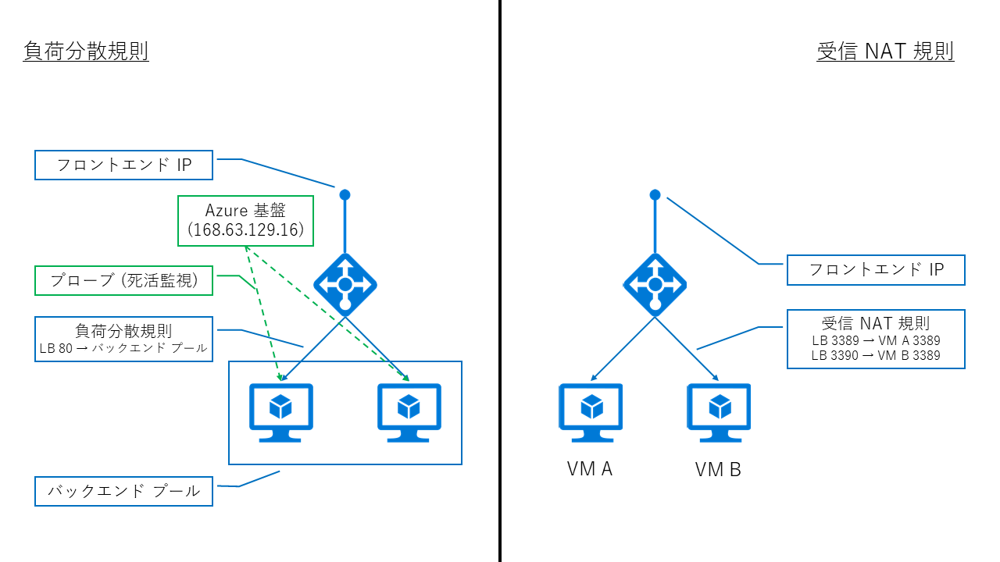
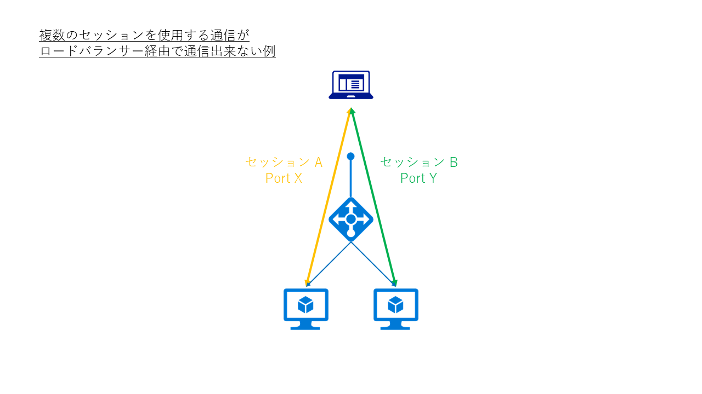
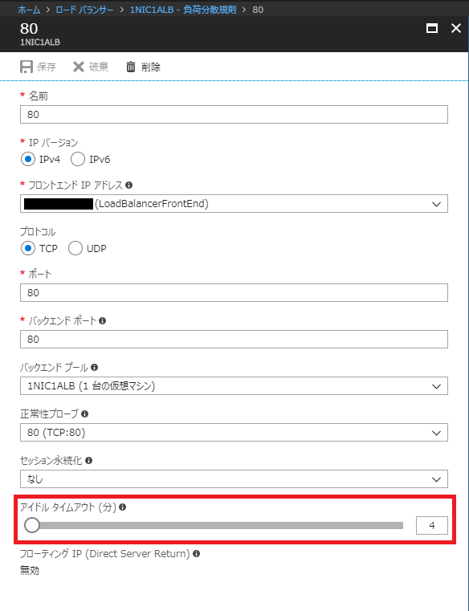

> [!WARNING]
> 本記事は、投稿より時間が経過しており、**一部内容が古い可能性があります。**

こんにちは。Azure サポートの宇田です。

今回は Azure のロードバランサー (ALB / ILB) 経由で通信ができない場合のチェックポイントをご紹介します。

Azure におけるロードバランサーの挙動については、以下の投稿もあわせてご確認ください。

* Azure のロードバランサーは pre-warming も監視も不要です
https://jpaztech.github.io/blog/archive/azure-lb-pre-warming-and-monitoring/
* ロードバランサー経由での通信が偏る場合のチェックポイント
https://jpaztech.github.io/blog/archive/loadbalancer-troubleshooting2/

## Azure のロードバランサーについて

現在、Azure では通信の負荷分散を行うにあたって複数のサービスを提供しています。

* クラウド サービス (クラシック環境での呼称): リソース マネージャー環境での外部ロードバランサーと同等
* 外部ロードバランサー (ALB / Azure Load Balancer): フロントエンドに Public IP を持つ L4 のロードバランサー
* 内部ロードバランサー (ILB / Internal Load Balancer): フロントエンドに Private IP を持つ L4 のロードバランサー
* アプリケーション ゲートウェイ (Application Gateway): HTTP / HTTPS の負荷分散を行う L7 のロードバランサー
* トラフィック マネージャー (Traffic Manager): 複数のリージョンをまたぎ、DNS レベルでの負荷分散を行うロードバランサー

今回は、このうち内部・外部のロードバランサー (ALB / ILB) についてを取り上げます。

## Azure Load Balancer / Internal Load Balancer の仕組み

Azure 上のロードバランサーは、物理的なハードウェアによって負荷分散を行っておらず、複数のインスタンスがソフトウェア的に負荷分散を実現しています。

この負荷分散を担うインスタンス (SLB MUX) は、BGP を用いた経路制御を行っているため、仮に一部のインスタンスで障害が発生した場合でも、短時間で他の正常なインスタンスへ切り替えが行われ、通常ロードバランサーの障害が問題となることはありません。ロードバランサー経由での通信が期待したように動かない場合の多くは、わずかな設定の不備に起因するものとなりますので、各設定項目の意味をご理解いただき、後述の通り切り分けて頂ければと思います。

なお、内部の仕組みなど詳しくは以下の参考文献をご確認ください。

* Ananta: Cloud Scale Load Balancing
http://conferences.sigcomm.org/sigcomm/2013/papers/sigcomm/p207.pdf
http://conferences.sigcomm.org/sigcomm/2013/slides/sigcomm/19.pptx
* 詳説 Azure IaaS ～私はインフラが好きだ～ (51:40 – 58:20 頃)
https://channel9.msdn.com/Events/de-code/2016/INF-001
* Azureのロードバランサ事情 – ロードバランサの中ってどうなっているの？ –
http://qiita.com/hat22/items/60e4547019473761be3f

## Azure Load Balancer / Internal Load Balancer の構成要素

ALB / ILB は、以下の構成要素によって成り立っています。

* フロントエンド IP: ロードバランサーへアクセスする際の IP アドレス
* バックエンド プール: ロードバランサー配下に所属させるリソース群
* プローブ: ロードバランサーからバックエンドに対して行う死活監視
* 負荷分散規則 / 受信 NAT 規則: 負荷分散設定

Azure のロードバランサーは、定期的にバックエンドのサーバーに対してプローブと呼ばれる死活監視を行い、これに応答がない場合は当該サーバーがダウンしているものとみなして、負荷分散の対象から除外します。(応答が返る状態に復旧すれば、負荷分散対象に戻ります。)

また、負荷分散規則を使用するか、受信 NAT 規則を使うべきかは用途によって異なります。例えば、Web サイトを複数のサーバーでホストするような場合には、どちらのサーバーへ割り振られても問題がないため負荷分散規則を使いますが、RDP や SSH のように、特定のサーバーへ通信を割り振りたい場合には受信 NAT 規則を用います。

つまり、1 つのロードバランサー配下に 2 台のサーバーを立てたとして、2 台のどちらかに振り分けたいのであれば負荷分散規則を、特定のサーバーの特定のポートへ NAT (NAPT) させたいのであれば受信 NAT 規則を使います。

## ロードバランサー経由で通信できない場合の切り分け方法
以上のような仕組みを踏まえたうえで、ロードバランサーを経由する通信が意図したように行えない場合の原因をいくつかのパターンに分けて取り上げます。

### 1. プローブに応答を返せていない場合
前述の通り、ロードバランサーはバックエンド プールのサーバー群に対して、定期的にプローブ (死活監視) の通信を行っています。この頻度や死活監視の方法 (TCP / HTTP) は任意で設定できますが、設定が正しくない場合や、バックエンドのサーバーが死活監視に応答できない場合、ロードバランサーは当該サーバーがダウンしているとみなし、負荷分散が行われません。

例) TCP 443 しか Listen していない Web サーバーに対して、TCP 80 でプローブを行った場合

こうした事象を切り分けるには、バックエンドのサーバーでプローブに設定したポートが Listen しているかを確認したり、パケットを採取してプローブが正しく届き、応答を正しく返せている (3way handshake が出来ている) ことを確認しましょう。

もしプローブが到達していなければ、NSG や OS の Firewall などでプローブの発信元である 168.63.129.16 からの通信を拒否しているような場合が考えられます。こうした場合には、一時的に NSG の紐づけを外したり、Firewall を無効化して切り分けを行いましょう。また、プローブが届いているものの、応答を返していないような場合には、仮想マシン内の設定をご確認ください。(例えば、マルチ NIC の仮想マシンでデフォルト ルートの設定が正しくない等)

(Netstat で Listen しているポートを確認)

<pre>C:\Users\shuda&gt;netstat -an

Active Connections

  Proto  Local Address          Foreign Address        State
  TCP    0.0.0.0:80             0.0.0.0:0              LISTENING
  TCP    0.0.0.0:135            0.0.0.0:0              LISTENING
  TCP    0.0.0.0:445            0.0.0.0:0              LISTENING
  TCP    0.0.0.0:3389           0.0.0.0:0              LISTENING
  TCP    0.0.0.0:5985           0.0.0.0:0              LISTENING
  TCP    0.0.0.0:47001          0.0.0.0:0              LISTENING
  TCP    0.0.0.0:49152          0.0.0.0:0              LISTENING
  TCP    0.0.0.0:49153          0.0.0.0:0              LISTENING
  TCP    0.0.0.0:49154          0.0.0.0:0              LISTENING
  TCP    0.0.0.0:49155          0.0.0.0:0              LISTENING
  TCP    0.0.0.0:49161          0.0.0.0:0              LISTENING
  TCP    0.0.0.0:49163          0.0.0.0:0              LISTENING
  TCP    10.1.1.4:139           0.0.0.0:0              LISTENING
  TCP    10.1.1.4:3389          114.181.231.193:63028  ESTABLISHED
  TCP    10.1.1.4:49159         168.63.129.16:80       ESTABLISHED
  TCP    10.1.1.4:49164         40.115.229.24:443      ESTABLISHED
  TCP    10.1.1.4:49168         168.63.129.16:80       ESTABLISHED
  TCP    10.1.1.4:49210         157.56.77.148:443      ESTABLISHED
  UDP    0.0.0.0:123            *:*
  UDP    0.0.0.0:3389           *:*
  UDP    0.0.0.0:5355           *:*
  UDP    10.1.1.4:137           *:*
  UDP    10.1.1.4:138           *:*</pre>

(プローブを 5 秒間隔で TCP 80 とした際のパケット)

<table border="1">
<tbody>
<tr>
<th width="110">Time</th>
<th width="70">Process</th>
<th width="130">Src IP</th>
<th width="130">Des IP</th>
<th>Description</th>
</tr>
<tr>
<td>10:25:35 AM</td>
<td>System</td>
<td>168.63.129.16</td>
<td>10.0.0.4</td>
<td>TCP:Flags=&#8230;A&#8230;F, SrcPort=62067, DstPort=HTTP(80), PayloadLen=0, Seq=1069893956, Ack=1409551583, Win=4106</td>
</tr>
<tr>
<td>10:25:35 AM</td>
<td>System</td>
<td>10.0.0.4</td>
<td>168.63.129.16</td>
<td>TCP:Flags=&#8230;A&#8230;., SrcPort=HTTP(80), DstPort=62067, PayloadLen=0, Seq=1409551583, Ack=1069893957, Win=4140</td>
</tr>
<tr>
<td>10:25:35 AM</td>
<td>System</td>
<td>168.63.129.16</td>
<td>10.0.0.4</td>
<td>TCP:Flags=CE&#8230;.S., SrcPort=62127, DstPort=HTTP(80), PayloadLen=0, Seq=2857482126, Ack=0, Win=8192 ( Negotiating scale factor 0x8 ) = 8192</td>
</tr>
<tr>
<td>10:25:35 AM</td>
<td>System</td>
<td>10.0.0.4</td>
<td>168.63.129.16</td>
<td>TCP:Flags=.E.A..S., SrcPort=HTTP(80), DstPort=62127, PayloadLen=0, Seq=4099797981, Ack=2857482127, Win=8192 ( Negotiated scale factor 0x8 ) = 2097152</td>
</tr>
<tr>
<td>10:25:35 AM</td>
<td>System</td>
<td>168.63.129.16</td>
<td>10.0.0.4</td>
<td>TCP:Flags=&#8230;A&#8230;., SrcPort=62127, DstPort=HTTP(80), PayloadLen=0, Seq=2857482127, Ack=4099797982, Win=4106 (scale factor 0x8) = 1051136</td>
</tr>
<tr>
<td>10:25:35 AM</td>
<td>System</td>
<td>10.0.0.4</td>
<td>168.63.129.16</td>
<td>TCP:Flags=&#8230;A.R.., SrcPort=HTTP(80), DstPort=62067, PayloadLen=0, Seq=1409551583, Ack=1069893957, Win=0</td>
</tr>
<tr>
<td>10:25:40 AM</td>
<td>System</td>
<td>168.63.129.16</td>
<td>10.0.0.4</td>
<td>TCP:Flags=&#8230;A&#8230;F, SrcPort=62127, DstPort=HTTP(80), PayloadLen=0, Seq=2857482127, Ack=4099797982, Win=4106 (scale factor 0x8) = 1051136</td>
</tr>
<tr>
<td>10:25:40 AM</td>
<td>System</td>
<td>168.63.129.16</td>
<td>10.0.0.4</td>
<td>TCP:Flags=CE&#8230;.S., SrcPort=62156, DstPort=HTTP(80), PayloadLen=0, Seq=687874311, Ack=0, Win=8192 ( Negotiating scale factor 0x8 ) = 8192</td>
</tr>
<tr>
<td>10:25:40 AM</td>
<td>System</td>
<td>10.0.0.4</td>
<td>168.63.129.16</td>
<td>TCP:Flags=.E.A..S., SrcPort=HTTP(80), DstPort=62156, PayloadLen=0, Seq=3417247187, Ack=687874312, Win=8192 ( Negotiated scale factor 0x8 ) = 2097152</td>
</tr>
<tr>
<td>10:25:40 AM</td>
<td>System</td>
<td>168.63.129.16</td>
<td>10.0.0.4</td>
<td>TCP:Flags=&#8230;A&#8230;., SrcPort=62156, DstPort=HTTP(80), PayloadLen=0, Seq=687874312, Ack=3417247188, Win=4106 (scale factor 0x8) = 1051136</td>
</tr>
<tr>
<td>10:25:40 AM</td>
<td>System</td>
<td>168.63.129.16</td>
<td>10.0.0.4</td>
<td>TCP:[Segment Lost]Flags=&#8230;A&#8230;F, SrcPort=62127, DstPort=HTTP(80), PayloadLen=0, Seq=2857482127, Ack=4099797982, Win=4106 (scale factor 0x8) = 1051136</td>
</tr>
<tr>
<td>10:25:40 AM</td>
<td>System</td>
<td>10.0.0.4</td>
<td>168.63.129.16</td>
<td>TCP:Flags=&#8230;A&#8230;., SrcPort=HTTP(80), DstPort=62127, PayloadLen=0, Seq=4099797982, Ack=2857482128, Win=4140 (scale factor 0x8) = 1059840</td>
</tr>
<tr>
<td>10:25:40 AM</td>
<td>System</td>
<td>10.0.0.4</td>
<td>168.63.129.16</td>
<td>TCP:Flags=&#8230;A.R.., SrcPort=HTTP(80), DstPort=62127, PayloadLen=0, Seq=4099797982, Ack=2857482128, Win=0</td>
</tr>
<tr>
<td>10:25:45 AM</td>
<td>System</td>
<td>168.63.129.16</td>
<td>10.0.0.4</td>
<td>TCP:Flags=&#8230;A&#8230;F, SrcPort=62156, DstPort=HTTP(80), PayloadLen=0, Seq=687874312, Ack=3417247188, Win=4106 (scale factor 0x8) = 1051136</td>
</tr>
<tr>
<td>10:25:45 AM</td>
<td>System</td>
<td>168.63.129.16</td>
<td>10.0.0.4</td>
<td>TCP:Flags=CE&#8230;.S., SrcPort=62190, DstPort=HTTP(80), PayloadLen=0, Seq=3103981020, Ack=0, Win=8192 ( Negotiating scale factor 0x8 ) = 8192</td>
</tr>
<tr>
<td>10:25:45 AM</td>
<td>System</td>
<td>10.0.0.4</td>
<td>168.63.129.16</td>
<td>TCP:Flags=.E.A..S., SrcPort=HTTP(80), DstPort=62190, PayloadLen=0, Seq=2471031278, Ack=3103981021, Win=8192 ( Negotiated scale factor 0x8 ) = 2097152</td>
</tr>
<tr>
<td>10:25:45 AM</td>
<td>System</td>
<td>168.63.129.16</td>
<td>10.0.0.4</td>
<td>TCP:Flags=&#8230;A&#8230;., SrcPort=62190, DstPort=HTTP(80), PayloadLen=0, Seq=3103981021, Ack=2471031279, Win=4106 (scale factor 0x8) = 1051136</td>
</tr>
<tr>
<td>10:25:45 AM</td>
<td>System</td>
<td>168.63.129.16</td>
<td>10.0.0.4</td>
<td>TCP:[Segment Lost]Flags=&#8230;A&#8230;F, SrcPort=62156, DstPort=HTTP(80), PayloadLen=0, Seq=687874312, Ack=3417247188, Win=4106 (scale factor 0x8) = 1051136</td>
</tr>
<tr>
<td>10:25:45 AM</td>
<td>System</td>
<td>10.0.0.4</td>
<td>168.63.129.16</td>
<td>TCP:Flags=&#8230;A&#8230;., SrcPort=HTTP(80), DstPort=62156, PayloadLen=0, Seq=3417247188, Ack=687874313, Win=4140 (scale factor 0x8) = 1059840</td>
</tr>
<tr>
<td>10:25:45 AM</td>
<td>System</td>
<td>10.0.0.4</td>
<td>168.63.129.16</td>
<td>TCP:Flags=&#8230;A.R.., SrcPort=HTTP(80), DstPort=62156, PayloadLen=0, Seq=3417247188, Ack=687874313, Win=0</td>
</tr>
</tbody>
</table>

(2017/01/17 追記)
Linux OS をご利用の場合に「net.ipv4.tcp_tw_recycle」のパラメーターが有効になっていたことで、ロードバランサーからの死活監視に応答しなくなる、といった事例が複数ございました。

こうした事例では、上述のように仮想マシンでパケットを採取した場合、プローブの通信は届いているものの Ack を返しておらず、結果的にロードバランサーからはダウンしていると判断されておりましたので、このパラメーターが「1」（有効）と設定されている場合は、「0」（無効）に設定して事象が回避できるかご確認いただければと思います。

（確認方法）

<pre># sysctl net.ipv4.tcp_tw_recycle
net.ipv4.tcp_tw_recycle = 1</pre>

（変更方法）

<pre># sysctl -w net.ipv4.tcp_tw_recycle=0
net.ipv4.tcp_tw_recycle = 0</pre>

(2017/01/17 追記ここまで)

### 2. 負荷分散の設定が正しくない場合

負荷分散規則の誤った使い方をしている場合や、アプリケーションが期待したセッションが確立できない場合、通信が行えないことがあります。

これは様々なパターンが考えられますが、代表的なものとしてはクライアントからの通信が複数のサーバーに割り当てられてしまうことが原因で発生します。

例えば、FTP のように制御用とデータ転送用で 2 セッションを必要としたり、Windows Server の Remote Desktop サービスでは、RD Gateway を使用した通信で送信・受信の 2 セッションを確立する必要がある場合です。こうした複数のセッションを確立する通信の場合、一方が 1 号機に、他方が 2 号機に対して振り分けられてしまうと、正しくセッションが確立できないため通信が行えません。

こうした複数セッションを同一のバックエンド サーバーに振り分ける必要がある場合には、負荷分散規則で[セッション永続化] の項目を [クライアント IP] などと設定します。これにより、同一の IP アドレスから来た通信は同一のサーバーに対して振り分けが行われます。

* なし: ソース IP / ソース Port / 宛先 IP / 宛先 Port / プロトコル
* クライアント IP: ソース IP / 宛先 IP
* クライアント IP とプロトコル: ソース IP / 宛先 IP / プロトコル

なお、セッション永続化の項目は以下 3 通り存在していますが、それぞれ以下の項目を共に振り分け先を決定しています。詳しくは下記 URL をご参照ください。

* ロード バランサー分散モード (ソース IP アフィニティ)
https://docs.microsoft.com/ja-jp/azure/load-balancer/load-balancer-distribution-mode

また、稀な話ではありますが、SQL の通信を振り分けようとして、TCP 1433 を負荷分散規則を作成したつもりが、TCP1443 と Typo していた場合なども、当然期待した負荷分散が行われません。基本的な箇所で間違っていないか、念のため今一度確認してみましょう。

### 3. フローティング IP が有効な場合

負荷分散規則の設定において、フローティング IP (Direct Server Return) という設定項目があります。この設定は SQL Server の Always On を構成する以外の場合、無効にする必要があります。

この設定に有効・無効による差異については、以下にパケットとともにご紹介します。

#### a. フローティング IP 無効時
例えば、ロードバランサー配下に複数の Web サーバーを構築して負荷分散を行う場合、以下のようなパケットが採取できます。

(クライアント側パケット)

<table border="1">
<tbody>
<tr>
<th width="90">Time</th>
<th width="75">Src IP</th>
<th width="75">Dst IP</th>
<th>Description</th>
</tr>
<tr>
<td>4:12:42 PM</td>
<td>10.0.0.7</td>
<td>10.0.0.6</td>
<td>HTTP:Request, GET /</td>
</tr>
<tr>
<td>4:12:42 PM</td>
<td>10.0.0.6</td>
<td>10.0.0.7</td>
<td>HTTP:Response, HTTP/1.1, Status: Ok, URL: /</td>
</tr>
</tbody>
</table>

(サーバー側パケット)

<table border="1">
<tbody>
<tr>
<th width="90">Time</th>
<th width="75">Src IP</th>
<th width="75">Dst IP</th>
<th>Description</th>
</tr>
<tr>
<td>4:12:42 PM</td>
<td>10.0.0.7</td>
<td>10.0.0.4</td>
<td>HTTP:Request, GET /</td>
</tr>
<tr>
<td>4:12:42 PM</td>
<td>10.0.0.4</td>
<td>10.0.0.7</td>
<td>HTTP:Response, HTTP/1.1, Status: Ok, URL: /</td>
</tr>
</tbody>
</table>

※ サーバー: 10.0.0.4 / 10.0.0.5、ロードバランサー: 10.0.0.6、クライアント: 10.0.0.7

クライアントからはロードバランサー (10.0.0.6) 宛にパケットを送信していますが、実際にサーバー側ではクライアント (10.0.0.7) から自分自身 (10.0.0.4) 宛として届いている、すなわちロードバランサーで宛先の IP アドレスが NAT されていることがわかります。

#### b. フローティング IP 有効時
一方で、SQL Server で AlwaysOn を構成し、ロードバランサーのフローティング IP 設定を有効化した環境でパケットを採取しますと、以下のようなパケットが確認できます。

(クライアント側パケット)

<table border="1">
<tbody>
<tr>
<th width="90">Time</th>
<th width="75">Src IP</th>
<th width="75">Dst IP</th>
<th>Description</th>
</tr>
<tr>
<td>4:29:40 PM</td>
<td>10.0.0.7</td>
<td>10.0.0.6</td>
<td>TCP:Flags=CE&#8230;.S., SrcPort=55755, DstPort=1433, PayloadLen=0, Seq=1942765889, Ack=0, Win=8192 ( Negotiating scale factor 0x8 ) = 8192</td>
</tr>
<tr>
<td>4:29:40 PM</td>
<td>10.0.0.6</td>
<td>10.0.0.7</td>
<td>TCP:Flags=.E.A..S., SrcPort=1433, DstPort=55755, PayloadLen=0, Seq=2970949028, Ack=1942765890, Win=8192 ( Negotiated scale factor 0x8 ) = 2097152</td>
</tr>
</tbody>
</table>

(サーバー側パケット)

<table border="1">
<tbody>
<tr>
<th width="90">Time</th>
<th width="75">Src IP</th>
<th width="75">Dst IP</th>
<th>Description</th>
</tr>
<tr>
<td>4:29:40 PM</td>
<td>10.0.0.7</td>
<td>10.0.0.6</td>
<td>TCP:Flags=CE&#8230;.S., SrcPort=55755, DstPort=1433, PayloadLen=0, Seq=1942765889, Ack=0, Win=8192 ( Negotiating scale factor 0x8 ) = 8192</td>
</tr>
<tr>
<td>4:29:40 PM</td>
<td>10.0.0.6</td>
<td>10.0.0.7</td>
<td>TCP: [Bad CheckSum]Flags=.E.A..S., SrcPort=1433, DstPort=55755, PayloadLen=0, Seq=2970949028, Ack=1942765890, Win=8192 ( Negotiated scale factor 0x8 ) = 2097152</td>
</tr>
</tbody>
</table>

※ サーバー: 10.0.0.4 / 10.0.0.5、ロードバランサー: 10.0.0.6、クライアント: 10.0.0.7

フローティング IP が有効なロードバランサーを使用すると、サーバー側で採取を行ったパケットでも、NAT が行われずにロードバランサーの IP (10.0.0.6) 宛として着信している事が確認いただけるかと思います。

つまり、フローティング IP を有効化した場合には、サーバー側からみると自分以外の宛先へ向けたパケットとして認識されることから、受信したパケットは通常ではそのまま破棄されてしまいます。

こうした理由により、SQL Server の Always On で可用性グループのリスナーを構築するような場合を除いては、予期せぬトラブルを避けるため、フローティング IP の設定は無効にしていただければと思います。

(2018/03/29 追記)

### 4. 無通信が続いた場合
ロードバランサーの負荷分散では、アイドル タイムアウト値が既定で 4 分と設定されています。

このため、こちらの設置値を超えて無通信の状態が続いた場合、ロードバランサー経由での通信ができなくなります。

アイドル タイムアウト値は最大で 30 分まで設定ができますので、必要に応じて設定を変更いただくか、無通信の状態が続かないように定期的にキープアライブの通信を行うなどをご検討いただければと思います。

(2018/03/29 追記ここまで)

(2019/10/08 追記)

### 5. UDP でフラグメントが発生した場合
DNS や SNMP などの UDP の通信をロードバランサ－経由で行う場合には、ペイロードのサイズにご注意いただく必要があります。

具体的には、1472 Byte (UDP ヘッダー 8 Byte と IPv4 ヘッダー 20 Byte を加えて合計 1500 Byte) 以内でないとロードバランサー経由では通信できません。

UDP の場合、TCP のように MSS サイズで調整することができず、NIC で MTU のサイズを調整することになります。([MTU の調整方法はこちらをご参照ください](https://support.microsoft.com/ja-jp/help/2902923)) MTU サイズを調整した場合、IP レイヤーでフラグメントすることとなりますが、分割された 2 パケット目以降には、以下の通り UDP ヘッダーが付与されません。(つまり、TCP でも UDP でもない IP パケットとして届くことになりますが、Azure VNet は TCP / UDP / ICMP しかサポートしていません。)

また、以下のドキュメントにも明記されている通り、Azure のロードバランサーは IP フラグメントをサポートしていないため、UDP のペイロードが 1472 Byte (ヘッダーを含めて合計 1500 Byte) を超えた場合には通信できません。

* Azure Load Balancer の概要
https://docs.microsoft.com/ja-jp/azure/load-balancer/load-balancer-overview
(抜粋)
一般に、負荷分散規則では、IP フラグメントの転送または UDP および TCP パケットの IP フラグメント化の実行はサポートされていません。

UDP で大きなサイズのパケットをやり取りする場合には、ロードバランサーを介さずに行っていただくことをご検討ください。

(2019/10/08 追記ここまで)

以上、ロードバランサー経由で通信が出来ない場合の代表的な確認点となります。ご参考になれば幸いです。