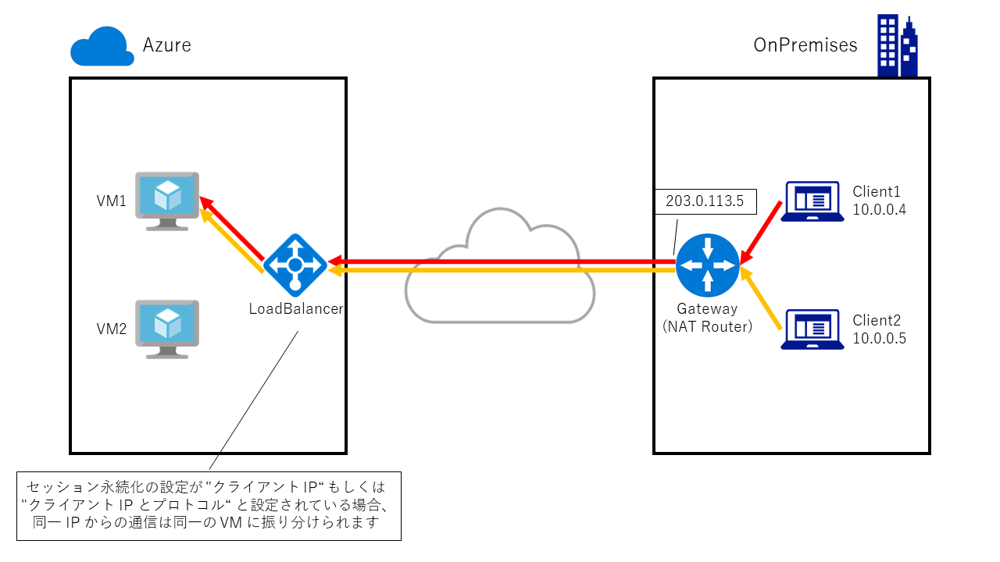
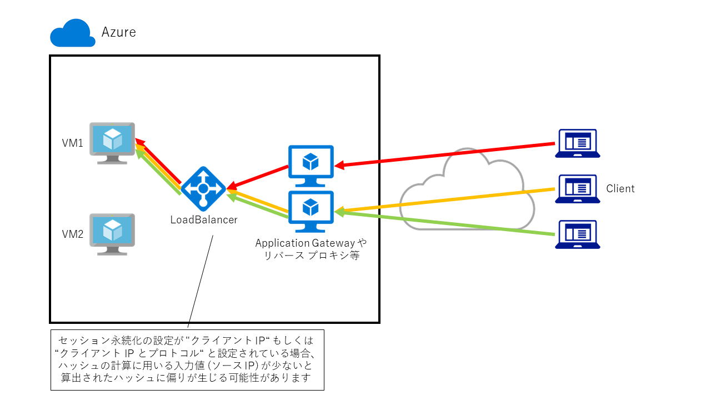
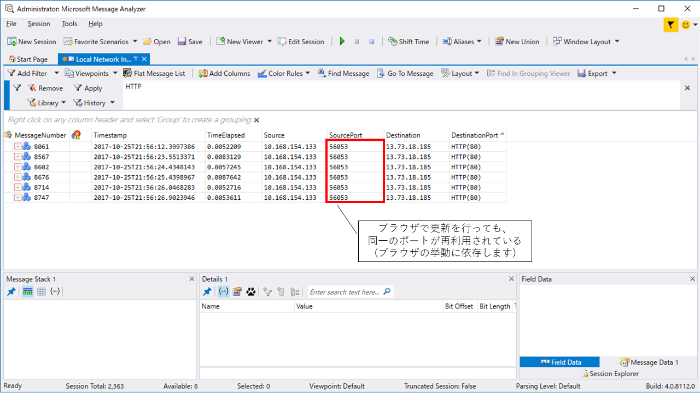

> [!WARNING]
> 本記事は、投稿より時間が経過しており、**一部内容が古い可能性があります。**

こんにちは。Azure サポートの宇田です。
今回はロードバランサー経由の通信が偏る場合のチェックポイントをご紹介します。

Azure におけるロードバランサーの挙動については、以下の投稿もあわせてご確認ください。

* ロードバランサー経由での通信ができない場合のチェックポイント
https://jpaztech.github.io/blog/archive/loadbalancer-troubleshooting/
* Azure のロードバランサーは pre-warming も監視も不要です
https://jpaztech.github.io/blog/archive/azure-lb-pre-warming-and-monitoring/

## ロードバランサーの負荷分散方式について

過去の投稿でも紹介している通り、Azure では様々な種類の負荷分散機能を用意しています。

* クラウド サービス (クラシック環境での呼称): リソース マネージャー環境での外部ロードバランサーと同等
* 外部ロードバランサー (ALB / Azure Load Balancer): フロントエンドに Public IP を持つ L4 のロードバランサー
* 内部ロードバランサー (ILB / Internal Load Balancer): フロントエンドに Private IP を持つ L4 のロードバランサー
* アプリケーション ゲートウェイ (Application Gateway): HTTP / HTTPS の負荷分散を行う L7 のロードバランサー
* トラフィック マネージャー (Traffic Manager): 複数のリージョンをまたぎ、DNS レベルでの負荷分散を行うロードバランサー

今回も前者 3 点 (クラウドサービス、ALB、ILB)について扱いますが、これらはいずれもハッシュベースの分散アルゴリズム、つまり各パラメーターから算出されたハッシュ値に基づいて分散先を決める方式を使用しています。ラウンドロビンの方式ではありませんので、2 台のクライアント端末からロードバランサー経由でアクセスを行っても、ハッシュの計算結果によっては同一のサーバーに対して振り分けられる可能性があることに注意が必要です。

## ロードバランサー経由の通信が偏る際の確認ポイント

ロードバランサーの “セッション永続化” の設定に応じて、以下の要素がハッシュの計算に利用されます。

* なし: ソース IP / ソース Port / 宛先 IP / 宛先 Port / プロトコル
* クライアント IP: ソース IP / 宛先 IP
* クライアント IP とプロトコル: ソース IP / 宛先 IP / プロトコル

これを踏まえ、ロードバランサー経由の通信が偏る一般的な要因をご紹介していきます。

### 1. 同一拠点から接続している場合
以下の図のようにオンプレミスの拠点にある複数のクライアント端末から接続を行った場合を考えます。

Azure のロードバランサーに届くパケットの観点では、複数のクライアント端末からの通信はいずれも というソース IP からの通信として認識されます。

この結果、”クライアント IP” や “クライアント IP とプロトコル” の負荷分散方式を利用している場合には、ソース IP が同一な通信となってしまうことに起因して、すべての通信が同一のサーバーへ振り分けられてしまいます。

この場合にはロードバランサーの “セッション永続化” を “なし” として対処しましょう。

(オンプレミスのゲートウェイで NAT に使用しているグローバル IP を複数とすることでも対処可能ですが、こうした方法は通常容易ではありません)

### 2. リバースプロキシなどが介在する場合

続いて、Web サーバーの手前に Application Gateway などのリバースプロキシが存在する場合を考えます。

上図のように Application Gateway など L7 で動作するリバースプロキシが介在する場合、ロードバランサーには Application Gateway の IP アドレスがソースとなったパケットとして届きます。

この結果、先の例と同様に “クライアント IP” や “クライアント IP とプロトコル” の設定ではハッシュの計算結果に偏りが生じ、通信がきれいに振り分けられないといったことが発生します。(上図の 2 台ずつの構成では、綺麗に 50% ずつに分かれることもあれば、100 % と 0 % といった偏りが生じることも起こりえます。)

Application Gateway などのリバース プロキシと、バックエンドのサーバー台数が多い場合にはハッシュの計算結果が極端に偏ることは起きませんが、上図のような小規模な構成では一方に偏ってしまうことがあることに留意のうえ、必要に応じて “セッション永続化” は “なし” と設定しましょう。

### 3. “セッション永続化” を “なし” としているのに偏る場合

最後に、”セッション永続化” は “なし” と設定し、かつ何度もブラウザでページを更新しているのに振り分け先が異なるという例をご紹介します。

ページを何度リロードしても一方のサーバーを参照してしまう場合、パケットを採取して見てみましょう。以下のように、ページをリロードした際も同一のソース Port から通信が発生していないでしょうか。

ページをリロードをした際に同一の Port を使いまわすか否かはブラウザの実装に依存するため、全てのブラウザがこのような挙動をするとは限りませんが、Azure のロードバランサーはあくまでも L4 で通信を振り分けるため、同一の値をもとにハッシュを計算すれば、当然振り分け先も同一となります。ブラウザを完全に閉じて再起動するか、複数の端末やブラウザを併用するなどして、正しくアクセスが振り分けられていることを確認しましょう。

[参考情報]

* Load Balancer の分散モードを構成する
https://docs.microsoft.com/ja-jp/azure/load-balancer/load-balancer-distribution-mode

以上、ご参考になれば幸いです。
