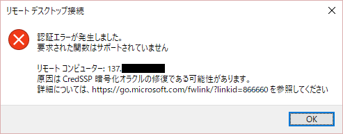

Azure サポートチームの石井です。
2018 年 5 月第 2 週目頃から、突然 Windows 仮想マシンに RDP すると以下のエラーが出て接続が出来なくなったというケースが報告されています。

このエラーは、5 月にリリースされたセキュリティ更新プログラムの影響です。接続元側にのみ、5 月の更新プログラムが適用されており、接続先の VM に 3 月以降の更新プログラムが未適用の場合に当該の状況が発生します。Windows Update の自動更新をせず、自社にてタイミングを管理しているようなお客様に該当する恐れがあります。

以下の Windows サポート部門からの情報に詳しくまとめられていますので、お読みいただき、回避策を実施下さい。

 

2018 年 5 月の更新プログラム適用によるリモート デスクトップ接続への影響
[https://blogs.technet.microsoft.com/askcorejp/2018/05/02/2018-05-rollup-credssp-rdp/](https://blogs.technet.microsoft.com/askcorejp/2018/05/02/2018-05-rollup-credssp-rdp/)
※ Ask CORE Blog は 2019 年 3 月をもちまして、弊社システム刷新の都合により終了いたしました。
※ 2019 年 8 月現在、過去の記事を閲覧することは可能でございますが、予告なく削除される可能性がございます

端的にいうと、以下の対策となります。
1. 回避策の項にある 1 ないしは 2 をクライアント側で実施することで、まずはエラーを回避して RDP 接続が行えるようになります。
2. サーバー側で "5. 参考情報" に記載のセキュリティ更新プログラムを適用します。

-> 更新プログラムの適用が難しい場合、サーバー側でポリシーを当てることで回避が出来ますが、セキュリティ レベルが低くなるため、あくまで暫定回避策とお考え下さい。

### <5/27 更新> 以下の事象は解消済みです。

~~※ 補足: Azure Marketplace のイメージにおいて、Windows 10 クライアント イメージでも事象が発生しますため、上記の回避策を実施して下さい。Azure Marketplace のイメージは、都度のセキュリティ更新プログラムを適用し、開発部門でテスト後に更新されていくため、[数週間の遅延が発生する可能性があります](https://docs.microsoft.com/ja-jp/azure/security/azure-security-best-practices-vms#manage-your-vm-updates)。今回の事象を受け、弊サポート部からも開発に、更新版のイメージのリリースを急ぐようプッシュをかけております。解消までの間、今しばらくお待ちください。~~