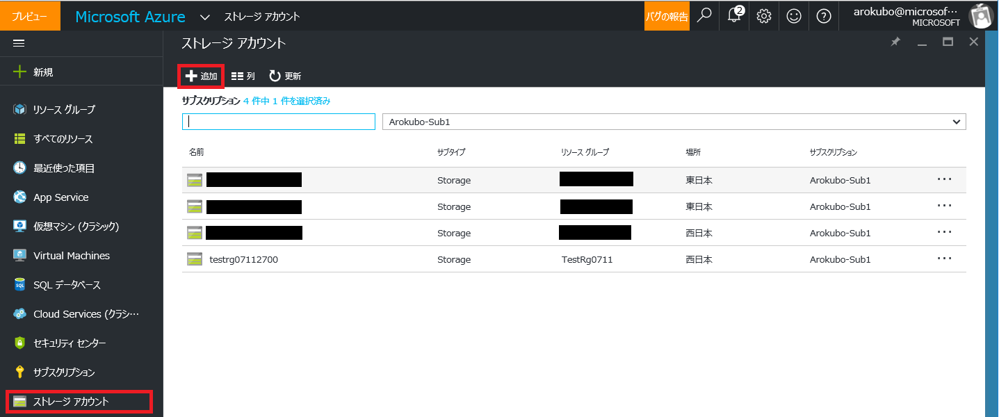
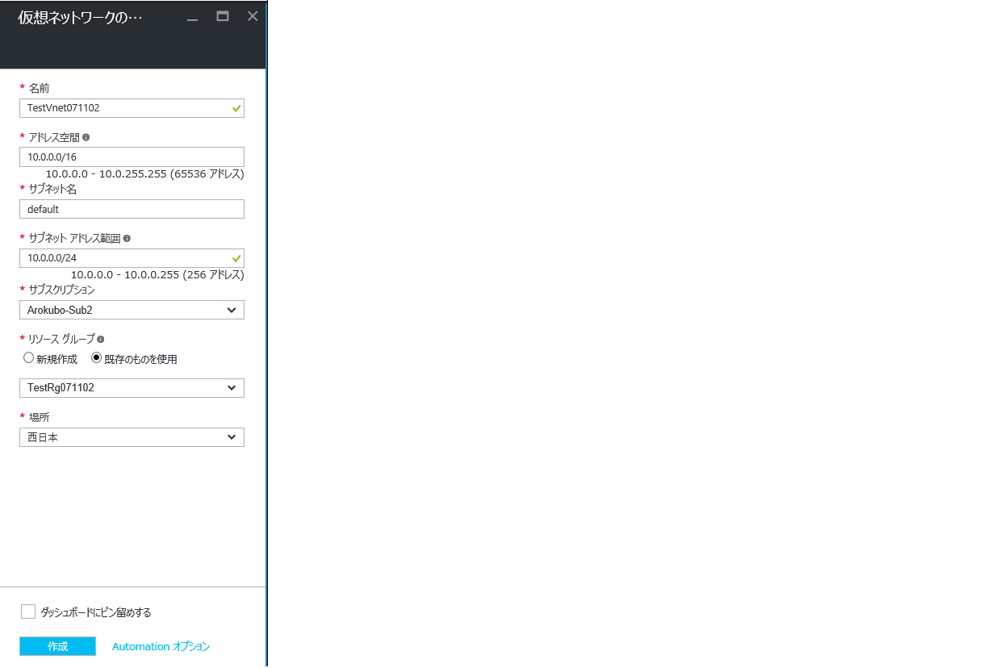
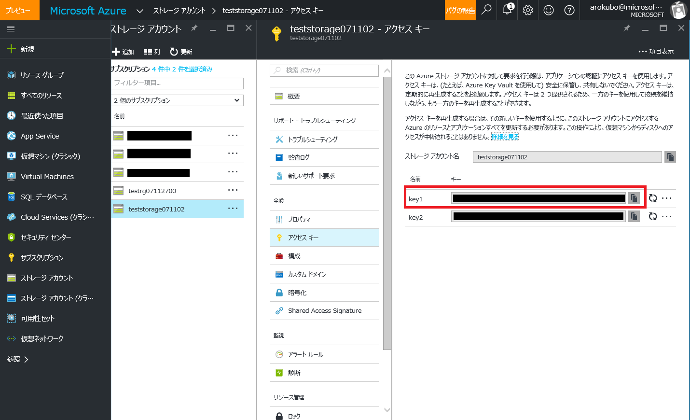

こんにちは。Azure サポートチームの小久保です。
本日は、別のサブスクリプションの環境に仮想ネットワーク、仮想マシンを移行する方法をご紹介します。
今回、ご紹介する環境は、Azure リソース マネージャー (以下、ARM) 環境から ARM 環境への移行となっております。

## ご参考
Azure サービス マネージャー (以下、ASM) 環境から ASM 環境への移行の場合は以下をご確認ください。
[クラシック環境からクラシック環境への仮想マシンの移行方法](http://blogs.technet.microsoft.com/jpaztech/2016/07/11/migration_classic_to_classic/)

## 利用する場面
- 開発用のサブスクリプションで作成した仮想マシンを本番環境用のサブスクリプションへ移行したい。
- VHD の保存されているストレージ アカウントを移動したい。
- ストレージ アカウントをプレミアム ストレージに変更したい。

## 前提条件
- 移行を前提としているため、一般化していない (特殊化状態の) 仮想マシンのシナリオをご紹介します。

## 構成と作業の流れ
1. 仮想マシンの停止
1. 移行先のサブスクリプションに、ストレージアカウントおよびコンテナーの作成
1. 移行先のサブスクリプションに、仮想ネットワークの作成
1. AzCopy にて、OS ディスク、データディスクの VHD ファイルの移行
※ データディスクが存在しない場合は、OS ディスクのみ移行します。
1. 移行した OS ディスクより、仮想マシンの作成

## 事前準備
AzCopy ツールを利用するため、 Microsoft Azure Storage Tools を以下よりダウンロードし、お手元のコンピューターにインストールをお願いします。
[Microsoft Azure Storage Tools](https://aka.ms/downloadazcopy)

## 作業手順
### 1. 新 ポータル ([https://portal.azure.com/](https://portal.azure.com/)) より、仮想マシンを停止します。

### 2. 移行先のサブスクリプションに、ストレージアカウントを作成します。
ストレージ アカウントを選択後、[＋追加] をクリックします。

新規作成するストレージアカウントの情報を入力し、「作成」ボタンをクリックします。
※ アカウントの種類は汎用を選択します。
※ サブスクリプションは移行先のサブスクリプションを選択します。

### 3. 移行先のサブスクリプションに、仮想ネットワークを作成します。
仮想ネットワークを選択後、[＋追加] をクリックします。

新規作成する仮想ネットワークの情報を入力し、「作成」ボタンをクリックします。
※サブスクリプションは移行先のサブスクリプションを選択します。

### 4. AzCopy を利用し、移行先のストレージアカウントへ VHD ファイルをコピーします。
管理者権限にてコマンドプロンプトを起動し、AzCopy のディレクトリに移動し、AzCopy コマンドを実行します。
※ 同じデータセンター内での VHD ファイルの移動は無償ですが、データセンターを跨いだ VHD ファイルの移動は有償となります為、ご注意ください。

コマンド例：
> cd C:\Program Files (x86)\Microsoft SDKs\Azure\AzCopy

コマンド基本構文：
> azcopy.exe /source:＜コピー元コンテナーの URL＞ /dest:＜コピー先コンテナーの URL＞ /SourceKey:＜コピー元ストレージ アカウントのアクセス キー＞ /destKey:＜コピー先ストレージ アカウントのアクセス キー＞ /pattern:"＜VHD ファイル名＞.vhd"

※ コンテナーの URL は [ストレージアカウント] ー＞ [概要] ー＞ [BLOB] ー＞ コンテナーの・・・を右クリックし、[プロパティ]よりご確認ください。

※ アクセスキーは [ストレージアカウント] ー＞ [アクセスキー] よりご確認ください。

※ VHD ファイル名は、コピー元のファイル名をご指定ください。

AzCopy の利用方法については、以下の記事もご参照ください。
- [AzCopy コマンド ライン ユーティリティを使用してデータを転送する](https://azure.microsoft.com/ja-jp/documentation/articles/storage-use-azcopy/)
- [azcopy – BLOB へファイルをやったり取ったり](http://blogs.technet.com/b/ksasaki/archive/2012/11/09/azcopy-blob.aspx)

### 5. 仮想マシンを作成します。
コピーした VHD ファイルをもとに、Azure PowerShell を使用して、仮想マシンを作成します。

特殊化 VHD ファイルから仮想マシンを ARM 環境にデプロイする為の Azure PowerShell は以下ブログにて、公開しております。
[特殊化 VHD ファイルから ARM 環境へ仮想マシンをデプロイする Azure PowerShell](https://blogs.technet.microsoft.com/jpaztech/2017/05/24/deployfromspecializedvhd-powershell/)

