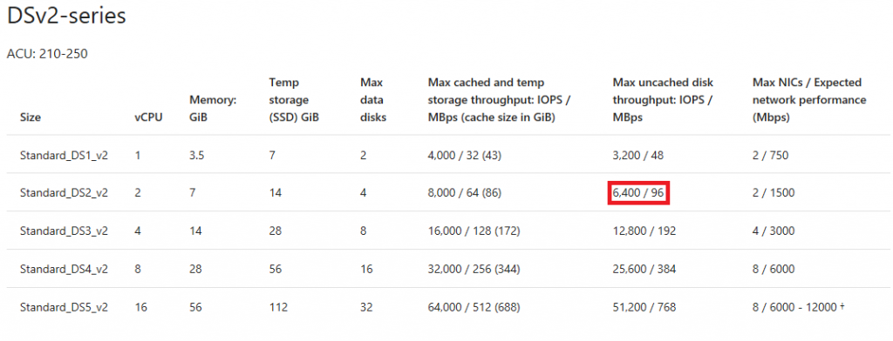
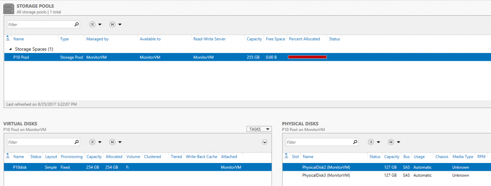
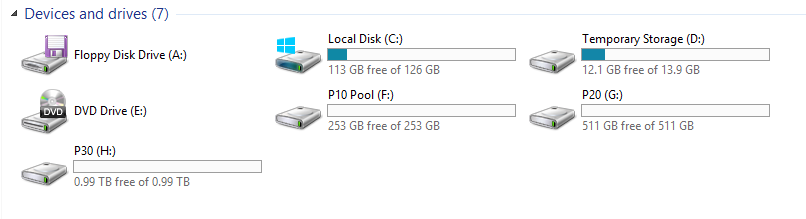
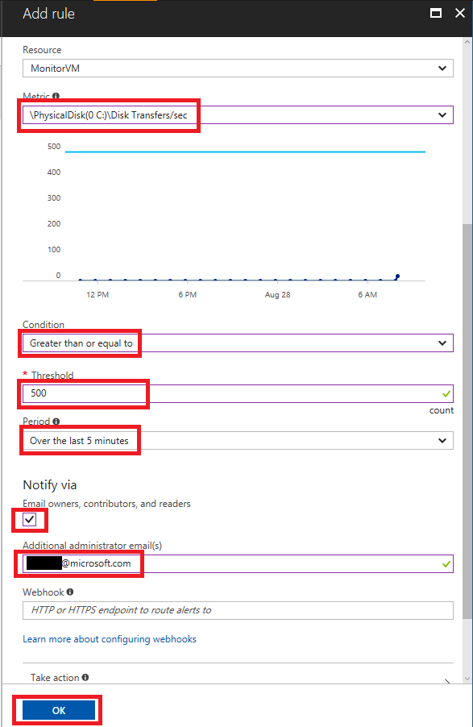
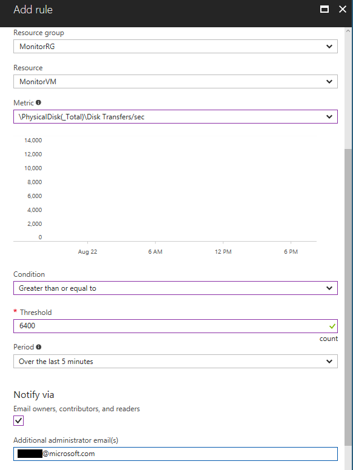
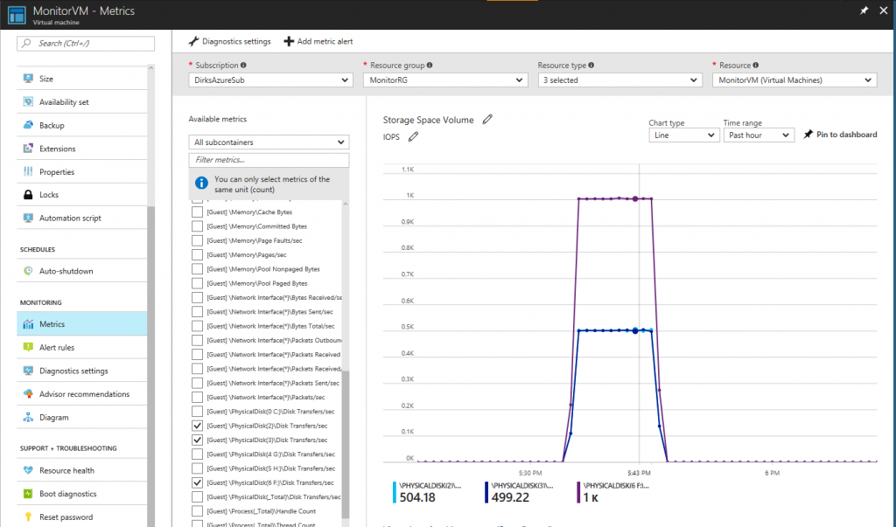
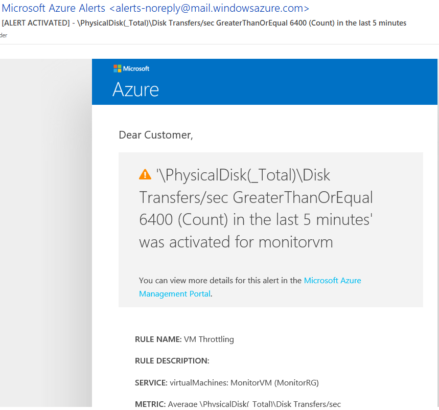
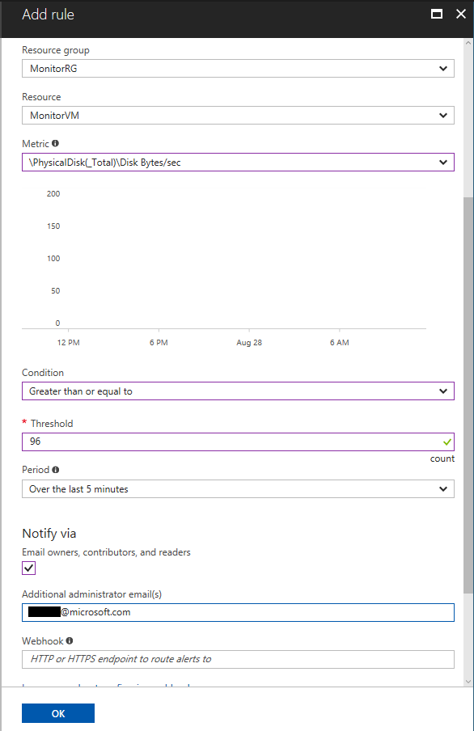
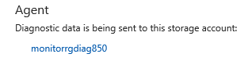

こんにちは、Azureサポートチームの三國です。
今回は、ARMのWindowsでディスクやVMレベルでのIOスロットリングを監視・通知する方法についてご案内いたします。

本記事は下記英文ブログの抄訳です。
[How to monitor and alert potential Disk and VM Level IO Throttling on Windows VMs using ARM](https://blogs.msdn.microsoft.com/mast/2017/09/12/how-to-monitor-and-alert-potential-disk-and-vm-level-io-throttling-on-windows-vms-using-arm/)
本情報の内容（添付文書、リンク先などを含む）は、作成日時点でのものであり、予告なく変更される場合があります。

## はじめに

本ブログはAzure上にあるWindows VMのディスクパフォーマンス監視手順について紹介します。
ディスクやVMレベルでのIOスロットリングについて検出することが目的です。
本ガイドラインはAzure Resource ManagerにてデプロイされているAzure上のすべてのバージョンのWindowsに適用できます。
手順の紹介に入る前に、3つの前提となる概念について説明します。

### スロットリングとは？

Azure Premium Storage では、選択された VM サイズとディスク サイズに応じて、指定された数の IOPS とスループットがプロビジョニングされます。
アプリケーションが、VM またはディスクが対応できるこれらの上限を超えて IOPS やスループットを試みると、これを抑制するように調整されます。 これは、アプリケーションのパフォーマンスの低下という形で現れます。
これにより、待機時間が長くなり、スループットや IOPS が低下する可能性があります。
スロットリングにはディスクレベルと VM レベルの2種類があります。

詳細については以下のドキュメントをご確認下さい。
[Azure Premium Storage: 高パフォーマンス用に設計する - Throttling](https://docs.microsoft.com/ja-jp/azure/virtual-machines/windows/premium-storage-performance#throttling)

### ディスク レベルのスロットリングとは？

基本的に、ディスクの制限値を超えたIOについてはすべて滞留しより大きな遅延が発生します。
管理ディスク・非管理対象ディスクの制限値については以下のドキュメントをご参照ください。
[汎用仮想マシンのサイズ - DSv2 シリーズ](https://docs.microsoft.com/ja-jp/azure/virtual-machines/windows/sizes-general#dsv2-series)

### VM レベルのスロットリングとは？

基本的に、VM にアタッチされたディスクの総 IO がスループット制限を超えた場合に VM レベルのスロットリングが発生します。
制限値はキャッシュ/非キャッシュで異なります。
こちらは Premium ディスクをお使いの場合のみ該当します。
Standard ディスクをお使いの場合には VM レベルの IO スロットリングという概念はありません。

IOスロットリングの詳細については、以下のドキュメントをご参照ください。
[Azure VM Storage Performance and Throttling Demystified](https://blogs.technet.microsoft.com/xiangwu/2017/05/14/azure-vm-storage-performance-and-throttling-demystify/)

## 準備

本ブログの説明に用いるVMの構成例を以下に記載します。

**VM 名**: "MonitorVM"
**VM サイズ** : DS2_v2
**Disk 構成**:
以下の4データディスクをVMにアタッチします:
- 2x P10 (128 GB - Disk limits: 500 IOPS or 100 MB/s - Disk Cache Setting: None)
- 1x P20 (512 GB - Disk limits: 2300 IOPS or 150 MB/s - Disk Cache Setting: None)
- 1x P30 (1024 GB - Disk limits: 5000 IOPS or 200 MB/s - Disk Cache Setting: None)

本シナリオでは、上記のようにアタッチされたディスクすべてについてキャッシュが無効になっています。
そのためVMの非キャッシュディスクスループット制限(IOPS/MBps)について確認します。
下記のURLの"キャッシュが無効な場合の最大ディスク スループット: IOPS/MBps"より確認できます。
[汎用仮想マシンのサイズ - DSv2 シリーズ](https://docs.microsoft.com/ja-jp/azure/virtual-machines/windows/sizes-general#dsv2-series)

キャッシュを有効にする場合は、上記 URL の"キャッシュが有効な場合の一時ストレージの最大スループット: IOPS/MBps (キャッシュ サイズは GiB 単位)"より VM における一時ストレージのスループット制限 (IOPS/MBps) を確認できます。

## "MonitorVM"VM内部のディスク設定の詳細について

F ドライブに、P10 ディスクを 2 つ用いて[復元力を備えた記憶域](https://technet.microsoft.com/ja-jp/library/hh831739.aspx#BKMK_AZURE)を構成し、1000 IOPS (2 x 500 IOPS) が制限値となります。

**ディスク管理:**

**ファイルエクスプローラー:**

**"MonitorVM"VM内のパフォーマンスモニター:**

VM 内のパフォーマンスモニターで VM の物理ディスクのパフォーマンスカウンターについてカウンター名が確認ができました。
次に、以下のパフォーマンスカウンターについて VM の診断設定に追加し、IOPS を Azure ポータルで監視する方法をご案内します。

**IOPS:**
"\PhysicalDisk(_Total)\Disk Transfers/sec" (VM レベルのスロットリング - 6400 IOPS)
"\PhysicalDisk(0 C:)\Disk Transfers/sec" (ディスクレベルのスロットリング - OS disk P10 - 500 IOPS)
"\PhysicalDisk(2)\Disk Transfers/sec" (ディスクレベルのスロットリング - P10 disk - 500 IOPS)
"\PhysicalDisk(3)\Disk Transfers/sec" (ディスクレベルのスロットリング - P10 disk - 500 IOPS)
"\PhysicalDisk(4 G:)\Disk Transfers/sec" (ディスクレベルのスロットリング - P20 disk - 2300 IOPS)
"\PhysicalDisk(5 H:)\Disk Transfers/sec" (ディスクレベルのスロットリング - P30 disk - 5000 IOPS)
"\PhysicalDisk(6 F:)\Disk Transfers/sec" (ディスクレベルのスロットリング - 記憶域スペースドライブ - 1000 IOPS)

## Azureポータルでパフォーマンスカウンターを監視するには？

パフォーマンスカウンターはAzureポータルの診断設定にて追加できます。

追加手順を以下に記載します。
- Azure ポータルの "MonitorVM" VM のページへ移動します
- VM ブレードの "Diagnostic settings" を選択し、"Performance counter" タブへ移動します (図中 1.)
- パフォーマンス カウンターを追加するため "Custom" (図中 2.) を選択します
- テキスト ボックス (図中 3.) にパフォーマンス カウンター名を入力します (例: \PhysicalDisk(0 C:)\Disk Transfers/sec)
- "Add" ボタン (図中 4.) を押下し、パフォーマンス カウンターを追加します
- サンプル レートをテキスト ボックス内 (図中 5.) に入力します
- 最後に "Save" ボタンを押下し構成を保存します

サンプル レートはパフォーマンス カウンターを収集する頻度です。
デフォルトでは 60 秒に指定されているため、60 秒ごとにパフォーマンス カウンターが収集されます。

ディスク負荷の変化が激しい場合は収集頻度を 10 秒、あるいは 1 秒に短縮して IO がディスクや VM の制限に到達していないかを確認できます。
ディスク負荷の変化が緩やかな場合はサンプル レートを大きくすることもできます。
サンプル レートはいつでも、すぐに変更でき、Azure ポータルの "Metrics" を通じて都度検証することができるので、ぜひ適切な値を環境に応じて調整してみてください。

## 収集した情報を確認するには？

下図のようにAzureポータルの"Metrics"より確認ができます。

VMブレードの "metrics" へ移動すると、追加したパフォーマンス カウンターを選択し折れ線グラフで値を見ることができます。
右上にある"time range" を変更することで最近のデータについて見ることができます。
 
次に、"Add metric alert"より負荷が制限に達した際に通知を受ける方法をご案内します。

## "metric alert Rules" を有効にするには？

下図はディスクレベルスロットリングを監視するための設定例です。

- "Metric" ドロップダウンより監視したいパフォーマンス カウンター (例では OS ディスク) を選択します
- "Condition" ドロップダウンより "Greater than equal to" を選択します
- "Threshold" に通知する IOPS の閾値 (例ではディスク レベルでの制限値、今回の場合は P10 ディスクの 500 IOPS) を入力します
- "Period" で通知する閾値超えの期間 (例では 5 分以上) を選択します
- メールで通知をする場合はチェックボックスをオンにし、必要に応じて "Additional administrator" を入力します
- 最後に、"Name" にルールの名前を入力し、"OK" を押下します

その他のパフォーマンス カウンターについても同様のルールを作成します。
下図は VM レベルスロットリングを監視するための設定例です。

"(_Total)" を含むカウンター名は VM レベルを監視するのに使用できます。

## "metrics alert Rues"をテストするには？

今回、作成したルールをテストするのに [diskspd](https://github.com/Microsoft/diskspd) というベンチマークツールを用います。
以下のパラメータを用いて F ドライブに負荷をかけます (P10 disk を 2 つ用いた記憶域スペース)
 
>diskspd.exe -c1024M -d300 -W30 -w100 -t1 -o25 -b8k -r -h -L F:\_diskSpd_test\testfile.dat
 
下図に、負荷が制限値に達した記憶域スペースの様子を示します。

上図より 2 つの P10 ディスクで 500 IOPS、F ドライブで 1000 IOPS の制限値に達していることがわかります。
 
続いて下図に、P30 disk に負荷をかけた後、VM レベルで制限値に到達させた様子を示します。

上図ではまず P30 disk に 5000 IOPS の負荷をかけています。
その後、G ドライブ (P20) と H ドライブ (P30) に同時に負荷をかけ VM レベルの制限値 6400 IOPS に到達させています。
理論上、2 つのディスクの負荷上限は 7300 IOPS (P20 が 2300, P30 が 5000) ですが、VM の非キャッシュ スループットの上限は DS2_v2 の場合 6400 IOPS であることがわかります。
 
先述の "metric alert rule" で指定した閾値を超えた場合、メールにて通知されます。
下図は、VMレベルの制限値に達した際の通知メールです。

下図は、VM レベルの制限値に達した後、事象が解決した際の通知メールです。

[IO 要求の特性](https://docs.microsoft.com/ja-jp/azure/storage/common/storage-premium-storage-performance#nature-of-io-requests)により、たとえば 1 つ 1 つの IO サイズが大きい場合などに、IOP S制限値に到達していなくともスループットの制限値に到達することが起こりえます。
そのため以下の MBps についての監視も検討できます。
 
Throughput/MBps:
"\PhysicalDisk(_Total)\Disk Bytes/sec" (VM レベルのスロットリング - 96 MBps)
"\PhysicalDisk(0 C:)\Disk Bytes/sec" (ディスクレベルのスロットリング - OS disk P10 - 100 MBps)
"\PhysicalDisk(2)\Disk Bytes/sec" (ディスクレベルのスロットリング - P10 disk - 100 MBps)
"\PhysicalDisk(3)\Disk Bytes/sec" (ディスクレベルのスロットリング - P10 disk - 100 MBps)
"\PhysicalDisk(4 G:)\Disk Bytes/sec" (ディスクレベルのスロットリング - P20 disk - 150 MBps)
"\PhysicalDisk(5 H:)\Disk Bytes/sec" (ディスクレベルのスロットリング - P30 disk - 200 MBps)
"\PhysicalDisk(6 F:)\Disk Bytes/sec" (ディスクレベルのスロットリング - Storage Spaces Drive 2x P10 - 200 MBps)
 
今回の例においてスループットの制限値については、VM レベルよりディスク レベルのスロットリングの制限値が高いため、VM レベルについてのみ通知を設定すれば十分です。
ディスク レベルよりも高いスロットリングの制限値をもつ VM サイズ (DS4_v2 - 384 MBpsなど) を選択した場合は、ディスク/VM 両方のレベルで設定します。
 
下図はVMレベルでのMBpsの制限値超えを通知するルールです。

負荷が最大 IOPS または MBps に達した際は、VM レベルでもディスク レベルでもスロットリングにより以下の 2 カウンターの値が増大します (例では OS ディスクについて記載しています)
 
"\PhysicalDisk(0 C:)\Current Disk Queue Length"?
"\PhysicalDisk(0 C:)\Avg. Disk sec/Transfer"?

## Metrics データの保管場所について
すべてのパフォーマンス カウンター Metric はストレージ アカウント内の "WADPerformanceCountersTable" に保管されます。
保管されるストレージアカウントは "Diagnostics settings" の "Agent" タブより確認できます。

## まとめ

本ブログではスロットリングを検知するためにストレージのパフォーマンスを監視・通知する手順についてご案内しました。
ディスクや VM レベルで制限値に達していないにもかかわらず VM の動作が遅くなっている場合は、切り分けとして [PerInsights](https://docs.microsoft.com/ja-jp/azure/virtual-machines/windows/how-to-use-perfinsights) を利用して調査を行うか、Azure サポートまでお問い合わせください。
