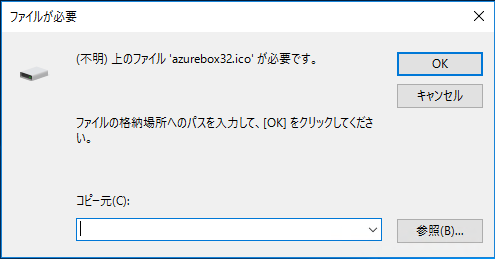

こんにちは。Azure サポートチームの比留間です。

今回は、Azure 仮想ネットワークに対するポイント対サイト接続用のクライアント パッケージをインストールする際に、"'azurebox32.ico'が必要です。" という文言のエラーが発生する事象についてお話させていただきます。

## ■ 現象の発生条件について：

現時点で、この事象は、ユーザープロファイルのパス名に、日本語を含む環境において発生する傾向があることが確認できております。
たとえば「ゆーざー」という名前のユーザーアカウントを作成すると、ユーザープロファイルのフォルダーは以下のように、日本語を含むパス名になります。
> C:\Users\ゆーざー

ポイント対サイト接続用のクライアント パッケージはインストールの過程において、ユーザープロファイルのフォルダー配下に一時フォルダーを作成し、パッケージから展開したファイルを展開します。

しかし、フォルダー名に日本語を含む環境において、パスを正しく処理できない状況が発生し、冒頭に記載したようなエラーが発生します。

## ■ 回避策について：

この事象についての根本的な原因は調査中ですが、回避策としては、コマンドプロンプトを経由してパッケージのインストールを実行するという手法がございます。

具体的には、管理者権限のコマンドプロンプトから以下のように /T オプションを付加して実行いただくことで、インストール時に使用する作業用フォルダーの場所を明示的に指定することが可能です。

例：（VPN クライアントパッケージの名称が 10a662cf-a82d-4579-80c8-5b8dc2d3f003.exe の場合） 
> 10a662cf-a82d-4579-80c8-5b8dc2d3f003.exe /T:C:\install

予め C:\install のような空フォルダーを作成しておき、上記のコマンドを実行することで、日本語を含むパス名を避けてインストールを実行することが可能になります。
この結果、エラーを回避し、インストールを正しく完了することができます。

同様のエラーに直面されている場合にお試しください。

