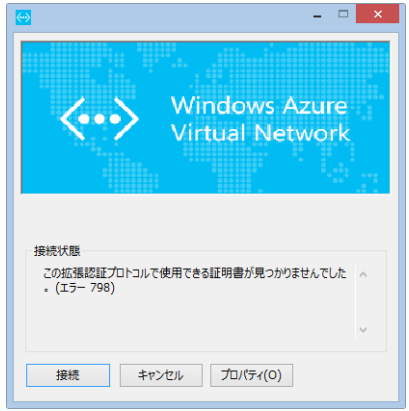
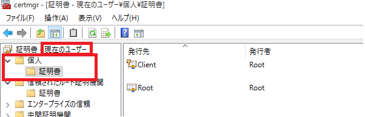
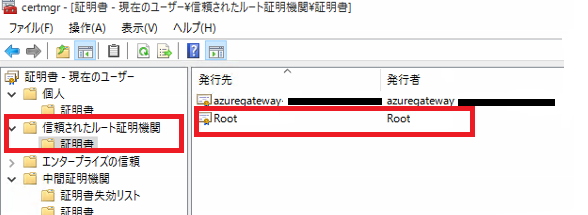
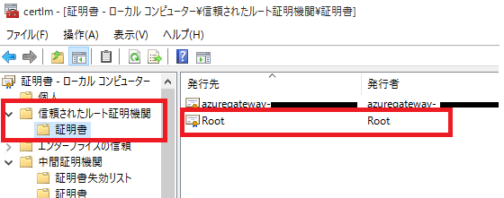

こんにちは、Azure サポート チーム 大塚です。

さて、今回のお題は Azure ポイント対サイト接続についてです。

ポイント対サイト接続は、わざわざ VPN ルーターを用意しなくても、クライアント端末からセキュアにそして簡単に仮想ネットワークに乗り入れられるという、何とも便利で嬉しい機能なのですが、その機能を構成する際に、「エラー 798」 というエラーが出力されて、VPN 接続ができないというお問い合わせをよくいただきます。

一般的にこの 「エラー 798」 は下記の場合に出力されるエラーです。

* 利用できる証明書がないと判断された場合
* 証明書のインストールはされているものの、正しいストアに格納されていない場合
* ルート証明書からクライアント証明書に至るまでの信頼チェーンが確立できない場合

そんな「エラー 798」 が出力された際に、まず確認していただきたいことは、ずばり「クライアント証明書がどこのストアに格納されているか。」ということです。

この時、クライアント証明書が格納されているべき場所は

**現在のユーザーの「個人」 ストア です。**

もし別のストアに格納していた場合は、上記の正しいストアに格納し直し、改めてVPN 接続が可能かどうかご確認ください。

 

■（参考図：クライアント証明書格納場所）

  

クライアント証明書が正しいストアに配置されているのに、VPN 接続ができない場合はルート証明書が正しいストアに格納されていない可能性があります。

念のためクライアントコンピューターの

**現在のユーザー** と **ローカルコンピューター** の**両方**の **「信頼されたルート証明機関」**

にルート証明書をインストールいただき、改めて VPN 接続が可能かどうかご確認ください。

 

■（参考図：ローカルコンピューター ・ ルート証明書格納場所）

  

 

■（参考図：現在のユーザー ・ ルート証明書格納場所）

  

最後に、ポイント対サイト接続を実施する際に実行するクライアント VPN パッケージは、クライアント端末に対して、ルート テーブルを書き換える動作が含まれており、この処理にローカル管理者の権限が必要です。
このため、ポイント対サイト接続を利用できるのは、ローカルの管理者権限をもつユーザーということになります。ローカルの管理者権限を持たないユーザーがポイント対サイト接続を利用する方法は、現状ではございません。