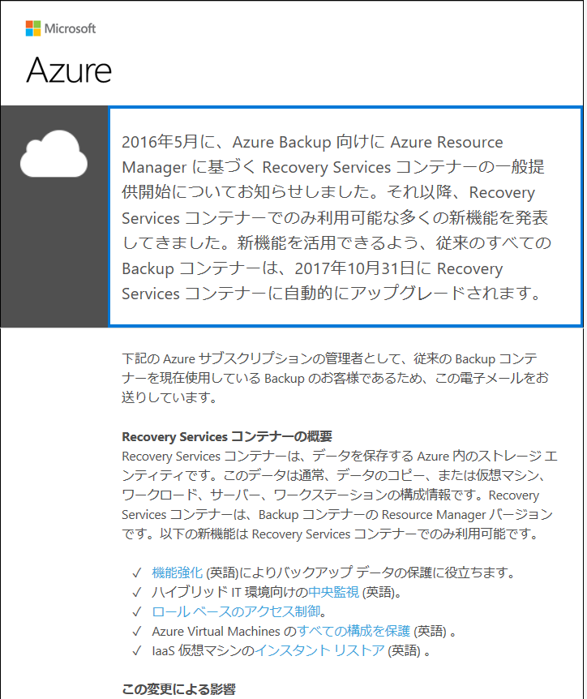

こんにちは、Azure IaaS Support チームです。

表題の通り、2017/10/31 に Azure Backup コンテナー (ASM) が、Recovery Services コンテナー (ARM) に自動でアップグレードされます。現在、このアナウンスを対象のユーザー様に電子メールにてお知らせしております。

これにより、今まで Azure Backup コンテナーにてバックアップを取得したデータは引き継げるのか心配されるかと存じます。
今回の自動アップグレードに関して、今までご利用のバックアップ データは問題なく、Recovery Services コンテナーに引き継がれ、そのデータ (2017/10/31 以前のデータ) より復元も可能ですのでご安心ください。

また、自動アップグレード後は今までご利用いただいたクラシック [Azure ポータル](https://manage.windowsazure.com/) ではなく、[新 Azure ポータル](https://portal.azure.com/) にてご利用いただくことになります。
尚、2017/10/31 の自動アップグレード前に手動でアップグレードいただくことも可能です。
以下、Azure Backup コンテナーから Recovery Services コンテナーへのアップグレードについて、参考となる弊社公開情報がございますのでぜひご参照ください。

## ■ 公開情報

Upgrade classic Backup and Site Recovery vaults to ARM Recovery Services vaults
(クラシック Backup 及び Site Recovery 用のコンテナーを 新 Recovery Services コンテナーにアップグレードする)
[https://azure.microsoft.com/ja-jp/blog/upgrade-classic-backup-and-siterecovery-vault-to-arm-recovery-services-vault/](https://azure.microsoft.com/ja-jp/blog/upgrade-classic-backup-and-siterecovery-vault-to-arm-recovery-services-vault/)
参考箇所 : How to upgrade? (手動によるアップグレード方法)

Recovery Services コンテナーのアップグレードについて
[https://blogs.technet.microsoft.com/jpaztech/2017/07/13/recovery-services-コンテナーのアップグレードについて/](https://blogs.technet.microsoft.com/jpaztech/2017/07/13/recovery-services-コンテナーのアップグレードについて/)

Recovery Services コンテナーのアップグレード (ASM -> ARM) が可能になりました。
[https://blogs.technet.microsoft.com/jpaztech/2017/05/17/recovery-services-コンテナーのアップグレード-asm-arm-が可能にな/](https://blogs.technet.microsoft.com/jpaztech/2017/05/17/recovery-services-コンテナーのアップグレード-asm-arm-が可能にな/)

※ 本情報の内容（添付文書、リンク先などを含む）は、作成日時点でのものであり、予告なく変更される場合があります。