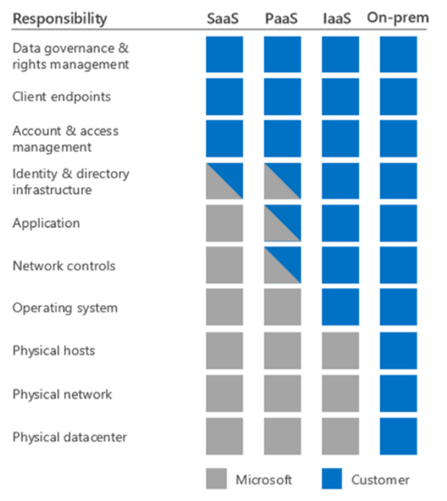

> [!WARNING]
> 本記事は、投稿より時間が経過しており、**一部内容が古い可能性があります。**

こんにちは。Azure サポートチームの比留間です。皆様ご存知の通り、Azure の仮想マシン (VM) から、インターネットまたは他のデータセンターに出ていく通信に対しては[料金が発生いたします](https://azure.microsoft.com/ja-jp/pricing/details/bandwidth/)。今回は、VM の送信方向の通信量について検討してみましょう。


私の通信量多すぎ？

## よくあるご質問

<strong>Q: VM からの通信量が予想よりも多く記録されていました。どのような通信をしていたか、過去の内訳を調査することは可能ですか？</strong>

<strong>A: 残念ながら<span style="color: red; ">できません。</span></strong>

… と、ここで終わってしまうと、~~第3部完！~~ひたすら残念なだけの記事になってしまいますので、もう少し説明を補足します。

少し堅い話をすると、Azure を始めとする多くのパブリッククラウドサービスでは、お客様と事業者 (Microsoft) との間で[責任範囲を分担するモデル](https://learn.microsoft.com/ja-jp/azure/security/fundamentals/shared-responsibility)を採用しております。大まかに分けると IaaS のレイヤーで提供される VM については、Azure 側は基盤となるハードウェア環境に責任を持ち、OS のレイヤー以上の構成は、お客様にて管理をいただくという区分になります。



つまり、VM 内部の OS 以上のレイヤーで行っている通信内容はお客様の持ち物、ということになり、Azure 側からはデータプライバシーの観点からも原則的に、お客様の VM の通信に干渉したり、通信内容や宛先を記録することは行っておりません。

従いまして、通信量の内訳を過去に遡って調査することは、私どもサポートチームでもご要望にお応えすることができません。しかし、現在進行形で予想以上のトラフィックが発生している、ということであれば、以下のような手法で手掛かりをつかむことが可能です。

## 1. VM 内部でパケットキャプチャーを採取する方法
原始的な方法ですが、OS が行っている通信内容を直接取得することができ、かつ、追加料金も発生しない手法です。Windows OS と Linux OS とで、採取方法の例をご紹介します。

### Windows  の場合：
Message Analyzer や Wireshark などのパケット採取用ツールを使用してももちろん差し支えございませんが、すぐにインストールすることが難しい場合、OS の組み込み機能で簡易なパケットキャプチャーを実施することも可能です。

#### 手順の例：

◇ ログの採取開始：

以下の説明では、仮に C:\temp を情報採取フォルダーとしていますが、実際の運用環境に合わせて、十分な空き容量があり、かつ、ストレージの I/O を圧迫しない保存場所を選択してください。

以下の各コマンドを、管理者権限のコマンドプロンプトにて順次実行します。

これにより、ログの採取が開始されます。

```cmd
cd C:\temp
netsh trace start capture=yes traceFile=C:\temp\NetTrace.etl
```

◇ ログの採取停止：

しばらく情報を採取した後、以下の各コマンドを、各仮想マシンの管理者権限のコマンドプロンプトより順次実行します。

これにより、ログの採取が停止されます。

```cmd
cd C:\temp
netsh trace stop
```

採取された NetTrace.etl がパケットキャプチャーです。弊社製 Network Monitor や、Message Analyzer で内容を読み取ることが可能です。

### Linux の場合：
一例として以下のような tcpdump コマンドでパケットキャプチャーの実施をいただくことができます。Ctrl+C で停止するまでパケットキャプチャーが継続します。

例：

```bash
sudo tcpdump -s0 -i any -n -w outfile.pcap
```

（コマンドの詳細については、tcmpdump のマニュアル (man) をご参照ください。

また、データの出力先や、パラメーターについては、お客様の環境に合わせて調整いただきますようお願いいたします。）

取得された .pcap ファイルは、Wireshark で内容の分析が可能です。

## 2. Network Watcher のパケットキャプチャー機能を使用する
VM 内部でパケットキャプチャー採取のための操作を実施することが難しい場合は、Network Watcher のパケットキャプチャー機能を使用する方法がございます。Network Watcher の拡張機能が VM にインストールされ、取得されたパケットキャプチャーをストレージアカウント上に出力させることができます。

手順と価格については以下の技術情報をご参照ください。

ポータルを使用して Azure Network Watcher でパケット キャプチャを管理する
https://docs.microsoft.com/ja-jp/azure/network-watcher/network-watcher-packet-capture-manage-portal

Network Watcher の価格
https://azure.microsoft.com/ja-jp/pricing/details/network-watcher/

## 3. Log Analytic の Wire Data 2.0 (プレビュー) を使用する
パケットキャプチャーの取得と分析とは少し毛色が異なるアプローチとして、Wire Data 2.0 を使用するという方法もございます。本稿作成時点でプレビュー段階であることに加え、インストールの手順等は必要になりますが、パケットキャプチャーの解析の知識がなくとも、通信先の IP アドレス等を図示して把握することが可能になります。

機能の紹介については、以下の技術情報をご参照ください。

Log Analytics の Wire Data 2.0 (プレビュー) ソリューション
https://docs.microsoft.com/ja-jp/azure/log-analytics/log-analytics-wire-data

