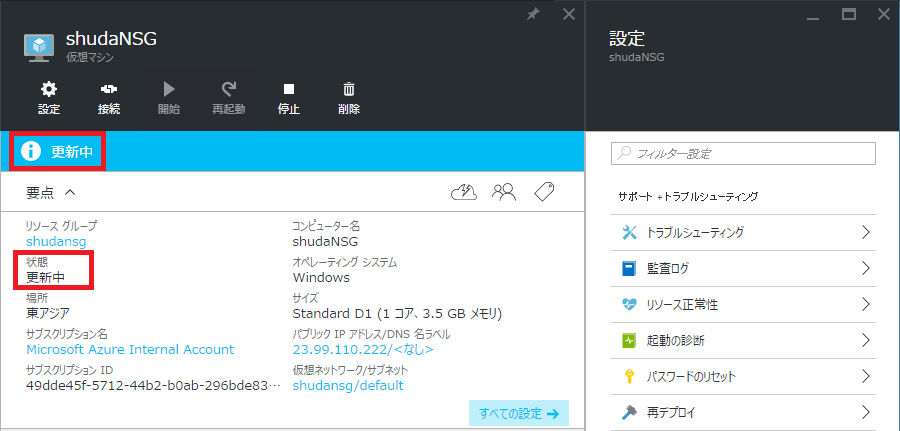
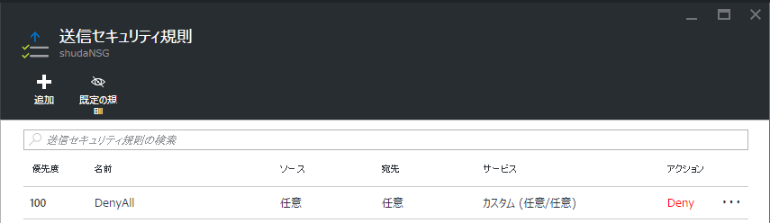
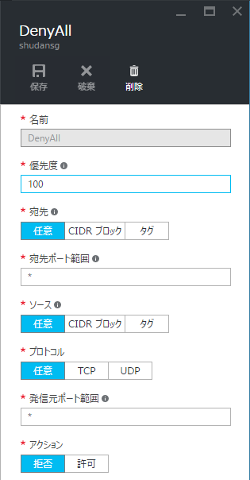
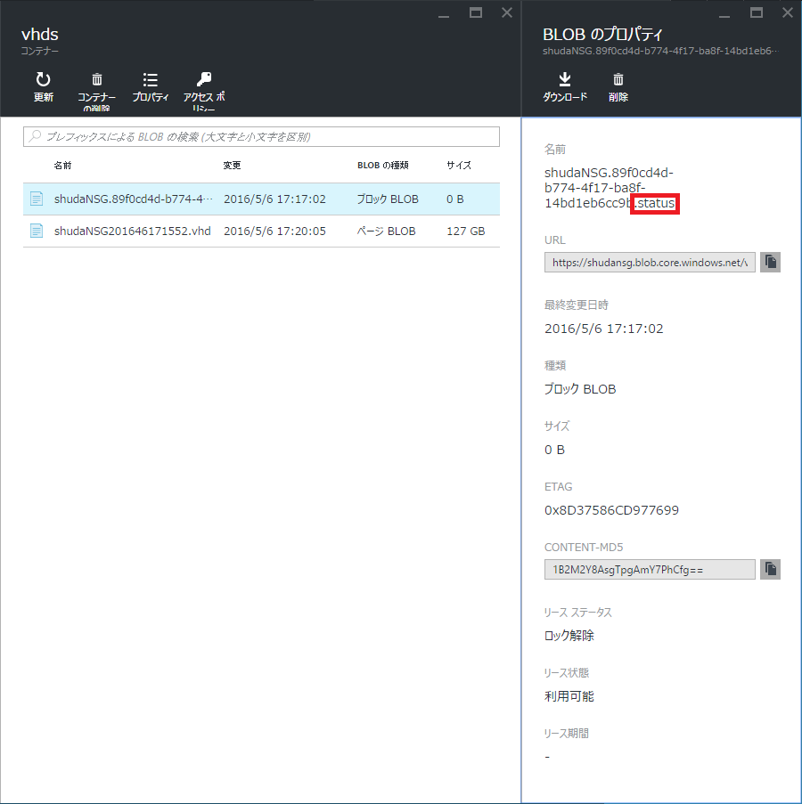

> [!WARNING]
> 本記事は、投稿より時間が経過しており、**一部内容が古い可能性があります。**

こんにちは。Azure サポートの宇田です。

今回は Azure VM を起動した際などに、ポータル上で “更新中” のまま起動が完了しない原因と対処策についてご紹介します。

セキュリティ要件などの兼ね合いで、NSG 等を利用して通信を制限されることは一般的なシナリオかと思います。ただ、本来必要な通信まで制限してしまうと仮想マシンが “更新中” のままになるだけではなく、Azure の各種機能に影響がでる場合があります。本サポート チームのブログでも順次情報を公開していきますので、通信を制限される際は十分にご留意のうえ、適切な設定をいただけるようお願いいたします。

## 事象

仮想マシンが長時間 **“更新中”** のステータスとなる代表的な例は以下の通りです。

1. 仮想マシンを新規作成した際、ステータスが **更新中** のままとなる
2. 既存の仮想マシンで VM エージェントを更新した際に、ステータスが **更新中** のままとなる
3. VM エージェントや拡張機能を Azure PowerShell から更新した際、60 分経過後に以下のようなエラーとなる
Long running operation failed with status ‘Failed’. ErrorCode: VMExtensionProvisioningError ErrorMessage: Multiple VM extensions failed to be provisioned on the VM. Please see the VM extension instance view for details.
4. 仮想マシンの状態を以下のようなコマンドレットで確認した際、VMAgent の状態が **VM Agent is unresponsive.** となる
Get-AzureRmVM -resourcegroupname <resourcegroupname> -name <name> -status

仮想マシンが長時間 “更新中” のステータスとなる例

仮想マシンの拡張機能が “利用できません”となる例

## 原因と対処策

上記のような事象が発生する原因は NSG (Network Security Group) の機能等で、仮想マシンのインターネット接続 を制限している場合に発生します。

Azure 上の仮想マシンでは VM エージェントを使用して Azure 基盤側との各種連携を行っていますが、拡張機能のダウンロードやステータスを更新するにあたってインターネット接続が必要です。VM エージェントの通信を許可しつつインターネットへの通信を制限するには、仮想マシンの存在するリージョンが保有する Azure のパブリック IP アドレス レンジについて通信を許可する NSG のルールを追加します。

Azure のパブリック IP アドレスに対して通信を許可する NSG ルールを作成する方法については、以下のブログをご参照ください。(2016/06/15: リンク先を翻訳記事に変更しました)

* [Azure Resource Manager (ARM) とPowerShell を用いて、 NSG ルールを作成する方法](https://jpaztech1.z11.web.core.windows.net/AzureResourceManager(ARM)%E3%81%A8PowerShell%E3%82%92%E7%94%A8%E3%81%84%E3%81%A6%E3%80%81NSG%E3%83%AB%E3%83%BC%E3%83%AB%E3%82%92%E4%BD%9C%E6%88%90%E3%81%99%E3%82%8B%E6%96%B9%E6%B3%95.html)

NSG のルールにて、全ての通信を Deny と設定した例

## 参考情報: VM エージェントの利用する .status ファイルについて

VM エージェントの情報は Azure ストレージの .status ファイルなどに保存されています。

仮想マシン内で稼働する VM エージェントから Public サービスとなる Azure ストレージへアクセスする際は、インターネット (パブリック IP) 側への通信が発生するため、NSG 等でこうした通信を制限しないようにご留意ください。

## 参考リンク

本投稿は以下のブログをもとに、一部内容を追記してご紹介しています。

* VM stuck in “Updating” when NSG rule restricts outbound internet connectivity
https://blogs.msdn.microsoft.com/mast/2016/04/27/vm-stuck-in-updating-when-nsg-rule-restricts-outbound-internet-connectivity/

また、本件に関連して Azure 上の各種機能で用いられている下記 IP についても制限しないよう、あわせてご注意ください。

* IP アドレス 168.63.129.16 について
https://www.syuheiuda.com/?p=4828
