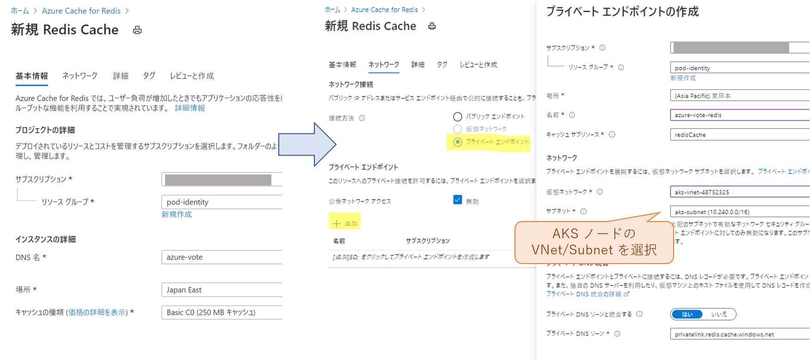
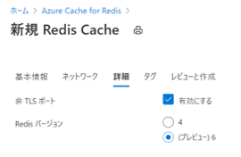
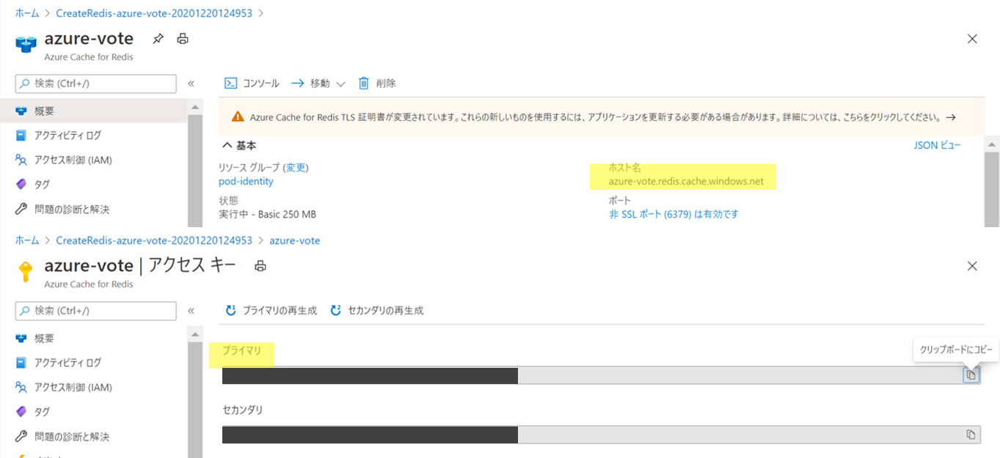
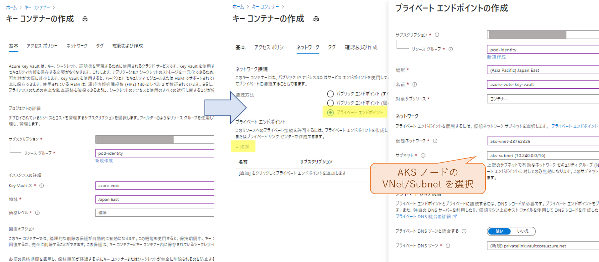
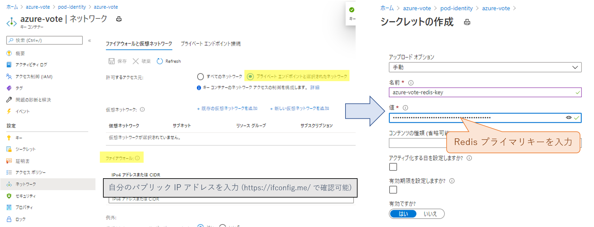
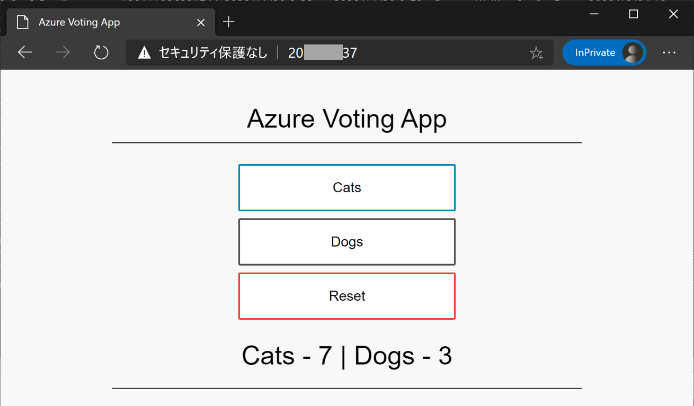

この記事は [Microsoft Azure Tech Advent Calendar 2020](https://qiita.com/advent-calendar/2020/microsoft-azure-tech) の 21 日目の記事になります。

こんにちは🎅 Azure テクニカル サポート チームの桐井です。

AKS 上のアプリケーション Pod から、 SQL Database や Key Vault、Blob Storage などの Azure サービスを利用する場合は、Pod に資格情報を渡し対象リソースへのアクセス権を付与する必要があります。

この記事では、AKS 上の Pod へ Azure AD Pod Identity を使ってマネージド ID を割り当てる方法を解説します。サンプル アプリケーションを動かしながら、マネージド ID の持つアクセス権で Azure Key Vault へアクセスする例をご紹介します。

🚩 **Update: 2023/5/1**
Pod にマネージド ID を割り当てるための新しい方法である **Azure Workload Identity** が [GA となりました](https://azure.microsoft.com/ja-jp/updates/ga-azure-active-directory-workload-identity-with-aks-2/)。AAD Pod Identity は Azure Workload Identity に[置き換えられます](https://cloudblogs.microsoft.com/opensource/2022/01/18/announcing-azure-active-directory-azure-ad-workload-identity-for-kubernetes/)。
今後、新規に開発・構築をする際には Azure Workload Identity の利用をご検討ください。
> [Azure Kubernetes Service (AKS) で Azure AD ワークロード ID を使用する - Azure Kubernetes Service | Microsoft Learn](https://learn.microsoft.com/ja-jp/azure/aks/workload-identity-overview)

AAD Pod Identity から移行する場合は、次のドキュメントをご参照ください。
> [ポッド マネージド ID からワークロード ID に移行する - Azure Kubernetes Service | Microsoft Learn](https://learn.microsoft.com/ja-jp/azure/aks/workload-identity-migrate-from-pod-identity)

<!-- more -->

---

## マネージド ID を使った Azure リソースへのアクセス

Pod に資格情報を渡す方法として、Pod 用のサービス プリンシパルを作成し、発行されたアプリケーション ID / パスワードの文字列を設定ファイルや Kubernetes の Secret から読み込むという方法があげられます。

この方法では、資格情報の文字列を開発者が管理する必要があり、資格情報やそれを含む Kubernetes の YAML マニフェストを安全に管理するためのセキュリティ上の課題が生じます。また、資格情報のローテーションを行った場合、新しい ID / パスワード文字列への置き換えが必要になるといった運用上の課題も考えられます。

このような課題の解決策として、Azure 環境上では「**マネージド ID**」が利用可能です。

マネージド ID は Azure リソースでのみ使用できる特殊なタイプのサービス プリンシパルです。アプリケーションは、Azure Active Directory (AAD) よりリアルタイムに取得したトークンを使って Azure リソースへアクセスします。資格情報は Azure によって管理されるため、パスワード文字列を自分で管理する必要がなくなります。

  > ※ ご参考情報: マネージド ID の概要・動作の詳細は、下記ドキュメントをご参照ください。
  > [Azure リソースのマネージド ID とは](https://docs.microsoft.com/ja-jp/azure/active-directory/managed-identities-azure-resources/overview)
  > [Azure リソースのマネージド ID と Azure 仮想マシンの連携](https://docs.microsoft.com/ja-jp/azure/active-directory/managed-identities-azure-resources/how-managed-identities-work-vm)

### AAD Pod Identity

マネージド ID は [VM や App Service など](https://docs.microsoft.com/ja-jp/azure/active-directory/managed-identities-azure-resources/services-support-managed-identities) の Azure リソースに割り当て、アプリケーションが他の Azure サービスへアクセスするための資格情報として利用できます。同様にマネージド ID を AKS で稼働する Pod に対して割り当てることが可能です。

  > ※ ご参考情報: Azure Kubernetes Service (AKS) の認証と認可のベスト プラクティス - ポッド ID を使用する
  > https://docs.microsoft.com/ja-jp/azure/aks/operator-best-practices-identity#use-pod-identities

Kubernetes クラスターに [AAD Pod Identity](https://github.com/Azure/aad-pod-identity) をインストールすることで、Pod でマネージド ID が利用できるようになります。


Pod Identity では、あらかじめマネージド ID とアプリケーション Pod の関連付け (Azure Identity Binding) を定義しておきます。Pod が Azure サービスへのアクセスを要求すると、トラフィックがクラスター上の NMI Pod (Node Management Identity) に転送されます。NMI は Pod と関連付けられたマネージド ID のアクセス トークンを Azure Active Directory に要求し、発行されたアクセス トークンを Pod に返却します。Pod はこのトークンを使用して Azure リソースの操作を行います。

AKS で Pod Identity を使用するには現在 2 通りの方法があり、[手動でインストール](https://azure.github.io/aad-pod-identity/docs/demo/standard_walkthrough/)する方法のほか、プレビュー機能となりますが、先月 (2020/11) 発表されました AAD Pod Identity Add-on [^1] を使用する方法があります。

> [Azure/AKS Release 2020-11-30](https://github.com/Azure/AKS/releases/tag/2020-11-30) - Preview Features
> [Azure AD Pod Identity Add-on](https://docs.microsoft.com/en-us/azure/aks/use-azure-ad-pod-identity) is now in public preview.

本記事では、この AKS アドオンを使用した手順をご紹介します。

> ※ ご参考情報: Pod Identity の詳細については、プロジェクトの公式ドキュメント、下記ブログ記事をあわせてご参照ください。
> Azure Active Directory Pod Identity For Kubernetes - Documentation
> https://azure.github.io/aad-pod-identity/docs/
> Pod Identity
> https://medium.com/microsoftazure/pod-identity-5bc0ffb7ebe7

[^1]: Pod Identity の既定では、クラスター上で NMI と MIC の 2 種類のコンポーネントが動作します。アドオンでインストールした Pod Identity では [Managed Mode](https://azure.github.io/aad-pod-identity/docs/configure/pod_identity_in_managed_mode/) で動作し、AKS クラスター上では NMI の Pod のみが動作します。

## サンプル アプリケーションで Pod Identity を試してみよう

本記事では [AKS チュートリアルでおなじみの azure-vote アプリケーション](https://docs.microsoft.com/ja-jp/azure/aks/tutorial-kubernetes-prepare-app)を例に解説をします。
azure-vote は front Pod (Web アプリ) と back Pod (Redis) の 2 段構成となっており、チュートリアルでは Web アプリと Redis の両方が AKS クラスター上にデプロイされています。

今回は Redis を AKS クラスターにはデプロイせず、代わりに [Azure Cache for Redis](https://docs.microsoft.com/ja-jp/azure/azure-cache-for-redis/cache-overview) を使用する構成をつくります。Redis へ接続するためのアクセス キーが必要となるため、安全に管理するために [Azure Key Vault](https://docs.microsoft.com/ja-jp/azure/key-vault/general/overview) を使用します。この Key Vault の参照権限を持つマネージド ID を作成しておき、Pod がデプロイされた際に Pod Identity でトークンを取得できるようにします。パスワード文字列の発行・YAML マニフェスト上での管理が必要ないという点がポイントです。

azure-vote アプリケーション自体は Key Vault へアクセスする機能を持たないため、実際のキーの取得は [Secrets Store CSI Driver](https://github.com/Azure/secrets-store-csi-driver-provider-azure) を使って実現します。CSI ドライバーは、Pod のラベルで指定されたマネージド ID の権限を使用して Key Vault にアクセスします。Key Vault オブジェクトを Kubernetes の Secret へ同期する機能を使い、環境変数で Redis のアクセス キーを azure-vote アプリケーションに渡します。


せっかくなので、今回は Key Vault と Redis への接続に [Azure Private Link](https://docs.microsoft.com/ja-jp/azure/private-link/private-link-overview) を利用してみました。トラフィックは AKS ノードと同じサブネットの Private Endpoint を介し、各サービスへプライベート ネットワーク経由で到達します。

### 検証用のリソース グループを作成

それでは作業を進めていきましょう (•̀ᴗ•́)و ̑̑
新しくリソース グループを作成し、この中に AKS / Key Vault / Redis Cache / Managed Identity をつくっていきます。

```shell
resourceGroup="pod-identity"
az group create --name ${resourceGroup} --location japaneast
```

### Pod Identity アドオンが有効なクラスターの作成

Pod Identity アドオンが有効な AKS クラスターを作成します。

> ご参考情報: Azure Kubernetes Service で Azure Active Directory ポッドマネージド ID を使用する (プレビュー)
> https://docs.microsoft.com/en-us/azure/aks/use-azure-ad-pod-identity

本記事の時点では、 Pod Identity アドオンはプレビュー機能として提供されています。プレビュー機能を利用するために、はじめに `EnablePodIdentityPreview` 機能の登録を行います。

```shell
az feature register --name EnablePodIdentityPreview \
  --namespace Microsoft.ContainerService
```

登録が完了したら AKS クラスターの作成に進みます。`--enable-pod-identity` オプションを指定します。

```shell
clusterName="pod-identity"

## Pod Identity アドオンが有効なクラスターを作成
az aks create \
  --resource-group ${resourceGroup} \
  --name ${clusterName} \
  --network-plugin azure \
  --enable-managed-identity \
  --enable-pod-identity

## クラスターの資格情報を取得
az aks get-credentials -g ${resourceGroup} -n ${clusterName}
```

> [補足] network-plugin に kubenet はサポートされていないため Azure CNI を使用します
> \# BadRequestError: Operation failed with status: 'Bad Request'. Details: Network plugin kubenet is not supported to use with PodIdentity addon.

### Redis Cache の作成

Azure ポータルで Redis Cache を作成します。
AKS クラスターから Azure Private Link を使ってアクセスするために、[ネットワーク] タブで AKS ノードのサブネットにプライベート エンドポイントを作成しておきます。



azure-vote アプリケーションは Redis の接続に 6379/TCP を使用するるため、[非 TLS ポート] を有効にしておきます。Redis バージョンも azure-vote-back にあわせて 6 にしておきます。



Redis Cache の作成が完了したら、ホスト名と接続用のアクセス キーを確認しましょう。後で使用するためメモしておきます。



### Azure Key Vault キー コンテナー / シークレットの作成

次に Redis のアクセス キーを保管する Key Vault キー コンテナーを作成します。
Redis と同様に、[ネットワーク] タブで AKS ノードのサブネットにプライベート エンドポイントを作成します。



作成が完了したら、先ほどメモした Redis の接続キーをシークレット オブジェクトとして登録します。

Key Vault の作成直後は、アクセス可能なネットワークがプライベート エンドポイント経由のみとなっているため、そのままではポータルから新しくシークレットの作成ができません。設定の [ネットワーク] にて [プライベート エンドポイントと選択されたネットワーク] を選択し、[ファイアウォール] で自分のパブリック IP アドレスを一時的に許可します。

その後 [シークレット] から新しいシークレットの作成画面に進みます。[名前]を入力し、[値]には Redis のプライマリー キーを入力して保存します。



### Key Vault シークレット ストア CSI ドライバーのインストール

AKS クラスターに Key Vault シークレット ストア CSI ドライバーをインストールします。Helm 3 を使い、下記のコマンドでインストールします。
そういえば今年は [Helm 2 終了のお知らせ](https://helm.sh/blog/helm-v2-deprecation-timeline/)がありましたね。まだ Helm 3 に移行していない方は早めに移行しましょうー！

```shell
## helm リポジトリの登録
helm repo add csi-secrets-store-provider-azure https://raw.githubusercontent.com/Azure/secrets-store-csi-driver-provider-azure/master/charts

## CSI ドライバーのインストール
helm install csi-secrets-store-provider-azure/csi-secrets-store-provider-azure --generate-name
```

次に AKS クラスターに `SecretProviderClass` を作成し、先ほど用意した Key Vault の参照設定を行います。以下のように YAML ファイルを作成し、Key Vault キー コンテナー、 シークレット オブジェクトの情報を記述します。Key Vault のテナント ID は `az keyvault show --name ${vaultName}` で確認できます。

`spec.parameters.objects` が読み込み対象の Key Vault オブジェクトになります。Redis アクセス キーの Secret オブジェクトを指定します。
また、`spec.secretObjects` の設定は、Key Vault を Kubernetes の Secret に同期するための設定になります。ここで設定した名前やキーで、Secret オブジェクトが自動的に作成されます。

```yaml
apiVersion: secrets-store.csi.x-k8s.io/v1alpha1
kind: SecretProviderClass
metadata:
  name: azure-vote-secret-provider-class
spec:
  provider: azure
  parameters:
    usePodIdentity: "true"      # Pod Identity を使用
    userAssignedIdentityID: ""  # Pod Identity を使用する場合は空文字列にします
    keyvaultName: "azure-vote"  # Key Vault 名
    objects: |    # Key Vault Secret オブジェクトの指定
      array:
      - |
        objectName: azure-vote-redis-key
        objectType: secret
    subscriptionId: "${サブスクリプション ID}"
    tenantId: "${Key Vault のテナント ID}"
  secretObjects:    # Kubernetes Secret への同期設定
  - secretName: azure-vote-secret
    type: Secret
    data:
    - objectName: azure-vote-redis-key
      key: redis-key
```

`kubectl apply` でクラスターにデプロイします。この時点では Key Vault からの読み込み・K8s Secret への同期はおこなわれません。後ほど、アプリケーション Pod をデプロイしたタイミングで実施されます。

```shell
% kubectl apply -f secretproviderclass.yaml
secretproviderclass.secrets-store.csi.x-k8s.io/azure-vote-secret-provider-class created
```

### Key Vault アクセス用のマネージド ID を作成

Key Vault へのアクセスに使用するマネージド ID を作成します。

```shell
identityName="azure-vote"
az identity create -g ${resourceGroup} -n ${identityName}
```

作成したマネージド ID に `閲覧者 (Reader)` ロールを割り当て、対象のキー コンテナーからシークレットを取得するアクセス許可を付与します。
また、Key Vault のセキュリティ ポリシーを設定し、マネージド ID (の clientId) によるシークレットの取得を許可します。

```shell
vaultName="azure-vote"

## Key Vault リソース ID を取得
keyVaultId=$(az keyvault show -n ${vaultName} --query id -o tsv)
## Azure AD ID の principalId, clientId を取得
principalId=$(az identity show -g ${resourceGroup} -n ${identityName} --query principalId -o tsv)
clientId=$(az identity show -g ${resourceGroup} -n ${identityName} --query clientId -o tsv)

## Azure AD ID に Reader ロールを割り当て 
az role assignment create \
  --role "Reader" \
  --assignee ${principalId} \
  --scope ${keyVaultId}

## Key Vault のアクセス ポリシーを設定
az keyvault set-policy \
  -n ${vaultName} \
  --secret-permissions get \
  --spn ${clientId}
```

### Pod Identity を作成

AKS クラスターに Pod Identity を作成し、上記で作成したマネージド ID を AKS クラスターから使えるようにします。`az aks pod-identity add` コマンドを実行します。

```shell
## マネージド ID のリソース ID を取得
identityResourceId=$(az identity show -g ${resourceGroup} -n ${identityName} --query id -o tsv)

## AKS クラスターに Pod Identity を作成
az aks pod-identity add \
  --resource-group ${resourceGroup} \
  --cluster-name ${clusterName} \
  --namespace default \
  --name azure-vote \
  --identity-resource-id ${identityResourceId}
```

上記コマンドにより、クラスターの default ネームスペースに `AzureIdentity` `AzureIdentityBinding` のオブジェクトが作成されます。

```shell
% kubectl get AzureIdentity,AzureIdentityBinding -n default
NAME                                             AGE
azureidentity.aadpodidentity.k8s.io/azure-vote   9m

NAME                                                            AGE
azureidentitybinding.aadpodidentity.k8s.io/azure-vote-binding   9m1s
```

`AzureIdentity` はマネージド ID を表し、使用した ID の `clientID`  `resourceID ` が記録されています。`AzureIdentityBinding` はマネージド ID と Pod の関連付けを表すもので、`AzureIdentity` の名前と後述する Pod のラベル名が記録されています。

また、 AKS クラスターが持つマネージド ID に対して、コマンドで指定したマネージド ID を scope とした Managed Identity Operator ロールが割り当てられます。


上記のように、 Pod Identity では[マネージド ID 操作に必要なロール割り当て](https://azure.github.io/aad-pod-identity/docs/getting-started/role-assignment/#performing-role-assignments)や [`AzureIdentity` `AzureIdentityBinding` の作成](https://azure.github.io/aad-pod-identity/docs/demo/standard_walkthrough/#3-deploy-azureidentity) が必要となりますが、 `az aks pod-identity` コマンドではこれらのステップをユーザーに代わり行ってくれます。

### Azure リソースへのアクセス権を Pod に付与する

さいごに、 azure-vote アプリケーションをデプロイします。下記のように Deployment および Service の YAML マニフェストを記述します。
ポイントは以下の 3 点です。

* **Pod のラベル**
  * `aadpodidbinding: azure-vote` ラベルにより `AzureIdentity` との関連付けをします
* **Secret Store を利用した資格情報のボリューム マウント**
  * ボリューム マウントが行われると Key Vault シークレットの内容が Kubernetes 上の Secret として同期されます
  * CSI ドライバーは Pod がボリュームをマウントする際に呼び出されます。今回は Kubernetes Secret を環境変数として読み込むためマウントしたファイルは必要ないのですが、CSI ドライバーを呼び出すために `volumesMounts` および `volumeMounts` の記述が必要となります
  > 参考: [kubernetes-sigs/secrets-store-csi-driver - Sync of k8 secrets not happening #290](https://github.com/kubernetes-sigs/secrets-store-csi-driver/issues/290)
* **環境変数の設定**
  * `REDIS` `REDIS_PWD` でアプリケーションに Redis の接続先/パスワードを渡します
  * パスワードの値は Kubernetes Secret から取得します (`secretKeyRef`)

```yaml
apiVersion: apps/v1
kind: Deployment
metadata:
  name: azure-vote
spec:
  replicas: 1
  selector:
    matchLabels:
      app: azure-vote
  template:
    metadata:
      labels:
        app: azure-vote
        aadpodidbinding: azure-vote   # Pod Identity を指定
    spec:
      containers:
      - name: azure-vote-front
        image: mcr.microsoft.com/azuredocs/azure-vote-front:v1
        ports:
        - containerPort: 80
        # Redis ホスト / アクセスキーを環境変数に設定
        # アクセスキーは自動作成される K8s Secret から読み込む
        env:
        - name: REDIS
          value: "${Redis ホスト名}"
        - name: REDIS_PWD
          valueFrom:
            secretKeyRef:
              name: azure-vote-secret
              key: redis-key
        # Secret Store の動作上ボリュームを一度マウントする必要がある
        volumeMounts:
        - name: secrets-store-inline
          mountPath: "/mnt/secrets-store"
          readOnly: true
      volumes:
      - name: secrets-store-inline
        csi:
          driver: secrets-store.csi.k8s.io
          readOnly: true
          volumeAttributes:
            # secretProviderClass 名を指定
            secretProviderClass: "azure-vote-secret-provider-class"
---
apiVersion: v1
kind: Service
metadata:
  name: azure-vote
  labels:
    app: azure-vote
spec:
  type: LoadBalancer
  ports:
  - port: 80
  selector:
    app: azure-vote
```

`kubectl apply` コマンドで YAML ファイルを適用し Deployment と Service をデプロイします。

Pod の作成と同時に CSI ドライバーによって Secret が作成されます。この Secret に Key Vault へ登録した Redis のアクセス キーが同期されています。

```shell
% kubectl apply -f app.yaml
deployment.apps/azure-vote created
service/azure-vote created

% kubectl get secret | grep azure-vote -B1
NAME                        TYPE             DATA   AGE
azure-vote-secret           Opaque           1      7s
```

`kubectl get` コマンドで Pod と Service が作成されたか確認してみましょう。Service の `EXTERNAL-IP` に表示された IP アドレスにブラウザーからアクセスして、投票アプリのページが表示されれば成功です!

```shell
% kubectl get pod,svc -l app=azure-vote
NAME                              READY   STATUS    RESTARTS   AGE
pod/azure-vote-666c85dbbc-2bfkl   1/1     Running   0          22s

NAME                 TYPE           CLUSTER-IP    EXTERNAL-IP   PORT(S)        AGE
service/azure-vote   LoadBalancer   10.0.58.182   20.xx.xx.37   80:32285/TCP   22s
```

AKS チュートリアルでは Redis も azure-vote-back Pod としてデプロイしているため、Pod を削除すると投票結果が消えてしまいます。今回の構成では Azure Cache for Redis へ結果が置かれているため、Pod を再起動したあとも同じカウント値が表示されるかと思います。

みなさんはどちらに投票しますか？ ちなみに私はねこ派です🐈


## さいごに

この記事では、Pod から Azure リソースへアクセスする資格情報としてマネージド ID を使用し、Pod Identity Add-on を使った手順をサンプル アプリケーションを例にご紹介しました。YAML マニフェスト上でサービス プリンシパルの資格情報を扱わずに、Key Vault へのアクセスができることをご確認いただけたかと思います。

このほかにも、マネージド ID を使って Pod から様々な Azure リソースの操作が可能になります。利用例の 1 つとしては Application Gateway Ingress Controller (AGIC) が挙げられます。AGIC では、コントローラー Pod が Ingress オブジェクトを読み取り、その内容にもとづいて自動的に Application Gateway を構成するという動作をします。このとき [Application Gateway を操作するためのアクセス権限を AAD Pod Identity を使って割り当てる](https://azure.github.io/application-gateway-kubernetes-ingress/setup/install-existing/#set-up-aad-pod-identity)ことができます。

> ご参考情報: Application Gateway Ingress Controller
> https://azure.github.io/application-gateway-kubernetes-ingress/

このように、今後オープン ソースのツールなどでも Pod Identity を利用する機会も出てくるかと存じますので、ご参考にいただけたらと思います。
本稿が皆様のお役に立ちましたら幸いです。

---

最後まで読んでいただきありがとうございました！
[Microsoft Azure Tech Advent Calendar 2020](https://qiita.com/advent-calendar/2020/microsoft-azure-tech) はまだまだ続きます。明日も是非ご覧くださいー！
