この記事は [Microsoft Azure Tech Advent Calendar 2022](https://qiita.com/advent-calendar/2022/microsoft-azure-tech) の 24 日目の記事になります🎅

こんにちは。Azure テクニカル サポートチームの桐井です。

[Azure Kubernetes Service (AKS)](https://learn.microsoft.com/ja-jp/azure/aks/intro-kubernetes) のクラスターを利用しているときに、アプリケーションがデプロイされたタイミングや、ノードのステータスがいつどのような理由で変わったのかなど、過去にクラスターで起こったイベントの履歴を確認したい場合があります。Kubernetes の監査ログを活用すると、これらのイベントをログから確認できるようになります。

本記事では、Kubernetes の監査ログの紹介と、AKS において監査ログ利用する方法を、実例を交えて解説します。

<!-- more -->

---

## Kubernetes の監査ログ (kube-audit)

Kubernetes のクラスターは大きく分けて、**コントロール プレーン** と **ノード** の 2 つのコンポーネントで構成されています。
クラスターに対する各種操作は、コントロール プレーンに存在する **[API サーバー (kube-apiserver)](https://kubernetes.io/ja/docs/concepts/overview/components/#kube-apiserver)** が提供する Kubernetes API を介して行われます。

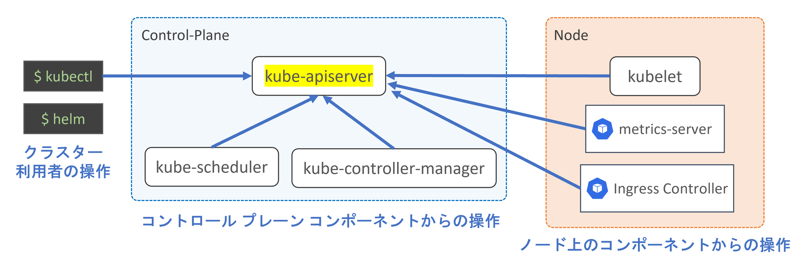

クラスターの利用者が実行する [kubectl コマンド](https://kubernetes.io/ja/docs/reference/kubectl/overview/)は、API サーバーに対してリクエストを送信することで、Pod をはじめとするクラスター内のオブジェクトの作成や変更をします。

また、ノード上で稼働する [kubelet](https://kubernetes.io/ja/docs/concepts/overview/components/#kubelet) やシステム Pod、さらにはコントロール プレーンを構成するコンポーネントも、API サーバーに対してアクセスをしています。各コンポーネントが自身の役割を果たすことで、Kubernetes クラスターの動作が成り立っています。

> [!TIP]
> たとえば、新しい Pod が作成された際には、[kube-scheduler](https://kubernetes.io/ja/docs/concepts/overview/components/#kube-scheduler) が Pod のデプロイに最適なノードを決定し、その結果を API サーバーへ報告します。Pod が割り当てられたノードでは、kubelet が Pod の仕様を読み取り、その内容に従ってコンテナー ランタイムにコンテナーの起動を指示します。コンテナーの起動が成功すると、API サーバーに対して Pod ステータスの更新がリクエストされ、Pod が動作中であると記録します。

そのため、API サーバーにどのようなリクエストが届いて、そのレスポンス (実行結果) はどのような内容であったのか記録されたログがあれば、クラスターで過去に行われた操作や発生したイベントを追跡できます。

Kubernetes では**監査ログ (kube-audit)** 機能を利用することで、API サーバーのアクセス ログを得ることができます。監査ログには、クラスター内で行われた一連の操作が記録されています。

> **Kubernetesドキュメント / 監査**
> https://kubernetes.io/ja/docs/tasks/debug/debug-cluster/audit/

### Kubernetes の監査ログの内容

Kubernetes の監査ログの構造や、どのような情報が記録されているかについて、実例をもとに解説します。
ここでは、`kubectl get pod` コマンドで Pod の情報を取得した際のログを確認します。

```shell
$ kubectl get pod nginx
NAME    READY   STATUS    RESTARTS   AGE
nginx   1/1     Running   0          6d4h
```

コマンドを実行すると、`GET https://{API Server FQDN}:443/api/v1/namespaces/default/pods/nginx` のように、API サーバーに対して HTTPS のリクエストが送信されます。

API サーバーは、リクエストにしたがって必要な処理を行い、クライアントへレスポンスを返します。そして、監査ログにその記録を出力します。監査ログは JSON 形式で出力されます。

> **Kubernetes Documentation / Reference / Configuration APIs / kube-apiserver Audit Configuration (v1) - Event**
> https://kubernetes.io/docs/reference/config-api/apiserver-audit.v1/#audit-k8s-io-v1-Event


このログから、次のことがわかります。ログの該当箇所を抜粋して解説します。

#### WHAT: 何が起きたのか？

`"verb"` は [Kubernetes API verbs](https://kubernetes.io/docs/reference/using-api/api-concepts/#single-resource-api) を表します。個々の Pod のように、単一のオブジェクトに対して行われた操作では、get、 create、 apply、 update、 patch、 delete、 proxy といった verb が使用されます。
この情報から、オブジェクトの作成・削除といった、どのような操作が実行されたか判断できます。

この例では、`nginx` Pod の情報を取得したため `"get"` が記録されています。

```json
{
  "verb": "get",
}
```

#### WHEN: いつ起こったのか？

タイムスタンプの情報から、そのイベントがいつ起こったのかがわかります。

`"requestReceivedTimestamp"`は、クライアントからのリクエストが API サーバーに到着した日時です。

監査ログは、API サーバーがリクエストを処理する[段階 (stage)](https://kubernetes.io/docs/tasks/debug/debug-cluster/audit/) ごとに出力されます。
この例では、`"stage"`は`"ResponseComplete"`と記録されています。API サーバーがクライアントにレスポンスを転送し終わった際のログとなっており、`"stageTimestamp"`はレスポンスが完了した日時を表します。

```json
{
  "stage": "ResponseComplete",
  "requestReceivedTimestamp": "2022-12-18T07:21:50.6437530Z",
  "stageTimestamp": "2022-12-18T07:21:50.6480500Z",
}
```

#### WHO: 誰がその操作を始めたのか？

`"user"` の情報から、どのユーザーが行った操作であるか特定できます。
AKS では、[`az aks get-credentials` コマンドで取得した資格情報](https://learn.microsoft.com/ja-jp/Azure/aks/control-kubeconfig-access#available-cluster-roles-permissions)を使ってクラスターを操作した場合に `"user.username"` が `"masterclient"` となります。

`"userAgent"` にはリクエストを送信したクライアントの [User Agent](https://developer.mozilla.org/ja/docs/Web/HTTP/Headers/User-Agent) の情報が記録されます。

```json
{
  "user": {
    "username": "masterclient",
    "groups": [
      "system:masters",
      "system:authenticated"
    ]
  },
  "userAgent": "kubectl/v1.26.0 (linux/amd64) kubernetes/b46a3f8",
}
```

たとえば、[Azure Portal から AKS クラスター内のリソースにアクセス](https://learn.microsoft.com/ja-jp/azure/aks/kubernetes-portal?tabs=azure-cli)した場合には、`"userAgent"` は次のように Web ブラウザーからのアクセスを示す文字列となります。

```json
"userAgent": "Mozilla/5.0 (Windows NT 10.0; Win64; x64) AppleWebKit/537.36 (KHTML, like Gecko) Chrome/108.0.0.0 Safari/537.36 Edg/108.0.1462.54",
```

User Agent を調べることで、クラスター上にデプロイされているツールやコントローラーによる操作も特定できます。
次の例では、[NGINX Ingress Controller](https://kubernetes.github.io/ingress-nginx/)のコントローラー Pod からリクエストされた操作であることがわかります。

```json
"userAgent": "nginx-ingress-controller/v1.4.0 (linux/amd64) ingress-nginx/50be2bf95fd1ef480420e2aa1d6c5c7c138c95ea",
```

#### WHERE: どこから操作をされたのか？

`"sourceIPs"` にはリクエスト元の IP アドレスが記録されます。IP アドレスを調べることによって、操作がどこから行われたのか特定できます。
(次の例では[例示用 IP アドレス](https://www.rfc-editor.org/rfc/rfc5737)に置き換えています)

```json
{
  "sourceIPs": [
    "203.0.113.10"
  ],
}
```

#### WHAT: 何に対する操作が行われたのか？

`"requestURI"` はクライアントから API サーバーに送信されたリクエスト URI を示します。

`"objectRef"` ([Object Reference](https://kubernetes.io/docs/reference/config-api/apiserver-audit.v1/#audit-k8s-io-v1-ObjectReference)) は、操作のターゲットとなったオブジェクトを表します。

次の例では、`"default"` ネームスペースに存在する `"pods"` リソースで、名前が `"nginx"` であるオブジェクトが操作対象であったことがわかります。

```json
{
  "requestURI": "/api/v1/namespaces/default/pods/nginx",
  "objectRef": {
    "resource": "pods",
    "namespace": "default",
    "name": "nginx",
    "apiVersion": "v1"
  },
}
```

#### 操作の結果はどうなったのか

`"responseStatus"` は、API サーバーがクライアントに返したレスポンス ステータスを表します。

次の例では、リクエスト対象の Pod がクラスターに存在し、Pod の情報を応答することが成功した (HTTP Status 200) ことがわかります。

```json
{
  "responseStatus": {
    "metadata": {},
    "code": 200
  },
}
```

リクエストがエラーとなった場合には、エラーの内容を示すステータスが記録されます。
次の例では、存在しない Pod の情報を取得しようとしたために、HTTP Status 404 が返されたことがわかります。

```json
{
  "requestURI": "/api/v1/namespaces/default/pods/nginxxxxxx",
  "responseStatus": {
    "metadata": {},
    "status": "Failure",
    "reason": "NotFound",
    "code": 404
  },
}
```

#### API リクエストとレスポンスのオブジェクト内容

`"requestObject"` には、クライアントから API サーバーに送信されたリクエストの内容が記録されています。Pod や Deployment といったオブジェクトを作成する際には、YAML 形式のマニフェスト ファイルに記載した内容が記録されます。監査ログ上では JSON 形式で記録されますが、フィールド名や値、オブジェクトの構造は YAML 形式の場合と同様です。
ノードや Pod などのステータスが更新された場合には、更新が必要な情報 (フィールド) のみを抜粋した patch リクエストが行われる場合もあります。

次の例は、Deployment を作成した際のログの抜粋です。`spec.replicas` に Pod のレプリカ数が指定されていることがわかります。Deployment オブジェクトはまだ作成されていない状態のため、作成日時のタイムスタンプは `null` です。

```json
{
  "requestObject": {
    "kind": "Deployment",
    "apiVersion": "apps/v1",
    "metadata": {
      "name": "azure-vote-back",
      "namespace": "default",
      "creationTimestamp": null,
      ...
    },
    "spec": {
      "replicas": 1,
      ...
    }
  }
}
```

`"responseObject"` には、API サーバーからクライアントへ返されたレスポンスの内容が記録されています。

次の例は、Deployment の作成リクエストに対するレスポンスです。Deployment オブジェクトが作成されたため、作成日時のタイムスタンプ情報があり、オブジェクトの `"uid"` が割り当てられていることが確認できます。

```json
{
  "responseObject": {
    "kind": "Deployment",
    "apiVersion": "apps/v1",
    "metadata": {
      "name": "azure-vote-back",
      "namespace": "default",
      "uid": "b5154018-c171-4155-8d95-2a1866a25a6b",
      "resourceVersion": "144810978",
      "generation": 1,
      "creationTimestamp": "2022-12-19T11:13:27.0000000Z",
    ...
  }
}
```

このように、監査ログには、API サーバーにリクエストされた操作の内容やリクエストの発生元、そしてその結果となるレスポンスがどうなったのかについて情報が記録されています。

前述のとおり、クラスターに対する操作は、クラスターの利用者の操作、ツール / Kubernetes のコントローラーの自動化処理など、すべて API サーバーに対してリクエストが送信されます。
監査ログをみることで、どのような操作が行われたのかを追跡でき、過去にクラスターで何が起こったのかを手に取るように把握できます。

## AKS クラスターの監査ログ出力を設定する

監査ログの出力を有効化するには、kube-apiserver に対して設定が必要となります。
AKS はマネージドの Kubernetes サービスであるため、ご利用者様において kube-apiserver の設定を直接変更することはできませんが、AKS クラスター (managedCluster) リソースの[**診断設定**](https://learn.microsoft.com/ja-jp/azure/azure-monitor/essentials/resource-logs)を構成することで、Kubernetes の監査ログを Log Analytics ワークスペースやストレージ アカウントに送信できます。

> **AKS データの監視に関するリファレンス - リソース ログ**
> https://learn.microsoft.com/ja-jp/azure/aks/monitor-aks-reference#resource-logs

Azure ポータルでは、対象となる AKS クラスターを開いたあと、左に表示されるメニューの **[診断設定]** の画面から設定できます。

![ポータルの左メニューから[診断設定]を開きます](./aks-kube-audit/aks-kube-audit03.png)

診断設定の作成画面では、設定につける名前とログのカテゴリ、ログの転送先の選択をします。
次の例では、Kubernetes の監査ログを Log Analytics ワークスペースへ送信するように設定しています。

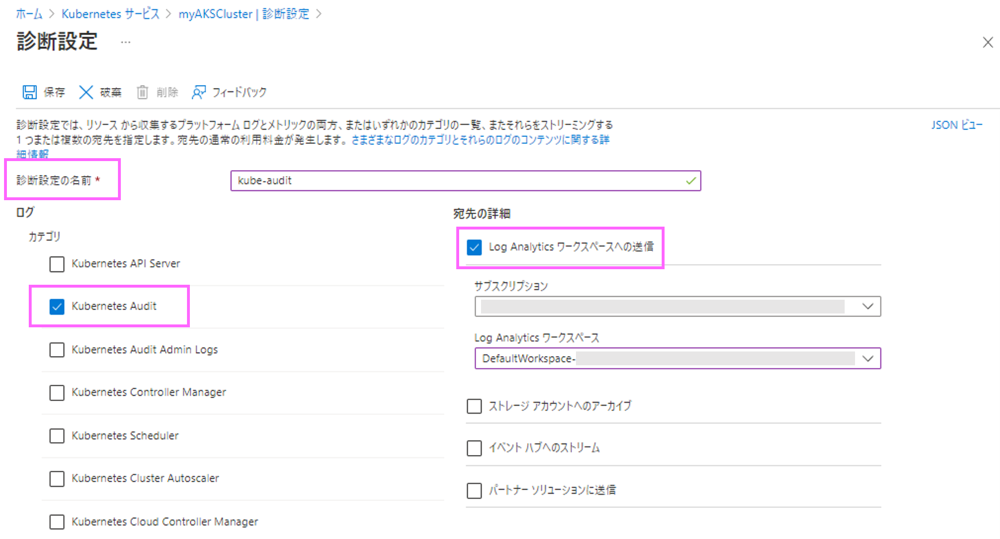

監査ログに該当するカテゴリには、**Kubernetes Audit** と **Kubernetes Audit Admin Logs** の 2 つが存在します。それぞれ、次の違いがあります。

* **Kubernetes Audit (kube-audit)**
  * get、list、create、update、delete、patch、post を含む、すべての監査イベントのログを出力します
* **Kubernetes Audit Admin Logs (kube-audit-admin)**
  * Kubernetes Audit (kube-audit) カテゴリのログから、get および list の監査イベント (参照系のイベント) を除外したログを出力します

Kubernetes クラスターの動作は、さまざまなコントローラー (ソフトウェア) がリソース オブジェクトを操作することによって成り立っています。そのため、オブジェクトの get や list、watch といったリクエストが継続的に発生しています。**Kubernetes Audit** カテゴリは、コントローラーによる参照系リクエストもふくめ、すべてのイベントのログが出力されます。

一方、クラスターに対する変更系の操作のみを追跡したいというシナリオでは、get や list といった参照系のログは必要ないということがあります。その場合、**Kubernetes Admit Admin Logs** を選択することで、ログの数を大幅に削減でき、Log Analytics ワークスペースやストレージ アカウントの容量・料金の節約になります。

診断設定で出力できる AKS クラスターのリソース ログについては、次のドキュメントに一般的な推奨事項が記載されていますので、あわせてご参照ください。

> **Azure Monitor のコンテナー正常性機能を使用して Azure Kubernetes Service (AKS) を監視する - リソース ログを収集する**
> https://learn.microsoft.com/ja-jp/azure/aks/monitor-aks#collect-resource-logs
> 　
> このドキュメントでは、kube-audit を Azure ストレージへ転送し、kube-audit-admin を Log Analytics ワークスペースへ転送する構成が紹介されています。

### 監査ログの取得方法

診断設定で Log Analytics ワークスペースへ送信したログは、Azure ポータルの [**[モニター]**](https://portal.azure.com/#view/Microsoft_Azure_Monitoring/AzureMonitoringBrowseBlade/~/overview) 画面から、[Kusto クエリ](https://learn.microsoft.com/ja-jp/azure/azure-monitor/logs/log-query-overview)を実行することで取得できます。

左のメニューから **[ログ]** 画面へ移動し、ログの出力先の Log Analytics ワークスペースを選択して新しいクエリを実行します。

診断設定のログは **AzureDiagnostics** テーブルに格納されています。
`Category` カラムの値が `kube-audit` となっているログを絞り込むことで、Kubernetes の監査ログが取得できます。

```kusto
AzureDiagnostics 
| where Category == "kube-audit"
| take 10
```

次のスクリーンショットは、クエリを実行してログを取得した画面です。`log_s` カラムに、Kubernetes の監査ログが JSON 形式で記録されています。


`log_s` カラムの値を [parse_json()](https://learn.microsoft.com/ja-jp/azure/data-explorer/kusto/query/parsejsonfunction) 関数で変換することで、監査ログ内部の値にアクセスしやすくなります。
[extend 演算子](https://learn.microsoft.com/ja-jp/azure/data-explorer/kusto/query/extendoperator)でログの項目ごとに新しい列を作成しておくと、クエリに検索条件を追加する際に便利です。また、必要な列のみに絞ってログを表示することが可能になります。

```kusto
AzureDiagnostics 
| where Category == "kube-audit"
| extend audit = parse_json(log_s)
| extend Method = audit.verb
| extend RequestURI = audit.requestURI
| extend RequestObject = audit.requestObject
| extend ResponseObject = audit.responseObject
| extend ResponseStatusCode = audit.responseStatus.code
| extend UserAgent = audit.userAgent
| extend User = audit.user.username
| project TimeGenerated, Method, ResponseStatusCode, RequestURI, User, UserAgent, RequestObject, ResponseObject
| order by TimeGenerated asc
```

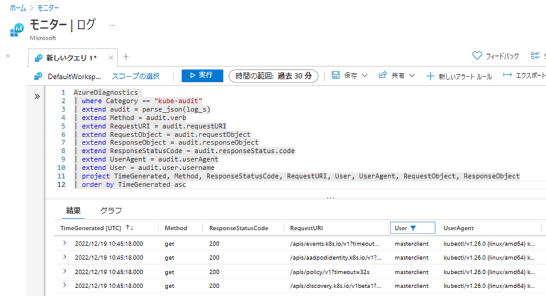

## クエリとログの例

ここまでの手順で、AKS クラスターの監査ログを Log Analytics ワークスペースへ転送し、クエリの実行でログ取得ができるようになりました。

ここでは 4 つのシナリオをもとに、監査ログの情報を取得する例を紹介します。

### シナリオ 1: アプリケーション (Pod/Deployment) の作成履歴を確認する

AKS クラスターにアプリケーションをデプロイした際のログを見てみましょう。[AKS チュートリアル](https://learn.microsoft.com/ja-jp/azure/aks/tutorial-kubernetes-deploy-application)で使用されている azure-vote アプリケーションをクラスターにデプロイし、Kubernetes の監査ログからDeployment の作成履歴を確認します。

`kubectl` コマンドでアプリケーションの YAML マニフェストをクラスターに適用します。次のコマンド例では Deployment と Service が2つずつ作成されています。

```shell
$ kubectl apply -f azure-vote-all-in-one-redis.yaml
deployment.apps/azure-vote-back created
service/azure-vote-back created
deployment.apps/azure-vote-front created
service/azure-vote-front created
```

次のクエリ例では、監査ログ (`audit`) 内に `"azure-vote"` の文字列を含むログを抽出しています。
その他の条件として、create リクエスト (`Method`)、kubectl コマンドからのアクセス (`UserAgent`) を指定しています。

```kusto
AzureDiagnostics 
| where Category == "kube-audit"
| extend audit = parse_json(log_s)
| extend Method = audit.verb
| extend RequestURI = audit.requestURI
| extend RequestObject = audit.requestObject
| extend ResponseObject = audit.responseObject
| extend ResponseStatusCode = audit.responseStatus.code
| extend UserAgent = audit.userAgent
| extend User = audit.user.username
| where audit contains "azure-vote"     // 監査ログ内に "azure-vote" の文字列を含む
| where Method == "create"              // create リクエスト
| where UserAgent contains "kubectl"    // クライアントが kubectl のログ
| project TimeGenerated, Method, ResponseStatusCode, RequestURI, User, UserAgent, RequestObject, ResponseObject
| order by TimeGenerated asc
```

クエリを実行すると、次のスクリーンショットのようにログが取得されました。ログの内容を表示された順に上から確認してみましょう。

まずは、 API サーバーに対して、`2022-12-19 11:13:27 (UTC)` に `/apis/apps/v1/namespace/default/deployments` のパスに `create` リクエストが送信されたことがわかります。

`User` カラムの情報から、`az aks get-credentials` コマンドで取得した AKS クラスターの資格情報 (`masterclient`) が使用されていることがわかります。また、`UserAgent` カラムの情報から、`kubectl` コマンドによる操作が実行されたことがわかります。

`RequestObject` には Deployment の YAML マニフェストの内容が記録されています。`spec` には Deployment の仕様が記録されており、Pod のレプリカ数 (`spec.replicas`) や Pod テンプレート (`spec.template`) の内容が含まれていることが確認できます。 

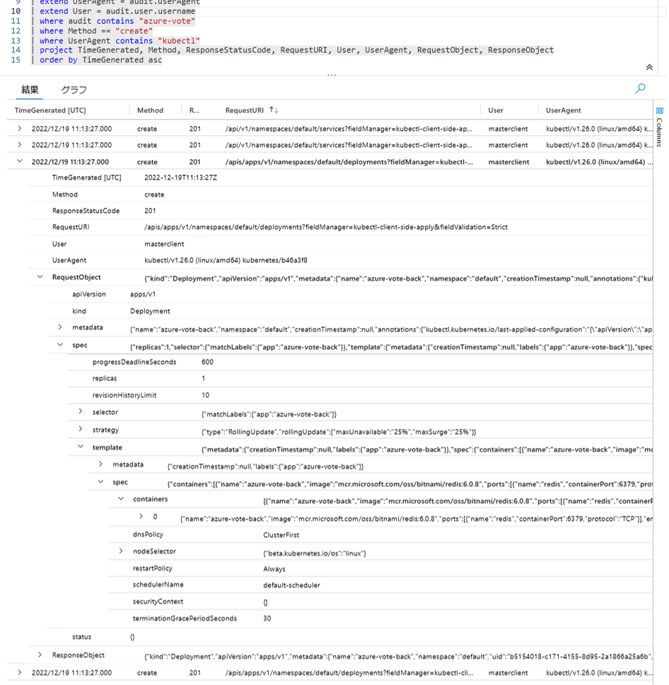

Kubernetes では、Deployment オブジェクトが作成・更新されると、その内容をもとに ReplicaSet オブジェクトが作成されます。そして、指定されたレプリカの数だけ Pod オブジェクトが作成されます。この動作は、Kubernetes クラスターを構成するコントローラーによって自動的に行われます。

上記のクエリ例では、人によって開始された Deployment 作成のログを確認しましたが、コントローラーによる自動処理についても Kubernetes の監査ログから確認できます。
作成した Deployment から最終的に Pod が起動するまでの様子を、実際に監査ログから追ってみましょう。ここでは、ReplicaSet が作成される箇所は割愛し、最終的に Pod が作成される様子を紹介します。

先ほど使用したクエリの条件 (kubectl によるリクエスト) を削除して、ログ内に `"azure-vote"` の文字列を含む create リクエストのすべてを検索します。すると、`/api/v1/namespaces/default/pods` パスに対する create リクエストが確認できます。

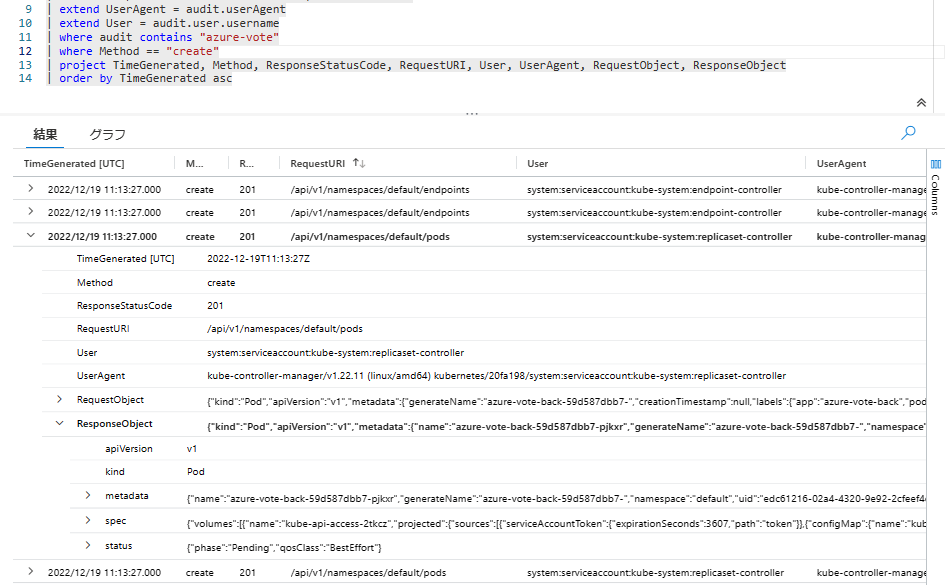

`User` および `UserAgent` から、[kube-controller-manager](https://kubernetes.io/ja/docs/concepts/overview/components/#kube-controller-manager) 内の ReplicaSet Controller によって、Pod の作成がリクエストされたことがわかります。

Deployment の場合と同様に、`ResponseObject` には Pod のデプロイ内容が記録されています。`metadata.name` の情報から、`azure-vote-back-59d587dbb7-pjkxr` という名前で Pod が作成されたことがわかります。
また、`status.phase` が `Pending` となっています。この時点では Pod がノードにスケジューリングされておらず、ステータスが `Pending` の状態であったことがわかります。

Pod の名前が特定できました。この Pod 名を `RequestURI` に含むログを検索してみましょう。クエリを実行すると、次のリクエストのログが表示されました。

* `create /api/v1/namespaces/default/pods/azure-vote-back-59d587dbb7-pjkxr/binding` **(binding)**
* `patch /api/v1/namespaces/default/pods/azure-vote-back-59d587dbb7-pjkxr/status` **(status)**

```kusto
| where RequestURI contains "azure-vote-back-59d587dbb7-pjkxr"  // Pod 名を指定
```

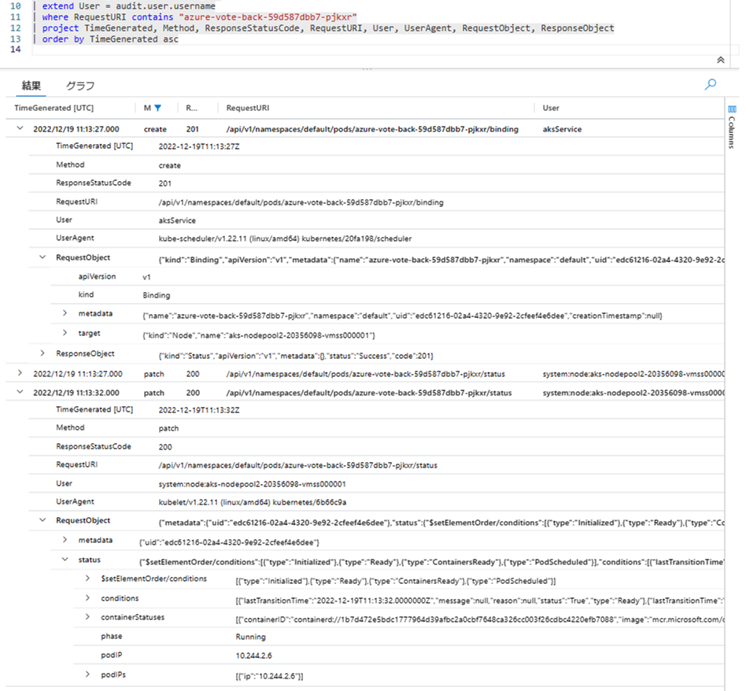

`RequestURI` の末尾が `/binding` のログは、Pod がノードにスケジューリングされた際のリクエストです。`UserAgent` から kube-scheduler によるリクエストであることが確認できます。
また、`RequestObject.target` の情報から、Pod がノード `aks-nodepool2-20356098-vmss000001` に割り当てられたことがわかります。

`RequestURI` の末尾が `/status` のログは、Pod のステータス情報が更新された際のリクエストです。`User` と `UserAgent` から、Pod がスケジューリングされたノード `aks-nodepool2-20356098-vmss000001` の kubelet から送信されたことが確認できます。

ノード上の kubelet は、コンテナー ランタイムにコンテナーの起動を指示し、その結果を API サーバーに送信する役割を持っています。コンテナーの状態にあわせて Pod のステータスを更新しています (`Method` も `create` ではなく `patch` となっています)。

`RequestObject` の `status` の情報が、kubelet から報告された Pod の状態になります。`status.phase` より、Pod が `Running` ステータスになったことがわかります。また、Pod に割り当てられた IP アドレスの情報も確認できます。

> [!TIP]
> create リクエストでは、作成するオブジェクトがまだ存在しないため、`RequestURI` にはオブジェクト名が含まれません。たとえば、Pod の作成では `/api/v1/namespaces/default/pods` に対して create リクエストが送信され、Pod 名などの情報は `RequestObject` に含まれています。
> 　
> オブジェクトが作成された後は、オブジェクト名を含む `RequestURI` で操作されます。たとえば、特定の Pod の削除操作では、対象となる Pod を表す `/api/v1/namespaces/default/pods/azure-vote-back-59d587dbb7-pjkxr` に対して delete リクエストが送信されます。
> 　
> クエリの作りこみをする際には、上述のクエリ例 (`where audit contains "azure-vote"`) のように、監査ログ全体を絞り込みの条件にして、必要な情報がどのフィールドに存在するかを確認するとよいです。ReplicaSet によって作成された Pod のように、名前にランダムな文字列が含まれる場合もログの特定がしやすくなります。

### シナリオ 2: Pod のステータスとノードへのスケジューリング履歴を確認

新しく作成された Pod が `Pending` ステータスとなり、起動しない場合があります。

> コンピュート リソースの不足によって発生する Pod の Pending ステータスについては、こちらのブログ記事もご参照ください。
> 　
> **Japan Azure IaaS Core Support Blog - AKSのメモリ関連トラブルシューティング**
> https://jpaztech.github.io/blog/containers/aks-memory-troubleshoot/

次の例では、Pod が要求する CPU リソースが、現在クラスターに存在する空きノードで提供できないために、Pod が `Pending` ステータスとなっています。
また、[クラスター オートスケーラー](https://learn.microsoft.com/ja-jp/azure/aks/cluster-autoscaler)が `Pending` ステータスの Pod が存在することを検知し、ノードプールのスケール アップを実行したイベントが確認できます。

```shell
$ kubectl get pods -l app=azure-vote-front
NAME                                READY   STATUS    RESTARTS   AGE
azure-vote-front-7655fcc46d-jm5sh   0/1     Pending   0          2s
azure-vote-front-7655fcc46d-wtfph   1/1     Running   0          31s
azure-vote-front-7655fcc46d-zqvbc   0/1     Pending   0          2s

$ kubectl describe pod azure-vote-front-7655fcc46d-jm5sh
  ...
Events:
  Type     Reason            Age   From                Message
  ----     ------            ----  ----                -------
  Warning  FailedScheduling  35s   default-scheduler   0/2 nodes are available: 2 Insufficient cpu.
  Normal   TriggeredScaleUp  28s   cluster-autoscaler  pod triggered scale-up: [{aks-nodepool2-20356098-vmss 2->4 (max: 5)}]
```

このときの Pod のステータスの変化と、ノードの追加のイベントを、監査ログから確認してみましょう。

`RequestURI` に対象の Pod 名を含むログを検索します。ステータス情報が更新されたイベントを抽出するために、`Method` が get 以外のログを取得します。

```kusto
AzureDiagnostics 
| where Category == "kube-audit"
| extend audit = parse_json(log_s)
| extend Method = audit.verb
| extend RequestURI = audit.requestURI
| extend RequestObject = audit.requestObject
| extend ResponseStatusCode = audit.responseStatus.code
| extend UserAgent = audit.userAgent
| where Method != "get"
| where RequestURI contains "/api/v1/namespaces/default/pods/azure-vote-front-7655fcc46d-jm5sh"
| project TimeGenerated, RequestObject, Method, ResponseStatusCode, RequestURI, UserAgent
| order by TimeGenerated asc
```

ログを検索した結果、kube-scheduler によって Pod のステータス情報が更新されたログが見つかりました (URI 末尾が `/status`) 。
`RequestObject.status.conditions[0]` に Pod の状態を表す情報が記録されています。`Unschedulable` のメッセージが確認でき、`message` から CPU リソースの不足が理由であることがわかります。このメッセージは `kubectl describe pod` コマンドで確認できるものと同様の内容です。

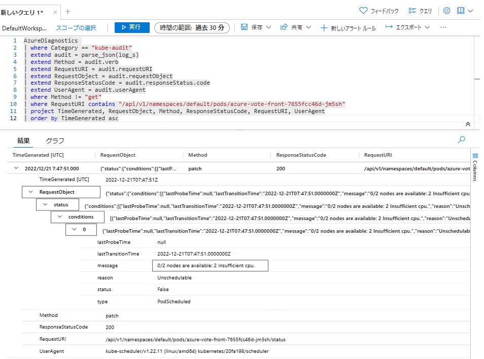

そのあとの時間に、Pod がノードに割り当てられたログが確認できました (URI 末尾が `/binding`) 。`ResponseObject.target` から、Pod のデプロイ先がノード `aks-nodepool2-20356098-vmss000005` になったことがわかります。クラスター オートスケーラーによって新しい空きノードが追加され、Pod がデプロイできるようになりました。

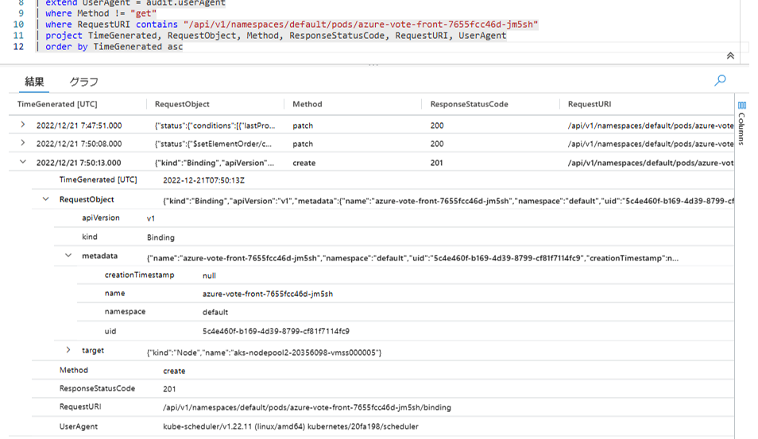

クラスターにノードが追加された際のログをみてみましょう。`kubectl get nodes` コマンドで取得できるノードの情報は、Node オブジェクトとして管理されています。`/api/v1/nodes` に送信された create リクエストのログを検索します。

```kusto
AzureDiagnostics 
| where Category == "kube-audit"
| extend audit = parse_json(log_s)
| extend Method = audit.verb
| extend RequestURI = audit.requestURI
| extend RequestObject = audit.requestObject
| extend ResponseStatusCode = audit.responseStatus.code
| extend UserAgent = audit.userAgent
| extend User = audit.user.username
| where Method == "create"
| where RequestURI contains "/api/v1/nodes"
| project TimeGenerated, RequestObject, Method, ResponseStatusCode, RequestURI, User, UserAgent
| order by TimeGenerated asc
```

Node オブジェクトの作成ログが取得できました。`User` および `UserAgent` から、`aks-nodepool2-20356098-vmss000005` ノードの kubelet からリクエストが送信されたことがわかります。
新しいノード (VM) が作成され、kubelet が動作を開始すると、API サーバーにノードの情報が登録されます。`ResponseObject` の `spec` や `status` から、ノードの情報やステータスが取得できます。

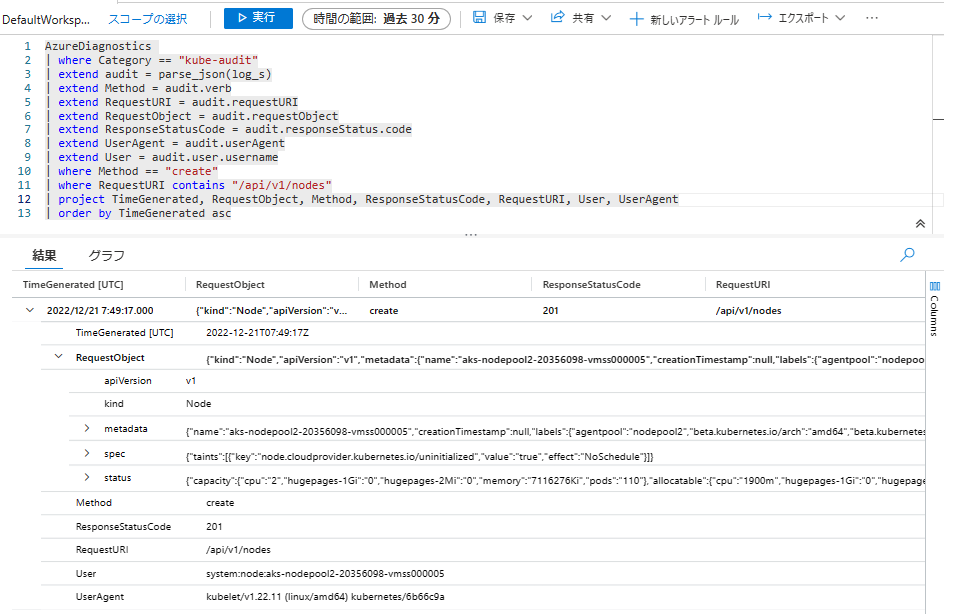

> [!TIP]
> クラスター オートスケーラーのログは、監査ログと同様に AKS クラスターの診断設定で **Kubernetes Cluster Autoscaler (cluster-autoscaler)** を出力することで、お客様にてご確認いただけます。
> オートスケールによってノードが意図した通りに追加・削除されなかった際に、クラスター オートスケーラーがどのような判断をしたのかや、VMSS インスタンスの操作リクエストが失敗していないかについて、ログから確認できます。

### シナリオ 3: Node のステータス履歴を確認

ノードが新規に作成されると、はじめは `NotReady` ステータスの状態でクラスターに登録されます。その後 Pod を起動する準備が完了すると `Ready` ステータスへ変化します。
上記例 2 のシナリオで新しいノードが作成された際のログから、ノードのステータス情報が変化した様子を確認してみましょう。

`RequestURI` に文字列 `"/api/v1/nodes"` を含み、かつ `"/status"` で終わるという条件をクエリに追加します。`Method` には patch を指定しています。

ノードのステータス情報は `ResponseObject.status.conditions` の配列に含まれています。扱いやすいように [mv-expand 演算子](https://learn.microsoft.com/ja-jp/azure/data-explorer/kusto/query/mvexpandoperator)で配列の値を複数のレコードに展開します。ノードが Ready であるかどうかを表す情報は、`conditions.type` が `Ready` のものが該当します。

```kusto
AzureDiagnostics 
| where Category == "kube-audit"
| extend audit = parse_json(log_s)
| extend Method = audit.verb
| extend RequestURI = audit.requestURI
| extend ResponseObject = audit.responseObject
| extend UserAgent = audit.userAgent
| where RequestURI contains "/api/v1/nodes" and RequestURI endswith "/status"
| where Method == "patch"
| mv-expand conditions = ResponseObject.status.conditions   // conditions 配列の値を複数のレコードに展開
| where conditions.type == "Ready"                          // type が "Ready" のログを取得
| project TimeGenerated, conditions.type, conditions.status, conditions.reason, conditions.message, RequestURI, UserAgent
| order by TimeGenerated asc
```

クエリを実行すると、次の例のようにログが取得できます。
少々わかりにくいですが、`conditions_status` が `False` となっている場合は、ノードが `Ready` **ではない** ことを示しています (`NotReady` ステータス) 。

そのあとの時間に `conditions_status` が `True` へと変化しています (ノードが `Ready` ステータスになった)。また、`kubelet is posting ready status.` のメッセージから、kubelet から API サーバーにノードが正常であるという情報が報告されたことがわかります。

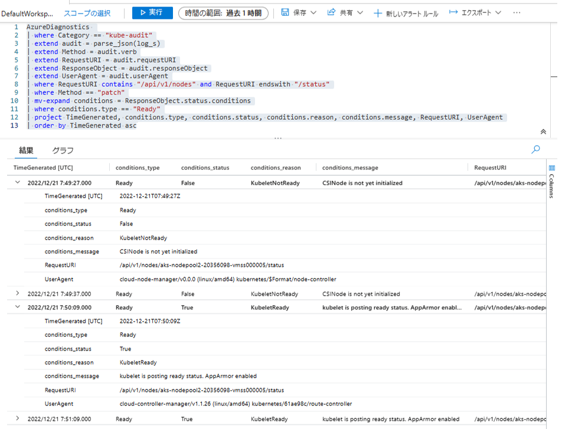

> [!TIP]
> [Container Insights](https://learn.microsoft.com/ja-jp/azure/azure-monitor/containers/container-insights-overview) を利用にすることで、Azure Monitor で[ノードのステータス情報をメトリックとして取得](https://learn.microsoft.com/ja-jp/azure/azure-monitor/containers/container-insights-livedata-metrics#node-count)できます。
> 監査ログではクラスターのさまざまな情報が取得可能ですが、Pod や Node のステータス変化をモニタリングする目的では、クエリの作成やログ データの管理が不要なため、Container Insights で用意されたメトリックを利用することをおすすめします。メトリックから、ステータス変化が発生した事実・発生日時を把握し、具体的な理由や関連するクラスター上のイベントを調査する目的で、監査ログを併用すると良いでしょう。

### シナリオ 4: Pod 再起動のなぞを追え！

> **[Contoso 社のストーリー]**
> [Contoso 社](https://ja.wikipedia.org/wiki/%E3%82%B3%E3%83%B3%E3%83%88%E3%82%BD)では先月、AKS を使って期待の新サービスをリリースしました。年明けにはイベント開催も控えており、2022年も終わりをむかえるこの12月も、開発は鋭意進行中です。今のところ目立った問題は起きておらず、安定して稼働をしているようです。今日の AKS の調子はどうかな？
> 　
> ところが今日、開発のエンジニアより「最近 Pod が突然再起動するようになった」との報告を受けました。リリース作業などのクラスター操作はしていないのにもかかわらず、Pod が再起動 (再作成) されるとのことです。事象は平日の夜に起こることが多く、再作成された Pod の情報から、直近では `2022/12/21 21:47:39 (JST)` 頃に起きたようです。
> ```shell
> $ kubectl describe pod azure-vote-front-7655fcc46d-zp9v7
>   ...
> Start Time:       Wed, 21 Dec 2022 21:47:39 +0900
>   ...
> ```
> 同じノードの Pod が一斉に再起動するため、開発のエンジニアはノードの調子が悪いのではないかと心配しています。事象は開発環境で発生したため、現時点でサービス影響は出ていないですが、今後の開発やサービス提供のために原因を突き止めたいとのことでした。
> 　
> さてどうしましょう？ こんなこともあろうかと、監査ログの出力を有効にしていたのでした！

Contoso 社では開発に kubectl と [Helm](https://helm.sh/ja/) を使っています。事象の発生時間帯を調べると、これらのツールによる Pod 操作は見つからず、たしかにクラスター利用者の操作は無いようでした。

```kusto
| where TimeGenerated between(datetime(2022/12/21 12:00:00) .. 1h)  // 21:00 - 22:00 (JST) のログを検索。クエリ上では UTC 表記
| where RequestURI contains "/api/v1/namespaces/default/pods"       // default ネームスペースの Pod 操作に絞り込み
| where Method !in ("get", "list", "watch")                         // 参照系リクエストは除く
| where UserAgent contains "kubectl" or UserAgent contains "helm"   // kubectl もしくは helm による操作に絞り込み
```


Pod の delete リクエストのログを検索します。すると、事象の時間帯に複数の Pod が削除されていることがわかりました。
Pod が存在していたノードは `ResponseObject.spec.nodeName` から確認できます。ノード名がすべて `aks-nodepool2-20356098-vmss000001` となっており、同じノードの Pod が再起動するという開発エンジニアの証言とも一致します。
`UserAgent` が kubelet と kube-controller-manager となっていることから、何らかの理由により Kubernetes 側から Pod の削除がリクエストされたと推察されます。

```kusto
| where TimeGenerated between(datetime(2022/12/21 12:00:00) .. 1h)
| where RequestURI contains "pods"
| where Method == "delete"
| project TimeGenerated, Method, ResponseStatusCode, RequestURI, UserAgent, ResponseObject.spec.nodeName
```

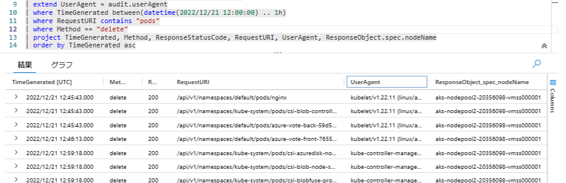

ノード `aks-nodepool2-20356098-vmss000001` に何が起きたのか手がかりを探します。このノードに関するリクエストを調べると、ノードに対して `unschedulable`フラグを設定・解除しているリクエストが見つかりました。`UserAgent` は `kured/v0.0.0` になっています。`unschedulable` は対象のノードへの Pod のスケジューリングを無効化する際に利用される設定値です (`kubectl cordon / uncordon` コマンドの操作に該当します)。

```kusto
| where TimeGenerated between(datetime(2022/12/21 12:00:00) .. 1h)
| where RequestURI == "/api/v1/nodes/aks-nodepool2-20356098-vmss000001"
| where Method !in ("get", "list", "watch")
| where RequestObject != "{}" and RequestObject != "skipped-too-big-size-object"  // RequestObject が空、もしくは省略された場合 (後述) を除外
```

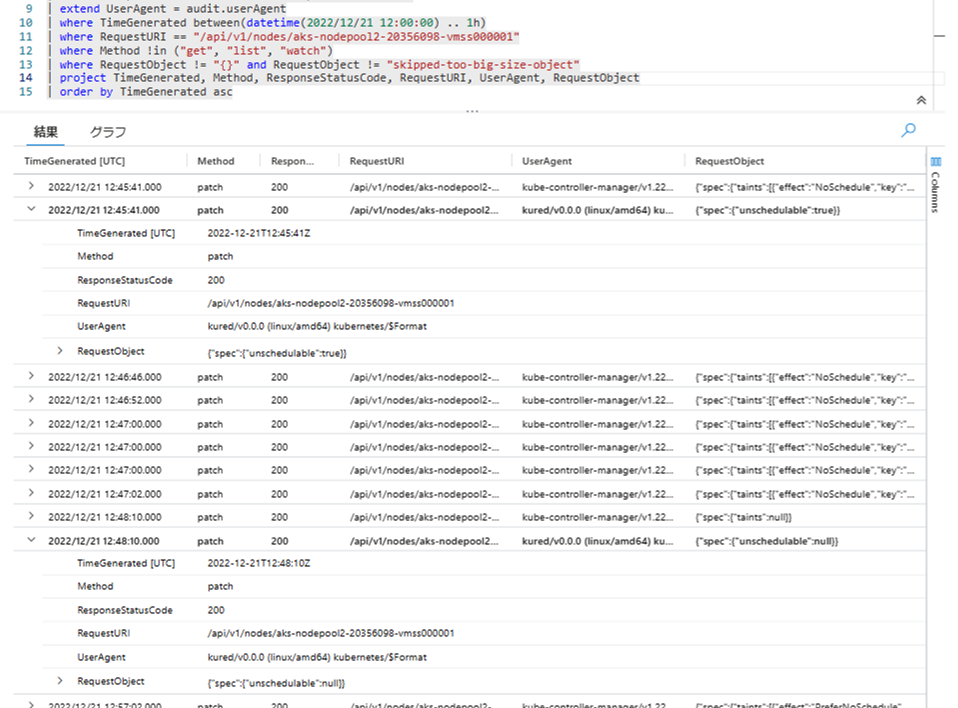

`UserAgent` に `kured/v0.0.0` を含むログを検索してみます。すると、今回削除された Pod に対して退避のリクエストを送っていることがわかりました (URI 末尾が `/evictions`) 。

```kusto
| where TimeGenerated between(datetime(2022/12/21 12:00:00) .. 1h)
| where UserAgent contains "kured/v0.0.0"
| where Method !in ("get", "list", "watch")
```


[Kured](https://github.com/kubereboot/kured) はオープンソースのツールです。Linux OS のパッケージ アップデートの状態を確認し、アップデートの反映のために OS の再起動が必要となった場合に、自動的に OS を再起動します。

> **kured を使用した Linux ノードの再起動の処理 - Azure Kubernetes Service - Microsoft Learn**
> https://learn.microsoft.com/ja-JP/azure/aks/node-updates-kured

Kured はノードを再起動する前に、対象ノードへの Pod スケジューリングを停止し、稼働中の Pod を別のノードへ退避させます ([ノードのドレイン](https://kubernetes.io/docs/reference/generated/kubectl/kubectl-commands#drain))。今回発生した事象は、Kured によるノードの自動再起動が実施され、Pod の停止と別ノードでの再作成が発生したためであると判断できそうです。
(正確な判断には、Kured 自体が出力した動作ログをあわせて確認するのがよいでしょう)

Kured はいつクラスターにインストールされたのでしょうか？ 直近 1 週間でログを検索すると、関連するとみられるリソースが `kured` ネームスペースに作成されていることがわかりました。

```kusto
| where TimeGenerated >= ago(7d)
| where audit contains "kured"
| where Method !in ("get", "list", "watch")
```


Kured は DaemonSet を利用して各ノードへ配置されます。作成された DaemonSet の内容を確認してみます。

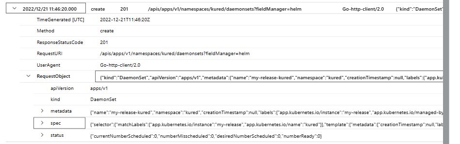

コンテナー内で実行される `kured` コマンドにいくつかのオプションが渡されています (`spec.template.spec.containers[0].args`)。`--start-time=9pm` と[時間が指定](https://kured.dev/docs/configuration/#setting-a-schedule)されており、この時間以降でノードの再起動が開始される設定になっていました。Pod 再起動の事象が、夜の時間帯に発生するという証言の裏付けが取れました。

```json
{
  "kind": "DaemonSet",
  "apiVersion": "apps/v1",
  "metadata": {
    "name": "my-release-kured",
    "namespace": "kured",
    ...
  },
  "spec": {
    "template": {
      "spec": {
        "containers": [
          {
            "name": "kured",
            "image": "ghcr.io/kubereboot/kured:1.12.0",
            "command": [
              "/usr/bin/kured"
            ],
            "args": [
              "--ds-name=my-release-kured",
              "--ds-namespace=kured",
              "--reboot-command=/bin/systemctl reboot",
              "--start-time=9pm",         // 夜9時以降にノード再起動を開始 (タイムウィンドウの設定)
              "--time-zone=Asia/Tokyo",   // タイムゾーン
              "--log-format=text"
            ],
      ...
  }
}
```

> **[Contoso 社のストーリー - 後日談]**
> 後日、チームメンバーにヒアリングをしたところ、クラスター運用の効率化のために、[AKS ドキュメントで紹介されていた Kured](https://learn.microsoft.com/ja-JP/azure/aks/node-updates-kured) の検証を行っていたことがわかりました。Pod 再起動の理由が解明でき、ノードの不調ではないことがわかったことで、開発のエンジニアも安心したようでした。
> その後、Contoso 社ではクラスターの運用方法について検討が行われ、AKS のマネージド機能である[自動アップグレード](https://learn.microsoft.com/ja-jp/azure/aks/auto-upgrade-cluster)や、[計画メンテナンス機能](https://learn.microsoft.com/ja-jp/azure/aks/planned-maintenance) についても試してみることになりました。

> [!TIP]
> ノードプールに VMSS を利用しているクラスターでは、ノードを最新状態にするために、[ノードイメージのアップグレード](https://learn.microsoft.com/ja-JP/azure/aks/node-image-upgrade)が利用可能です。
> スケール操作によって新規追加されたノードは、使用されているノードイメージをもとにインスタンスが起動します。そのため、古いバージョンのノードイメージが使用されている場合、日次で実行されるパッケージ アップデートまでの間は、ノードが最新状態ではない可能性がある点に留意しましょう。
> VMSS を利用しているクラスターでは、定期的にノードイメージのアップグレード作業を実施する、もしくは自動アップグレード機能を利用することをおすすめします。
> 以前の AKS の既定である、ノードに可用性セットを使用するクラスターでは、ノードイメージが利用できないため、運用の自動化と OS を最新状態へ維持するために、Kured の利用が手段の 1 つとして挙げられます。

### 注意点: RequestObject / ResponseObject のサイズ制限

`RequestObject` および `ResponseObject` カラムは、値が Log Analytics カラムのサイズ上限に達している場合に記録されません。

> **Azure/AKS - Release 2022-08-14**
> Remove responseObject from kube-audit logs when its size is reaching log analytics column size limit (32K) and customer enables kube-audit/kube-audit-admin diagnostics.
> https://github.com/Azure/AKS/releases/tag/2022-08-14

サイズ上限に達した場合は `"skipped-too-big-size-object"` というメッセージに置き換えられます。監査ログによる調査やクエリの作成時には、`RequestObject` と `ResponseObject` の情報が取得できない場合があることに注意しましょう。


## さいごに

本記事では、Kubernetes の監査ログの紹介と、AKS・Azure Monitor で実際にログ情報を利用する様子を紹介しました。監査ログを活用することで、過去にクラスターで発生した操作やオブジェクトの変更履歴を調べることができます。我々サポート エンジニアも AKS クラスターの調査をする際に、Kusto のクエリを利用して Kubernetes や AKS 基盤のさまざまなログを調査しています。

監査ログを活用するために、Request / Response Object の構造や、ある操作をしたときに何の API リクエストが送信されるのかについて把握していると役立ちます。Kubernetes API のリファレンスが参考になります。

> **Kubernetes Documentation / Reference / Kubernetes API**
> https://kubernetes.io/docs/reference/kubernetes-api/

また、kubectl コマンドのデバッグ出力 (`kubectl --v=8`) を有効にすると、API サーバーへのリクエスト内容が確認できるため、ログと照らし合わせて動作を確認するのに便利です。ログ出力を有効にして、クラスターを操作しながら実際にどのようなログが出力されるか試してみるとわかりやすいです。監査ログをみることで、トラブルシューティングだけではなく、Kubernetes クラスターがどのように動作をしているのか、理解をより深めることができるでしょう。

今回紹介しました監査ログが、AKS をよりご活用いただくうえでのご参考になりましたら幸いです。また、AKS のご利用において、お困りの点やご不明点がありました際は、いつでも Azure サポートまでお気兼ねなくご相談ください。

## 参考リンク

* Kubernetes に Audit log を求めるのは間違っているだろうか？
  * @makocchi さんによる CloudNative Days 2019 / OpenStack Days 2019 (コンテナー / クラウド ネイティブに関する国内カンファレンス) の発表資料
  * https://speakerdeck.com/makocchi/cndt2019-kubernetes-audit-log-c4d4c5f6-6058-40f9-a5fc-abbb36073a19

---

最後まで読んでいただきありがとうございました！
[Microsoft Azure Tech Advent Calendar 2022](https://qiita.com/advent-calendar/2022/microsoft-azure-tech) は明日が最終日となります。是非ご覧くださいー！

本年は多くのお客様にお世話になりました。ありがとうございました。
来年もみなさまにとって素晴らしい年でありますように、心よりお祈り申し上げます。
