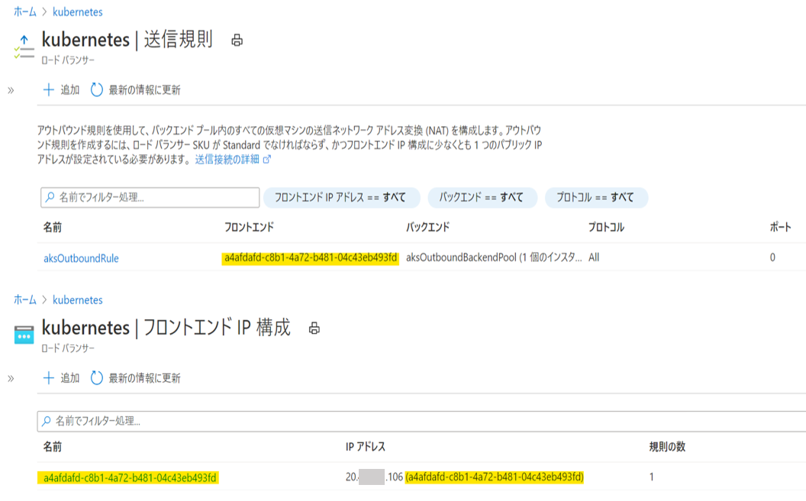
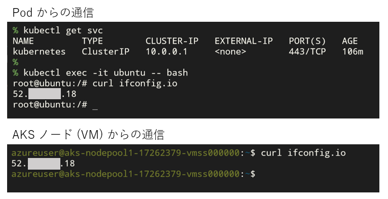
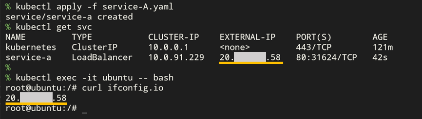

こんにちは！ Azure テクニカル サポート チームの桐井です。

Azure Kubernetes Service (AKS) にデプロイされた Pod からインターネットへの送信トラフィックでは、 Azure VM で外部接続をする場合と同様に、仮想ネットワークのプライベート IP アドレスからグローバル IP アドレスへの SNAT が必要です。 AKS 上のアプリケーションから外部の連携サービスへアクセスするというシナリオで、リソース グループ内に存在するパブリック IP アドレスのうちどれが送信元の IP アドレスとして使用されるのか、疑問に思われた方もいらっしゃるのではないかと思います。

Azure では外部接続の SNAT オプションを複数提供しており、 AKS ではクラスター作成時に選択した Load Balancer の SKU によって、使用される SNAT オプションが異なることがございます。この記事では、送信トラフィックに Azure Load Balancer が使用されている [^1] ことを前提に、 AKS の外部接続で使用される SNAT オプションについて、関係する Azure リソースの構成とともにご紹介いたします。

<!-- more -->

[^1]: 送信接続のために Azure Load Balancer ではなく、 User Defined Routing (UDR) を使用して、独自のゲートウェイ、ファイアウォールまたはプロキシを使用する構成もございます。詳細につきましては「[ユーザー定義ルートを使用してクラスターのエグレスをカスタマイズする](https://docs.microsoft.com/ja-jp/azure/aks/egress-outboundtype)」をご参照ください。

---

## AKS で使用される Load Balancer SKU と SNAT オプション

AKS では、 Azure Load Balancer の **Standard SKU** と **Basic SKU** の両方がサポートされています。 Load Balancer の SKU は、クラスター作成時のオプションで指定可能で、既定では Standard SKU が選択されます。

外部接続で使用される SNAT オプションを、クラスター作成時に選択した Load Balancer の SKU 、および [Kubernetes Service](https://kubernetes.io/ja/docs/concepts/services-networking/service/) の作成状況ごとにまとめると、下記の表のようになります。 SNAT オプションに記載のシナリオは、下記 Azure Load Balancer のドキュメントに記載のシナリオと対応することを示します。

> Azure Load Balancer ドキュメント
> [アウトバウンド接続での SNAT の使用](https://docs.microsoft.com/ja-jp/azure/load-balancer/load-balancer-outbound-connections)

Standard SKU を選択した場合は、クラスター作成と同時に Load Balancer リソースも作成されますが、 Basic SKU では [Load Balancer タイプの Service](https://kubernetes.io/ja/docs/concepts/services-networking/service/#loadbalancer) を作成するまで Load Balancer リソースは構成されないという点に注意が必要です。

| Load Balancer SKU / K8s Service の有無 | SNAT オプション | SNAT アドレスに使用される IP アドレス |
| --- | --- | --- |
| **Standard** | 外部 Load Balancer の送信規則による SNAT [※シナリオ2](https://docs.microsoft.com/ja-jp/azure/load-balancer/load-balancer-outbound-connections#scenario-2-virtual-machine-without-public-ip-and-behind-standard-public-load-balancer) | 送信規則のフロントエンド IP アドレス |
| **Basic** / Service (LoadBalancer) が**作成されていない** | Azure 既定の SNAT [※シナリオ3](https://docs.microsoft.com/ja-jp/azure/load-balancer/load-balancer-outbound-connections#scenario-3-virtual-machine-without-public-ip-and-behind-basic-load-balancer) | ランダムに割り当てられる IP アドレス |
| **Basic** / Service (LoadBalancer) が**作成済み** | 外部 Load Balancer の負荷分散規則による SNAT [※シナリオ2](https://docs.microsoft.com/ja-jp/azure/load-balancer/load-balancer-outbound-connections#scenario-2-virtual-machine-without-public-ip-and-behind-standard-public-load-balancer) | 負荷分散規則のフロントエンド IP アドレス |

それでは Standard / Basic SKU それぞれを選択した AKS クラスターで、どのように SNAT が構成されるのか、実際に作成された Azure リソースをみながら確認していきましょう。 Pod からインターネットへ通信を行った際の送信元 IP アドレスの検証には、送信元のグローバル IP アドレスを確認できるサービス [ifconfig.io](http://www.ifconfig.io/) を使用します。

また、 Azure で提供される SNAT オプションにつきまして、弊社ネットワーク エンジニアによる解説記事がございます。どの SNAT オプションが使用されるか、状況別に判定するフローチャートがございますので、本記事とあわせてご参考にいただけますと幸いでございます。

> Japan Azure IaaS Core Support Blog
> [Azure VM の外部接続 (SNAT) オプション まとめ](https://jpaztech.github.io/blog/network/snat-options-for-azure-vm/)

### Standard SKU の場合

Standard SKU を使用した場合では、 AKS クラスターから送信されたトラフィックは Load Balancer の**送信規則に従い SNAT** されます。Pod からインターネットへの通信では、**送信規則に割り当てられたフロントエンド IP アドレス** が送信元のアドレスとなります。

> AKS ドキュメント
> [Azure Kubernetes Service (AKS) でパブリック Standard Load Balancer を使用する](https://docs.microsoft.com/ja-jp/azure/aks/load-balancer-standard)

Standard SKU を選択しクラスターを作成すると、以下の画像のようにノード リソース グループの中に ロード バランサー および Public IP Address リソースが作成されます。

ロード バランサー の送信規則には aksOutboundRule というルールが設定されており、一緒に作成された Public IP Address がフロントエンド IP アドレスとして指定されています。クラスターの送信トラフィックはこの送信規則にもとづいて SNAT されます。

実際にクラスター上の Pod から通信を行うと、送信元のグローバル IP アドレスとして、送信規則のフロントエンドに割り当てられた IP アドレスが使用されていることが確認できます。

### Basic SKU の場合

Basic SKU を使用した AKS クラスターでは、 LoadBalancer タイプの Service の有無によって、使用される SNAT オプションが異なり、送信元の IP アドレスの割り当て方法も変化します。

* LoadBalancer タイプの Service が作成されていない場合
  * エージェント ノードの VMSS は、どの外部 Load Balancer のバックエンドにも存在しないため、 **Azure 既定の SNAT** により**ランダムに割り当てられたパブリック IP** が使用されます
* LoadBalancer タイプの Service を作成した場合
  * ロード バランサー および Public IP Address リソースが作成され、**負荷分散規則に割り当てられたフロントエンド IP アドレスで SNAT** されます

> AKS ドキュメント
> [Azure Kubernetes Service (AKS) で Basic SKU ロード バランサーと共に、エグレス トラフィックに静的パブリック IP アドレスを使用する](https://docs.microsoft.com/ja-jp/azure/aks/egress)

上記の動作について、文章だけではイメージしづらいと思いますので、ここではリソースのライフサイクルに沿って順に解説いたします。

#### (1) AKS クラスターを作成した直後

ノード リソース グループの中には、ロード バランサー および Public IP Address リソースは存在しません。

この段階では、エージェント ノードの VMSS は、どの Load Balancer のメンバーではなく、外部接続では Azure 既定の SNAT が使用されます。SNAT に使用される IP アドレスは、 VM が存在する Azure リージョン内で使用されるグローバル IP アドレスの中から、未使用のアドレスがランダムに割り当てられます。 Pod から通信を行った場合も、ノード (VM) と同じ SNAT 構成が使用されます。

Azure 既定の SNAT では、 VM / VMSS が再デプロイされると、割り当て済みの IP アドレスは解放され、新しいパブリック IP アドレスに変動します。 そのため、アプリケーションの接続先で IP アドレスによる通信制限を行っている場合、 IP アドレスの変動によりアクセスができなくなる恐れがありますのでご注意ください。

> 詳細につきましてはこちらの記事もご参照ください
> Japan Azure IaaS Core Support Blog
> [Azure VM の外部接続 (SNAT) オプション まとめ 「Azure 既定の SNAT」](https://jpaztech.github.io/blog/network/snat-options-for-azure-vm/#Azure-%E6%97%A2%E5%AE%9A%E3%81%AE-SNAT)

#### (2) Load Balancer Service を作成した後

AKS クラスターに `type: LoadBalancer` の Kubernetes Service を作成すると、自動的に ロード バランサー および Public IP Address リソースが作成されます。

エージェント ノードの VMSS がバックエンド プールとして割り当てられます。また、負荷分散規則が構成され、フロントエンド IP アドレスには、同時に作成された Public IP Address が割り当てられます。

Load Balancer が構成されると、クラスターの送信トラフィックは負荷分散規則にもとづいて SNAT されるようになります。 SNAT アドレスには、フロントエンド IP アドレスとして割り当てられた IP アドレスが使用されます。実際に Pod から通信を試すと、送信元の グローバル IP アドレスが Service の External-IP として表示されている IP アドレスと一致することが確認できます。

2 つ目以降の Service をデプロイした場合は、最初に割り当てられた IP アドレスが引き続き SNAT アドレスとして使用されます。例えば `Service A` 、 `Service B` という順番で Service を作成した場合、SNAT IP アドレスには `Service A` で割り当てられたパブリック IP アドレスが使用されます。

#### (3) Load Balancer Service をすべて削除した後

すべての Load Balancer Service が削除されると、 ロード バランサー および Public IP Address リソースはノード リソース グループから自動的に削除されます。

上記の「[(1) クラスターを作成した直後](#1-AKS-クラスターを作成した直後)」と同じ構成に戻ります。その後の Pod からの通信では、 Azure 既定の SNAT によってランダムに割り当てられたパブリック IP アドレスが送信元の IP アドレスとして使用されます。

## さいごに

この記事では、 AKS の外部接続で使用される SNAT オプションについて Load Balancer の構成を踏まえて解説いたしました。

今回ご紹介しました Load Balancer のように、 AKS では Kubernetes の操作を介して、各種 Azure リソースが自動的に構成されます。動作の詳細や注意点について、対象の Azure サービスのドキュメントや、 VM の使用を想定した公開情報が参考になることもございますので、ぜひご参照いただけたらと思います。

本稿が皆様のお役に立てれば幸いです。
