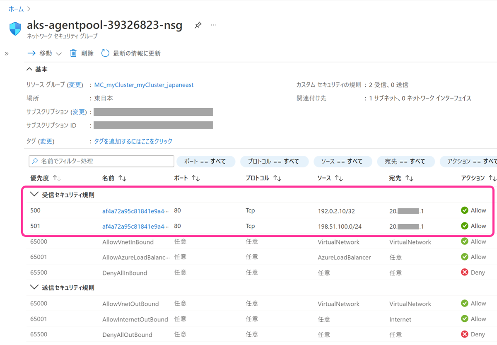

こんにちは。Azure テクニカル サポート チームの桐井です。

AKS に作成した Service (type: LoadBalancer) に対して、アクセス可能な IP アドレス範囲を NSG で制限する方法をご紹介いたします。

<!-- more -->

## AKS クラスターの NSG

AKS クラスターを作成すると、クラスターを構成する Azure リソースの 1 つとしてネットワーク セキュリティ グループ (NSG) が作成されます。

AKS 上に Load Balancer タイプの Service をデプロイすると、Service の内容にもとづいて外部ロード バランサーが構成されます。あわせて、NSG に受信セキュリティ規則が作成され、インターネットから外部ロード バランサーに対するアクセスが許可されます。

以下のスクリーンショットは、80/TCP を公開する Service をデプロイしたあとの NSG の様子です。ソースが Internet、宛先が外部ロード バランサーの IP アドレスとなった受信セキュリティ規則が作成されています。


## Service へのアクセスを特定の IP アドレス範囲のみ許可する

Service の YAML に `spec.loadBalancerSourceRanges` フィールドを追加することで、NSG 受信セキュリティ規則のソース アドレスをカスタマイズすることが可能です。
これにより、Service へのアクセスを特定の IP アドレス範囲のみ許可することが実現できます。

> ご参考情報: Azure Kubernetes Service (AKS) でパブリック Standard Load Balancer を使用する
> 「受信トラフィックを特定の IP 範囲に制限する」が該当のドキュメント項目です。
> https://docs.microsoft.com/ja-jp/azure/aks/load-balancer-standard#restrict-inbound-traffic-to-specific-ip-ranges

下記が YAML の記述例です。`spec.loadBalancerSourceRanges` 配下に、アクセスを許可したい IP アドレス範囲を CIDR 表記で記述します。

```yaml
apiVersion: v1
kind: Service
metadata:
  name: azure-vote-front
spec:
  type: LoadBalancer
  ports:
  - port: 80
  selector:
    app: azure-vote-front
  loadBalancerSourceRanges:
  - 192.0.2.10/32    # 単一のアドレスの許可
  - 198.51.100.0/24  # アドレス範囲の許可
```

上記 YAML を AKS クラスターにデプロイします。外部ロード バランサーに IP アドレス (EXTERNAL-IP) が割り当てられました。

```shell
% kubectl apply -f service.yaml
service/azure-vote-front created

% kubectl get svc
NAME              TYPE          CLUSTER-IP   EXTERNAL-IP   PORT(S)       AGE
azure-vote-front  LoadBalancer  10.0.98.178  20.xxx.xxx.1  80:32730/TCP  83s
kubernetes        ClusterIP     10.0.0.1     <none>        443/TCP       6m45s
```

Azure ポータルでクラスター既定の NSG を確認します。受信セキュリティ規則が 2 つ作成され、それぞれソースが `loadBalancerSourceRanges` で指定したアドレス範囲になっていることが確認できます。



> [!NOTE]
> `loadBalancerSourceRanges` は Azure 固有のフィールドではなく、Kubernetes API で用意されている共通のフィールドです。この設定値を読み取った Cloud Provider が、各クラウド サービスのネットワーク制限機能を操作するという仕組みで、Azure の場合では NSG ルールが構成されるという動作になっています。
> [Kubernetes API Reference Docs - ServiceSpec v1 core](https://kubernetes.io/docs/reference/generated/kubernetes-api/v1.21/#servicespec-v1-core)

### 内部ロード バランサーでも利用できますか？

NSG によるアクセス元アドレスの制限は、内部ロード バランサーを使用する Service においても利用可能です。

YAML では `metadata.annotations` に `azure-load-balancer-internal: true` のアノテーションを追加し、外部ロード バランサーの場合と同様に `spec.loadBalancerSourceRanges` フィールドを記述します。

内部ロード バランサーで Service を作成する方法は、下記ドキュメントをご参照ください。

> Azure Kubernetes Service (AKS) で内部ロード バランサーを使用する
> https://docs.microsoft.com/ja-jp/azure/aks/internal-lb

## さいごに

この記事では、AKS に作成した Service (type: LoadBalancer) に対して、NSG でアクセス可能な IP アドレス範囲を制限する方法をご紹介いたしました。

Service へアクセス可能なネットワークを、オンプレミス環境や特定の VNet などに制限する場合にご活用いただけます。また、NSG ルールをアプリケーション用の YAML マニフェストとあわせて記述できるため、管理面でのメリットがございます。

AKS では Kubernetes を介して各種 Azure リソースが自動的に構成されます。クラスターが正常動作しなくなる恐れがございますので、ノード リソース グループ (MC_*) 内の自動作成された NSG や、その他 Azure リソースに対しては、手動で変更を加えないようにしましょう。

> Azure Kubernetes Service (AKS) についてよく寄せられる質問
> [ノード リソース グループ内の AKS リソースのタグや他のプロパティを変更できますか?](https://docs.microsoft.com/ja-jp/azure/aks/faq#can-i-modify-tags-and-other-properties-of-the-aks-resources-in-the-node-resource-group)

> [!NOTE]
> カスタム VNet の NSG 変更はサポートされています。
> Azure Kubernetes Service のサポート ポリシー - [ネットワーク ポート、アクセス、NSG](https://docs.microsoft.com/ja-jp/azure/aks/support-policies#network-ports-access-and-nsgs)

本稿が皆様のお役に立てれば幸いです。
