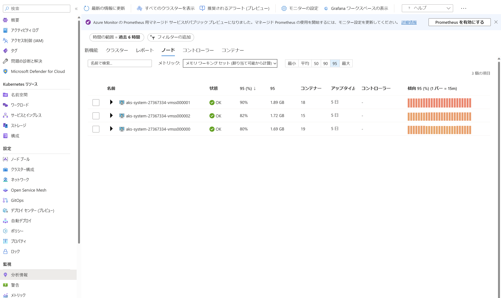
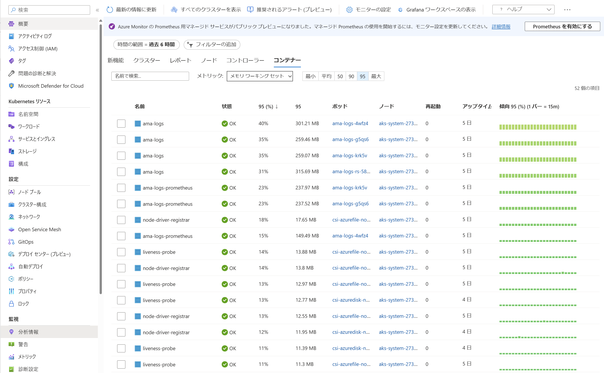

この記事は[Microsoft Azure Tech Advent Calendar 2022](https://qiita.com/advent-calendar/2022/microsoft-azure-tech)の21日目の記事です。

Azureテクニカルサポートチームの高田です。

Azure Kubernetes Service(AKS)の運用に際して、メモリ関連の要因によりワークロードが期待通りに実行されない…という方向けに、下記の典型的な事例と対処方法を紹介させて頂きます。

- 事例1: Podが配置・実行されない
- 事例2: 実行中のPodが終了され、Failed状態となる(または削除・再作成される)
- 事例3: 実行中のPodにてOOMKillが発生する


## 事例1: Podが配置・実行されない

これは、新たに作成されたPodのメモリ要求(requests)を満たすノードが存在せず、Podがどのノードにも配置(スケジューリング)されない = 実行が開始されない、というものとなります。

[Kubernetes の公式ドキュメント](https://kubernetes.io/ja/docs/concepts/configuration/manage-resources-containers/#my-pods-are-pending-with-event-message-failedscheduling)でも同様の事例が紹介されておりますが、簡単に解説します。

PodがRunning状態とならず、`kubectl describe pod`コマンドにてStatusがPendingとなっており、Eventsが下記のような表示となっていた場合に、このケースに該当します。

```
$ kubectl describe pod <pod名>
(略)
Status:       Pending
(略)
Events:
  Type     Reason            Age   From               Message
  ----     ------            ----  ----               -------
  Warning  FailedScheduling  7s    default-scheduler  0/3 nodes are available: 3 Insufficient memory.
```

メモリ要求を満たすノードが存在しない、ということは、言い換えると、このPodをどのノードに配置しても、そのノード上のPodのメモリ要求の合計がそのノードの割当可能な(allocatable)メモリ量を超えてしまう、という意味となります。

実際には、メモリ「のみ」に関しては条件を満たすノードがあるものの、その他の条件(例:Pod のマニフェストにて指定されている配置条件、CPU等他リソースの状況、ノードのTaint等)により、それらを同時に満たすノードが存在しない、というケースもあります。

Podのメモリ要求値、各ノードのメモリ割り当て状況は、各々`kubectl describe pods` `kubectl describe nodes`コマンドで確認できます。

```
$ kubectl describe pod <pod名>
(略)
Containers:
  podcontainer:
    Image:      podimage
    Port:       <none>
    Host Port:  <none>
    Requests:
      memory:     2Gi                    <- 2GiBのメモリを要求
    Environment:  <none>
```
この例では、Pod内のコンテナーに設定されているメモリ要求値が2Giになっています。

```
$ kubectl describe node <node名>
(略)
Capacity:
  cpu:                2
  ephemeral-storage:  129886128Ki
  hugepages-1Gi:      0
  hugepages-2Mi:      0
  memory:             4025844Ki          <-ノードの全メモリは4,025,844KiB
  pods:               30
Allocatable:
  cpu:                1900m
  ephemeral-storage:  119703055367
  hugepages-1Gi:      0
  hugepages-2Mi:      0
  memory:             2209268Ki          <-Podに割当可能なメモリは2,209,268KiB
  pods:               30
(略)
Allocated resources:
  (Total limits may be over 100 percent, i.e., overcommitted.)
  Resource           Requests     Limits
  --------           --------     ------
  cpu                430m (22%)   4500m (236%)
  memory             310Mi (14%)  3286Mi (152%)    <- 310MiB (Allocatable の14%) が割当済み
  ephemeral-storage  0 (0%)       0 (0%)
  hugepages-1Gi      0 (0%)       0 (0%)
  hugepages-2Mi      0 (0%)       0 (0%)
Events:              <none>
```

ノードに残されている割当可能なメモリ2209268Ki - 310Mi よりもPodの要求値 (2Gi) が大きいため、このノードには配置できない、ということがわかります。

ここでご注意頂きたい点として、配置時に関しては、ノード上で実際に使用されているメモリ量、Pod/コンテナーが実際に使用しているメモリ量は直接関係なく、あくまでもPod/コンテナーが(マニフェスト内の指定にて)**要求する**メモリ量、ノード上のそれらの**要求**の合計により判定される、というものがあります。
ノード上の既存のPod/コンテナーが実際にはほとんどメモリを使用していない場合でも、それらの**要求**値が高い場合には、配置時の観点ではそのノードは「メモリに余裕がない」扱いとなります。
この問題のトラブルシューティングの際には、(後述するワーキングセットメモリの監視など)実際のメモリ使用量ではなく、**要求**量を確認しましょう。


### 対処方法

これを解消するには、メモリ割り当てに余裕のあるノードを確保するか、あるいは、Podのメモリ要求を既存のノードで賄える程度まで小さくする必要があります。

前者に関しては、不要なPodの削除による割り当ての開放、または、[ノードプールのスケーリング](https://learn.microsoft.com/ja-jp/azure/aks/use-multiple-node-pools#scale-a-node-pool-manually)、[ノードプールの追加](https://learn.microsoft.com/ja-jp/azure/aks/use-multiple-node-pools#add-a-node-pool)、[ノードのVMサイズの変更](https://learn.microsoft.com/ja-jp/azure/aks/resize-node-pool)、等によるノードの増強、といった方法があります。

後者に関しては、Pod のメモリ要求の値、すなわち、Podのマニフェストの`spec.containers[].resources.requests.memory`の値を減らすこととなります。

```
apiVersion: v1
kind: Pod
(略)
spec:
  containers:
  - image: podimage
(略)
    resources:
      requests:
        memory: 2Gi # <- これを減らす
```

ただし、Podが実際に使用するメモリ量を考慮せずにこの値を減らした場合、後述するOOMKillやEvictが発生するリスクが生じますのでご注意下さい。


### 補足:詰め込みの是非

Podのメモリ要求に対して必要最小限のノードにてAKSクラスターを運用したい、という方も多いかと思います。
しかしながら、平常時にて未割当のメモリが少ない場合、Deployment の更新によるローリングアップデートの際等に、メモリが割当不能になるリスクがあります。

AKSでは、ユーザのPodの他に、CoreDNS等のシステムPodが配置され、動作しています。
これらは随時アップデートが行われることがあります。
また、AKSに関するアドオンの有効化等により、システムPodが追加で配置されることもあります。
このとき、既に各ノードのメモリのほぼ全てが割り当てられていた場合、システムPodの配置失敗や、システムPodの配置のために既存Podが[Preemption](https://kubernetes.io/docs/concepts/scheduling-eviction/pod-priority-preemption/#preemption)の対象となることがあり得ます。
このような事態を避けるため、少なくとも[システムノードプール](https://learn.microsoft.com/ja-jp/azure/aks/use-system-pools?tabs=azure-cli)内のノードに関してはある程度の余裕を確保することをご検討下さい。

ちなみに、配置の際にはCPUとメモリの扱いに本質的な違いはないので、上記の考え方はCPUに関してもそのまま適用可能です。


## 事例2: 実行中のPodが終了され、Failed状態となる(または削除・再作成される)

これは、実行中のPodがノードのメモリ不足によりEvict(退去)の対象となった場合に発生します。
`kubectl describe pod`コマンドの結果にて下記のような記録があった場合にこのケースに該当します。

```
$ kubectl describe pod <pod名>
(略)
Events:
  Type     Reason               Age   From     Message
  ----     ------               ----  ----     -------
(略)
  Warning  Evicted              110s  kubelet  The node was low on resource: memory. Container <container名> was using 3256Ki, which exceeds its request of 2048Ki.
  Normal   Killing              110s  kubelet  Stopping container <container名>
```

Podのマニフェストに記載するメモリ要求(`spec.containers[].requests.memory`)はあくまでも「予算」のようなものであり、Podはこの値を超えてメモリを確保・使用することが可能です。
このため、要求の合計がノードの割当可能なメモリ量の範囲に収まるようにPodが配置されていても、それらのPod(の一部)が要求値を超えてメモリを確保・使用した場合には、ノードにてメモリ不足が発生します。
このとき、要求を超えてメモリを使用しているPodの中から、Podに設定されている優先等を考慮して選択されたものが[evict](https://kubernetes.io/docs/concepts/scheduling-eviction/node-pressure-eviction/)(退去)されます。
(メモリ使用量が急激に増加した場合など、Evictが発生せずに後述するOOMKillが発生する場合もあります)


### 対処方法

メモリ不足によるEvictを防ぐには、ノード上でメモリ不足が発生しないようにする必要があります。
必ずしもPod・コンテナーが使用するメモリの最大値を要求に記載する必要はありませんが、Pod・コンテナーのメモリ使用量が定常的に要求値を超える場合は、そのようなPodの要求値(Podマニフェスト中の`pod.spec.containers[].resources.requests.memory`の値)をより大きなものに変更することで、対象のPodがよりメモリ割当に余裕のあるノードに配置されることとなり、ノード上でのメモリ不足が発生しにくくなります。

```
apiVersion: v1
kind: Pod
(略)
spec:
  containers:
  - image: podimage
(略)
    resources:
      requests:
        memory: 1Gi # <- これを増やす
```


なお、この変更によりPodの配置が行えなくなる可能性もありますので、必要に応じて「Podが配置・実行されない」のトラブルシューティングも実施しましょう。


### 補足:コンテナー分析情報

実際のノードやPod・コンテナーのメモリ消費量は、[コンテナー分析情報](https://learn.microsoft.com/ja-jp/azure/azure-monitor/containers/container-insights-enable-aks?tabs=azure-cli)を有効にすることで監視できます。

コンテナー分析情報は、AzureポータルのAKSクラスターの画面中、「監視」内「分析情報」のタブから利用できます。
コンテナー分析情報ではRSS(プロセスが直接明示的に使用しているメモリ領域の大きさ)とワーキングセット(RSS以外の、ファイルキャッシュ等の間接的なメモリ消費を含んだ値)を確認できますが、Evictや後述するOOMKillはワーキングセットに基づいて行われますため、メモリ不足発生の有無の観点ではワーキングセットを確認するようにしましょう。





## 事例3: 実行中のPodにてOOMKillが発生する

OOM(Out Of Memory)Kill は、ノードに配置され実行中のPodによるメモリ使用量が「制限値」を超過した(正確には、超過してメモリを使用しようとした)ときに発生します。

`kubectl describe pod`コマンドにて、 Last State 等のReasonに"OOMKilled"と書かれている場合が該当します。
```
$ kubectl describe pod <pod名>
(略)
Containers:
(略)
    Last State:     Terminated
      Reason:       OOMKilled
      Exit Code:    1
      Started:      Fri, 16 Dec 2022 09:57:41 +0000
      Finished:     Fri, 16 Dec 2022 09:57:44 +0000
    Ready:          False
    Restart Count:  1
```


制限値には、Pod/コンテナーレベルのものと、ノードレベルのものがあります。
(ノード上でのPod合計のメモリ使用量増加する=ノードがメモリ不足となる場合は前項で解説したEvictも発生し得ますが、メモリ増加ペース等によりEvictが発生せずいきなりOOMKillとなる場合もあります)
ノード全体のメモリ使用量等から、どちらの制限値に抵触したか判断可能な場合が多いですが、後述の、OOMKillの詳細情報にて判断することも可能です。


### Pod/コンテナーレベルのOOMKillの原因と対処方法

Pod/コンテナーレベルのOOMKillは、Podのマニフェスト中、`spec.containers[].resources.limits.memory`にてメモリ制限値が指定されていた場合に、Pod/コンテナーのメモリ使用量がこれに抵触することで発生します。

従って、Pod/コンテナーレベルのOOMKillが発生した場合、その原因はPod/コンテナーのメモリ使用量に問題がある(=Pod/コンテナー内アプリケーションの何らかの異常等により、メモリ使用量が想定を超えて増大している)か、メモリ制限値に問題がある(=Pod/コンテナー内のワークロードの使用するメモリ量を低く見積もり過ぎている)か、のどちらかとなります。

ワークロードの種類によっては判断が難しい場合もありますが、もしメモリ制限値が厳しすぎた可能性があると考える場合は、limitsの値を増やしましょう。


```
apiVersion: v1
kind: Pod
(略)
spec:
  containers:
  - image: podimage
(略)
    resources:
      requests:
        memory: 500Mi
      limits:
        memory: 1Gi  # <- これを増やす
```


なお、Pod/コンテナーのメモリ使用量はワーキングセット(RSS以外のファイルキャッシュ等も
含んだ値)に関して評価されます。
psコマンド等で確認できるプロセスのメモリ使用量(RSS)の合計よりも大きな値となりますので、コンテナー分析情報等にてワーキングセットの値も確認しましょう。


### ノードレベルのOOMKillの原因と対処方法

ノードレベルにて、「割当可能なメモリ量」の値 + evictionのための猶予値が制限値として設定されているため、これに抵触した場合に(たとえPod/コンテナーレベルの制限値に抵触しなくても)OOMKillが発生します。

この場合、原因はメモリ不足によるEvictと同様のため、対処方法も同様に各Podのメモリ要求の見直しと、必要に応じたノードの増強等となります。

### 補足: OOMKillの詳細情報

OOMKillはLinux Kernelのメモリ関連機能である[memcg](https://www.kernel.org/doc/html/latest/admin-guide/cgroup-v1/memcg_test.html)により駆動されるため、発生時のカーネルメッセージを参照することで様々な情報が得られます。
例えば、下記メッセージ中のoom_memcgにはOOMKillの原因となった制限値が設定されていたmemcg(memory cgroup、プロセスの集合)が記載されているため、これが下記のように`/kubepods`となっていた場合はノードレベルのOOMKill、 `/kubepods/....`と続いていた場合はPod/コンテナーレベルのOOMKillとなります。

```
Dec 16 09:37:31 aks-nodepool1-32235639-vmss000002 kernel: [376723.579928] oom-kill:constraint=CONSTRAINT_MEMCG,nodemask=(null),cpuset=d9a4f01c5cfe15ee88972f51557b3395ea6f8d0f31a93d7ef19c64459085a156,mems_allowed=0,oom_memcg=/kubepods,task_memcg=/kubepods/besteffort/pod325d3265-721f-4032-a97b-b3caa6e51859/d9a4f01c5cfe15ee88972f51557b3395ea6f8d0f31a93d7ef19c64459085a156,task=stress,pid=2268420,uid=0
```

この他、メッセージにはOOMKillが発生したときのメモリ使用状況等も含まれており、これがメモリ使用内訳の調査等にも役に立つことがあります。
カーネルメッセージは、ノードの`/var/log/syslog`等に記録されるため、 [ノードにログイン](https://learn.microsoft.com/ja-jp/azure/aks/node-access)した後に `/host/var/log/syslog`等を参照することで確認できます。


## さいごに
AKSはワークロードの配置や実行、問題発生時の復旧を自動的に行ってくれる一方、与える情報や設定が不十分であったり、実態と乖離した場合には予期しない動作となることもあります。
今回ご紹介した事例が、皆様のAKSの運用に役立つことを願っています。

