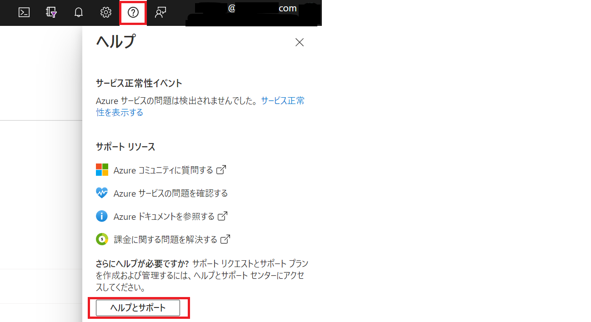
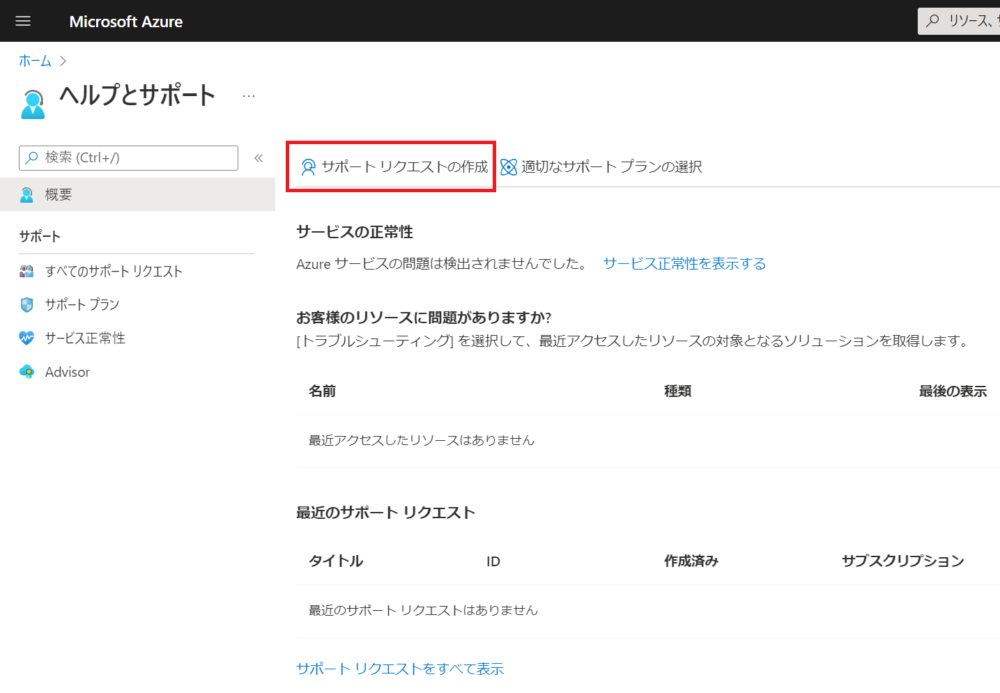
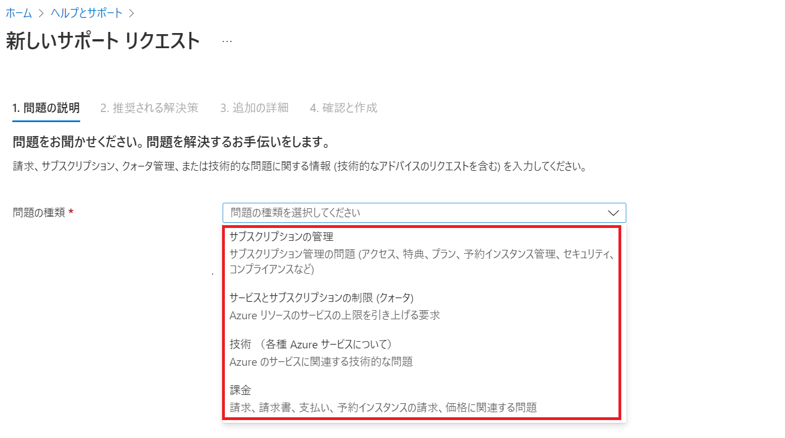
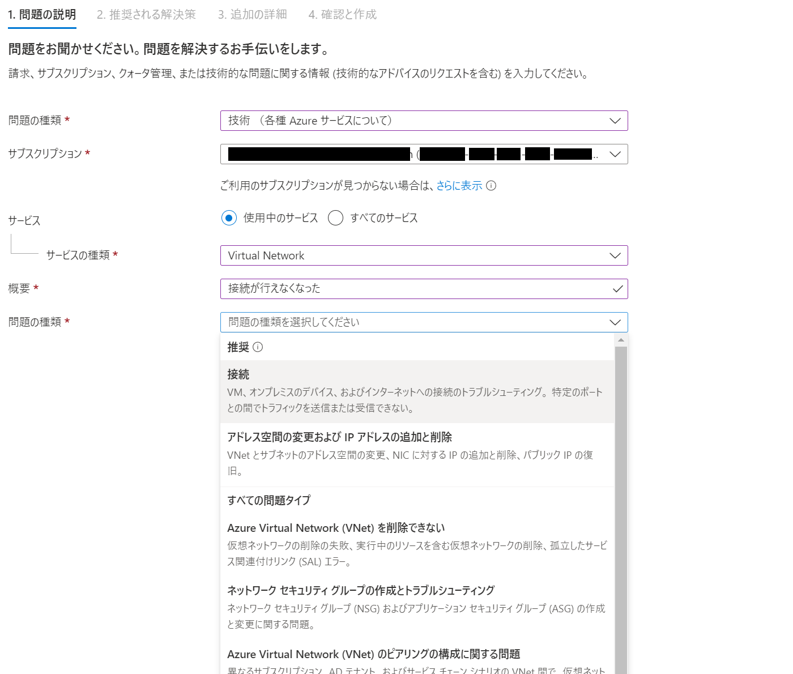
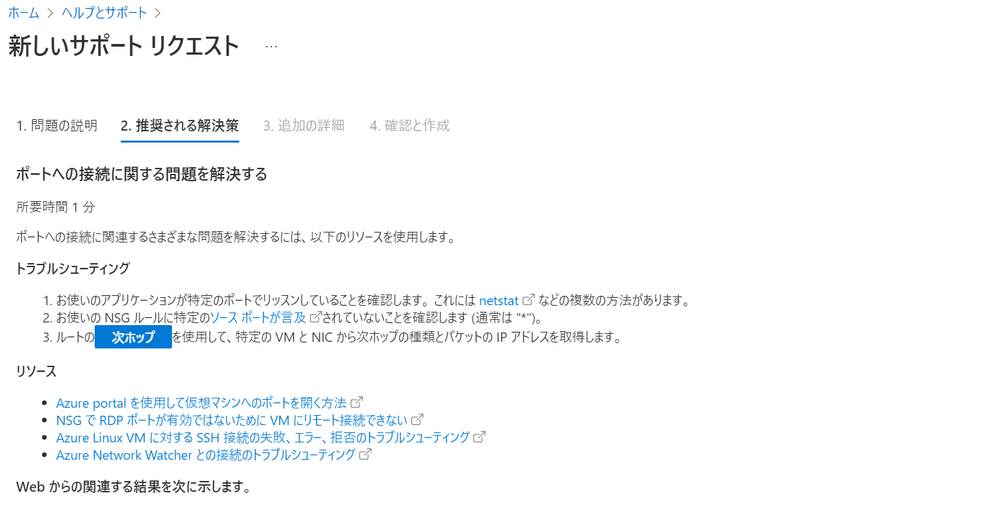
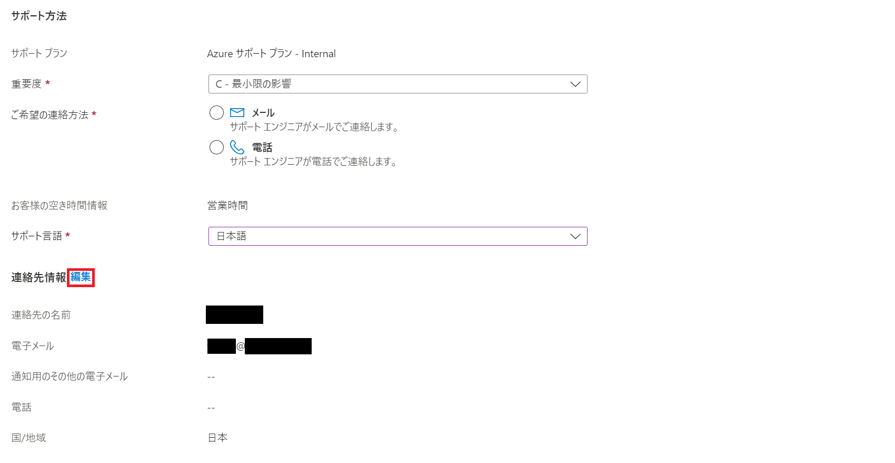

こんにちは。Azure テクニカル サポート チームです。

私たちは、Azure をご利用いただいているお客様に、Azure を正常かつ快適にご利用いただくためのご支援を差し上げています。
この度、Azure サポートを効果的に利用するやり方について知りたい、というご要望を頂戴しましたので、以下にサポートへのお問い合わせ方法をご案内させていただきます。

<!-- more -->

本資料は、以下のようなお客様にお読みいただくことを想定しています。  

- お問い合わせを起票するための契約や、お問い合わせ発行から連絡をもらえるまでの応答時間などのルールと流れを知りたい
- マイクロソフトのサポートからどのような内容を対応してもらえるのか知っておきたい
- Azure サポートを利用する際にどのように起票すれば効率的に成果が得られるか知りたい

なお、以下に記載しました内容はあくまで 「一般的なお問合せの流れ」 をご紹介していますので、もしこちらに記載がなくお悩みの点がございましたら、一旦お問合せを起票いただくか、既に対応させていただいている件があればそちらの担当サポートエンジニアまで、お気兼ねなくご相談をいただければ幸いです。

---

## サポート リクエスト (お問い合わせ) の作成

[Azure Portal](https://portal.azure.com/) の画面右上、クエスチョン マークから \[ヘルプとサポート\] に遷移し、続いて \[サポート リクエストの作成\] をクリックすることで、Azure のサポート リクエストを作成できます。

> ご参考) Azure サポート要求を作成する
> [https://docs.microsoft.com/ja-jp/azure/azure-portal/supportability/how-to-create-azure-support-request](https://docs.microsoft.com/ja-jp/azure/azure-portal/supportability/how-to-create-azure-support-request)

---

### サポート リクエスト作成画面 - 1. 問題の説明 ページ

まず問題の種類を選択します。  
サブスクリプションの管理、サービスとサブスクリプションの制限 (クォータ)、課金、に関しては無償でお問い合わせいただけます。

技術的なお問い合わせについては、有償サポート契約が必要であり、"技術 (各種 Azure サービスについて)" を選択します。  
ここでは、技術的なお問い合わせをされる際のフローについて説明します。

> [!TIP]
> **課金・サブスクリプション・クォータのサポートについての参考資料はこちらです**
> Japan Azure 課金 サブスクリプション サポート ブログ - サポートにお問い合わせする方法について
> https://jpazasms.github.io/blog/AzureSubscriptionManagement/20131030a/

#### サブスクリプション

問題が発生しているリソースを含むサブスクリプションを正しく選ぶことは非常に重要なステップです。

- この画面にて、自動的に、今回の画面を開いているユーザーアカウント (Azure Portal の右上に表示) がお問い合わせ可能なサブスクリプションが検索され、選択可能となります。
  サポート リクエストでは、ご利用されている環境のヒアリングをしており、サポートからの情報の提示を行う場合があります。
  お問い合わせされる際には、本アカウントが、対象サブスクリプションの所有者・共同作成者・サービス リクエスト共同作成者のいずれかのセキュリティ ロールが付与されている必要があり、これによってお客様の環境について情報を漏洩していないことを確認しています。
  
- 有償サポート契約との紐付きはサブスクリプション単位で行っています。
  このため、適切なサポート レベルにてサービス提供が受けられます。

> [!IMPORTANT]
> **異なるサブスクリプション上のリソースの調査について**
> サポートリクエストを発行される際、調査対象リソースのサブスクリプションからお問い合わせくださいますようお願いいたします。
> 異なるサブスクリプション上のリソースの調査は、セキュリティ上の問題が発生します。詳しくは以下をご参照ください。
> 　
> ご参考) お問い合わせ発行時と「異なる」サブスクリプションの調査依頼に対してのセキュリティ チェックが強化されます
> [https://jpaztech.github.io/blog/information/Different-subscriptions-research/](https://jpaztech.github.io/blog/information/Different-subscriptions-research/)
> ご参考) 電話経由における Azure サブスクリプションの調査のセキュリティ チェックが厳格化されます
> [https://jpaztech.github.io/blog/information/Security-check-stricter/](https://jpaztech.github.io/blog/information/Security-check-stricter/)

#### サービス (サービスの種類)

サービスとは、Azure におけるそれぞれのサービス名のことです。
できる限り正確に、どのサービスに対してのお問い合わせであるか選択していただくようお願いします。  

「Azure」はひとつのサービスではなく、数百種類も存在する様々なサービスのプラットフォームとなっています。  
Azure サポート チームでは、この膨大なサービスを個々のチームで分担し、より専門的な回答を差し上げられるよう研鑽を積んでおります。  
適切なサービスを選択していただくことで、専門的な知識を持つサポートエンジニアからの正確なご案内をスムーズに行うことができます。  

「使用中のサービス」ボタンを選択していると、そのサブスクリプションですでに作成済みのリソースのみがリストアップされるため、絞り込みやすくなります。  

#### 概要、問題の種類と、サブタイプ

概要については、簡潔に問題の概要を記載下さい。  
このキーワードをもとに、問題の種類がリストアップされますので、ここからお客様が直面している問題に近いものを選択します。  
これは、適切な専任チームにお問合せがルーティングされるための貴重な情報として使われます。  
厳密な表現が難しい場合には、後続のページにてテキスト フォーマットで詳細を記載可能となりますので、ご安心ください。  

> [!TIP]
> **起票の単位 (サービスごと、リソースごと)**
> サポートをご利用いただく際には、問題の最小単位を切りだしたものを 1 件としてお問合せください。
> これは、お問合せの量に応じて適切なサポート人員を配置し、また必要に応じて複数人での対応によりスピーディなご連絡を差し上げるためであり、サポートご利用の皆様にお願いさせて頂いております。
> 分割いただくことが適切な例は以下の通りです。
> 
<ul>
> <li>同じサービスで複数のリソースにて問題が発生しているが、発生パターンが異なるなど同じ原因によるものか不明な場合</li>
> <li>1 つの問題と考えられるが、複数のサービス間にわたって問題が発生しており、どちらに問題があるかそれぞれから見解を受けたい場合 (※ 専任部門がことなるそれぞれのエンジニアから対応が受けられるため。お問い合わせ番号を相互にご連絡いただけましたら、内部で連携を取って調査します。)</li>
> <li>お問い合わせの過程で、関連した質問が発生したが元のお問い合わせ内容と異なる場合</li>
> </ul>

なお、複数のお問合せを起票した方が良いか分からない、どのサービスとどのサービスが別々なのか判断がつかない、一問一答にしてしまうと膨大な量になってしまう、といった場合には、まず一件起票いただき、担当のサポートエンジニアとご相談をいただけますと助かります。

### サポート リクエスト作成画面 - 2. 推奨される解決策 ページ

この画面は、特に入力が必要な部分は無く、関連する可能性のある情報が提示される箇所です。

Azure においては、お問い合わせによるやりとりにてお手間をかけず、極力お客様ご自身で必要な情報にアクセスが出来るよう、公開情報の刷新を続けております。
対象ページでは、1ページ目で記載いただいたトピックにて関連する可能性のある技術資料やトラブルシューティング方法など、お客様での解決をお手伝いする資料を検索し、提示します。

また、最近発生した大規模な障害の情報も自動的に表示される場合があり、お問い合わせのやりとりを待つ事なく情報が得られる可能性もあります。
情報を参照された結果、該当していない、もしくはサポート エンジニアからの対応が必要な場合、次へをクリックして進みます。

### サポート リクエスト作成画面 - 3. 追加の詳細 ページ

サポート リクエストの依頼内容の詳細を入力するページとなります。

#### 問題の詳細

ここでは、お客様のご利用のサービスやリソースについて、いつから問題が発生したのかや、問題の説明について詳細な記載をお願いしております。
サポート エンジニアが迅速に問題内容を把握し、調査を行うためにご協力をいただけますと助かります。

**日時 欄**
エラーや問題が最初に発生した時間について記載してください。

**説明 欄**
以下を参考に、問題の詳細について記載してください。

- お問い合わせにおけるゴール
- 問題、あるいはご質問内容
- 再現の手順 (どのような操作を行うことで問題が発生するか)
- 問題の頻度 (○時間に一度、定期的/不定期 など)
- 問題が出る直前に、構成や設定面で変更を加えたものがあれば、可能な限り詳細に記載ください。
- 詳細なエラー メッセージ。ログファイルや画面ショットなどが準備できる場合、アップロードしていただくことも可能です。(エラーと分かった一部分のみに省略せず、コマンドや操作を行ったところからエラーになるまでの全体を抜粋いただくことが確実です)
- お客様にてお試しいただいた対策や、実施された調査内容、既知の回避策の有無
- (すでに他のサポート リクエストを起票済みで関連している場合) 関連するお問合せ番号と当該件の担当者名
- お問い合わせのやりとりに追加されたい他のご担当者様の連絡先

> [!TIP]
> その他の一般的なヒアリング事項については、[https://aka.ms/jpazsupportform](https://aka.ms/jpazsupportform) に EXCEL シートをご用意しております。
> 起票の際のポイントとして参考にしていただけますと幸いです。
> (本テンプレートを埋めてアップロードしていただいても OK です。)

> [!TIP]
> **過度な略語やプロジェクト固有文言の使用は避けましょう**
> 一般的に Azure の製品名や機能であるものをのぞき、略称やプロジェクト固有の文言の使用により齟齬が発生する可能性があります。
> 例: 「PoC 環境」「プライマリ/セカンダリ」など。
>「PoC ではエラーが出なかったが、本番環境では問題が発生している」 => PoC 環境、本番環境がどのようなリソース名と構成であるかを明記したり、利用方法などの違いについてもご説明いただくことで、比較調査に役立つ場合があります。
> 

#### 高度な診断情報

Azure サポートでは、お客様のデータ プライバシーに配慮をしつつ、一部リソースのトラブルシューティングに必要な範囲で基盤ログの抽出を行うといった、高度な診断情報へアクセスを行うことができます。  
これにより、お客様にて手動で情報を抽出し、弊社に送信いただくといった手間が省けます。  
基本的には、こちらで「はい」を選択していただくことをお勧めしております。  
アクセス許可を付与することで Azure サポートが参照できる情報は以下の通りとなります。  

> ご参考) Data we use to deliver Azure support
> [https://azure.microsoft.com/en-us/support/legal/support-diagnostic-information-collection/](https://azure.microsoft.com/en-us/support/legal/support-diagnostic-information-collection/)
> (※ お問い合わせのクローズと共にアクセス許可は削除されます)

#### サポート方法

**重要度 (重大度)**
問題の状況によって、3 種類の重要度が設定可能です。
お客様がご利用されている契約と、この緊急度に応じて、初回応答時間が設定されています。
初回応答時間は、Microsoft のサポートエンジニアがお客様と連絡を取り、サポートが開始されるまでの時間です。重大度 A 以外は営業時間内でのご連絡となります。

- 事業に軽微な影響が及ぶ場合 (重大度 C):
  Standard サポート契約の場合 8 時間以内
- 事業に部分的な影響が発生する場合 (重大度 B):
  Standard サポート契約の場合 4 時間以内
- 事業に大きな影響が発生する場合 (重大度 A):
  Standard サポート契約の場合 1 時間以内

詳しくは、[サポート プラン—サポート内容と応答性](https://azure.microsoft.com/ja-jp/support/plans/response/) のページを参照してください。

> [!IMPORTANT]
> **重要度 A について**
> 平日の夜間と休日も含めた 24x7 (24 時間体制) でのご支援であり、具体的には以下のような「今すぐに対応が必要」という場合の利用を想定しております。
> 
<ul>
> <li>原則として、事業が停止しているような危機的障害 (例 : 全社員のメール送受信が失敗、全社員がアプリケーションへのアクセスに失敗、など) からの復旧を目指したサポートとなります。 このため、以下のような場合は重要度 B 以下を選択してください。</li>
> <ul>
> <li>復旧済みの問題についての原因の調査</li>
> <li>環境の構築中やこれまでと異なる設定への変更に伴う問題発生で切り戻しによって解消可能</li>
> <li>プロジェクトの進捗に影響が出ているので対応を加速</li>
> </ul>
> <li>即時の情報提供などが必要なため、お客様にも常にご連絡がつく体制の維持をお願いしております</li>
> <li>障害からの復旧後には、お客様とのご相談の上で重要度を変更させていただきます</li>
> </ul>

 

> **対応中の案件の緊急度 を A (24x7 対応) に上昇させたい場合**
> お問い合わせの件について緊急性が上昇した結果、重要度を A に変更されたい場合には、お手数ですが別途新規に重要度 A のお問い合わせの起票をお願いいたします。
> 新規のお問合せを起票いただくことで、そのタイミングの緊急対応担当へ呼び出しが行われます。
> その際、既存のお問い合わせのお問合せ番号を文中に記載いただくことで、関連のお問い合わせの経緯も参考にしつつ対応します。

**ご希望の連絡方法**
メールか電話、ご希望の連絡方法をご選択ください。選択した方法で初回のご連絡をさせていただきます。  
なお、2 回目以降のご連絡はサポートエンジニアが状況に応じて異なるご連絡方法のお願いをさせて頂く場合がございます。  
もし、より細かいご要望がございましたら、是非お問合せ説明欄にいただけますと助かります。  
緊急度 A については電話のみでの対応となります。  

**サポート言語**
対応を要望される言語をご選択ください。  

> [!TIP]
> **英語でのお問い合わせについて**
> 英語での対応をご要望の際には、お手数ですがお問合せ本文等もすべて英文での記載をお願いいたします。
> また、緊急度 B かつ 24x7 のお問合せは、現在のところ英語のみの対応となりますのでご注意ください。

#### 連絡先情報

お客様の連絡先を記載します。
「編集」ボタンをクリックすることで、任意のメール アドレスやご担当者名に変更することが可能ですので、お間違え無いよう今一度有効なメールアドレスおよび電話番号かをご確認ください。

### サポート リクエスト作成画面 - 4. 確認と作成 ページ

最後に、お問い合わせの作成確認画面となります。  
これまでに入力いただいた内容に漏れがないことをご確認の上、チケット作成を完了します。  
その後、初回応答時間内に、サポート エンジニアからのご連絡差し上げます。  

---

## お問い合わせの完了 (サポート リクエストのクローズ)

### お問い合わせの終了方法について

弊社のサポート エンジニアからの回答によって、お問い合わせに記載頂いた問題が解決した場合や、お客様ご自身で問題が解決した場合は、解決した旨を Azure ポータルやメール、お電話にてご連絡頂きますようお願い致します。  
その後、弊社のサポート エンジニアにてお問い合わせ対応の終了 (クローズ) を実施します。  
なお、一定期間お客様からご連絡を頂けなかった場合は、弊社のサポート エンジニアにてお問い合わせのクローズを実施します。  

### クローズ済みのお問い合わせの再開方法について

お客様のサポート契約が有効な場合は、クローズ済みのお問い合わせに関する追加のご質問や調査を再開することが可能ですので、お問い合わせ内容に対象のお問い合わせ番号を明記の上、新規でお問い合わせを起票頂きますようお願い致します。  

### サポート リクエストのクローズ後のアンケートについて

サポート リクエストをクローズ時にメールでアンケートを送付しています。  
サポート対応の品質向上を目的として、各サポート リクエストでのサポート エンジニアによる対応品質をお客様にご評価いただいております。  
回答内容については担当したサポート エンジニアならびに担当チームメンバーで共有し、次回以降のより良い対応に繋げたり、励みとさせていただいております。 

### Azure への製品へのフィードバックや機能追加の要望

Azure における製品自体の品質のフィードバック、機能追加・変更といったご要望については、以下の「アイデア」ページにて集約しております。  
こちらのサイトから投稿していただくことで、開発部門に直接お声を届けることが可能となっています。  

> ご参考) https://feedback.azure.com/d365community/  

> [!IMPORTANT]
> **サポートと機能要望の違いについて**
> Azure サポートは、現在進行形の問題に対して対処を行い、製品を使い続けられるような支援を行うことに注力しています。Azure などのクラウド製品においては、中・長期的に見た機能改善や追加のご要望、一過性の問題に対しての修正完了までの追跡はサポートでは行っておりません。上記フィードバック サイトでは、製品がより良くなるようなご要望について、その賛同意見や技術的な実現正とメリットを考え、今後の開発ロードマップに活かすべく開発者が直接参照しておりますので、ぜひとも積極的に投稿をお願いいたします。
> なお、このような機能改善へのご要望について、中・長期的ではあっても、お客様にとって Azure を継続利用するにあたって極めて大きな障壁となるようでしたら、プレミア サポートの契約をいただいている場合、担当の CSAM (カスタマー サクセス アカウント マネージャー) までご連絡をお願いします。

以上が Azure サポートを効果的にご利用いただくためのお問い合わせ方法、および流れとなります。  

なお、お問い合わせをされるお客様には様々なご要望があり、また様々なご事情を抱えていらっしゃると拝察しております。  
「すぐに電話が欲しい」、「電話は絶対にして欲しくない」、「メールはテキストが良い」、「いや HTML で図が入っていた方が読みやすい」などなど、日々対応させて頂いているなかで、頂戴するご要望は多岐に渡り、正反対のものもございます。

私たち Azure サポートでは、まずお客様と対話させて頂くことが必要であり、Q を入れたら A が出てくるような機械的なサポートではなく、ご要望をお聞きして、それに寄り添ったご支援を差し上げられればと考えています。  
もし、上記にうまくあてはめられないようなご要望やお悩みがございましたら、まずは一件お問合せをお送りいただき、その中でお気兼ねなく担当サポートエンジニアまでご相談ください。  

Azure をサポートサービスの質でお選び頂けるよう、チーム一同努めてまいりますので、これからも、弊社 Azure サービスならびに Azure サポートをご愛顧賜りますと幸いです。
