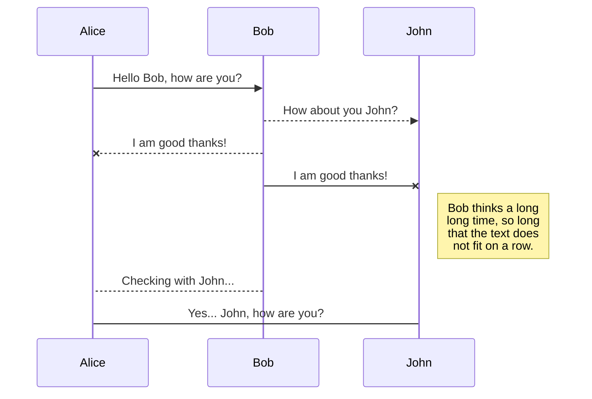
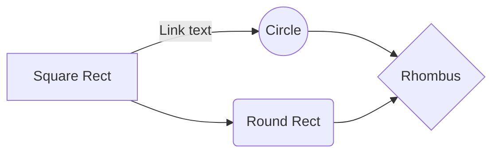

# WAF誤検知対応

いつもお世話になっております。Azure IaaS チームの庄です。
WAFの**誤検知**とは、WAFが正常なアクセスや無害なリクエストを誤って攻撃と判断し、不当にブロックすることを指します。こちらのブログは、WAFを利用する際に、誤検知が発生する際の対応方法につきまして障害いたします。

# 誤検知が発生する際に対応方法

**WAF側の設定**
Azure WAF の設定を使って誤検知を避ける方法には、主に3つの方法があります。

 1. 除外を利用する
特定のヘッダーやリクエストボディ内で誤検知が起こった部分を指定し、これらを誤検知として検出されたルールの評価から外す方法となります。この方法は、本文に紹介した3つの中で最も安全性が高いと考えられます。

 2. カスタムルールを利用する
カスタムルールでは、特定のIPアドレスからの通信や特定のパスへのアクセスをWAFの評価から除外し、これらをBypassするカスタムルールを作成できます。カスタムルールはマネージドルールよりも優先されるため、ここで設定したルールにより通信が許可または拒否されます。

 3.  特定のルールの無効化
WAFが特定のルールに誤検知が発生した場合、そのルールを無効にすることも誤検知への対処法の一つです。

これらの方法以外にも、WAFの要求本文の検査を無効にすることが考えられますが、これを行うとWAFがリクエストボディを検査しなくなり、セキュリティリスクが高まる可能性があります。このオプションを検討する場合は、サーバー側でのセキュリティ対策の実装を検討していただくことをお勧めします。

**アプリ側の対応**
WAF側の設定だけではご要件を満たさない場合、アプリケーション側で対策を講じることが解決策の一つとなります。例として、ユーザー情報をフォームで収集するアプリケーションを開発する際に、フォームの入力で「#」や「%」のような、SQL攻撃に利用され得る文字を使用することを制限する設定を追加することで、ユーザーがこれらの文字を含むリクエストに送るための誤検知を防ぐことができます。

## ログ
誤検知が発生した場合、その原因を理解することが最初のステップとなります。具体的には、どのルールによって誤検知が起きているのか、そしてその誤検知の原因は何なのかを把握する必要があります。この情報がなければ、誤検知を避けるための適切な対策を講じることができません。

WAFのログは、WAFに関連付けるApplication Gateway のログに確認ことが可能です。ルールをマッチした原因は、WAFログの「details_data_s」あるいは「details_message_s」に確認することが可能でございます。
「details_data_s」基本的は、以下の形式でマッチされたものを確認可能です。

**①**
①の部分は、基本的は、マッチされて文字列となります。例えば、リクエストディに「＃」が含むため、ルールより検出された際には、①には「＃」となります。

**②**
②の部分は、基本的は、リクエストボヂィーのどこの部分が、文字列が含むことが示す。例えば、あるヘッダー名の中に「＃」を含む際には、②の部分は、HeaderName というものが表示されます。あるヘッダー値の中に「＃」を含む際には、②の部分は、HeaderValueというものが表示されます。

**③**
このセクションが表示する内容は、上記②の部分との関連性があります。②が「xxxName」を持つ場合、③では、その特定のヘッダー名が表示されます。例として、ヘッダー名が「#header」となり、「#」が含まれているためにWAFによって検出された場合、③には「#header」が表示されることになります。

一方、上記②の部分では、「xxValue」が表示されている場合は、③では「 A ：B」という形で表示されます。Ｂには、検出された値の完全版、Ａは検出されたもの所在のヘッダー名前や要求本文フィールドの名前。例えば、「header」というヘッダーの値に、
ヘッダー名：Header
ヘッダー値：＃Value

Header : Value

Matched Data: **#** found within HeaderValue : **Header**: **#Value**

## 除外

「details_data_s」に値で検出された場合、以前ご案内した通り、WAFでは、値に特定の文字列を含む場合に除外することができない為、
以下のような除外では、除外効果がございません。

## カスタムルール

You can rename the current file by clicking the file name in the navigation bar or by clicking the **Rename** button in the file explorer.

## Delete a file

You can delete the current file by clicking the **Remove** button in the file explorer. The file will be moved into the **Trash** folder and automatically deleted after 7 days of inactivity.

## Export a file

You can export the current file by clicking **Export to disk** in the menu. You can choose to export the file as plain Markdown, as HTML using a Handlebars template or as a PDF.

# Synchronization

Synchronization is one of the biggest features of StackEdit. It enables you to synchronize any file in your workspace with other files stored in your **Google Drive**, your **Dropbox** and your **GitHub** accounts. This allows you to keep writing on other devices, collaborate with people you share the file with, integrate easily into your workflow... The synchronization mechanism takes place every minute in the background, downloading, merging, and uploading file modifications.

There are two types of synchronization and they can complement each other:

- The workspace synchronization will sync all your files, folders and settings automatically. This will allow you to fetch your workspace on any other device.
	> To start syncing your workspace, just sign in with Google in the menu.

- The file synchronization will keep one file of the workspace synced with one or multiple files in **Google Drive**, **Dropbox** or **GitHub**.
	> Before starting to sync files, you must link an account in the **Synchronize** sub-menu.

## Open a file

You can open a file from **Google Drive**, **Dropbox** or **GitHub** by opening the **Synchronize** sub-menu and clicking **Open from**. Once opened in the workspace, any modification in the file will be automatically synced.

## Save a file

You can save any file of the workspace to **Google Drive**, **Dropbox** or **GitHub** by opening the **Synchronize** sub-menu and clicking **Save on**. Even if a file in the workspace is already synced, you can save it to another location. StackEdit can sync one file with multiple locations and accounts.

## Synchronize a file

Once your file is linked to a synchronized location, StackEdit will periodically synchronize it by downloading/uploading any modification. A merge will be performed if necessary and conflicts will be resolved.

If you just have modified your file and you want to force syncing, click the **Synchronize now** button in the navigation bar.

> **Note:** The **Synchronize now** button is disabled if you have no file to synchronize.

## Manage file synchronization

Since one file can be synced with multiple locations, you can list and manage synchronized locations by clicking **File synchronization** in the **Synchronize** sub-menu. This allows you to list and remove synchronized locations that are linked to your file.

# Publication

Publishing in StackEdit makes it simple for you to publish online your files. Once you're happy with a file, you can publish it to different hosting platforms like **Blogger**, **Dropbox**, **Gist**, **GitHub**, **Google Drive**, **WordPress** and **Zendesk**. With [Handlebars templates](http://handlebarsjs.com/), you have full control over what you export.

> Before starting to publish, you must link an account in the **Publish** sub-menu.

## Publish a File

You can publish your file by opening the **Publish** sub-menu and by clicking **Publish to**. For some locations, you can choose between the following formats:

- Markdown: publish the Markdown text on a website that can interpret it (**GitHub** for instance),
- HTML: publish the file converted to HTML via a Handlebars template (on a blog for example).

## Update a publication

After publishing, StackEdit keeps your file linked to that publication which makes it easy for you to re-publish it. Once you have modified your file and you want to update your publication, click on the **Publish now** button in the navigation bar.

> **Note:** The **Publish now** button is disabled if your file has not been published yet.

## Manage file publication

Since one file can be published to multiple locations, you can list and manage publish locations by clicking **File publication** in the **Publish** sub-menu. This allows you to list and remove publication locations that are linked to your file.

# Markdown extensions

StackEdit extends the standard Markdown syntax by adding extra **Markdown extensions**, providing you with some nice features.

> **ProTip:** You can disable any **Markdown extension** in the **File properties** dialog.

## SmartyPants

SmartyPants converts ASCII punctuation characters into "smart" typographic punctuation HTML entities. For example:

|                |ASCII                          |HTML                         |
|----------------|-------------------------------|-----------------------------|
|Single backticks|`'Isn't this fun?'`            |'Isn't this fun?'            |
|Quotes          |`"Isn't this fun?"`            |"Isn't this fun?"            |
|Dashes          |`-- is en-dash, --- is em-dash`|-- is en-dash, --- is em-dash|

## KaTeX

You can render LaTeX mathematical expressions using [KaTeX](https://khan.github.io/KaTeX/):

The *Gamma function* satisfying $\Gamma(n) = (n-1)!\quad\forall n\in\mathbb N$ is via the Euler integral

$$
\Gamma(z) = \int_0^\infty t^{z-1}e^{-t}dt\,.
$$

> You can find more information about **LaTeX** mathematical expressions [here](http://meta.math.stackexchange.com/questions/5020/mathjax-basic-tutorial-and-quick-reference).

## UML diagrams

You can render UML diagrams using [Mermaid](https://mermaidjs.github.io/). For example, this will produce a sequence diagram:

And this will produce a flow chart:

