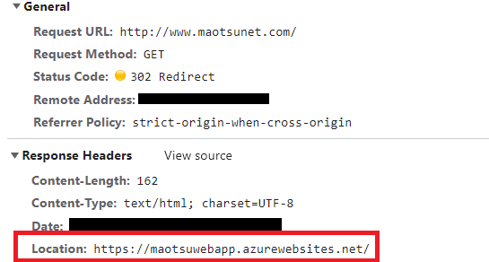
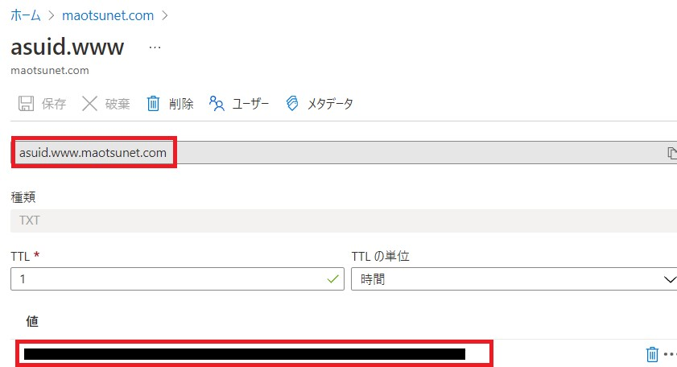
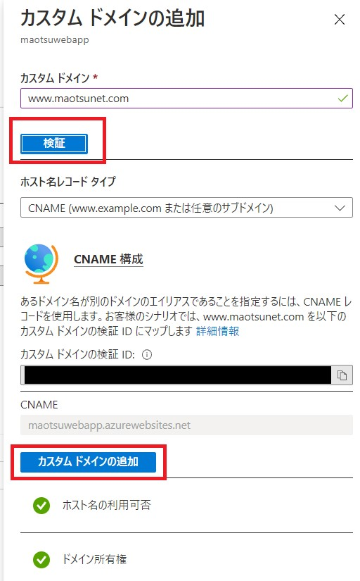
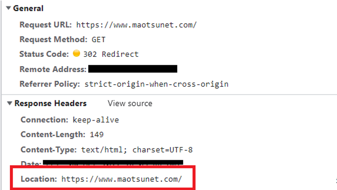
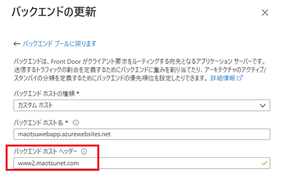

こんにちは、Azure テクニカル サポート チームの大塚です。

この記事では Application Gateway と App Service を組み合わせた時によくお問い合わせをいただくリダイレクトの問題についてご紹介させていただきます。
<!-- more -->
---

### はじめに

Application Gateway のバックエンドにマルチテナントである App Service を指定するシナリオでは、App Service の 既定の FQDN（xxx.azurewebsites.net）をバックエンドに配置し、この FQDN でホスト名の上書きを行うことで実現させることが一般的です。
※詳細は[こちら](https://docs.microsoft.com/ja-jp/azure/application-gateway/configure-web-app-portal)のドキュメントをご参照ください。 

しかしながら Application Gateway のフロント エンドにカスタム ドメインを設定しており、バックエンドに指定した App Service 側でリダイレクトの応答が返されるシナリオでは前述の構成だと意図せず App Service の 既定の FQDN が利用されてしまい期待した動作とならない場合があります。

この場合のトラブルシュートについては[こちら](https://docs.microsoft.com/ja-jp/azure/application-gateway/troubleshoot-app-service-redirection-app-service-url)のドキュメンとに対処方法が記載されております。このブログではこのドキュメントの手順をもう少しかみくだきご紹介いたします。

#### 現在の構成
まず、現在の構成は以下とします。この状態でクライアントから 「www.maotsunet.com」 に接続すると、ブラウザの URL 表示が App Service のFQDN となってしまう事象が発生しています。これをカスタムドメインで表示させることが目的です。

-	カスタム ドメイン 「www.maotsunet.com」 は Application Gateway のパブリック IP アドレスに名前解決されるように構成済み
-	Application Gateway のバックエンド プールには App Service の既定の FQDN 「maotsuwebapp.azurewebsites.net」 を設定し HTTP 設定とカスタム プローブでバックエンドターゲットからホスト名を選択する設定をいれている

## <a href="#application-gateway-issue-check">App Service のリダイレクトの問題に合致しているかどうかの確認</a>

現在発生している問題がリダイレクトの問題かどうか確認しましょう。確認にはブラウザの F12 キーを押し開発者ツールを使用し、Network タブを確認します。※[参考サイトはこちら](https://docs.microsoft.com/ja-jp/azure/azure-portal/capture-browser-trace)

確認してみるとクライアントから 「www.maotsunet.com」 に接続すると、応答ヘッダー内の Location ヘッダーにApp Service の既定の FQDN が入り、リダイレクトの指示がされています。

この場合、App Service のリダイレクトの問題に合致しているので、後述の方法で対処することでリダイレクト構成時にもアドレスバーの FQDN をカスタム ドメインで構成することが可能です。

### リダイレクトの問題の対応方法
このリダイレクトの問題を対処するには次の２ つの方法があります。使い分け分けとしては大まかに以下のように整理できます。

* **Application Gateway の書き換え規則をつかう**  
 Application Gateway V2 SKU を利用の場合で、Location ヘッダーのみの書き換えで対応が可能な場合

* **カスタム ドメインをつかう**
Application Gateway V1 SKU を利用の場合、または V2 SKU を利用しているものの referer ヘッダーや Cookie などにもドメインが含まれていて書き換えでの対応が複雑となる場合

それではそれぞれの対応方法について見てみましょう。

## <a href="#application-gateway-rewrite">Application Gateway の書き換え規則をつかう</a>

Application Gateway V2 から追加された「書き換え規則」を使います。設定内容は下記の通りです。
※書き換え規則の設定方法の詳細については[こちら](https://docs.microsoft.com/ja-jp/azure/application-gateway/rewrite-http-headers-url#modify-a-redirection-url)もご参照ください。

#### 必要な作業
 * 「If（条件）」の一致させるパターン ： `(https?):\/\/.*azurewebsites\.net(.*)$`
 * 「Then（結果）」 のヘッダー値 ：`{http_resp_Location_1}://<カスタム ドメイン名>{http_resp_Location_2}`

## <a href="#application-gateway-custom-domain">カスタム ドメインをつかう</a>

#### 必要な作業
**1. App Service側にもカスタムドメイン「www.maotsunet.com」 を登録する**
**2. Application Gateway 側で HTTP 設定とカスタム プローブの変更する**
**3. 動作の確認**
それぞれの作業内容についてご説明します。

--------------------------------------------------------------------------------

### 1. App Service側にもカスタムドメイン「www.maotsunet.com」 を登録する
App Service はマルチテナント サービスのため、IP アドレスでのリクエストを受け入れることはできません。
そのため、既定の FQDN 以外で接続したい場合は事前にカスタム ドメインの登録を行う必要があります。
App Service にカスタム ドメインを設定する際に、カスタム ドメインの CNAME が既にApplication Gatewayなど WebApps 以外に向いている場合、カスタム ドメインの設定はできません。
このような場合、App Service の「カスタム ドメインの検証 ID」を使用し、asuid という名前の TXT レコードを作成することで回避することが可能です。
例えば、カスタム ドメインにwww.maotsunet.com を登録しようとしている場合 ｍaotsunet.com の DNS ゾーンに以下のレコードを追加します。App Service 側にカスタム ドメインを追加する作業の詳細については[こちら](https://docs.microsoft.com/ja-jp/azure/app-service/app-service-web-tutorial-custom-domain?tabs=cname#3-get-a-domain-verification-id)もご参照ください。

1) App Service のカスタム ドメインの項目から「カスタム ドメイン検証 ID」をコピーします。

2)	「ｍaotsunet.com」 ゾーンを管理しているDNS サーバーに以下のようなレコードを追加します。
- 名前：asuid.<ホスト名>
- 種類：TXT
- 値：コピーしたカスタムドメインの検証 ID

【例】www.maotsunet.com というカスタムドメインで、 maotsuwebapp.azurewebsites.net という App Service のドメインの場合
- 名前：asuid.www
- 種類：TXT
- 値：123456789123456789123456789XXXXXXX

(※) Azure DNS でゾーンの管理している場合は下記のように構成します

これによって、カスタム ドメイン設定時の検証において、awverify のレコードを参照して検証を行うため、元のホスト名の CNAME が Application Gateway など WebApps 以外に向いている状態でカスタム ドメインが設定可能となります。

3）対象の WebApps の設定にてカスタム ドメインの 「検証」 ・ 「カスタム ドメインの追加」 を行います

 (注意)
Application Gateway と App Service 間で HTTPS プロトコルを使用する場合、カスタム ドメインの証明書を App Service 側にも設定する必要がありますのでご留意ください。また、作成した awverify の DNS レコードは WebApps 側のカスタム ドメインの設定後は不要となりますので、削除頂いても問題ございません。

### 2. Application Gateway 側で HTTP 設定とカスタム プローブの変更
次に Application Gateway 側の設定を変更します。

1）	管理ポータルより、正常性プローブを選択し、以下のように変更し保存します
    ※下記以外はそのままの設定で問題ありません

・	ホスト： カスタム ドメイン
・	ホスト名をバックエンド HTTP 設定から選択します：いいえ

2）	HTTP 設定にて 「新しいホスト名でオーバーライドする」 で いいえ にチェックをいれ保存します
※カスタム プローブは １）で変更したものが紐づいている状態となります（ホスト名の箇所でカスタム ドメインを入れても問題ありません）

(注意)
 V2 を利用する場合、この変更により Application Gateway - App Service 間で HTTPS プロトコルを使用する場合にライブトラフィックおよびプローブで利用される証明書はカスタム ドメインの証明書となります。バックエンド側に登録したカスタム ドメイン用の証明書が自己署名証明書など、公的機関から発行されていない場合、Application Gateway の HTTP 設定でルート証明書をアップロードする必要があります。 ※この動作ついては [こちら](https://docs.microsoft.com/ja-jp/azure/application-gateway/ssl-overview#end-to-end-tls-with-the-v2-sku) のドキュメントをご確認ください。

### 3. 動作の確認
設定は以上です。最後に再度意図した動作となっているかどうかご確認します。
再度クライアントから Application Gateway にアクセスした際の F12 のログを確認すると Location ヘッダーの内容がカスタム ドメインとなっていることが確認できます。

## <a href="#faq">FAQ</a>

#### -  すでにApplication Gateway に向けているカスタムドメインと同じものを App Service に登録することは可能ですか
 はい、可能です。App Service 側ではあくまで 「そのカスタムドメインを受け入れる構成にするために登録する」 ことが目的であり、この登録する際に一時的に該当のドメインを所有しているかどうかの検証があるため、ドメインを管理している DNS 側での設定作業が必要となります。この作業が終われば、App Service の設定は DNS から削除しても問題ありません。実際にカスタム ドメインが名前解決した結果得られる IP アドレスは Application Gateway の IP となることが想定です。

#### - Azure Front Door のバックエンドに App Service を構成している場合でも同じ事象がおきますか
 はい、起きる可能性があります。本Blog にてご紹介した App Service のリダイレクトの問題であると判断できた場合、Azure Front Door のバックエンドの構成で「バックエンド ホスト ヘッダー」の箇所にカスタム ドメインを設定することで対応可能です。

## <a href="#reference">参考情報</a>
- [チュートリアル:既存のカスタム DNS 名を Azure App Service にマップする](https://docs.microsoft.com/ja-jp/azure/app-service/app-service-web-tutorial-custom-domain?tabs=cname#map-your-domain)
- [Application Gateway での TLS 終了とエンド ツー エンド TLS の概要](https://docs.microsoft.com/ja-jp/azure/application-gateway/ssl-overview)
