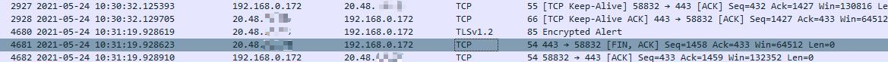
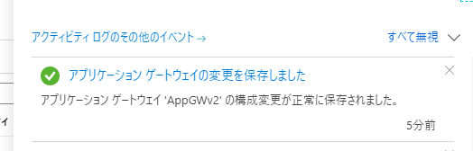

> [!NOTE]
> Application Gateway v1 は 2026 年 4 月 28 日をもって廃止となりました。 このため本記事では Application Gateway v2 に対する設定変更の影響についてのみ説明します。 2026 年 6 月現在、本記事は Application Gateway v2 / WAF v2 を対象としています。  

こんにちは、Azure テクニカル サポート チームの杜です。

本記事では Application Gateway に対して設定変更を行う際の既存接続 (TCP コネクション) への影響についてご紹介します。

## Application Gateway SKU Standard_v2 & WAF_v2
### 設定変更の影響

基本的には任意の設定変更がすべての既存接続に影響を与えます。 
たとえ既存の通信に関連しない新規設定を追加する場合であっても、既存の通信を処理しているすべてのリスナーとの TCP 接続が切断される動作となります。

例えば、１つの Application Gateway に以下の設定が入っている場合は、
* リスナー A → 要求ルーティング規則 A → HTTP 設定 A → バックエンド プール A, カスタム正常性プローブ A
* リスナー B → 要求ルーティング規則 B → HTTP 設定 B → バックエンド プール B, カスタム正常性プローブ B

設定 A 又は B の任意のコンポーネントに対する設定変更、もしくは新規の HTTP 設定やバックエンド プールを追加しますと、リスナー A 及び B への既存接続が切断されます。

### 影響がある場合の動作
任意の設定変更を行った場合に、Application Gateway から クライアントに対して **TCP FIN** を送信する動作になっていることを確認しています。

例えば、リスナー A が使用している証明書を更新した際のパケット キャプチャを確認すると、以下の TCP シーケンスとなっています。

クライアント IP アドレス: 192.168.0.172 
Application Gateway パブリック IP アドレス: 20.48.x.x

> パケット レベルの詳細動作については現時点では公開ドキュメントに記載されておらず、将来にわたって保証される動作ではございませんので、予めご了承ください。

## よくある質問
## TCP コネクションが切断されるとのことですが、実際にクライアントに対してどのような影響がありますか？
クライアントの接続設定と挙動により一概にご案内できませんが、例えば Edge / Chrome などのブラウザーでは再接続などによって基本的には瞬断以外の影響はないと考えられます。 
しかしながら、いかなる瞬断も許容されないような環境の場合、メンテナンス時間を設けて Application Gateway の設定変更を実施いただきますようお願いいたします。

### 設定変更を行ってから既存接続が切断されるまでどれくらいの時間がかかりますか？
Azure 基盤側の処理状況に依存するため一概にご案内することはできませんが、数十秒から数分程度要する事例が多く見られます。
Azure ポータルから設定変更した場合は、下記のような設定変更の通知が出た後、数十秒後に接続済みの TCP コネクションが Application Gateway 側よりクローズされる動作を確認しています。

### Application Gateway v2 が Key Vault と連携している場合では、Key Vault 側で証明書を更新した際にも同じように瞬断などの影響を受けますか？
はい、影響を受けます。 
以下の公開ドキュメントに記載されているとおり、Key Vault と連携した場合は証明書の更新が検出されると Application Gateway に自動的に反映する動作となります。
- [Key Vault 証明書を用いた TLS 終端](https://learn.microsoft.com/ja-jp/azure/application-gateway/key-vault-certs)

>インスタンスによって 4 時間ごとに Key Vault がポーリングされ、証明書の更新バージョン (存在する場合) が取得されます。 更新された証明書が検出されると、HTTPS リスナーに関連付けられている TLS/SSL 証明書が自動的にローテーションされます。

このときに手動で証明書を更新した場合と同様な影響を受けることを確認しています。
そのため、既存接続に影響するタイミングをコントロールされたい場合は、証明書は手動更新にしていただくようお願いいたします。

以上、ご参考になれば幸いです。