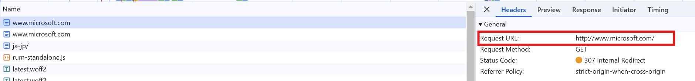
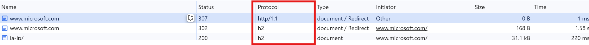

いつもお世話になっております。Azure Networking チームの庄です。
Application Gateway V1 のリタイアが 2026 年 4 月 28 日であると発表されてから暫く経ち、V1 をご利用のお客様の中で V2 への移行計画を進められているご状況かと思います。

※ V1 のリタイアについて詳しくは[こちら](https://learn.microsoft.com/ja-jp/azure/application-gateway/v1-retirement)

今回のブログでは Application Gateway V1 と V2 で HTTP/2 を取り扱う際の動作の違いについてご紹介します。皆様のご参考になりましたら幸いです。

# HTTP/2 とは
HTTP/2（Hypertext Transfer Protocol version 2）は、ウェブ ページのデータをウェブ サーバーから取得するための新しい通信方法です。
HTTP/1.1 の後継として、2015 年に正式な仕様として承認されました。HTTP/2 には、「h2」と「h2c」の二つの識別子があります。HTTP/2 の接続が確立される際にトランスポート層セキュリティ（TLS) が利用されたかどうかによって、HTTP/2 通信には「h2」または「h2c」識別子が表示されます。つまり、HTTP/2 の識別子を通じて、HTTP/2 通信が暗号化されているかどうかを判断することができます。

・識別子が "h2" となっている場合、それは HTTP/2 通信が TLS を使用するプロトコルであることを示しています。

・識別子が "h2c" となっている場合、HTTP/2 通信が TLS を使用しません。この際、クライアントは HTTP/2 通信に "Upgrade" ヘッダーと "HTTP2-Settings" ヘッダーを送信します。"Upgrade" ヘッダーの値は「h2c」が設定され、"HTTP2-Settings" ヘッダーの値はトークン（例: AAMAAABkAAQCAAAAAAIAAAAA）が設定されます。

[HTTP/2 の関連記事 (英語)](https://datatracker.ietf.org/doc/html/rfc9113#section-3.1)

> The "h2c" string was previously used as a token for use in the HTTP Upgrade mechanism's Upgrade header field. This usage was never widely deployed and is deprecated by this document. The same applies to the HTTP2-Settings header field, which was used with the upgrade to "h2c".


現在、Edge や Chrome など現在主要なブラウザーでは、HTTP/2 over TLS (h2) のみが HTTP/2 として使用できます。
 

例えば、www.microsoft.com のサイトは HTTP/2 に対応していますが、 www.microsoft.com に HTTPS ではなく HTTP で接続する場合、
ブラウザーが HTTP/2 over TCP (h2c) をサポートしていないため、HTTP/2 は使用されず、HTTP/1.1 で接続を確立します。
(以下のスクリーンショットの例ではその後 HTTPS の URL にリダイレクトされ、HTTP/2 over TLS (h2)で接続しています。)

 
 

なお、ブラウザからのアクセスではなく、curl コマンドなどの他の HTTP クライアントから HTTP リクエストを送信する際には、HTTP/2 over TCP (h2c) を利用して HTTP/2 通信が行われる可能性があります。この状況では、Application Gateway が接続先となる際に、v1 と v2 で動作が異なります。v1 の場合、HTTP/2 通信はダウングレードされて、v2 の場合は HTTP ステータスコード 403 が応答されます。詳細の動作つきましては、以下のセクションをご参照ください。

# Application Gateway のサポートに
Application Gateway はリバース プロキシとして動作するため、フロントエンド接続（クライアント - Application Gateway）とバックエンド接続（Application Gateway - バックエンド サーバー）の二つの接続が発生します。現在、バックエンド接続における HTTP/2 はサポートされておりません。

フロントエンド接続における HTTP/2 のサポート状況については、リスナーで利用しているプロトコルによって異なります。詳細は以下のテーブルをご参照いただけますと幸いです。

|リスナーのプロトコル | サポート状況 |
| ------------ | ------------ |
| HTTPS | サポート |
| HTTP  | 非サポート | 

一般的なシナリオとして、HTTP/2 over TLS (h2) が使用されるため、Application Gateway でも HTTP/2 over TLS (h2) のみを考慮しています。そのため、Application Gateway では、HTTPS リスナーでのみ HTTP/2 をサポートしています。v1、v2 ともに HTTP リスナーでは HTTP/2 の通信をサポートしていませんが、HTTP リスナーに対して実際にクライアントから HTTP/2 通信を送信する際には、SKU によって動作が異なります。以下にそれぞれの SKU の動作について紹介します。


### v1 の動作
v1 の HTTP リスナーに HTTP/2 を用いて送信すると、通信がダウングレードされ、Application Gateway は HTTP/1.1 でレスポンスを送信します。

v1 の HTTP リスナーに HTTP/2 リクエストを curl コマンドで送信した結果
```
root:/# curl -v http://<v1 Appgw の IP> --http2
*   Trying xxxxxx:80...
* Connected to xxxx port 80 (#0)
> GET / HTTP/1.1
> Host: xxxxxx
> User-Agent: curl/7.81.0
> Accept: */*
> Connection: Upgrade, HTTP2-Settings
> Upgrade: h2c
> HTTP2-Settings: AAMAAABkAAQCAAAAAAIAAAAA
>
* Mark bundle as not supporting multiuse
< HTTP/1.1 200 OK
< Date: Wed, 25 Dec 2024 09:09:10 GMT
< Content-Type: text/html
< Content-Length: 7
< Connection: keep-alive
< Server: Microsoft-IIS/10.0

```
### v2 の動作
v2 の場合は、HTTP リスナーに HTTP/2 を送信すると、Application Gateway はクライアントに 403 を応答します。

v2 の HTTP リスナーに HTTP/2 リクエストを curl コマンドで送信した結果
```
root: curl --http2 -v -k http://<v2 Appgw の IP>
*   Trying xxxx:80...
* Connected to xxxx (xxxx) port 80 (#0)
> GET / HTTP/1.1
> Host: xxxx
> User-Agent: curl/7.81.0
> Accept: */*
> Connection: Upgrade, HTTP2-Settings
> Upgrade: h2c
> HTTP2-Settings: AAMAAABkAAQCAAAAAAIAAAAA
>
* Mark bundle as not supporting multiuse
< HTTP/1.1 403 Forbidden
< Server: Microsoft-Azure-Application-Gateway/v2
< Date: Wed, 25 Dec 2024 08:51:52 GMT
< Content-Type: text/html
< Content-Length: 179
< Connection: keep-alive
<
<html>
<head><title>403 Forbidden</title></head>
<body>
<center><h1>403 Forbidden</h1></center>
<hr><center>Microsoft-Azure-Application-Gateway/v2</center>
</body>
</html>
* Connection #0 to host xxxx left intact

```

上記の HTTP リスナーに HTTP/2 を送信した通信結果を、Application Gateway で設定可能な診断ログの 1 つであるアクセス ログから対象の通信結果を確認すると、「httpStatus」のプロパティには 403 が記載され、「serverStatus」のプロパティには 403 以外の別のステータスコードが記載されます。こちらは想定されているログの記録結果です。

また、このブロックは Application Gateway V2 自体のコード レベルでの動作であり、WAF を利用していない場合でも同様に HTTP 403 を返す動作となります。つまり、Application Gateway v2 は WAF の利用の有無にかかわらず HTTP リスナーで受け取った HTTP/2 通信をブロックすることが想定された動作となります。
  
  


