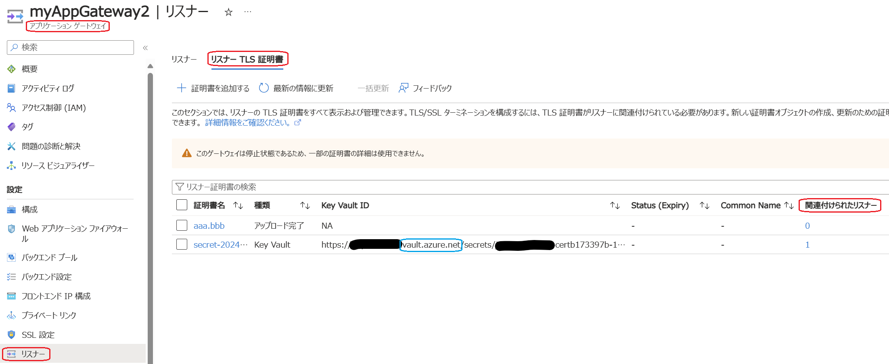
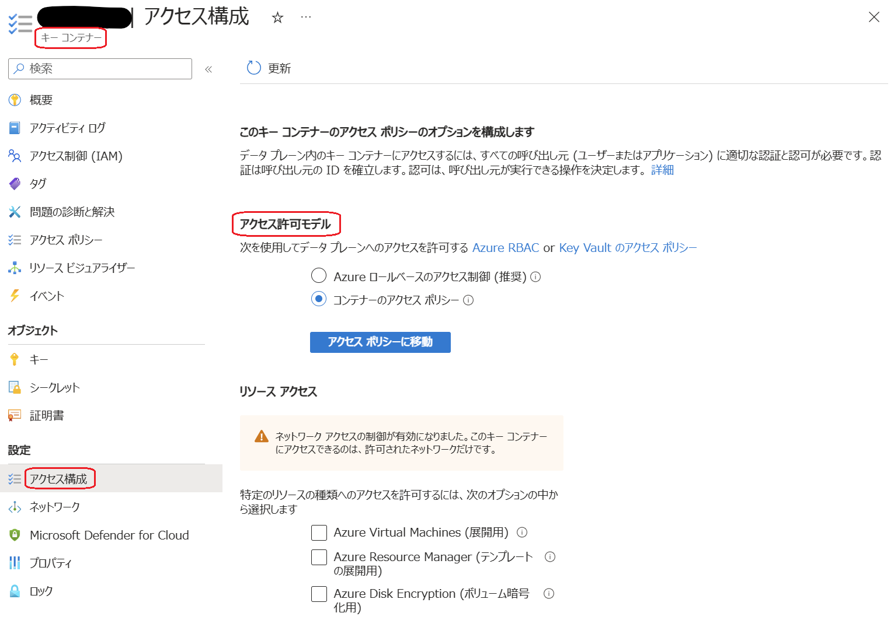
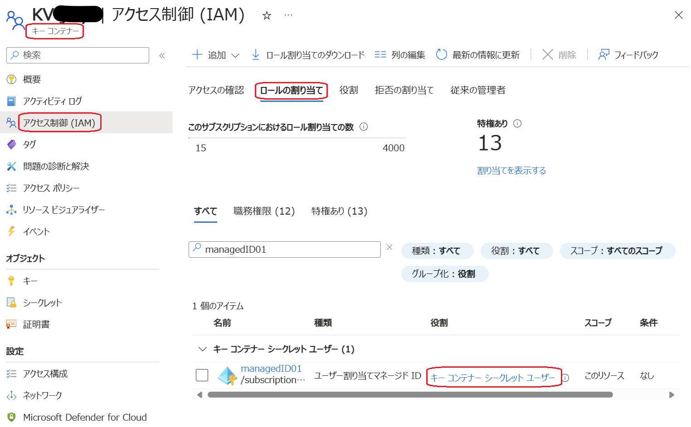
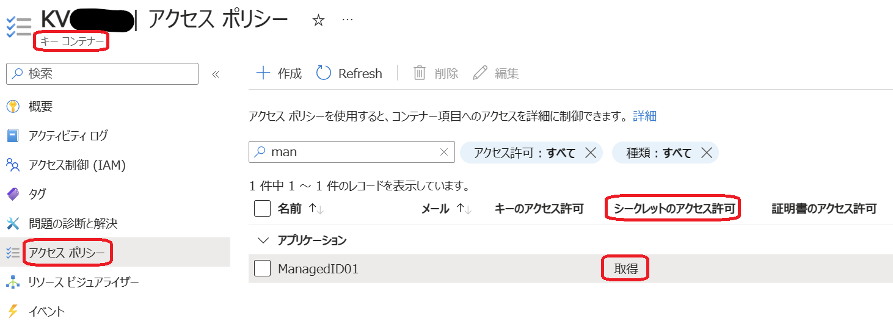
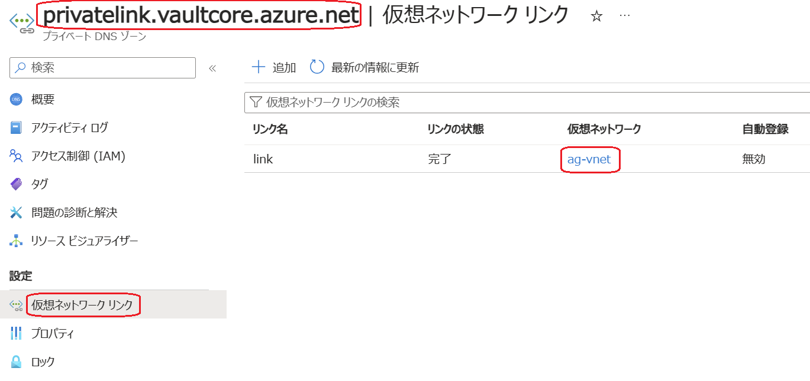
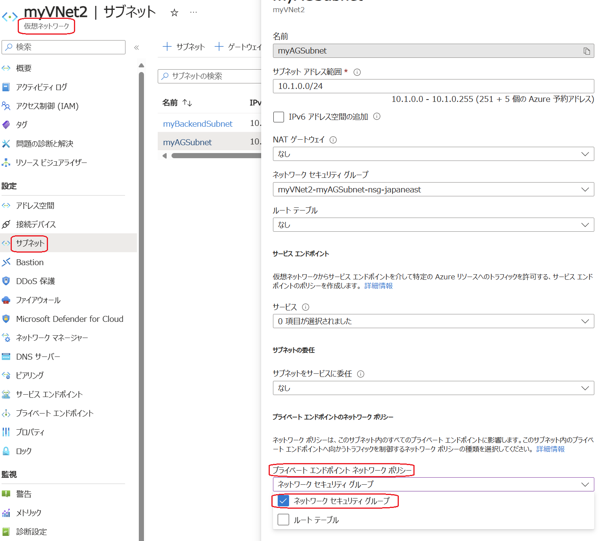

こんにちは、Azure テクニカル サポート チームの金です。
Application Gateway v2 (Standard/WAF) の TLS 終端は、リスナーに直接証明書をアップロードする、またはリスナーにて Key Vault 証明書/シークレットを参照することで実現できます。
リスナーにて Key Vault 証明書/シークレットを参照する構成では、Application Gateway から 4 時間毎に Key Vault に対して証明書/シークレットをポーリングします。Application Gateway を更新するタイミングでも、Key Vault に対して証明書/シークレットをポーリングします。

この記事では、リスナーにて Key Vault 証明書/シークレットを参照する構成で、Application Gateway に HTTPS でアクセスした際に、「ERR_SSL_UNRECOGNIZED_NAME_ALERT」といった証明書エラーが発生する、もしくは Application Gateway の停止・起動や変更が正常に完了せず、Application Gateway のプロビジョニング状態が失敗になった場合に、確認すべき設定をご紹介します。リスナーにて Key Vault 証明書/シークレットを参照する設定を行う際にも該当します。

> [!TIP]
> Application Gateway から Key Vault 証明書/シークレットを取得する際は、マネージド ID を使用しており、Key Vault 側では、ロールベースのアクセス制御、またはアクセス ポリシーで、当該マネージド ID に対して適切なアクセス権限を付与する必要があります。
> Application Gateway と Key Vault 統合の詳細については、[公式ドキュメント](https://learn.microsoft.com/ja-jp/azure/application-gateway/key-vault-certs)をご参照ください。

Application Gateway のリスナーを削除した際に、適応済みの証明書/シークレットはそのまま残ります。下記の各チェック項目は Application Gateway の構成に含まれるすべての証明書/シークレットが該当します。
Application Gateway の証明書/シークレット一覧は、以下のように Application Gateway の [リスナー] → [リスナー TLS 証明書] からご確認頂けます。[関連付けられたリスナー] が「０」となっているのは、現在どのリスナーにも関連付けられていないことを示します。


※ [Key Vault ID] に「vault.azure.net」のドメインの URL が表示されている場合は、Key Vault 証明書/シークレットであることを示し、それ以外は直接リスナーにアップロードした証明書を示します。下記のチェック項目は Key Vault 証明書/シークレットにのみ適用されます。

### Key Vault 自体、Key Vault 証明書/シークレットの存在有無
##### Key Vault 自体
Application Gateway のリスナーで参照される Key Vault 自体が削除された場合は、Key Vault を復元する、もしくは [Key Vault を新規作成](https://learn.microsoft.com/ja-jp/azure/key-vault/general/quick-create-portal)する必要があります。
もし Key Vault を新規作成する際に、下記のようなエラーが出力される場合は、エラーの文言通りに同名の Key Vault を作成することはできないため、Key Vault を復元する必要があります。

> Certificate test-cert is currently in a deleted but recoverable state, and its name cannot be reused; in this state, the certificate can only be recovered or purged.

##### Key Vault 証明書/シークレット
Key Vault 証明書/シークレットが削除された場合は、Key Vault 証明書/シークレットを復元する、もしくは Key Vault 証明書/シークレットを[新規作成](https://learn.microsoft.com/ja-jp/azure/key-vault/certificates/create-certificate)/[インポート](https://learn.microsoft.com/ja-jp/azure/key-vault/certificates/tutorial-import-certificate?tabs=azure-portal)する必要があります。

Key Vault 自体、Key Vault 証明書/シークレットの削除や復元する方法に関しては、[公式ドキュメント](https://learn.microsoft.com/ja-jp/azure/key-vault/general/key-vault-recovery?tabs=azure-portal)をご参照ください。

### マネージド ID の存在有無
一度 Application Gateway にマネージド ID を関連付けたら、当該関連付けは Application Gateway の構成から削除しない限り、マネージド ID 自体の削除、もしくはリスナーや関連の証明書を削除することで削除されることはありません。
Application Gateway に関連付けられているマネージド ID は、以下の PowerShell コマンドでご確認頂けます。

```
$appgw = Get-AzApplicationGateway -Name “Application Gateway 名” -ResourceGroupName “Application Gateway のリソース グループ名”
$appgw.IdentityText
```

Application Gateway にマネージド ID を関連付けた状態で、マネージド ID 自体が削除された場合は、リスナーにおける証明書関連の設定更新のみならず、Application Gateway 停止・起動や変更が正常に完了せず、Application Gateway のプロビジョニング状態が失敗になります。その際は、以下のようなエラーが出力されます。

> Response: '{"error":{"code":"BadRequest","message":"Resource '/subscriptions/サブスクリプション ID/resourcegroups/リソース グループ名/providers/Microsoft.ManagedIdentity/userAssignedIdentities/マネージド ID' was not found."}}'.' で失敗しました。

解決方法：
① 上記エラーに示したリソース グループに同名の[マネージド ID を作成](https://learn.microsoft.com/ja-jp/entra/identity/managed-identities-azure-resources/how-manage-user-assigned-managed-identities?pivots=identity-mi-methods-azp#create-a-user-assigned-managed-identity)し、Key Vault 側で当該マネージド ID に対して適切なアクセス権限を付与します。
② Key Vault 証明書/シークレットの参照で使用されないマネージド ID は、以下の PowerShell コマンドで Application Gateway の構成から当該マネージド ID の関連付けを削除します。

```
$appgw = Get-AzApplicationGateway -Name “Application Gateway 名” -ResourceGroupName “Application Gateway のリソース グループ名”
$appgw = Remove-AzApplicationGatewayIdentity -ApplicationGateway $appgw
$updatedgateway = Set-AzApplicationGateway -ApplicationGateway $appgw
```

### Key Vault におけるマネージド ID のアクセス権限の確認
Key Vault のアクセス制御方式は、Azure ロールベースのアクセス制御とコンテナーのアクセス ポリシーの二つの方式がございます。
現在適用されている制御方式は、下記のように Key Vault の [アクセス構成] → [アクセス許可モデル] からご確認頂けます。



##### ロールベースのアクセス制御
ロールベースのアクセス制御を利用している場合は、Key Vault の [アクセス制御 (IAM)] で対象のマネージド ID に「キー コンテナー シークレット ユーザー」ロールを付与する必要があります。ロールを割り当てる方法に関しては、[公式ドキュメント](https://learn.microsoft.com/ja-jp/azure/role-based-access-control/role-assignments-portal?tabs=delegate-condition)をご参照ください。




##### アクセス ポリシー
アクセス ポリシーを利用している場合は、Key Vault の [アクセス ポリシー] で対象のマネージド ID に [シークレットのアクセス許可] の [取得] 権限を付与する必要があります。



### 補足
Key Vault 統合で設定不備があった場合は、Azure Advisor より Key Vault エラーが出力される場合もありますので、エラー コードと解決策については、[公式ドキュメント](https://learn.microsoft.com/ja-jp/azure/application-gateway/application-gateway-key-vault-common-errors)をご参照ください。

### プライベート エンドポイントを介して Key Vault にアクセスする場合
Application Gateway からプライベート エンドポイントを介して Key Vault にアクセスする場合は、以下の設定も必要となります。
- プライベート DNS ゾーン (privatelink.vaultcore.azure.net) にプライベート エンドポイントの DNS レコードが登録されている
- プライベート DNS ゾーン (privatelink.vaultcore.azure.net) に Application Gateway の VNet がリンクされている



- プライベート エンドポイントが所属するサブネットに NSG を構成 (必須の構成ではない) しており、下記のように、当該サブネットの [プライベート エンドポイント ネットワーク ポリシー] の [ネットワーク セキュリティ グループ] が有効になっている場合は、NSG の受信規則で Application Gateway のサブネットからの通信を許可する



### その他の注意点
- AppService 証明書を Key Vault に格納して使用する場合は、AppService 証明書のドメイン検証が終わってから、Application Gateway のリスナー側で指定してください。そうでない場合、Key Vault 側で証明書参照の準備ができていないため、Application Gateway のプロビジョニング状態が失敗になる可能性があります。
- Application Gateway のリスナーを削除した際に、適応済みに証明書/シークレットはそのまま残りますので、不要な証明書は削除することをお勧めします。Azure ポータルより対象の Application Gateway を開き、[リソース] → [リスナー TLS 証明書] 一覧から、対象の証明書を削除できます。
- Application Gateway に複数のリスナーがある場合、リスナー毎に異なるマネージド ID を指定せず、Application Gateway 単位で同一マネージド ID をご利用ください。

### お願い
上記の設定内容に不備がない場合、Application Gateway の観点でお問い合わせいただければと存じますが、その場合は、以下の三つのコマンドを実行し、実行したコマンドとその結果をお問い合わせ時に添付いただけるとスムーズかと存じます。

```
Get-AzKeyVault -VaultName <KeyVault 名>
Get-AzKeyVaultSecret -VaultName <KeyVault 名>
Get-AzKeyVaultSecret -VaultName <KeyVault 名> -Name
```
---