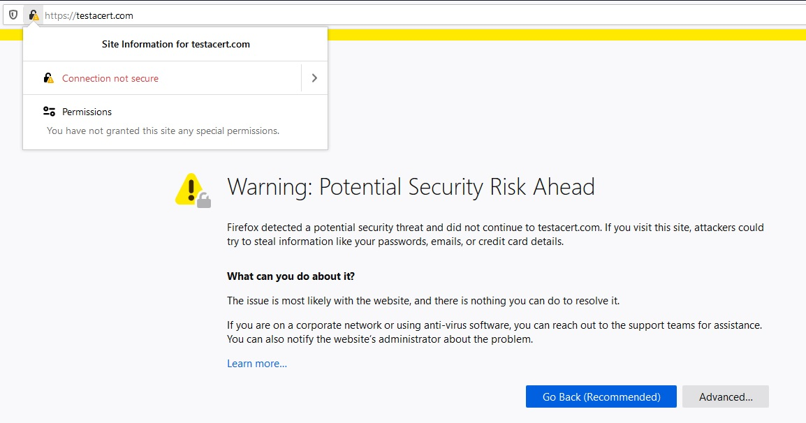
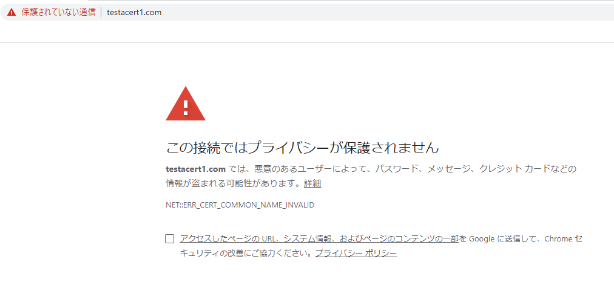
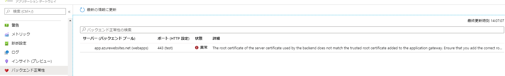
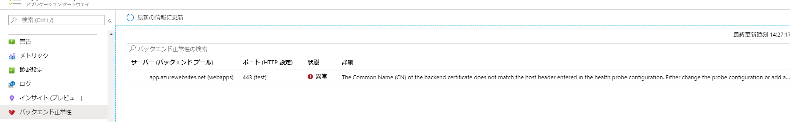

こんにちは、Azure サポートチーム檜山です。

今回は Application Gateway の証明書まわりについてよくお問い合わせをいただくものをご紹介させていただきます。

---
Application Gateway をご利用時に証明書が関連する設定としては、リスナーと HTTP 設定があります。
リスナーはクライアントからのアクセスを受け付ける部分で、HTTP 設定はバックエンドの Web サーバーへ接続するための定義を行う部分となります。Application Gateway の設定や構成例については以下もご参照ください。

- [Application Gateway の構成について](https://jpaztech1.z11.web.core.windows.net/ApplicationGateway%E3%81%AE%E6%A7%8B%E6%88%90%E3%81%AB%E3%81%A4%E3%81%84%E3%81%A6.html)

Application Gateway にて End to End の TLS (クライアントからバックエンドまですべて HTTPS による通信) を構成する場合、リスナーとバックエンドの Web サーバーにて証明書を構成する必要があります (HTTP 設定も構成により証明書の設定が必要)。
 
End to End の TLS にはせずに、クライアントと Application Gateway の間だけを TLS 化する場合は、バックエンドのサーバーや HTTP 設定に対する証明書の設定は必要ありません。Application Gateway に証明書を設定したり、証明書の更新などを行う場合、どちらの証明書が必要か、どの証明書の更新が必要かなどを区別して考える必要があります。

<span id="application-gateway-error"></span>
## <a href="#application-gateway-error" style="color:#f60;">Application Gateway へアクセスした際の証明書エラー</a>
FQDN を使用して Application Gateway のフロントエンド IP アドレスにアクセスした際に証明書のエラーが出る場合、リスナーの証明書に問題がある可能性があります。ブラウザ/ OS により動作が変わる場合があるので、念のため、複数のブラウザ/ OS にてご確認いただくことをお勧めいたします。

#### 出力例

Windows の Firefox ブラウザ


Windows の Chrome ブラウザ


Linux の curl コマンド

```
curl https://xxxxx.com
curl: (60) SSL certificate problem: unable to get local issuer certificate
More details here: https://curl.haxx.se/docs/sslcerts.html

curl failed to verify the legitimacy of the server and therefore could not
establish a secure connection to it. To learn more about this situation and
how to fix it, please visit the web page mentioned above.
```

念のため、以下の点についてもご確認ください。

*  証明書の CN (Common Name) と URL で指定した FQDN があってない
*  証明書の有効期限が切れている
*  自己証明書を使用しており、ルート証明書とのチェーンの検証で失敗している
*  リスナーに登録した証明書に中間証明書が含まれていない

4 点目の中間証明書についてですが、現状の動作として Application Gateway V2 ではリスナーに登録した証明書に中間証明書が含まれていない場合、証明書の検証に失敗し、エラーになることがあることを確認しております。(クライアントやブラウザによって動作が異なりますが、特に Linux 系のクライアントにて失敗することを確認済)
そのため、Application Gateway のリスナーに登録する PFX 形式の証明書は中間証明書を含む形で構成いただく必要がございます。

Edge や Chrome ブラウザの場合、クライアント側で中間証明書を補完するため、中間証明書に起因する問題が発生しているかがわからないことがあります。その場合、下記に記載の openssl コマンドにて証明書の状態を確認することが可能ですので、念のためご確認いただくことをお勧めいたします。

<span id="probe-error"></span>
## <a href="#probe-error" style="color:#f60;">正常性プローブのエラー</a>
Application Gateway V2 のバックエンドプールにて証明書が正しく構成されていない場合、バックエンド正常性の画面に以下のエラーが出ることがあります。




```
The root certificate of the server certificate used by the backend does not match the trusted root certificate added to the application gateway.
Ensure that you add the correct root certificate to whitelist the backend
(バックエンドによって使用されるサーバー証明書のルート証明書が、アプリケーション ゲートウェイに追加されている信頼されたルート証明書と一致しません。バックエンドをホワイトリストに登録するために適切なルート証明書を追加していることを確認してください。)
```

以下は SNI が不一致している場合の例。



```
The Common Name (CN) of the backend certificate does not match the host header of the probe. 
(バックエンド証明書の共通名 (CN) が probe のホスト ヘッダーと一致しません。)
```

原因としては以下が考えられます。
*  証明書の CN (Common Name) と 正常性プローブの SNI が一致していない
*  証明書の有効期限が切れている
*  自己証明書を使用しており、ルート証明書とのチェーンの検証で失敗している
*  証明書に中間証明書が含まれていない

バックエンド側にバインドされている証明書の構成が正しいかどうかについても、下記に記載の openssl コマンドにて証明書の状態を確認することが可能ですので、念のためご確認いただくことをお勧めいたします。


<span id="openssl-command"></span>
## <a href="#openssl-command" style="color:#f60;">openssl コマンドによる確認方法</a>

openssl はオープンソースのソフトウェアで Linux 系の OS で利用することができます。
Winodwos OS (Windows 10) の場合でも Windows Subsystem for Linux (WSL) を導入することで利用可能となります。

以下のコマンドを実行し、実行結果を CN が正しいか、エラーが表示されていないかを等を確認します。
```
[Application Gateway への接続確認]
openssl s_client -connect <Application Gateway の IP アドレス>:443 -servername <FQDN> -showcerts

[バックエンドへの接続確認]
openssl s_client -connect <バックエンドの IP アドレス>:443 -servername <FQDN> -showcerts

※バックエンドが内部 IP の場合は同一 VNET 上の VM からコマンドの実施を行ってください。
```

以下の例の赤字部分のようなエラーが表示された場合、使用している証明書に中間証明書が含まれていない可能性がありますので、証明書の構成をご確認ください。


例 )
openssl s_client -connect 52.224.201.173:443 -servername azurecerttest.testacert.com -showcerts

CONNECTED(00000003)

depth=0 OU = Domain Control Validated, CN = azurecerttest.testacert.com

<span style="color: red">verify error:num=20:unable to get local issuer certificate</span>

verify return:1

depth=0 OU = Domain Control Validated, CN = azurecerttest.testacert.com

<span style="color: red">verify error:num=21:unable to verify the first certificate</span>

verify return:1

～省略～

Timeout   : 7200 (sec)

<span style="color: red">Verify return code: 21 (unable to verify the first certificate)</span>

<span id="intermediate-cert"></span>
## <a href="#intermediate-cert" style="color:#f60;">中間証明書の構成方法</a>

AppService 証明書を Powershell で Export した場合は中間証明書が含まれていない構成となり、別途、中間証明書を含む形で構成する必要があります。

AppService 証明書を Azure Portal, Azure CLI でエクスポートした場合、中間証明書は含まれた状態となりますので問題ありませんが、証明書のパスワードを明示的に設定する必要があります。その場合も以下の手順を実施することでパスワードを設定できますのでご利用ください。

- [App Service 証明書を管理する (証明書をエクスポートします。)](https://docs.microsoft.com/ja-jp/azure/app-service/configure-ssl-certificate#export-certificate)

他の証明書においても PFX 形式の証明書に中間証明書が含まれていない場合、Windows 端末にて以下の手順を実施することで中間証明書を含む形で PFX 形式の証明書を構成可能ですので、お試しください。

※ 以下は Windows 10 の手順ですので、OS によっては少し手順が異なる場合がございます。

【証明書のインポート & エクスポート】

1. Azure ポータルから Export した証明書 (PFX) を Windows 端末の任意の場所に配置します。
2. 証明書をダブルクリックし、”現在のユーザー” を選択し、”次へ” をクリックします。 
3. インポートするファイルが選択されていることを確認し、”次へ” をクリックします。
4. 証明書の“パスワード” を入力し、”このキーをエクスポート可能にする” にチェックをいれ “次へ” をクリックします。
※証明書の ”パスワード” が空の場合は ”パスワード” を空にしたまま、”次へ” をクリックします。
 
5. “証明書の種類に基づいて、自動的に証明書ストアを選択する” を選択し、”次へ” をクリックします。
6. “完了” をクリックします。
7. Windows 端末の左下の Windows マークをクリックし、”certmgr.msc” と入力し、Enter キーを押します。
8. “個人” > “証明書” をクリックし、Import した証明書を右クリックし、”すべてのタスク” > “エクスポート” をクリックします。
9.  最初の画面で “次へ” をクリックします。
10. 秘密キーのエクスポート画面で “はい、秘密キーをエクスポートします” を選択肢、”次へ” をクリックします。
11. “証明のパスにある証明書を可能であればすべて含む” にチェックが入っていることを確認し、”次へ” をクリックします。
12. 証明書の “パスワード” を設定して、”暗号化” が ”TripleDES-SHA1” であることを確認し、”次へ” をクリックします。
13. 配置場所を選択して、証明書のファイル名を入力し、”次へ” をクリックします。
14. “完了” をクリックします。

<span id="faq"></span>
## <a href="#faq" style="color:#f60;">FAQ</a>
	
#### - リスナーに設定した証明書の更新時に切断は発生しますか？

現時点で確認できている動作として V1, V2 共に証明書の更新時に数秒程度の切断が発生することを確認できております。そのため、少しの切断も許容されない環境である場合は、メンテナンス期間等の影響が少ないタイミングで更新いただくことをご検討ください。

#### - PFX 証明書の中身を確認する方法はありますか？

以下のコマンドを実施することで証明書の構成を確認することができます。

【Windows】

コマンドプロンプトで以下を実施します。

```
certutil -dump "ファイルのパス/xxxxx.pfx"
```

【Linux】
```
openssl pkcs12 -info -in <ファイルのパス/xxxxx.pfx>
```
	
#### - 利用可能な証明書の一覧はありますか？

公開情報として利用可能な証明書の情報はありません。
公開情報の要件を満たす証明書であれば利用可能です。

- [TLS 終了でサポートされる証明書](https://docs.microsoft.com/ja-jp/azure/application-gateway/ssl-overview#certificates-supported-for-tls-termination)
- [Application Gateway の制限](https://docs.microsoft.com/ja-jp/azure/azure-resource-manager/management/azure-subscription-service-limits#application-gateway-limits)

#### - ポータルから証明書を削除する方法はありますか？

現状、ポータルから証明書を削除する方法は提供されておりません。以下の Powershell or Azure CLI のコマンドにて削除可能ですので、ご確認ください。使用中の証明書は削除できませんので、証明書が利用されていないことを事前にご確認ください。
また、HTTP 設定用の証明書削除手順は V1, V2 SKU でコマンドが異なりますので、ご留意ください。

* 証明書削除 (リスナー用)

```
【Powershell】
1. Application Gateway の情報を取得します。
$appgw = Get-AzApplicationGateway -Name "アプリケーション ゲートウェイ名" -ResourceGroupName "リソース グループ名"
 
2. 削除したい SSL サーバー証明書の名前を指定します。
Remove-AzApplicationGatewaySslCertificate -ApplicationGateway $appgw -Name "証明書名"
 
3. Application Gateway に設定を反映します。
Set-AzApplicationGateway -ApplicationGateway $appgw
```

```
【Azure CLI】
az network application-gateway ssl-cert delete -g <リソースグループ名> --gateway-name <Application Gateway 名> -n <証明書名>
```

* 証明書削除 (HTTP 設定用 [V1 のバックエンド認証用証明書])

```
【Powershell】
1. 対象の Application Gateway を取得します。
$appgw = Get-AzApplicationGateway -Name "Application Gateway 名" -ResourceGroupName "ResourceGroup 名"
 
2. 既存のサーバ証明書を削除します。※現在登録されている証明書名を指定します。
Remove-AzApplicationGatewayAuthenticationCertificate -ApplicationGateway $appgw -Name "証明書名"

3. Application Gateway に設定を反映します
Set-AzApplicationGateway -ApplicationGateway $appgw
```
```
【Azure CLI】
az network application-gateway auth-cert delete -g <リソースグループ名> --gateway-name <Application Gateway 名> -n <証明書名>
```

* 証明書削除 (HTTP 設定用 [V2 のルート証明書])

```
【Powershell】
1. 対象の Application Gateway を取得します。
$appgw = Get-AzApplicationGateway -Name "Application Gateway 名" -ResourceGroupName "ResourceGroup 名"

2. 既存のルート証明書を削除します。※現在登録されている証明書名を指定します。
Remove-AzApplicationGatewayTrustedRootCertificate -ApplicationGateway $appgw -Name "証明書名"

3. Application Gateway に設定を反映します
Set-AzApplicationGateway -ApplicationGateway $appgw
```
```
【Azure CLI】
az network application-gateway root-cert delete -g <リソースグループ名> --gateway-name <Application Gateway 名> -n <証明書名>
```
<span id="reference"></span>
## <a href="#reference" style="color:#f60;">参考情報</a>

Application Gateway のトラブルシューティングについては以下にも情報がございますので、ご参照ください。

- [Application Gateway での無効なゲートウェイによるエラーのトラブルシューティング](./application-gateway-troubleshooting-502)
- [Application Gateway のバックエンドの正常性に関する問題のトラブルシューティング](https://docs.microsoft.com/ja-jp/azure/application-gateway/application-gateway-backend-health-troubleshooting)

証明書の要件については以下にも記載がありますので、ご参照ください。

- [Application Gateway での TLS 終了とエンド ツー エンド TLS の概要](https://docs.microsoft.com/ja-jp/azure/application-gateway/ssl-overview)
