こんにちは、Azure テクニカル サポート チームの大塚です。

この記事では、先日新たに追加された Application Gateway WAF ポリシーのマネージド ルールにおいて CRS （コア ルール セット）3.2 以上を利用している際に要求本文(＝Request Body)のサイズ、ファイル アップロードのサイズ、および要求本文の検査をより細かく制御できる機能についてご紹介します。
<!-- more -->
---

### はじめに
この記事で以下の 3 つのシナリオにすべてあてはまるお客様向けの内容となります。

・Application Gateway WAF V2 の SKU を利用している
・WAF ポリシーを利用している
・WAF ポリシーのマネージド ルールで指定している CRS が 3.2 以上である

WAF によってチェックされる要求サイズへの制限につきましては[こちら](https://learn.microsoft.com/ja-jp/azure/web-application-firewall/ag/application-gateway-waf-request-size-limits)のドキュメントに記載がございますが、本ブログでは今回追加された新機能のみに焦点をおき、ご紹介いたします。

### 新しく追加された機能
今回追加された機能を含め、現在 CRS 3.2 以上の WAFで利用できる機能は以下となります。

 ① 要求の本文に含まれる内容において、先頭から何 KB の範囲を WAF で評価させるかの検査の上限を指定することができる
 ② 要求の本文の検査するサイズの上限の指定とは独立して、要求本文の内容を検査する/しないを指定できる
 ③ 要求の本文に含まれる内容の検査とは独立して、要求本文のサイズの検査を無効にできる
 ④ 要求の本文の検査とは独立して、ファイル アップロードのサイズの検査を無効にできる
 ⑤ 要求本文のサイズの上限を指定できる `※ 8 KB から 2000 KB（2MB） の範囲`
 ⑥ ファイル アップロードのサイズの上限を指定できる `※ 1 MB から 4000 MB（4GB） の範囲`

実際のポータルの設定画面と上記項番の該当箇所は以下のようになります。
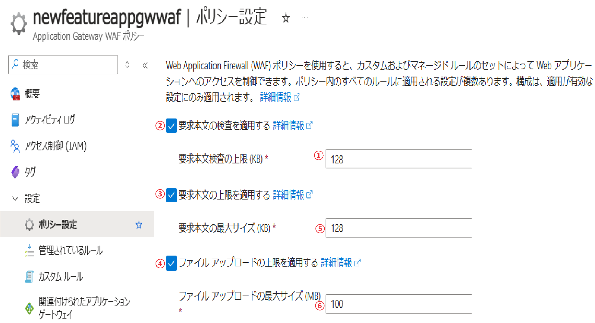

>[!NOTE]
>大きく追加された機能としては ① です。
>②から④ は CRS 3.1 以下でも利用できましたが、それぞれの設定が独立して指定できるようになりました。
>⑤から⑥ はこれまでと変わらず WAF 利用時のサイズの上限を指定する項目となります。

### <a href="#wafv2limit">上限値の整理</a>

Application Gateway V2 の要求本文サイズやファイル アップロードサイズの「上限値」について整理しましょう。
（※単位の違いにもご留意ください）

|  | 要求本文のサイズ上限  |｜ファイル アップロードのサイズ上限  |
| ------------ | ------------ | ------------ |
| Application Gateway V2 自体の上限値 （要求本文/ファイルアップロードの上限適用を無効にした場合はこの上限になります）  | 4 GB   | 4 GB |
| Application Gateway WAF V2/CRS 3.2 以降の上限値 | 2 MB  | 4 GB  |
| Application Gateway WAF V2/CRS 3.1 以前の上限値 | 128 KB  | 750 MB  |

### <a href="labtest">実際の動作の確認</a>
それでは新しく追加された ① の機能について動作を詳しく確認してみましょう。

この検証では、クライアントが送信するリクエストの要求本文の先頭から 10 KB 目に WAF で検知される文字列を含ませて送信してみることにします。設定内容によって実際に WAF がどのように動作するかを検証してみました。

### 「要求本文検査の上限 (KB)」が 128 (既定値)の場合

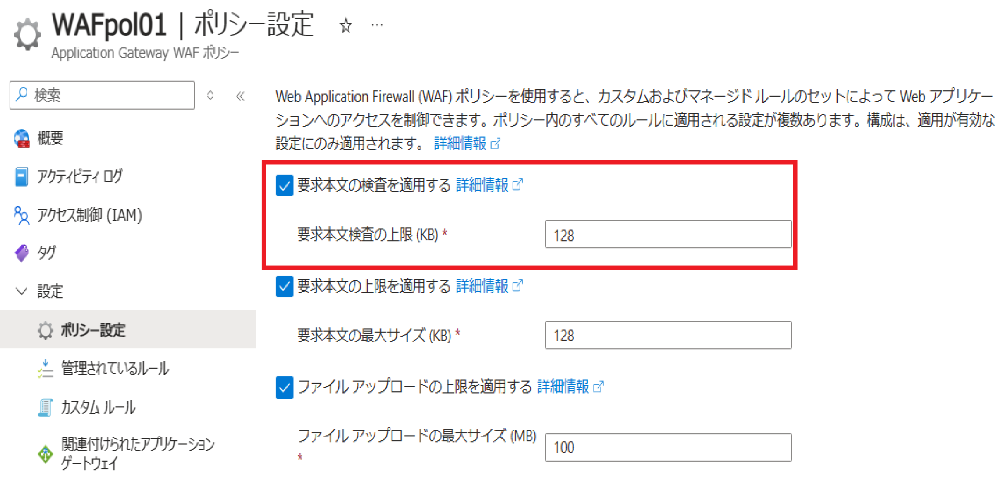

検査する要求本文の範囲は先頭から 128 KB までを指定しています。
要求本文の先頭から 10 KB 目に WAF で検知される文字列が含まれているリクエストを送信しているので、この場合は該当文字列はWAF での評価がされます。アクセス ログより HTTP ステータス コード 403 が返され、ブロックされることが確認できました。

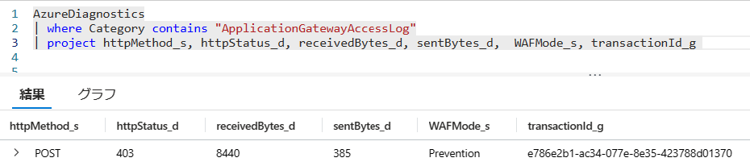

###  「要求本文検査の上限 (KB)」が 8 の場合

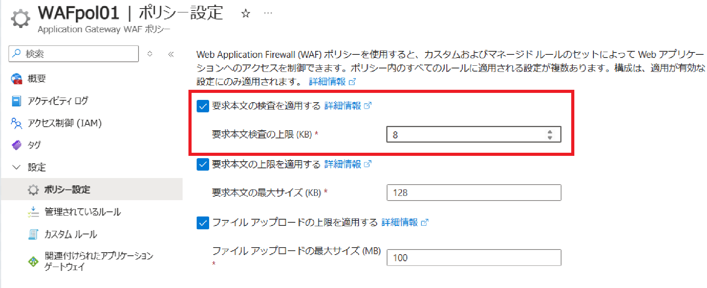

検査する要求本文の範囲は先頭から 8 KB までを指定しています。
要求本文の先頭から 10 KB 目に WAF で検知される文字列が含まれているリクエストを送信しているので、この場合は該当文字列は WAF での評価はされません。アクセス ログより HTTP ステータス コード 200 が返されたことが確認できました。

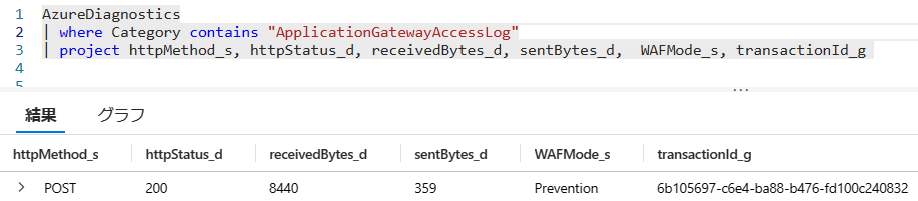

###  「要求本文検査の上限 (KB)」を「要求本文最大サイズ (KB)」よりも大きくした場合

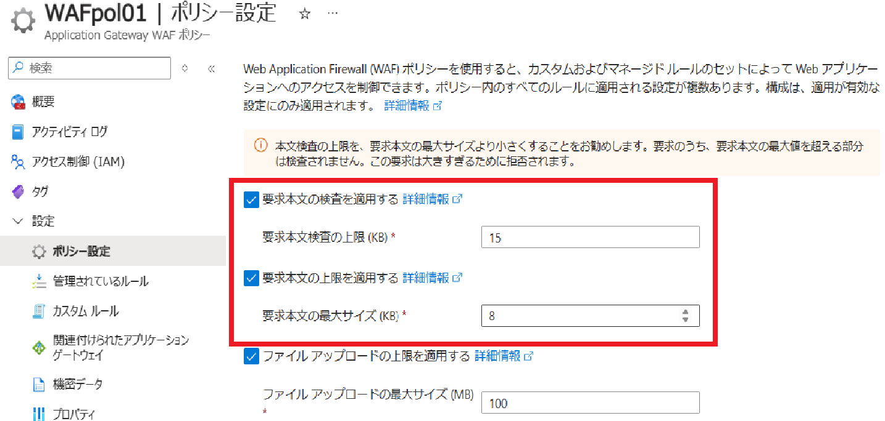

検査する要求本文の範囲は先頭から 15 KB までを指定していますが、要求本文のサイズ上限を 8 KB に指定しています。
この場合「要求本文最大サイズ」の上限値まで要求本文の内容が検査されます。さらにサイズの上限に合致している場合は WAF でブロックされます。アクセス ログより HTTP ステータス コード 403 が返され、ブロックされたことが確認できました。

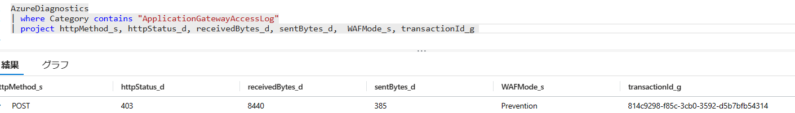

WAF 側のログでは要求本文の長さ (サイズ)が上限を超過したためブロックしたことを示すログが記録されていました。

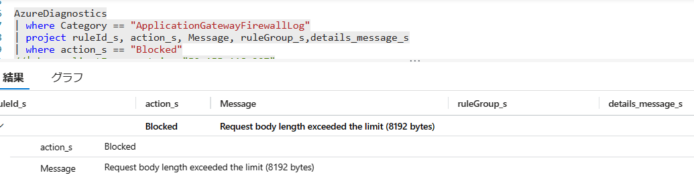

###  「要求本文の検査を適用する」を無効にする

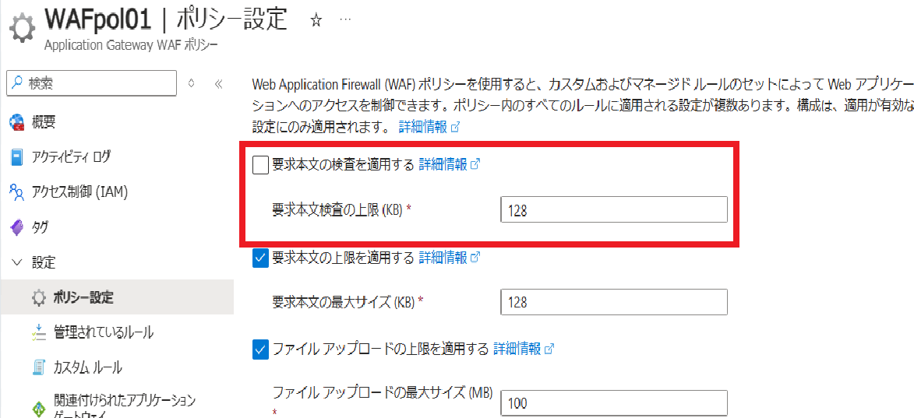

要求本文の検査を無効に指定しているので、要求本文に含まれる内容に対して WAF の評価はされません。アクセス ログより HTTP ステータス コード 200 が返されたことが確認できました。

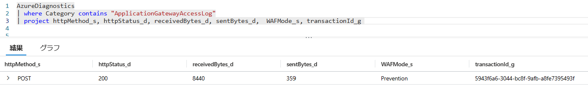

> [!NOTE]
> 要求本文の検査を無効（②の項番）にしている状態でも、要求本文の最大サイズ指定（⑤の項番）を有効としている場合はその設定は有効です。つまり以下のように設定している場合、要求本文の内容は WAF で評価されませんが、要求本文のサイズが 8 KB より大きい場合は WAF で評価されブロックされます。
>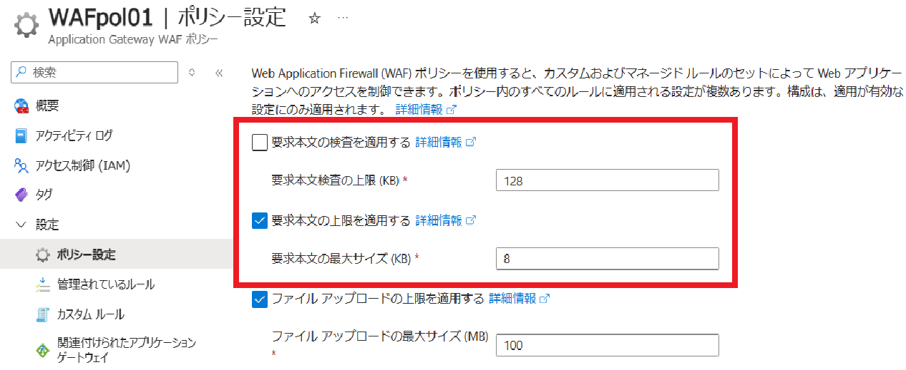

###  Application Gateway V2 側の制限値によってブロックされた場合の動作
番外編として、Application Gateway V2 自体のサイズ上限値に合致した場合はどのような動作となるかも確認しました。
設定値はすべて無効に指定します。

>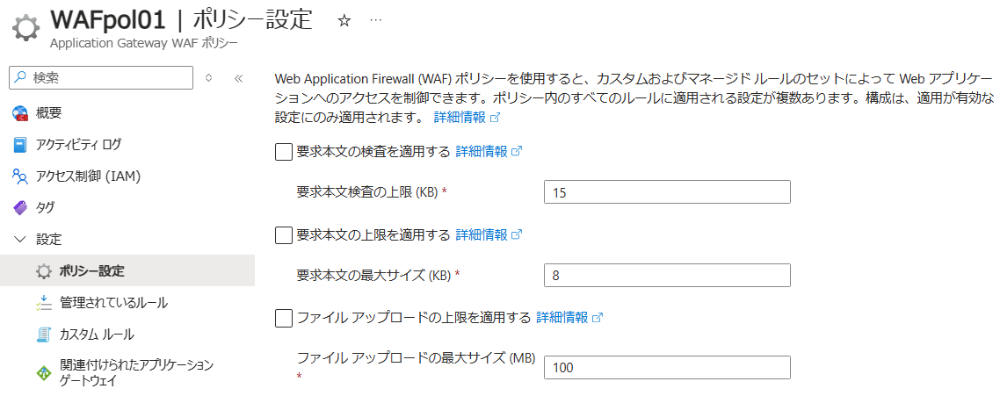

要求本文のサイズを Application Gateway V2 の上限である 4 GB よりも大きくしてリクエストを送信したところ、アクセス ログより HTTP ステータス コード 413 が返されることが確認できました。この時 WAF 側のログには何も記録はありません。また、ファイル アップロードサイズでも同じ動作が確認できました。

>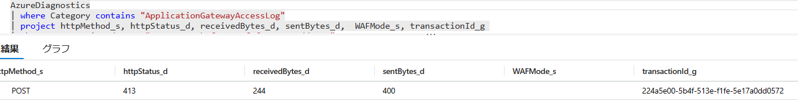

Application Gateway V2 の上限に合致した場合は HTTP ステータス コード 403 ではなく 413 となることが確認できました。

### <a href="#reference">参考情報</a>
- [Web Application Firewall の要求とファイル アップロードのサイズ制限](https://learn.microsoft.com/ja-jp/azure/web-application-firewall/ag/application-gateway-waf-request-size-limits)
- [Application Gateway の制限](https://learn.microsoft.com/ja-jp/azure/azure-resource-manager/management/azure-subscription-service-limits#application-gateway-limits)

