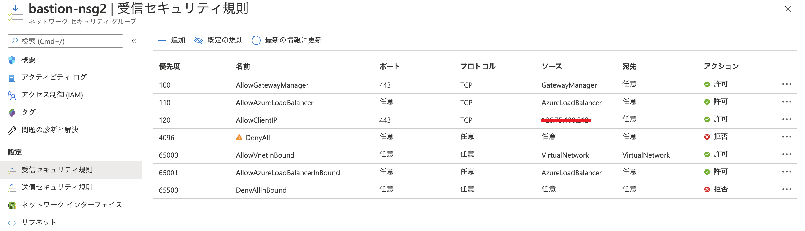
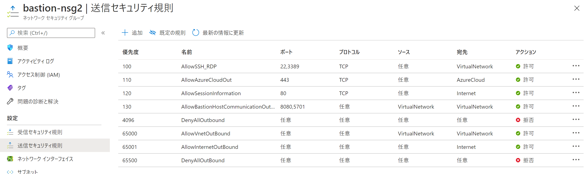
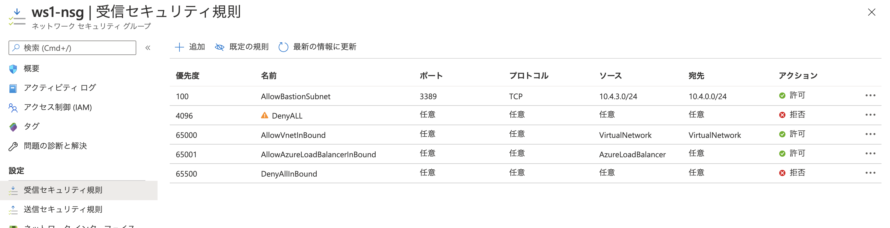

こんにちは、Azure テクニカル サポート チームの薄井です。
今回は Bastion のサブネットに関連付けることのできる NSG についてご紹介します。

よく Bastion のサブネットへのアクセスに制限をかけたいといったお問い合わせをいただきます。Bastion のサブネットに適用する NSG の設定については[公式ドキュメント](https://docs.microsoft.com/ja-jp/azure/bastion/bastion-nsg)に、NSG の既定の規則をそのまま利用した場合の説明がございます。
本記事では、既定の規則を全て拒否した場合の設定例を画像とともにご紹介いたします。

<!-- more -->

## 受信セキュリティ規則
以下に掲載しております画像の例では、優先度 120 番にて Bastion にアクセスするクライアントのグローバル IP アドレスのみを許可している例となります。優先度 4096 番に全てを拒否するルールを入れて既定のルールを拒否しています。
受信セキュリティ規則では以下のルールが必須となります。
- GatewayManager から任意の宛先への HTTPS（TCP ポート 443）の許可
- AzureLoadBalancer から任意の宛先への HTTPS（TCP ポート 443）の許可
- Bastion に接続するクライアントの IP アドレスから任意の宛先への HTTPS（TCP ポート 443）の許可
- VirtualNetwork から VirtualNetwork への任意のプロトコルのポート 8080,5701 の許可

## 送信セキュリティ規則
以下に掲載しております画像の例では、必須となるルールのみを許可している例となります。優先度 4096 番に全てを拒否するルールを入れて既定のルールを拒否しています。
送信セキュリティ規則では以下のルールが必須となります。
- 任意の送信元から VirtualNetwork への SSH と RDP (TCP ポート 22 と TCP ポート 3389) の許可。どちらか一方のプロトコルしか使わないような場合でも両方必要となります。
- 任意の送信元から AzureCloud への HTTPS（TCP ポート 443）の許可
- 任意の送信元から Internet への HTTP (TCP ポート 80) の許可。Bastion のセッション情報の管理に使用されます。
- VirtualNetwork から VirtualNetwork への任意のプロトコルのポート 8080,5701 の許可

## VM および VM のサブネットの NSG の受信セキュリティ規則
Bastion の接続先となる VM および VM のサブネットに NSG を設定する場合は、VM 側の NSG の受信セキュリティ規則において、Bastion のサブネットから VM のサブネットへの SSH もしくは RDP (TCP ポート 22 もしくは TCP ポート 3389) の許可をするルールが必要となります。

以下に掲載しております画像の例では、優先度 100 番の規則において Bastion のサブネットから Windows の VM に接続するために RDP（TCP ポート 3389)  宛の接続を許可した例となります。

Bastion から Linux の VM に接続をする場合には SSH（TCP ポート 22）宛の接続の許可が必要となります。

送信セキュリティ規則は特に必要な設定はございません。

## その他の Bastion に関連する情報
Bastion のサブネットに関連づける NSG について関連する情報が以下のページにあります。
併せてご参考いただければと思います。

- [NSG アクセスと Azure Bastion を使用する](https://docs.microsoft.com/ja-jp/azure/bastion/bastion-nsg)

---