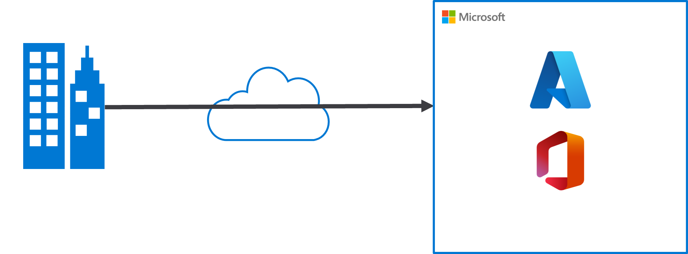
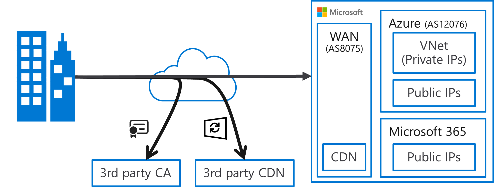
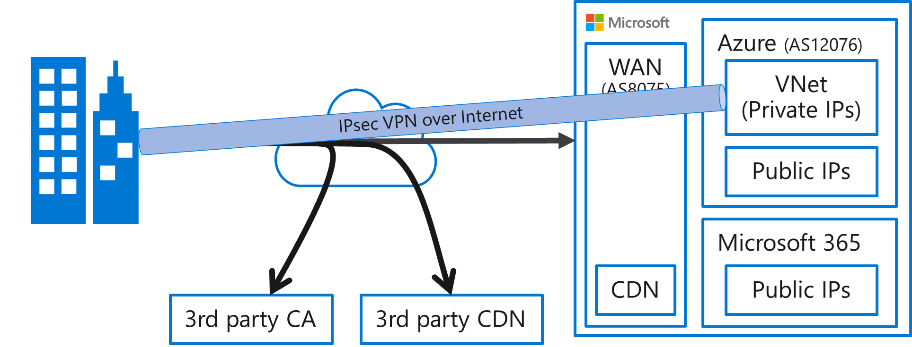
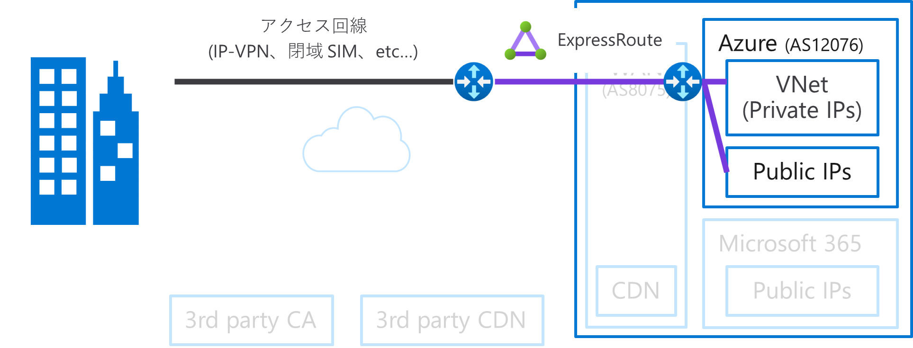
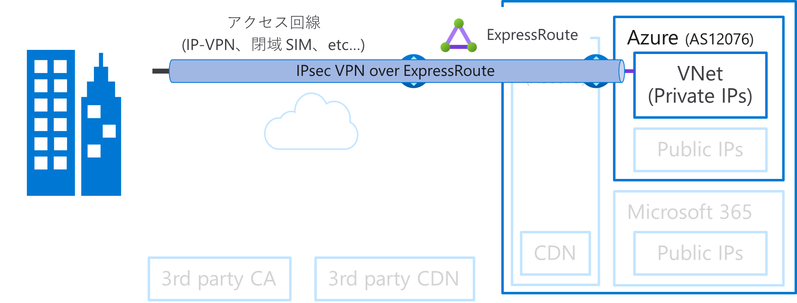
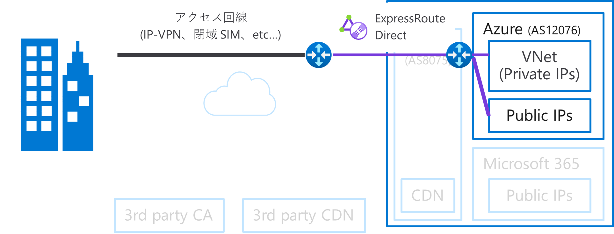
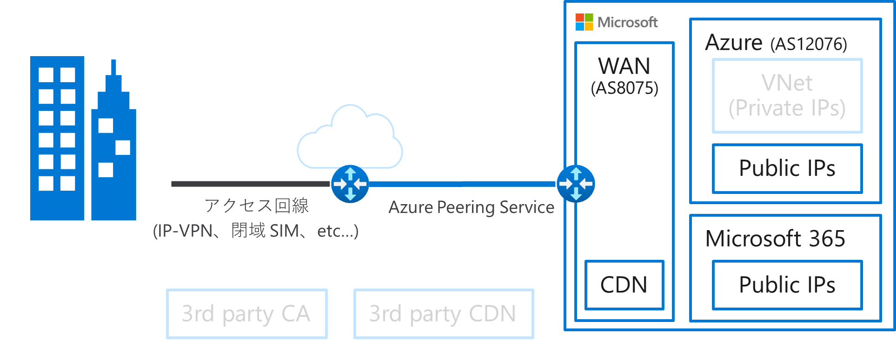

こんにちは。Azure サポートの宇田です。

今回は Microsoft のネットワークとの様々な接続パターンをご紹介したいと思います。皆さんが自社ないしお客様の案件で Azure や Microsoft 365 などの各種 Microsoft サービスを新たに導入する、ひいては Microsoft のネットワークと接続する際の参考となれば幸いです。

## ネットワーク構成を検討する前に、利用予定のサービスの通信要件を確認しましょう

Microsoft のクラウド サービスを利用する際、 漠然と以下の図のようにオンプレミスから Microsoft のネットワークに対して通信が行われるようなイメージをされている方も多いのではないでしょうか。

ただ、実際は上記のようにオンプレミスと Microsoft 間でシンプルに通信している訳ではなく、下図のように Microsoft 内のネットワークも用途別に様々なセグメントに分かれています。Internet、すなわち他の通信事業者に最も近い外側の部分 (Microsoft 視点でいうと上流のネットワーク) には世界中に張り巡らされた WAN が存在し、その拠点である POP には Microsoft が提供する CDN (Azure Front Door) なども配置されています。そして、皆様がご利用になる Azure や Microsoft 365 の各サービス (データセンター) は、その WAN の下にぶら下がる利用部門/ユーザーといった位置づけとなっています。

また、Windows Update のように弊社外の CDN が利用されている場合もあります。さらに言えば、昨今のクラウド サービスでは大半の通信が SSL/TLS で暗号化されており、その際に用いられる証明書の失効確認などで、外部の認証局 (CA) に対しての通信が発生することも一般的です。このため、Internet と一切の通信ができない完全閉域などを実現することは現実的ではありません。

以上のような経緯から、ご利用になるサービスの通信要件 (IP アドレス、FQDN など) について、ドキュメント等を事前に十分ご確認いただくことが重要です。以下に通信要件が記載されたドキュメントの一例を記載しますが、各サービスの通信要件 (IP アドレスや FQDN) 及びその用途等については、Azure Networking サポートからは正確なご案内が出来かねます。お手数ですが、各サービスの通信要件について詳細な確認が必要な場合には、各製品・サービスのサポート窓口までお問い合わせいただければと思います。(例: XXXXX というサービスの通信要件を教えてください、XXXXX.microsoft.com との通信はどのような用途で使用されますか？、XXXXX というサービスは、ExpressRoute 経由で利用できますか？)

### (参考) 代表的なサービスの通信要件

* [Microsoft 365 (Office 365)](https://learn.microsoft.com/ja-jp/microsoft-365/enterprise/urls-and-ip-address-ranges)
* [Azure Portal](https://learn.microsoft.com/ja-jp/azure/azure-portal/azure-portal-safelist-urls)
* [Microsoft Entra ID](https://jpazureid.github.io/blog/azure-active-directory/azure-ad-endpoints/)
* [Azure Arc](https://learn.microsoft.com/ja-jp/azure/azure-arc/network-requirements-consolidated)
* [Azure Monitor Agent](https://learn.microsoft.com/ja-jp/azure/azure-monitor/agents/azure-monitor-agent-network-configuration?tabs=PowerShellWindows#firewall-endpoints)

## 通信先の IP アドレス / FQDN はどこに存在するのか

上記のようなドキュメントより、利用予定のサービスの通信要件を把握したら、次にそこに記載されている IP アドレスや FQDN が Microsoft の内外どちらなのか、Microsoft 内の場合には Azure 内なのか否かを判断する必要があります。(後述しますが、ExpressRoute 経由で通信できるのは Azure 内のみであるため、Azure 外の Public IP アドレスの場合は ExpressRoute 経由では通信できないということになります。)

弊社に限らず、Public IP アドレスは ARIN や APNIC、JPNIC といったインターネット レジストリが各組織 (AS) に対して割り当てを行っています。そのため、例えば以下のようなサイトに IP アドレスを入力することで、その IP アドレスがどの組織に対して割り当てられたものかを調べることができます。(つまり、ASN	が 8075 - MICROSOFT-CORP-MSN-AS-BLOCK 等となっていれば、Microsoft に割り当てられた Public IP アドレスであると判断できます。)

* https://db-ip.com/ (外部サイト)

また、Azure で利用されている Public IP アドレス (NSG 等で利用するサービス タグ) の内訳を、以下のページで入手できる JSON ファイルで確認いただくことが可能です。この JSON ファイル内において、"AzureCloud.japaneast" 等のリージョンごとのサービス タグの内訳に含まれていれば、その Public IP アドレスは Azure 内に存在する (ExpressRoute 経由で通信ができる) と判断していただければと思います。逆に、"AzureFrontDoor.Frontend" のようなサービス単位のタグにしか含まれておらず、リージョン単位のタグに含まれていない場合は、ExpressRoute 経由では通信できませんのでご注意ください。

* [Azure IP Ranges and Service Tags – Public Cloud](https://www.microsoft.com/en-us/download/details.aspx?id=56519)

## Microsoft のネットワークへの接続パターン

前置きが長くなりましたが、ここからは Microsoft のネットワークと接続する様々なパターンについて見ていきましょう。

### Internet

Microsoft の各種クラウド サービスに接続する際の最も一般的な接続方法は、Internet 経由での接続です。在宅勤務をしながら Microsoft Teams を利用したり、Azure 上でホストされている業務アプリなどを利用している方も多いのではないでしょうか。

Internet 経由と聞くと、セキュアではないという印象をもたれる方もいるかもしれません。ただ、昨今は Microsoft の各種クラウド サービスにおけるほとんどの通信は HTTPS 等で暗号化通信が行われており、Internet 経由であっても安心してご利用いただけるようになっています。また、Azure 上の仮想ネットワーク (VNet) に VPN Gateway や仮想アプライアンスを配置し、VPN 接続をおこなうことも可能です。(稀に、Microsoft 365 宛の通信を VPN 経由にしたい等のご相談をいただくことがございますが、Azure の VPN Gateway としては、そのような接続はサポートしておりません。)

### ExpressRoute

エンタープライズのお客様などでは、セキュリティ要件で閉域網での接続が必要な場合も少なくないと思います。そうした閉域網での接続が必要な場合には、ExpressRoute での接続をご検討ください。ExpressRoute では、Azure VNet の Private なアドレス空間に接続するための Private Peering と、Azure の Public IP アドレス帯に対して接続するための Microsoft Peering の二種類の接続形態が用意されています。(なお、ExpressRoute の接続先はあくまでも Azure の世界であり、Microsoft 365 等 Azure 外に対しての疎通性はありませんのでご注意ください。)

その他 ExpressRoute に関する詳細は、公式ドキュメントや本ブログで別途投稿している "詳説 Azure ExpressRoute" の連載を併せてご参照いただければと思います。

* [ExpressRoute のドキュメント](https://learn.microsoft.com/ja-jp/azure/expressroute/)
* [Part1: ExpressRoute を導入する前に](./archive/expressroute-deep-dive-part1.md)
* [Part2: ExpressRoute のルーティング制御について](./archive/expressroute-deep-dive-part2.md)
* [Part3: ExpressRoute の導入手順について](./archive/expressroute-deep-dive-part3.md)
* [Part4: ExpressRoute の冗長構成について](./archive/expressroute-deep-dive-part4.md)
* [Part5: ExpressRoute の増速やプロバイダー変更について](./archive/expressroute-deep-dive-part5.md)
* [Part6: ExpressRoute の各種上限値について](./network/expressroute-deep-dive-part6.md)

### ExpressRoute + IPsec VPN

通常の ExpressRoute 回線は、閉域網での接続を行うのみであり、伝送路での暗号化は行われていません。(Internet 経由の場合と同様、昨今ではほとんどの通信は暗号化されておりますので、伝送路で暗号化をしないからといってセキュアではないというわけではありません。) 

もしセキュリティ要件が極めて厳しく、伝送路での暗号化も必須であるというような場合には、ExpressRoute 越しに Azure VNet 上の VPN Gateway と IPsec VPN を張ることも可能です。ただし、伝送路での暗号化が行えるのは VPN Gateway をデプロイする関係上、Azure VNet 宛の通信のみとなります。Microsoft Peering で接続する Azure の Public IP アドレス帯への通信は伝送路では暗号化されません。

Azure VNet に対して閉域かつ伝送路での暗号化を行った上で接続したい場合は、以下のドキュメント等を参考に構成していただければと思います。

* [ExpressRoute プライベート ピアリング経由のサイト間 VPN 接続を構成する](https://learn.microsoft.com/ja-jp/azure/vpn-gateway/site-to-site-vpn-private-peering)

### ExpressRoute Direct (+ MACsec)

Microsoft Peering も含めて、伝送路での暗号化を行われたいという場合については、通常の ExpressRoute 回線ではなく、物理ポート (10G or 100G) 占有型の L1 接続である ExpressRoute Direct のサービスを利用していただくことで、MACsec をご利用いただくことが可能です。物理ポートを買い切っていただくモデルとなるため、他の接続形態と比較して費用が高額になりますが、伝送路での暗号化が必須要件となる場合の選択肢としてご参考程度に紹介いたします。

* [ExpressRoute Direct ポートで MACsec を構成する](https://learn.microsoft.com/ja-jp/azure/expressroute/expressroute-howto-macsec)

### Azure Peering Service

Azure だけでなく、Microsoft 365 のサービスに対しての疎通性も必要な場合は、Azure Peering Service が選択肢となります。Azure Peering Service は、Microsoft の WAN にあたる AS8075 のネットワークと接続を行うサービスとなるため、Azure 以外の Microsoft が所有する Public IP アドレス帯へも疎通性 (経路情報) が提供されます。ただし、ExpressRoute とは異なり閉域接続を謳うサービスではありません。(PNI や IX 経由で Microsoft の AS8075 と接続いただく際と同様の接続イメージとなります。)　Azure Peering Service は、あくまでも経路の最適化による遅延の削減や信頼性向上を目的としたサービスとなりますので、その点は予めご承知おきください。

* [Azure Peering Service の概要](https://learn.microsoft.com/ja-jp/azure/peering-service/about)

### (番外編 1) オンプレミスから Internet 宛の通信を Azure 経由としたい場合

お客様によっては、Internet への出口を一元化したい、もしくは閉域環境でやむなく一部の Internet 宛の通信を行えるようにしなければならない等の理由で、オンプレミスから Internet 宛の通信を Azure 経由で行いたいというご相談をいただくことがあります。

こうした構成を実現する場合、以下の二通りの方法が考えられます。

* Azure 上に Forward Proxy を構築し、プロキシ経由で通信をさせる
* Azure からオンプレミスに対して BGP でデフォルト ルートを広報させる

前者については、Azure VM で Proxy (Squid 等) を構築いただき、PAC ファイルや Proxy サーバー上で特定の FQDN 宛の通信のみ許可するなどの制御をいただくことになります。他方で後者については、Azure 上に Virtual WAN もしくは Route Server + NVA を構築いただく構成となり、以下のブログで詳しくご紹介しておりますので、こちらをご参照いただければと思います。

* [オンプレミスからのインターネット宛ての通信を Azure 経由にする方法](https://jpaztech.github.io/blog/network/forcetunneling-azure-to-onpre-configuration/)

### (番外編 2) ゼロトラスト ソリューションをお探しの場合

ここまで紹介してきた接続方法とは少し毛色が違いますが、Microsoft ではゼロトラスト (ZTNA) 向けの SSE: Secure Service Edge (SASE: Secure Access Service Edge と呼ばれることもあります) ソリューションとして、Microsoft Entra Private Access および Microsoft Entra Internet Access から構成される Global Secure Access というサービスを提供しています。従来の Firewall や VPN 装置をリプレースし、ゼロトラスト ソリューションの導入を検討されている方は、こちらをご検討いただければと思います。

* [Global Secure Access とは](https://learn.microsoft.com/ja-jp/entra/global-secure-access/overview-what-is-global-secure-access)
* [Microsoft Entra Private Access について学習する](https://learn.microsoft.com/ja-jp/entra/global-secure-access/concept-private-access)
* [Microsoft の Security Service Edge ソリューションの Microsoft Entra Internet Access 概念実証デプロイ ガイド](https://learn.microsoft.com/ja-jp/entra/architecture/sse-deployment-guide-internet-access)

## よくある質問

### XXXXX というサービスを完全閉域で利用できますか

お客様のセキュリティ要件などで Internet 接続を行うことができず、完全閉域で Microsoft の各種クラウド サービスを利用したいといったご相談をいただくことがございます。ただ、前述の通り CDN や認証局などの弊社外との通信が必要となる場合がほとんどですので、Internet 接続が何らか必要になるものと予めご理解をいただければと思います。

> [!NOTE] 「ExpressRoute 経由で XXXXX というサービスに通信できるか」といったお問い合わせを ExpressRoute の質問として Azure Networking サポートにお問い合わせいただく場合がございます。ただ、ExpressRoute は BGP で経路交換を行うのみであり、各製品・サービスがどのような FQDN や IP アドレスを使用しているかといった通信要件については、Azure Networking サポートでは情報を持ち合わせておりませんため、ご案内ができません。お手数ですが、対象製品のサポート窓口まで (複数製品の場合には、製品ごとに個別に) お問い合わせいただくようお願いいたします。

### Microsoft 365 に対して、閉域網で接続することはできますか

Microsoft 365 は、Internet からのアクセスを前提に設計されており、ExpressRoute を利用した "閉域網のみ" で利用いただくようには設計されていません。前述の通り ExpressRoute 経由では通信できない外部のエンドポイントもございますので、ExpressRoute 経由の閉域網で Microsoft 365 を利用することは原則不可とご認識ください。唯一の例外として、法的要件などで閉域接続が必須のお客様のみ、弊社担当営業へご相談をいただき、開発部門による個別の承認を得たうえで Microsoft 365 の経路情報を受け取る (ルートフィルターで Microsoft 365 関連の BGP Community を利用する) ことが可能とはなっています。ただ、この承認を得た場合であっても、Microsoft 365 のすべての通信が閉域網で行えるわけではなく、Internet 接続が必要となる点は変わりませんのでご留意ください。

* [Azure ExpressRoute for Microsoft 365](https://learn.microsoft.com/ja-jp/microsoft-365/enterprise/azure-expressroute)

> [!WARNING] Microsoft 365 の ExpressRoute は、ほとんどの状況でサービスに最適な接続モデルを提供しないため 、**お勧めしません 。** そのため、この接続モデルを使用するには Microsoft の承認が必要です。 お客様のすべての要求を確認し、必要なまれなシナリオでのみ、Microsoft 365 の ExpressRoute を承認します。 詳細については 、[ExpressRoute for Microsoft 365 ガイド](https://aka.ms/erguide) を参照してください。また、生産性、ネットワーク、セキュリティ チームに関するドキュメントの包括的なレビューに従って、Microsoft アカウント チームと協力して、必要に応じて例外を送信してください。 Microsoft 365 のルート フィルターを作成しようとしている未承認のサブスクリプションには、 [エラー メッセージ](https://support.microsoft.com/kb/3181709)が表示されます。

