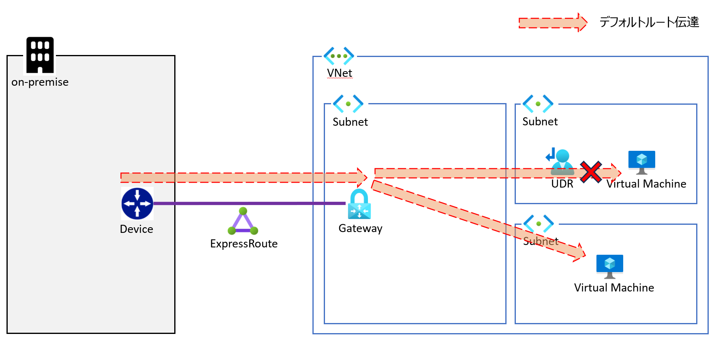
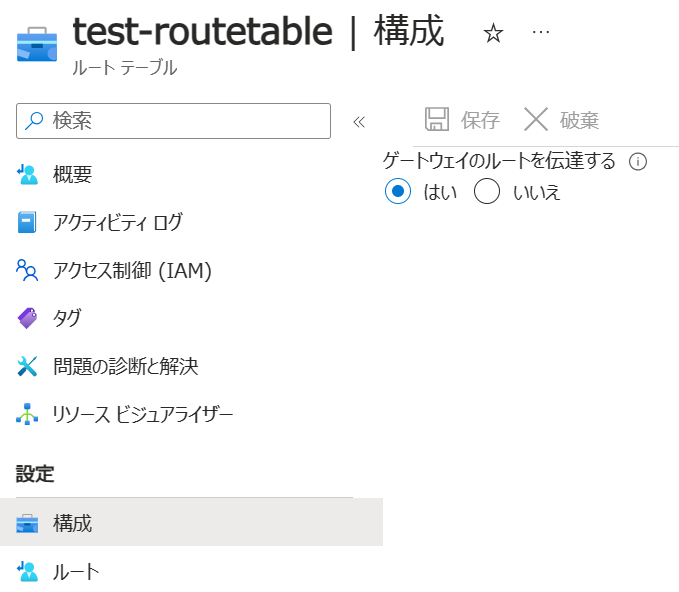
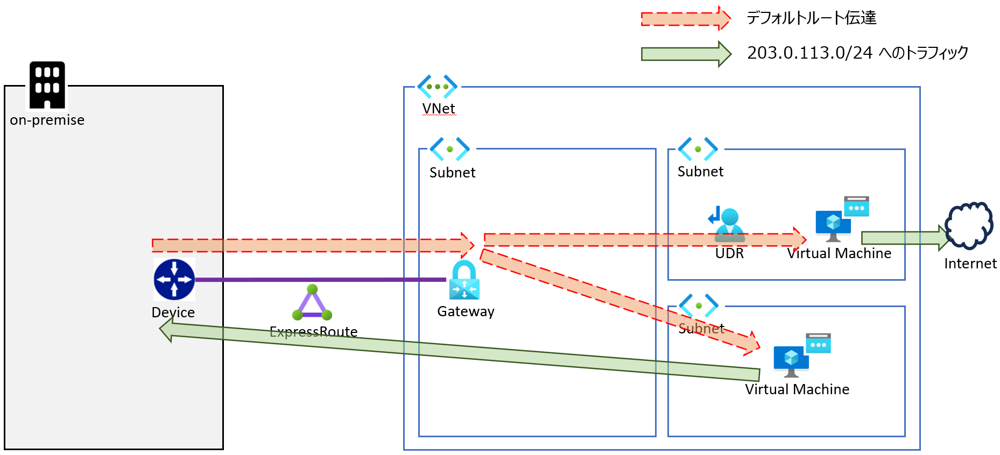
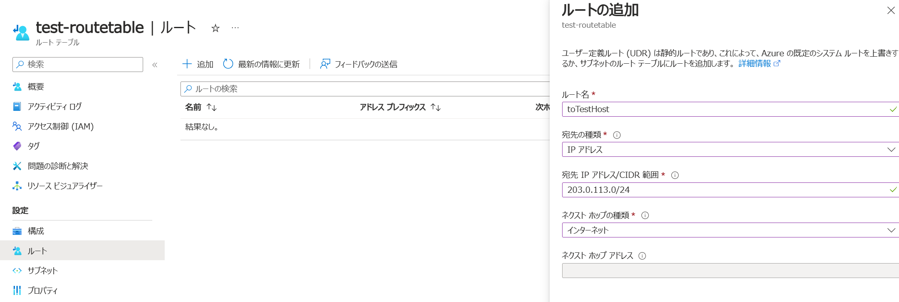
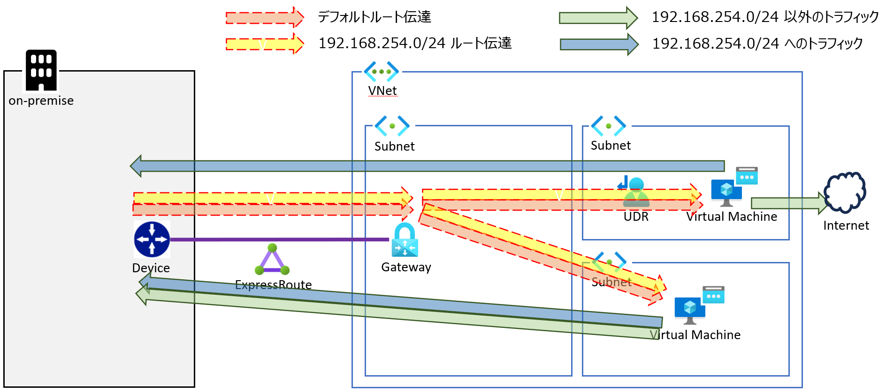
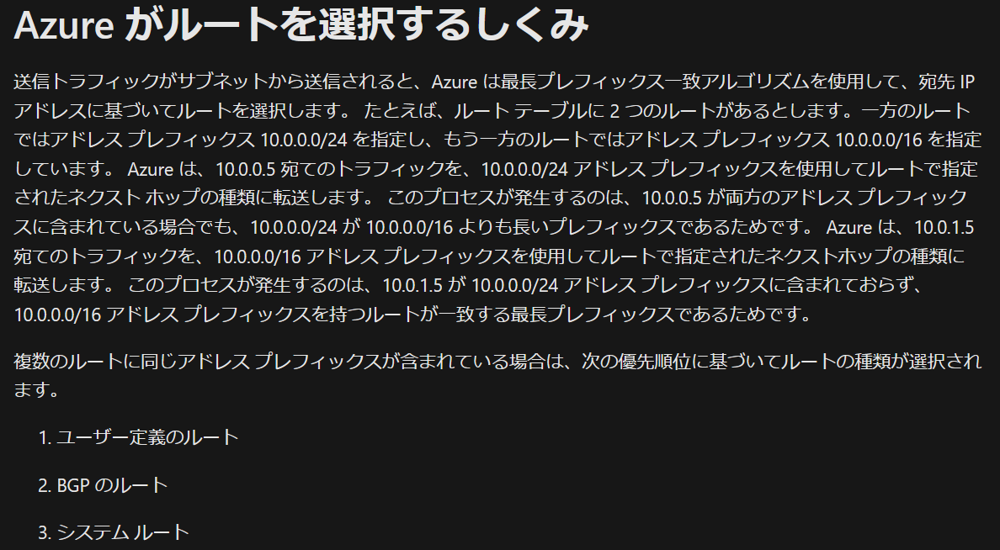
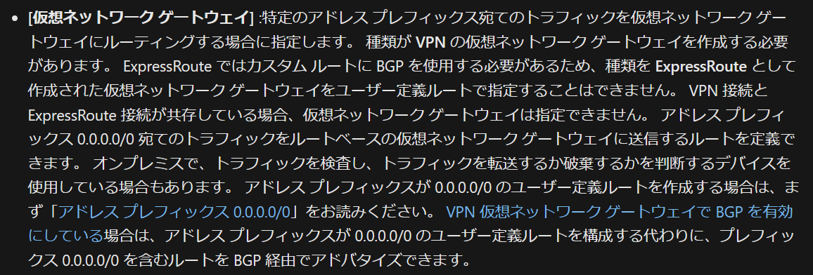

こんにちは、Azure テクニカル サポート チームの角田です。
オンプレミスから ExpressRoute 経由で デフォルトルート (0.0.0.0/0) を広報している場合に、
特定のサブネットからオンプレミスに通信させたくない場合や、
オンプレミス以外にも通信させたい要件があるかと存じます。
今回は、その様な要件を解決する方法をご紹介します。

<!-- more -->

## 想定シナリオ

以下 3 パターンのシナリオについてご紹介します。
全てオンプレミスから構成デフォルトルートを広報されている構成 (Azure では強制トンネリング構成とも呼称) を前提としており、
いずれも対象のサブネットにルートテーブルリソース ( 以下 UDR ) を関連付けて解決します。

シナリオ 1. 特定のサブネットからオンプレミスに対して通信させたくない場合
シナリオ 2. 基本的にはオンプレミスと通信するが、一部の宛先だけインターネットと通信したい場合
シナリオ 3. 基本的にはインターネットと通信するが、一部の宛先だけオンプレミスと通信したい場合

以下それぞれ記載いたします。

### シナリオ 1. 特定のサブネットからオンプレミスに対して通信させたくない場合

UDR では、「ゲートウェイのルートを伝達する」というオプションがございます。
このオプションが無効の場合、Gateway から対象のサブネットへのルート伝達を停止することが可能となります。
ルート伝達を停止することで、対象のサブネットから オンプレミスに対して通信不能とさせることが可能です。

本設定は UDR の構成ページにございますので、「いいえ」をご選択ください。

### シナリオ 2. 基本的にはオンプレミスと通信するが、一部の宛先だけインターネットと通信したい場合

Azure ではルーティングの優先順位付けにロンゲストマッチを利用しておりますので、
より詳細な経路を学習している場合は、そちらを優先する動作となります。
例えば 203.0.113.0/24 に対する経路を 直接インターネットに通信したい場合、
UDR にて 203.0.113.0/24 の経路を記載することで、直接インターネットと通信することが可能です。

> 注意
>仮想マシンがインターネットと通信する場合、
>インターネットと通信する手段をサブネット内の仮想マシンが持つ必要がございます。
>詳しくは下記をご参照ください。
> [Azure VM の送信接続 (SNAT) オプション まとめ | Japan Azure IaaS Core Support Blog](https://jpaztech.github.io/blog/network/snat-options-for-azure-vm/)

下図では、仮想マシンに パブリック IP リソースを持たせた際の動作となります。

ルートの追加は UDR のルートページにございますので、「追加」を押下して追加ください。

### シナリオ 3. 基本的にはインターネットと通信するが、一部の宛先だけオンプレミスと通信したい場合

Azure ではルーティングの優先順位として、
BGP で学習したルートよりも UDR で記載したルートを優先する動作となります。 (参考 1 )
そのため UDR にて宛先をインターネットとしたデフォルトルートを記載した場合、
すべてのトラフィックがインターネットに転送され、
オンプレミスに対して通信することができない状態となります。
この状態で オンプレミスに対して通信させたい場合、
対象のアドレスプレフィックスをオンプレミスより広報いただくことで、
ロンゲストマッチによりルートが優先され、通信可能となります。
例えば 192.168.254.0/24 の宛先についてオンプレミスと通信したい場合、
デフォルトルートに加えて 192.168.254.0/24 のルートを広報いただくことで、
192.168.254.0/24 宛のトラフィックをオンプレミスに対して通信することが可能となります。

> 注意
>UDR で特定の経路のネクストホップを[仮想ネットワーク ゲートウェイ]に設定し、オンプレミスと通信させることはできません。
> ExpressRoute ゲートウェイをネクストホップとして設定することをサポートしていないためです。 (参考 2 )
>このシナリオを解決する場合は、当該経路を BGP 経由で広報頂けますようお願いいたします。

### 参考
1.) [Azure 仮想ネットワーク トラフィックのルーティング | Microsoft Learn](https://learn.microsoft.com/ja-jp/azure/virtual-network/virtual-networks-udr-overview#how-azure-selects-a-route)

2.) [Azure 仮想ネットワーク トラフィックのルーティング | Microsoft Learn](https://learn.microsoft.com/ja-jp/azure/virtual-network/virtual-networks-udr-overview#custom-routes)

