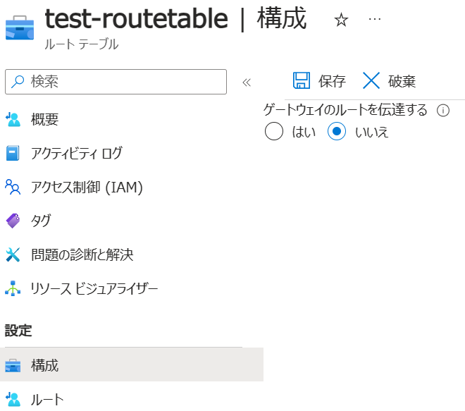

こんにちは、Azure テクニカル サポート チームの角田です。 
オンプレミスから ExpressRoute 経由で デフォルトルート (0.0.0.0/0) を広報している場合に、特定のサブネットからオンプレミスに通信させたくない場合や、オンプレミス以外にも通信させたい要件があるかと存じます。 
今回は、その様な要件を解決する方法をご紹介します。 

<!-- more -->

---

## 想定シナリオ

以下 3 パターンのシナリオについてご紹介します。 
全てオンプレミスからデフォルトルートを広報されている構成 (Azure では強制トンネリング構成とも呼称) を前提としており、いずれも対象のサブネットにルートテーブルリソースを関連付けて解決します。 

* シナリオ 1. 特定のサブネットからオンプレミスに対して通信させたくない場合 
* シナリオ 2. 基本的にはオンプレミスと通信するが、一部の宛先だけインターネットと通信したい場合 
* シナリオ 3. 基本的にはインターネットと通信するが、一部の宛先だけオンプレミスと通信したい場合 

以下それぞれ記載いたします。

### シナリオ 1. 特定のサブネットからオンプレミスに対して通信させたくない場合

ルートテーブルリソースでは、「ゲートウェイのルートを伝達する」というオプションがございます。 
このオプションが無効の場合、Gateway から対象のサブネットへのルート伝達を停止することが可能となります。 
ルート伝達を停止することで、対象のサブネットから オンプレミスに対して通信不能とさせることが可能です。 

本設定は UDR の構成ページにございますので、「いいえ」をご選択ください。

### シナリオ 2. 基本的にはオンプレミスと通信するが、一部の宛先だけインターネットと通信したい場合

Azure ではルーティングの優先順位付けにロンゲストマッチを利用しておりますので、より詳細な経路を学習している場合は、そちらを優先する動作となります。 
例えば 203.0.113.0/24 に対する経路を 直接インターネットに通信したい場合、ルートテーブルリソースにて 203.0.113.0/24 のユーザー定義ルート (以下 UDR) を記載することで、直接インターネットと通信することが可能です。 

> 注意 
>仮想マシンがインターネットと通信する場合、 
>インターネットと通信する手段をサブネット内の仮想マシンが持つ必要がございます。 
>詳しくは下記をご参照ください。 
> [Azure VM の送信接続 (SNAT) オプション まとめ | Japan Azure IaaS Core Support Blog](https://jpaztech.github.io/blog/network/snat-options-for-azure-vm/)

下図では、仮想マシンに パブリック IP リソースを持たせた際の動作となります。

ルートの追加はルートテーブルリソースのルートページにございますので、「追加」を押下して追加ください。

### シナリオ 3. 基本的にはインターネットと通信するが、一部の宛先だけオンプレミスと通信したい場合

Azure では、同一のアドレスプレフィックスを複数の方法で学習している場合、BGP で学習したルートよりも UDR で記載したルートを優先する動作となります。 (参考 1 ) 
そのため UDR にて宛先をインターネットとしたデフォルトルートを記載した場合、すべてのトラフィックがインターネットに転送され、オンプレミスに対して通信することができない状態となります。 
この状態で オンプレミスに対して通信させたい場合、対象のアドレスプレフィックスをオンプレミスより広報いただくことで、ロンゲストマッチによりルートが優先され、通信可能となります。 
例えば 192.168.254.0/24 の宛先についてオンプレミスと通信したい場合、デフォルトルートに加えて 192.168.254.0/24 のルートを広報いただくことで、192.168.254.0/24 宛のトラフィックをオンプレミスに対して通信することが可能となります。

> 注意 
>UDR で特定の経路のネクストホップを[仮想ネットワーク ゲートウェイ]に設定し、オンプレミスと通信させることはできません。 
> ExpressRoute ゲートウェイをネクストホップとして設定することをサポートしていないためです。 (参考 2 ) 
>このシナリオを解決する場合は、当該経路を BGP 経由で広報頂けますようお願いいたします。

### 参考
1.) [Azure 仮想ネットワーク トラフィックのルーティング | Microsoft Learn](https://learn.microsoft.com/ja-jp/azure/virtual-network/virtual-networks-udr-overview#how-azure-selects-a-route)
> Azure がルートを選択するしくみ 
> 送信トラフィックがサブネットから送信されると、Azure は最長プレフィックス一致アルゴリズムを使用して、宛先 IP アドレスに基づいてルートを選択します。 
> たとえば、ルート テーブルに 2 つのルートがあるとします。
> 一方のルートではアドレス プレフィックス 10.0.0.0/24 を指定し、もう一方のルートではアドレス プレフィックス 10.0.0.0/16 を指定しています。 
> Azure は、10.0.0.5 宛てのトラフィックを、10.0.0.0/24 アドレス プレフィックスを使用してルートで指定されたネクスト ホップの種類に転送します。 
> このプロセスが発生するのは、10.0.0.5 が両方のアドレス プレフィックスに含まれている場合でも、10.0.0.0/24 が 10.0.0.0/16 よりも長いプレフィックスであるためです。 
> Azure は、10.0.1.5 宛てのトラフィックを、10.0.0.0/16 アドレス プレフィックスを使用してルートで指定されたネクストホップの種類に転送します。 
> このプロセスが発生するのは、10.0.1.5 が 10.0.0.0/24 アドレス プレフィックスに含まれておらず、10.0.0.0/16 アドレス プレフィックスを持つルートが一致する最長プレフィックスであるためです。
> 複数のルートに同じアドレス プレフィックスが含まれている場合は、次の優先順位に基づいてルートの種類が選択されます。
> 
> 1.ユーザー定義のルート 
> 2.BGP のルート 
> 3.システム ルート 

2.) [Azure 仮想ネットワーク トラフィックのルーティング | Microsoft Learn](https://learn.microsoft.com/ja-jp/azure/virtual-network/virtual-networks-udr-overview#custom-routes)
> ユーザー定義ルートを作成するときは、次のネクストホップの種類を指定できます。
> (中略)
> [仮想ネットワーク ゲートウェイ] : 
> 特定のアドレス プレフィックス宛てのトラフィックを仮想ネットワーク ゲートウェイにルーティングする場合に指定します。 
> 種類が VPN の仮想ネットワーク ゲートウェイを作成する必要があります。 
> ExpressRoute ではカスタム ルートに BGP を使用する必要があるため、種類を ExpressRoute として作成された仮想ネットワーク ゲートウェイをユーザー定義ルートで指定することはできません。 
> VPN 接続と ExpressRoute 接続が共存している場合、仮想ネットワーク ゲートウェイは指定できません。 

---

