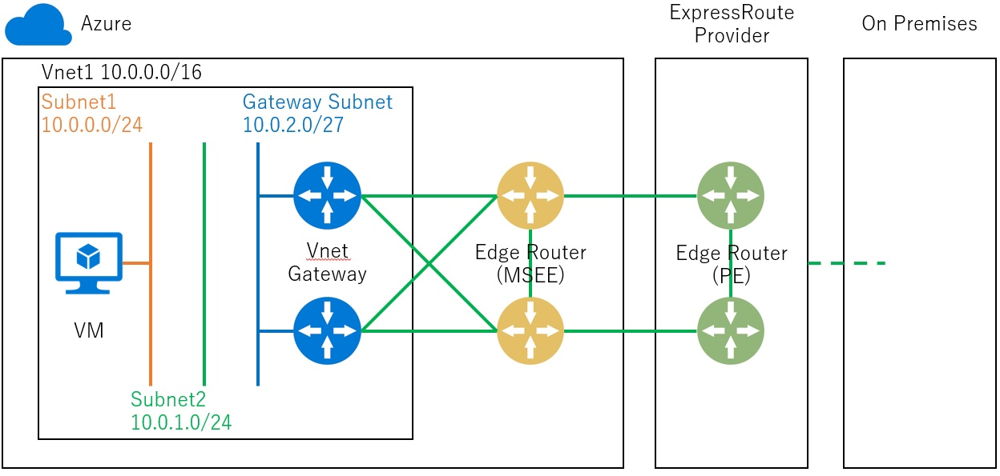

こんにちは、Azure テクニカル サポート チームです。
今回は ExpressRoute 回線のエッジルーターにおけるメンテナンスについて、メンテナンス時の基本的な挙動と、お問い合わせをいただくことの多いご質問への回答を紹介させていただきます。

 

## メンテナンスの通知
ExpressRoute 回線でメンテナンスが実施される場合、通常以下のようなお客様への通知が事前に行われております。

※ 本文中の日時やロケーションはメンテナンスごとに異なります。

 

## メンテナンスの対象
ExpressRoute ではエッジルーター (Microsoft Enterprise Edge: MSEE) と呼ばれる物理ルーターが、既定で Microsoft 側に 2 系統存在しており、それぞれが回線プロバイダー様のルーター (Provider Edge: PE)と BGP セッションを構成することで、冗長化が行われております (2 系統で冗長化されていない環境は SLA の範囲外です)。

メンテナンスの対象となるのはこの MSEE (図における黄色のルーター) です。

※ L2 モデルの回線プロバイダー様ご利用されている場合、回線プロバイダー様のスイッチを経て L3 レベルではお客様の管理所有するルーターと接続されています。そのため L2 モデルの回線プロバイダー様をご利用の場合、PE という表現についてはお客様が管理所有されている BGP ルーターと読み替えてください。

 

## メンテナンス時の挙動
メンテナンスは MSEE の冗長性を考慮して片系統ずつ実施されます。そのためメンテナンス実施中であっても、後述する「通信影響が生じる可能性のあるケース」に該当しない限りは、お客様への通信影響は想定されておりませんのでご安心ください。

メンテナンス時の挙動について少し具体的にご説明すると、メンテナンス対象の MSEE と PE 間の BGP セッションが切断される前に、以下のような手法で通信経路を非メンテナンス側に寄せる処理が行われます。

1. MSEE から PE への通信経路
弊社側での経路制御により非メンテナンス側の経路が優先されるよう制御します。
2. PE から MSEE への通信経路
MSEE から PE に対して、 BGP で広報する経路のうち、メンテナンスを行う側の AS PATH を長くして広報することで、非メンテナンス側の経路が優先されるように制御します (AS Path Prepend)。

上記 1 、 2 の手法により、双方向とも非メンテナンス側の経路が優先されるように制御が行われますので、メンテナンスの実施中もお客様への通信影響は想定されておりません。

以下の公開文書にも、メンテナンス実施中に AS PATH により経路を制御する旨が記載されています。
* [ExpressRoute を使用した高可用性のための設計 - アクティブ/アクティブ接続](https://docs.microsoft.com/ja-jp/azure/expressroute/designing-for-high-availability-with-expressroute#active-active-connections)

  >メンテナンス アクティビティの期間、またはいずれかの接続に影響を与える計画外のイベント時に、Microsoft では、AS パス プリペンディングを使用して、正常な接続にトラフィックをドレインする方法を優先します。 Microsoft によりパス プリペンドが構成されている場合にトラフィックを正常なパスにルーティングできること、およびサービスの中断が発生しないように、必要なルート アドバタイズが適切に構成されていること確認する必要があります。

 

**通信影響が生じる可能性のあるケース**
上記のとおりほとんどの環境では通信影響はありませんが、例えば以下のような極めて限定的な条件下においては、一時的な通信影響が発生する可能性があります。

- お客様側で非常に長い AS Path を利用した経路制御を行っており、メンテナンス時に Microsoft 側で付与する AS Path がお客様の利用されている AS Path に負け、経路制御が効かないケース
- お客様側で AS Path Prepend よりも優先度の高い手法による経路制御を行っているケース

仮に上記のようなケースで PE から MSEE への通信経路の制御が動作しなくても、往復路が不一致となるのみですので、通常は通信への影響ありません。
しかし、例えばステートフルなファイアウォールを利用されている場合など、PE 側のネットワーク構成によってはこうして生じた往復路の不一致が許容されない場合があります。

このように、お客様側での通信制御によって AS Path Prepend が動作せず、かつ往復路の不一致が許容されない構成になっている場合には、メンテナンス時に一時的な通信影響が生じる可能性がございますので予めご承知おきください。
なお PE 側の経路制御状況やネットワーク構成が上記に該当しているかご確認されたい場合、お客様側のネットワークご担当者様にご確認いただくようお願いいたします。  
---

## よくあるご質問

- **現在利用している ExpressRoute 回線は冗長化されていますか**
ExpressRoute 回線は、「 1 回線」作成すると、必ず内部的には 2 本の物理的な回線が構成され、2 台の MSEE が利用されます。つまり、シングル構成になっていることは原則ありません。 ただし、L2 モデルのプロバイダー (お客様自身で BGP ルーターを構成いただく必要があるプロバイダー) をご利用いただいており、ルーターを片方の回線にしか接続していない、片方の回線しか BGP の Neighbor を確立していないなど、極めて例外的な構成を取っている場合に限っては、今回のメンテナンスにあたって通信影響が生じます。 このような構成は、SLA が担保されない、弊社として保証していない特殊な構成であり、プロバイダー様、またはお客様にて意図的に構成されるものです。そのため、ご利用されている ExpressRoute 回線が冗長構成となっているか確認されたい場合は、ご契約されているプロバイダー様、またはお客様側のネットワーク担当者様へご確認ください。

- **メンテナンス期間を延期・変更していただくことはできますか**
前述の通り、ExpressRoute 回線は冗長構成でご利用いただく前提のサービスであり、MSEE に対するメンテナンス作業は片系ずつ実施されますので、通信影響は極めて限定的となります。また、メンテナンス日程の延期や変更は、メンテナンス対象の機器に収容されている全てのお客様に対して日程変更の影響が生じます。そのため、大変恐れ入りますが MSEE に対するメンテナンス作業は、個々のお客様のご事情に応じて延期・変更することはできません。

- **仮想ネットワーク ゲートウェイ の SKU とメンテナンスに伴う影響の有無は関係ありますか**
既にリタイアした Basic 以外の SKU では、メンテナンスに伴う影響の有無には関係ありません。仮想ネットワーク ゲートウェイ は上記の図中の青色の部分ですが、メンテナンス対象である MSEE は黄色の部分です。

- **メンテナンス期間が数時間取られていますが、この時間中ずっと切断されたままになるのですか**
いいえ、メンテナンス期間中の一部のタイミングでのみ、一時的な切断が発生します。また切断といっても、前述のとおり冗長化された回線の片系ずつの切断となります。

- **PE 側で何らかのログが出力される可能性はありますか**
メンテナンスに伴って BGP セッションが切断された際には、PE 側では BGP セッションの切断を示すログなどが記録されることが想定されます。ルーターの監視を行っている場合は、メンテナンス期間中にこのようなログが記録されることをあらかじめご認識いただけますと幸いです。

- **メンテナンス期間中に、ExpressRoute 回線に関連する作業を予定していますが、影響はありますか**
メンテナンス期間中は、MSEE に対して変更を加えることができません。そのため、お客様側で ExpressRoute 回線に関連した作業を行った場合、エラーとなり失敗することが予想されます。大変恐れ入りますが、メンテナンス期間外の日程にて作業していただけますようお願い申し上げます。

以上、ExpressRoute の MSEE メンテナンス通知を受け取られた際の影響確認、ならびに同メンテナンスによる影響を回避するにあたってのルーティング設計をご検討いただくにあたり、ご参考にしていただければ幸いです。
