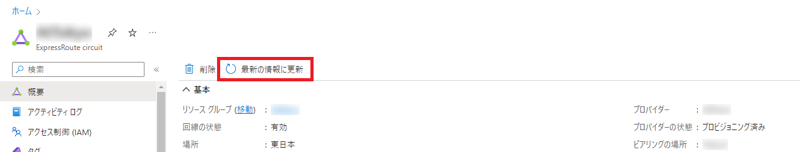

みなさんこんにちは、Azure テクニカル サポート チームの平原です。本日はポータル上で ExpressRoute の構成確認をする際に発生する表示の問題の件について、ご案内をいたします。少しでもお役に立てば幸いです。

<!-- more -->

## 問題
ExpressRoute 回線のピアリングに関する情報 (ルート テーブルや ARP レコードの情報など) が適切に表示されない。

## 原因
レイヤー 3 のプロバイダー様とご契約いただき、ExpressRoute 回線を新設したり構成変更された際など、プロバイダー様とユーザー様の構成情報が同期されていない場合に、ExpressRoute 回線の各種データ取得に失敗します。

## 対処策
ポータルもしくは Azure PowerShell にて、最新の情報に更新を行っていただくことで解消されます。

#### ポータルを利用する場合
ポータル (https://portal.azure.com) 上から ExpressRoute の構成を開き、ExpressRouteの構成情報の画面にある [最新の情報に更新] をクリックします。


#### Azure PowerShell を利用する場合
Azure PowerShell コマンドで、以下のコマンドを実施して、ExpressRoute の情報を取得し更新します。

```PowerShell
$exr = Get-AzureRmExpressRouteCircuit -ResourceGroup <リソースグループ名> -Name <ExpressRoute 名>
Set-AzureRmExpressRouteCircuit -ExpressRouteCircuit $exr
```

## 参考情報
[ExpressRoute 接続を確認する](https://learn.microsoft.com/ja-jp/azure/expressroute/expressroute-troubleshooting-expressroute-overview#verification-via-the-azure-portal-1)
> IPVPN 接続モデルでは、サービス プロバイダーがピアリング (レイヤー 3 サービス) を構成する責任を担います。 このようなモデルでは、サービス プロバイダーがピアリングを構成した後、ポータルのピアリングが空の場合、ポータルの更新ボタンを使用して回線の構成を更新します。 この操作により、現在のルーティング構成が回線からプルされます。

以上ご参考になれば幸いです。
