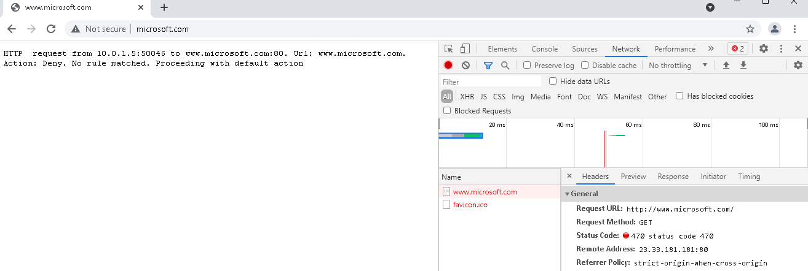
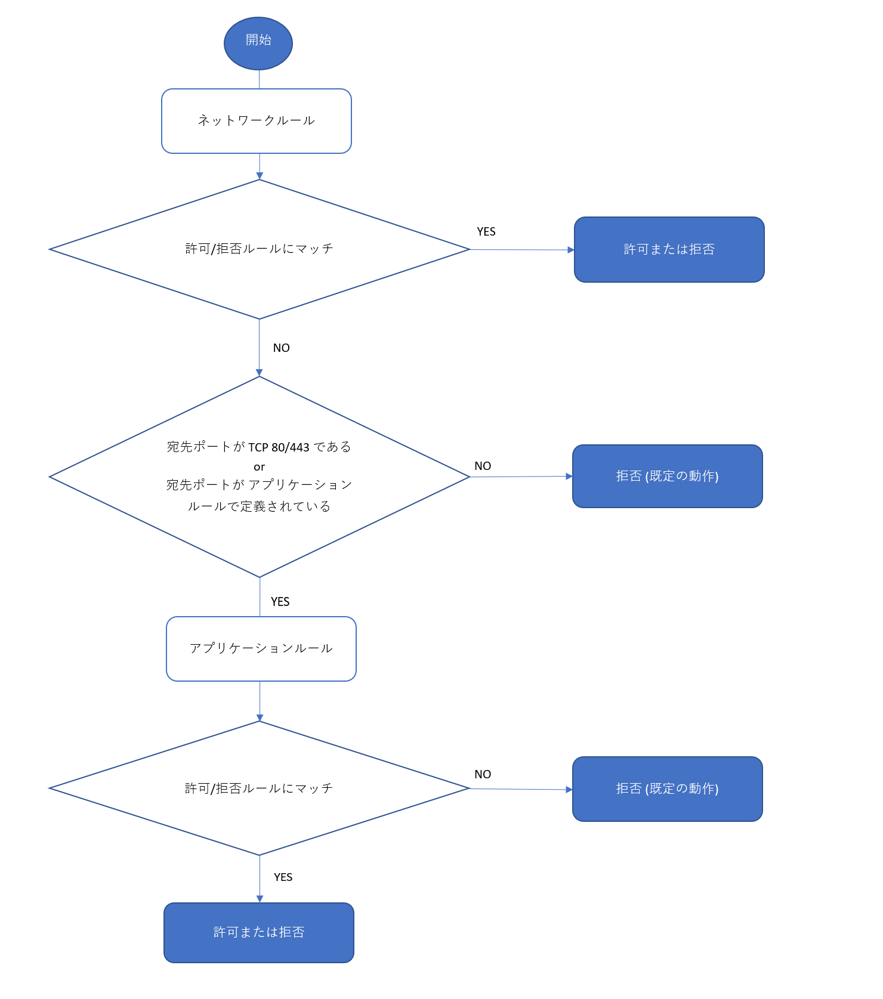

こんにちは、Azure テクニカル サポート チーム檜山です。

今回は Azure Firewall の各ルールの動作についてよくあるお問い合わせを紹介させていただきます。

---

## <a href="#apprule-block">Azure Firewall のアプリケーションルールで許可されているように見える動作について</a>
HTTP (80), HTTPS (443) の通信において、ネットワークルール、アプリケーションルールで明示的に拒否していない場合、ルールの処理順序に従って、Azure Firewall の既定の動作として、アプリケーションルールで拒否されることが想定される動作となります。

この動作について Windows の Test-Netconnection や Linux の curl, nc コマンド等 (以下に記載) で TCP の 3way handshake による接続確認を実施した場合はアプリケーションルールで許可していないにもかかわらず、3way handshake が確立され、許可されたように見える動作となります。この動作の詳細を以下に記載します。

* Powershell Test-NetConnection コマンド (Windows)

>Test-NetConnection -port 443 www.micorosoft.com
>
>ComputerName     : www.micorosoft.com
>RemoteAddress    : 40.76.4.15
>RemotePort       : 443
>InterfaceAlias   : Ethernet 2
>SourceAddress    : 10.0.1.5
>TcpTestSucceeded : True

* nc コマンド (linux)

>$ nc -vz www.microsoft.com 443
>Ncat: Version 7.50 ( https://nmap.org/ncat )
>Ncat: Connected to 23.33.181.181:443.
>Ncat: 0 bytes sent, 0 bytes received in 0.02 seconds.

### Azure Firewall のアプリケーションルールの動作の詳細について
上述の通り、TCP 80, 443 宛の通信について、ネットワークルールで明示的な拒否、許可がない場合、アプリケーションルールで評価され、許可ルールがない場合は既定の動作としてアプリケーションルールにて拒否されます。
アプリケーションルールでは HTTP のホストヘッダ、HTTPS の SNI の Server Name をもとにアプリケーションルール内の FQDN とマッチするかを確認して評価が行われます。
 
アプリケーションルールは L7 で動作しますので、内部的には クライアントと Azure Firewall 間で 3way handshake を確立し、HTTP , HTTPS の情報に基づいて通信を制御しますので、3way handshake が確立されることは想定される動作となります。

NSG にて接続が拒否されている Web サーバーにアクセスした際も、宛先アドレスと 3way handshake は確立可能で、HTTP, HTTPS のレイヤーで拒否されていることから、Azure Firewall が送信元を変換してパケットを返送するような動作であることが確認できます。

**そのため、アプリケーションルールで実際に通信が拒否されるかどうかを確認する際は、ブラウザや curl コマンド等で Web サイトへアクセスし、エラーによりクライアントへ期待される応答 (Status 200 等) が返らないことをご確認ください。**

アプリケーションルールにて拒否されている場合はブラウザや curl コマンドだと以下のような動作となります。

* Chrome [HTTP]

|
|:-:|

* Chrome [HTTPS]

|
|:-:|

* curl コマンド (HTTP)

>$ curl -v http://www.microsoft.com
> 
> About to connect() to www.microsoft.com port 80 (#0)
>    Trying 23.33.181.181...
> Connected to www.microsoft.com (23.33.181.181) port 80 (#0)
> GET / HTTP/1.1
> User-Agent: curl/7.29.0
> Host: www.microsoft.com
> Accept: */*
>
> HTTP/1.1 470 status code 470
> Date: Mon, 29 Mar 2021 04:29:57 GMT
> Content-Length: 144
> Content-Type: text/plain; charset=utf-8
> Connection #0 to host www.microsoft.com left intact
>HTTP  request from 10.0.1.4:53460 to www.microsoft.com:80. Url: www.microsoft.com. Action: Deny. No rule matched. Proceeding with default action

* curl コマンド (HTTPS)

>$ curl -v https://www.microsoft.com
> 
> About to connect() to www.microsoft.com port 443 (#0)
>   Trying 23.33.181.181...
> Connected to www.microsoft.com (23.33.181.181) port 443 (#0)
> Initializing NSS with certpath: sql:/etc/pki/nssdb
>   CAfile: /etc/pki/tls/certs/ca-bundle.crt
> CApath: none
> NSS error -5938 (PR_END_OF_FILE_ERROR)
> Encountered end of file
> Closing connection 0
> curl: (35) Encountered end of file

## <a href="#difference-net-app">ネットワークルールと、アプリケーションルールの動作の違いについて</a>

### ネットワークルールの動作について
ネットワークルールは L4 で動作します。TCP の通信で宛先アドレス、宛先ポートが拒否されている場合、Azure Firewall は SYN/ACK を返しませんので、3way handshake に失敗し、通信が拒否される動作となります。

### アプリケーションルールとネットワークルールの動作の違いについて
上述の通り、ネットワークルールは L4 で動作し、アプリケーションルールは L7 で動作します。
どちらのルールを使用すべきかについては以下がベストプラクティスとなりますので、ご確認いただけますと幸いです。

1. HTTP, HTTPS の通信において FQDN ベースで通信を制御できるものはアプリケーションルールを利用する
2. HTTP, HTTPS の通信において FQDN ベースで通信を制御できないものはネットワークルールを利用する
3. HTTP, HTTPS, MSSQL 以外の通信はネットワークルールを利用する

### アプリケーションルールとネットワークルールの FQDN のフィルタリングについて
現在はアプリケーションルール、ネットワークルールどちらでも FQDN のフィルタリングが可能です。
ベストプラクティスは上述の通りとなりますが、HTTP, HTTPS の通信でアプリケーションルールの利用を推奨する理由としては以下もございます。

- IP アドレスが同一になるような FQDN でも制御可能 (CDN や AppService 等の同一 IP アドレスを複数のユーザーが利用する基盤が宛先となっている場合でも制御が可能)
- ワイルドカードによる FQDN の指定が可能
- DNS Proxy の利用が不要 (クライアント側の DNS の設定変更も不要)
- Web トラフィックに対する今後の機能追加が優先的に行われる可能性がある 

ネットワークルールでの FQDN のフィルタリングは以下もご一読ください。

[ネットワーク ルールでの FQDN フィルタリング](https://docs.microsoft.com/ja-jp/azure/firewall/fqdn-filtering-network-rules)

[Azure Firewall の DNS 設定](https://docs.microsoft.com/ja-jp/azure/firewall/dns-settings)

## Azure Firewall のルールの処理順序 (フローチャート)
Azure Firewall のルールの処理順序がわかりにくいというお問い合わせをいただくことがございます。以下のフローチャートにて詳細を記載しておりますのでご確認ください。

## <a href="#faq">FAQ</a>
	
#### - 設定変更時に既存接続への影響はありますか。
DNAT ルール, ネットワークルール, アプリケーションルールの設定変更において、既存の接続に影響が出るような設定変更でなければ既存の接続に影響がでない動作となることを確認しております。

#### - 戻りのパケットは診断ログに記録されますか。
ネットワークルールでは TCP の SYN パケットに対して許可/拒否が記録されますが、戻りのパケット (SYN/ACK) は診断ログには記録されない動作となります。

#### - 「Action: Deny. Reason: SNI TLS extension was missing」で拒否される理由を教えてください。
アプリケーションルールでは TLS の通信を評価する際に Client Hello に含まれる SNI の Server Name を参照し、評価を行っております。そのため、SNI が利用されない通信はアプリケーションルールで制御することができません。

例えば、https://1.2.3.4 のような IP アドレスでアクセスするような方法ですと、SNI が含まれるずにアプリケーションルールで拒否されることが想定されます。対応策としてはネットワークルールにて制御する必要があります。

[既知の問題](https://docs.microsoft.com/ja-jp/azure/firewall/overview#known-issues)

#### - NAT ルールで拒否のログが記録されません。
NAT ルールで指定されている宛先ポート以外の通信のログは出力されない動作となります。NAT ルールが構成されている宛先ポートに対して通信を行い、拒否のログが出力されるかをご確認ください。

#### - NAT ルールの処理順序をおしえてください。
- NAT ルールはネットワークルールより優先的に評価されます。

#### - ブラックリスト形式でルールを設定できますか。
Azure Firewall は既定でホワイトリスト形式ですが、優先度が低いルールで広い範囲で許可するルールコレクションを設定し、優先度が高いルールコレクションで特定の通信を拒否するルールを設定することでブラックリスト形式で対応することができます。

以下は設定例です。

| 優先度 | ネットワーク ルールコレクション | プロトコル | 送信元 | 宛先 | 宛先ポート | アクション |
----|----|----|---- |----|---- |----
| 100 | Deny-SSH | TCP | 10.0.0.0/8 | 1.2.3.4/32 | 22 | Deny |
| 200 | Allow-ALL | TCP | Any | Any | * | Allow |

## 参考情報

Azure Firewall の概要や機能については以下にも記載がありますのでご一読ください。

[Azure Firewall とは](https://docs.microsoft.com/ja-jp/azure/firewall/overview)

[Azure Firewall の機能](https://docs.microsoft.com/ja-jp/azure/firewall/features)

[Azure Firewall FAQ](https://docs.microsoft.com/ja-jp/azure/firewall/firewall-faq)
