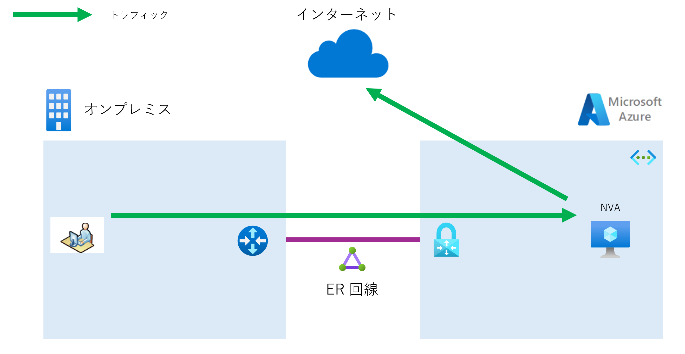
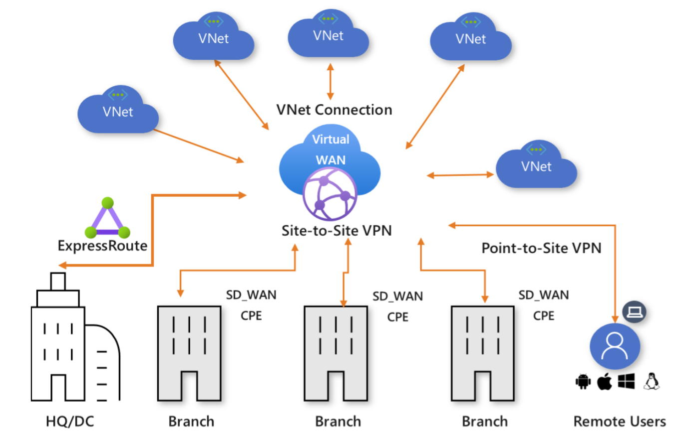
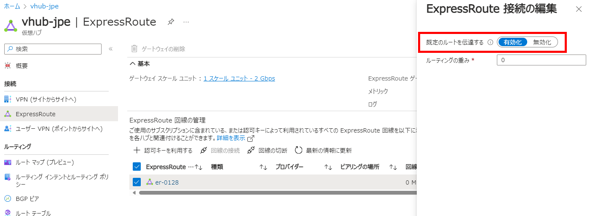
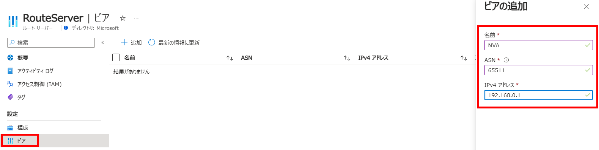
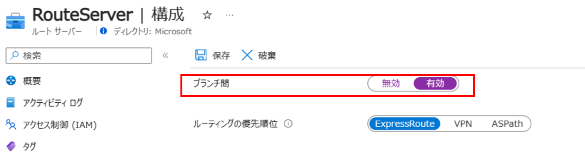

こんにちは、Azure テクニカル サポート チームです。

本ブログでは、オンプレミスからのインターネット宛ての通信を Azure 経由にする方法について、ご紹介いたします。

<!-- more -->

---

お客様のクラウド利用が進み、オンプレミスとクラウドを組み合わせたハイブリッド クラウド環境が普及してきました。ハイブリッド クラウド環境では、オンプレミスとクラウド間の通信の他に、インターネットへのアクセスをオンプレミス経由、またはクラウド経由にさせたいというご要望をいただくことがあります。

従来から、お客様のセキュリティポリシーの要件により、Azure からのインターネットへの通信をオンプレミスを経由させて、オンプレミスでセキュリティ対策を実施されることがありました。Azure では、Azure 環境からインターネットへの通信をオンプレミス経由させることを「強制トンネリング（Forced Tunneling）」と呼んでいます。

[サイト間構成用の強制トンネリングについて](https://learn.microsoft.com/ja-jp/azure/vpn-gateway/about-site-to-site-tunneling)

昨今では、Azure の提供する Azure Firewall や、サードパーティー製のネットワーク仮想アプライアンス（NVA - Network Virtual Appliance）として、多くのセキュリティサービスが提供されています。
オンプレミスに設置されていた物理的なセキュリティベンダーの製品が、Azure 上の NVA としても提供されるようになり、従来実施していた同様のセキュリティ対策を Azure 上で実施することも可能になってきました。
また、NVA は物理的なデバイスと比べ、スケールアウトを迅速に行いやすいなど、クラウド環境特有のメリットもあります。

このような背景から、オンプレミスからインターネット接続を Azure を経由させたいというご要望をいただくことが多くなりましたので、本ブログでは概要をご説明します。

まず、オンプレミスから Azure を経由させてインターネットに接続させるには、Azure からオンプレミスのルーターに対してデフォルトルート（0.0.0.0/0）（Azure では「既定のルート」と呼ばれることがあります）をルーティング プロトコルの BGP で広報する必要があります。
デフォルトルートを Azure から広報するには、以下の 2 種類の方法が考えられます。

１）Virtual WAN を利用する  
２）Azure Route Server と NVA（Network Virtual Appliance - 仮想アプライアンス）を利用する

## 1）Virtual WAN を利用する
比較的大規模な環境で利用される Virtual WAN では、ハブ アンド スポーク アーキテクチャで、仮想ハブ内に Azure Firewall や、サードパーティ製のセキュリティ用 NVA、または SD-WAN 用 NVA などをデプロイすることができます。
Azure Firewall や、これらの NVA からデフォルトルートを広報することにより、ExpressRoute 回線（ER）や Site to Site VPN（S2S VPN）で接続されたオンプレミスからの通信を、Azure を経由してインターネットにアクセスさせることが可能になります。

[Azure Virtual WAN とは](https://learn.microsoft.com/ja-jp/azure/virtual-wan/virtual-wan-about)

Azure Firewall をすでに Virtual WAN の仮想ハブにデプロイしている場合、インターネット向けの通信を Azure Firewall に向けるためのルーティング ポリシーを設定します。
次に、S2S VPN 接続の場合には VPN サイトで「既定のルートを伝達」を有効化させることにより、デフォルトルート（0.0.0.0/0）をオンプレミスに広報します。
ER 接続の場合も、同様の「既定のルートを伝達」を有効化させることにより、デフォルトルート（0.0.0.0/0）をオンプレミスに広報します。

これだけで、オンプレミスは Azure から広報されたデフォルトルート（0.0.0.0/0）を学習し、オンプレミスからインターネットへの通信を Azure 経由にさせることが可能になります。
Virtual WAN の場合には、このように簡単にデフォルトルート（0.0.0.0/0）を広報することが可能です。

### インターネット向けのルーティング ポリシーを設定

### VPN 接続の場合
「既定のルートを伝達」を有効化

### ExpressRoute 接続の場合
「既定のルートを伝達」を有効化

## 2）Azure Route Server と NVA（Network Virtual Appliance - ネットワーク仮想アプライアンス）を利用する

Virutal WAN ではなく、仮想ネットワーク（VNet）を利用している場合には、少々複雑にはなってしまいますが、Azure Route Server（RS）とサードパーティー製の NVA を利用して、実現することができます。

RS は NVA と BGP で経路交換することにより、VNet と NVA の間で経路の学習をすることができます。
そのため、RS を利用することで、VNet が NVA から広報されたインターネット向けの経路を学習します。
さらに、RS は NVA から広報されたインターネット向けの経路を、仮想ネットワークゲートウェイに対しても広報することができます。
これにより、オンプレミスは仮想ネットワークゲートウェイから広報されたインターネット向けの経路を学習することにより、オンプレミスからインターネットへの通信を Azure 経由にさせることが可能になります。
また、RS は BGP の経路交換だけに使われるため、実際のトラフィックは RS を通ることはありません。

ER 回線と Site to Site VPN（S2S VPN）では、Azure でデプロイする仮想ネットワークゲートウェイの種類が異なり、ER GW と VPN GW という 2 種類があります。
ER GW と VPN GW は、実装の違いによりオンプレミスへ経路広報ができる経路に違いがあります。
そのため、NVA で広報する経路を以下のようにする必要があるので、この点はご注意ください。

### ER 回線
・デフォルトルート（0.0.0.0/0）を広報する  
> [経路広報]  
> オンプレミス <-- ER 回線 <-- ER GW <--  RS <-- NVA（0.0.0.0/0 を広報する）  
> [トラフィックフロー]  
> オンプレミス --> ER 回線 --> ER GW --> NVA --> インターネット

### Site to Site VPN  
・0.0.0.0/1, 128.0.0.0/1 の２つ経路を広報する  
※ VPN GW は、オンプレミス向けにはデフォルトルート（0.0.0.0/0）を広報できない実装となっているため

> [経路広報]  
> オンプレミス <-- Site to Site VPN (S2S VPN) <-- VPN GW <--  RS <-- NVA (0.0.0.0/1, 128.0.0.0/1 の２つを広報する）  
> [トラフィックフロー]  
> オンプレミス --> Site to Site VPN (S2S VPN) --> VPN GW --> NVA --> インターネット

NVA で経路広報をする方法は、NVA の設定方法に依存するため、本ブログでは割愛します。

NVA で経路広報の設定をしたのち、RS で「ピアの追加」をし「ブランチ間」を有効化することで、
オンプレミス -- ER GW/VPN GW -- RS -- NVA 間で経路情報の交換を開始します。
これにより、オンプレミスは NVA からインターネット向けの経路を学習し、オンプレミスからインターネットへの通信を、Azure 経由にさせることが可能になります。

### RS の設定について
RS でピアの追加

RS で「ブランチ間」を有効化

RS と NVA を利用する方法は、NVA の OS 上のスタティックルートを設定したり、NVA の NIC のサブネットにインターネット向けのユーザー定義ルートを設定したりと、実際には複雑な作業が必要となりますので、参考情報に RS と NVA に関する情報を補足しております。

## まとめ
今回は、オンプレミスからのインターネット宛ての通信を Azure 経由にする方法について、以下の２つの方法をご紹介しました。

１）Virtual WAN を利用する  
２）Azure Route Server と NVA（Network Virtual Appliance - 仮想アプライアンス）を利用する

どちらを選択されるかは、お客様の様々な状況にも依存しますので、適切な方法を選択し事前検証をした上で実際の動作もご確認ください。
動作でご不明な点があれば、Azure ポータルより弊社サポートまでお問い合わせください。
