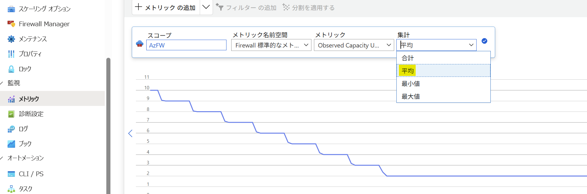

こんにちは、Azure テクニカル サポート チームの園部です。

今回は日本時間 2025 年 10月 17 日に GA (General Availability) されたプレスケーリング機能について紹介します。

<!-- more -->

## Azure Firewall の自動スケーリング機能の動作、課題
プレスケーリング機能の紹介の前に、Azure Firewall に元々備わっている自動スケーリング機能の動作と課題について紹介します。 

Azure Firewall は、内部コンポーネントとして、トラフィックのルール評価、処理を制御する内部インスタンスが存在しています。 
Azure Firewall Standard, Premium の内部インスタンス数は、自動スケーリング機能により変化し、既定では最小で 2 インスタンス、最大で 20 インスタンスが動作します。※Azure Firewall Basic は 2 インスタンス固定で、自動スケーリング機能は備わっていません。 
この自動スケーリング機能では、平均スループットや CPU 使用率やコネクション数に応じて自動的にスケールアウト/スケールインを行います。 
Azure Firewall の自動スケーリング機能の公開情報は [Azure Firewall のパフォーマンス](https://learn.microsoft.com/ja-jp/azure/firewall/firewall-performance) を参照してください。

しかし、この自動スケーリング機能には以下のような課題があります。

・スケールアウト時の課題 スケールアウトには通常 5-7 分程度要します。その為、突然のトラフィックの急増にスケールアウトが追い付かず、いくつかのリクエストで遅延、正常に接続が行えない、等の事象が発生する可能性があります。

・スケールイン時の課題 長期コネクションが残存しているインスタンスでスケールインが発生し、当該インスタンスが削除される際に、予期しない接続断が発生する可能性があります。

## Azure Firewall のプレスケーリング機能の動作、メリット
今回 GA されたプレスケーリング機能では、Azure Firewall リソース個々に、最小インスタンス数と、自動スケーリングによる最大インスタンス数をご指定頂くことが可能となります。

例えば、最小インスタンス数を 5, 最大インスタンス数を 20 とすると、平常時は 5 インスタンスで動作し、スループットの増加やインスタンスの CPU 使用率等に合わせて最大 20 インスタンスまでスケールアウトします。

また最小インスタンス数と最大インスタンス数を同じ値にすることで、インスタンス数を常にその値に固定することが可能となり、自動スケーリングが行われなくなります。

プレスケーリング機能の公開情報は [Azure Firewall の事前スケーリング](https://learn.microsoft.com/ja-jp/azure/firewall/prescaling) を参照してください。

このプレスケーリング機能により、上述の自動スケーリング機能における課題を低減頂くことが可能となります。
例えば、一時的なイベント等により Azure Firewall を経由するトラフィック量が急増することを把握されているような場合、事前に、最小値を既定の 2 以上に設定しておくことでスケールアウト時の課題を回避できます。
またスケールインによる予期しない接続断を発生させたくない環境の場合、最小インスタンス数と最大インスタンス数を同じ値にしておくことで、スケールインを防ぐことが可能です。

## プレスケーリング機能を利用する際の注意点
- Azure Firewall メトリックに新たに追加された [Observed capacity Units] メトリックを参照し、適切な最小インスタンス数、最大インスタンス数を設定してください。このメトリックを参照する際は、[集計] を "最大値" にしてください。
　

- プレスケーリング機能をご利用頂くと、通常の料金に追加し、以下の課金も発生します。
  | SKU | 容量ユニットあたりの価格 |
  |:----:|:---:|
  | Azure Firewall Standard | 容量ユニット時間あたり $0.07 |
  | Azure Firewall Premium  | 容量ユニット時間あたり $0.11 |

  例えば Azure Firewall Standard において、プレスケーリング機能により最小インスタンス数を 10 として 100 時間稼働させた場合、$0.07 * 8 (instances) * 100 (hours) = $56 が追加費用として発生することになります。なお、計算に用いられるインスタンス数について、10 インスタンスとしてカウントされるのではなく、既定で動作する 2 インスタンスを差し引いた 8 インスタンスとしてカウントされている点にご注意ください。   

以上、Azure Firewall プレスケーリング機能をご利用される際のご参考になれば幸いです。

---
