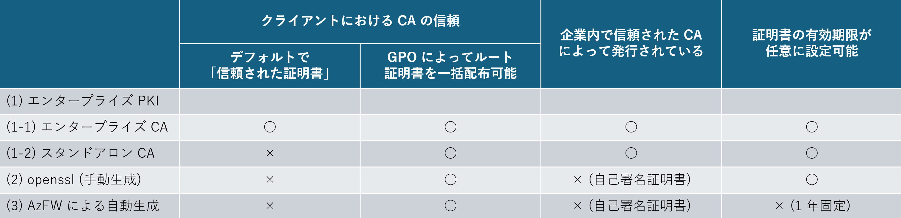

--- 
title: Azure Firewall Premium における TLS 検査用の中間 CA 証明書作成方法の違い
date: 2024-02-20 12:00:00 
tags:  
  - Network
  - Azure Firewall
  - Certificate
---

こんにちは、Azure テクニカル サポート チームです。  
本ブログでは、Azure Firewall Premium でご利用いただける「TLS 検査」に用いる中間 CA 証明書の作成方法の違いについてご案内いたします。

<!-- more -->

## 中間 CA 証明書の要件
まず前提として、Azure Firewall の観点では、Azure Firewall が参照する中間 CA 証明書によって、TLS 検査を行うためのサーバー証明書が作成できるのであれば、中間 CA 証明書を発行した CA の種別は問いません。  

* 参考: [Azure Firewall Premium によって使用される証明書](https://learn.microsoft.com/ja-jp/azure/firewall/premium-certificates#certificates-used-by-azure-firewall-premium)
```
Azure Firewall Premium の TLS 検査を適切に構成するには、有効な中間 CA 証明書を用意し、それを Azure Key Vault に格納する必要があります。
```

上記で抜粋した `有効な中間 CA 証明書` に関しまして、Azure Firewall の TLS 検査に必要な中間 CA 証明書の要件は下記のドキュメントの通りとなります。  
こちらの要件を満たした中間 CA 証明書であれば、どの CA から発行されたものであっても、検証環境 / 運用環境を問わずご使用いただくことが可能です。
<br>

* 参考: [中間 CA 証明書の要件](https://learn.microsoft.com/ja-jp/azure/firewall/premium-certificates#intermediate-ca-certificate-requirements)
```
・Key Vault シークレットとしてデプロイする場合、証明書と秘密キーを使用するパスワードレス PFX (PKCS12) を使用する必要があります。 PEM 証明書はサポートされていません。

・単一の証明書でなければならず、証明書チェーン全体を含めることはできません。

・今後 1 年間有効でなければなりません。

・最小サイズが 4096 バイトである RSA 秘密キーでなければなりません。

・KeyCertSign フラグによって Critical とマーク付けされた KeyUsage 拡張が必要です (RFC 5280、4.2.1.3 Key Usage)。

・Critical とマーク付けされた BasicConstraints 拡張が必要です (RFC 5280、4.2.1.9 Basic Constraints)。

・CA フラグが TRUE に設定されている必要があります。

・パスの長さは 1 以上でなければなりません。

・証明書はエクスポートできる必要があります。
```

## TLS 検査でご利用いただける証明書について

[こちら](https://learn.microsoft.com/ja-jp/azure/firewall/premium-certificates) のドキュメントに記載の通り、TLS 検査で使用可能な中間 CA 証明書は下記の 3 つの方法で作成していただけます。
1. エンタープライズ PKI
2. openssl コマンドによる手動生成 
3. Azure Firewall による自動生成

以下の表は 3 つの方法の簡単な比較表となります。 

 

下記にそれぞれの生成方法についての詳細をご説明いたします。 

## (1) エンタープライズ PIK
エンタープライズ PKI としては「エンタープライズ CA」と「スタンドアロン CA」が存在します。  

### (1-1) エンタープライズ CA  (こちらを用いた証明書作成手順の詳細は、[ドキュメント](https://learn.microsoft.com/ja-jp/azure/firewall/premium-deploy-certificates-enterprise-ca) に記載がございます)
* オンプレミスの Active Directory 環境でのみ構築可能 （Azure AD DS 環境では Enterprise Admins の権限を保有できないため構築不可）  
* 作成された証明書は配布作業を行わなくとも AD ドメインに参加している各クライアント端末において、デフォルトで「信頼された証明書」となる  
* 企業内のプライベート CA であるため、少なくとも企業内においては信頼された CA であると認識され、これによって発行された証明書は自己署名証明書よりもセキュリティ面で優位であると認識される  
* 証明書の有効期限は任意に設定可能

### (1-2) スタンドアロン CA  
* Azure AD DS 環境でも構築可能
* 証明書テンプレートが使用できない
* デフォルトではクライアント端末において「信頼された証明書」ではないため、各クライアント端末にルート証明書の配布が必要
* 作成された証明書は グループ ポリシー (GPO) を用いてドメイン参加している各クライアント端末に一括配布可能**
* 企業内のプライベート CA であるため、少なくとも企業内においては信頼された CA であると認識され、これによって発行された証明書は自己署名証明書よりもセキュリティ面で優位であると認識される  
* 証明書の有効期限は任意に設定可能  

**参考: [グループ ポリシーを使用してクライアント コンピューターに証明書を配布する](https://learn.microsoft.com/ja-jp/windows-server/identity/ad-fs/deployment/distribute-certificates-to-client-computers-by-using-group-policy)  


## (3) openssl コマンドによる手動生成
* 自己署名証明書である
* デフォルトではクライアント端末において「信頼された証明書」ではないため、各クライアント端末にルート証明書の配布が必要
* 作成された証明書は グループ ポリシー (GPO) を用いてドメイン参加している各クライアント端末に一括配布可能
* 証明書の有効期限は任意に設定可能
	
## (4) Azure Firewall による自動生成
* 自己署名証明書である
* 検証環境での使用を想定しているので、作成されるのはルート証明書である
* デフォルトではクライアント端末において「信頼された証明書」ではないため、各クライアント端末にルート証明書の配布が必要
* 作成されたルート CA 証明書を Key Vault からエクスポートすることで、グループ ポリシー (GPO) を用いてドメイン参加している各クライアント端末に一括配布可能
* 新規に Key Vault、マネージド ID のリソースが作成される (既存のリソースは使用不可)
* 証明書の有効期限は 1 年固定 (1 年ごとに証明書の更新を行う必要があるので、1 年ごとに GPO で証明書の配布が必要)

<br>
以上、ご参考になれば幸いです。

## 参考文献

* [Azure Firewall Premium の証明書](https://learn.microsoft.com/ja-jp/azure/firewall/premium-certificates)
* [HBuilding a POC for TLS inspection in Azure Firewall](https://techcommunity.microsoft.com/t5/azure-network-security-blog/building-a-poc-for-tls-inspection-in-azure-firewall/ba-p/3676723)

---
