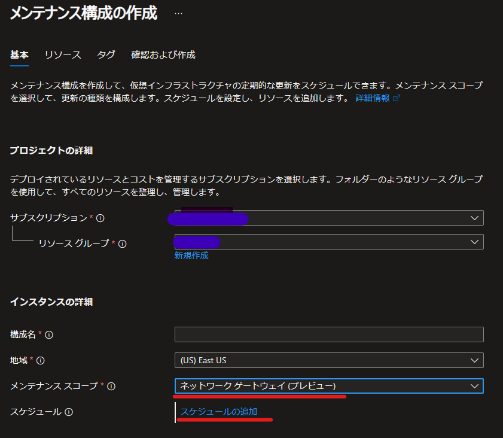
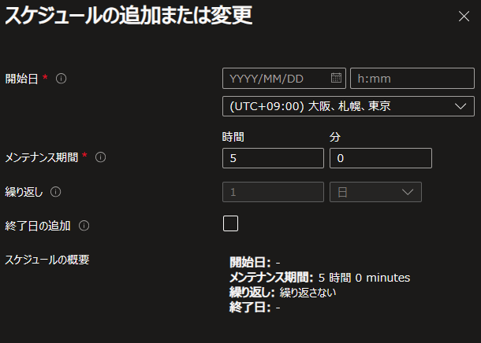

こんにちは、Azure テクニカル サポート チームです。

Azure ゲートウェイサービスでは以前からお客様よりメンテナンスのコントロールについてご要望をいただいておりました。
2023 年 11 月よりプレビュー中の機能とはなりますが、メンテナンスコントロールのための機能が実装されましたのでご紹介させていただきます。

* ご参考: [Public preview: Customer-controlled maintenance | Azure の更新情報 | Microsoft Azure](https://azure.microsoft.com/ja-jp/updates/public-preview-customercontrolled-maintenance/)

## 仮想ネットワークゲートウェイ( VGW ) メンテナンスとは
VGW ではサービスを健全に保つため、月に数回のメンテナンスを実施しており、定期メンテナンスは大きく以下の 3 種類に分類されます。

1. ゲートウェイ機能を提供するソフトウェア メンテナンス
2. ホスト基盤メンテナンス 
3. ハードウェアメンテナンス

ゲートウェイ機能を提供しているソフトウェアのアップグレードの他、一般的な VM と同様の IaaS サービス基盤上で動作しているため、
ホストで稼働するソフトウェアアップグレードやホスト、上位ネットワーク装置などハードウェアの更新などの作業を行います。
一般的にこれらは Azure サービス基盤上で自動化された作業で、冗長性を考慮し、数千、数万のリソースに対し、順次、更新を適用いたします。

* ご参考: [Azure IaaS VM で実施されるメンテナンスについて](https://jpaztech.github.io/blog/vm/vm-maintenance/)

定期メンテナンスでは極力お客様サービスに影響が発生しないように、ExressRoute ゲートウェイではトラフィックを迂回した上で実施するなどの対処を行っております。しかしながら現状、実行時に多少の通信遅延の増加、パケットロスが検出されることがあります。また VPNGW では VPN 接続で再接続が必要になることがあります。

## メンテナンスコントロール機能でできること
本機能を設定することで、 VGW リソース毎に定期メンテナンスを実行するためのメンテナンスウィンドウを指定することができます。トラフィックの少ない時間帯、営業時間外にメンテナンスウィンドウを設定いただくことにより、サービス影響を極力避けた運用が可能となります。この機能を用いても、上記の 3 種類のメンテナンスの中の "1. ゲートウェイ機能を提供するソフトウェア メンテナンス” のみの制御となりますので、**全メンテナンスを制御できるわけではございませんのでご注意ください。**

( VGW は共有リソース上で稼働しているため、ホスト基盤、ハードウェアメンテナンスについては本機能の制御対象外となります )

## 対応可能なゲートウェイの種類
対象可能な VGW の種類は下記となります。
現時点では Virtual WAN Point-to-Site GW, VirtualWAN 仮想ハブルータついては未対応です

- ExpressRoute GW
- VPNGW
- VirtualWAN Site-to-Site GW
- VirtualWAN ExpressRoute GW

## 設定例
設定方法詳細については以下ドキュメントご参照ください。

＊ご参考: [VPN Gateway にお客様が管理するゲートウェイ メンテナンスを構成する (プレビュー)](https://learn.microsoft.com/ja-jp/azure/vpn-gateway/customer-controlled-gateway-maintenance)

＊ご参考: [ExpressRoute にお客様が管理するゲートウェイ メンテナンスを構成する (プレビュー)](https://learn.microsoft.com/ja-jp/azure/expressroute/customer-controlled-gateway-maintenance)

仮想ネットワーク ゲートウェイにお客様が管理するメンテナンスを構成する - Azure VPN Gateway | Microsoft Learn

重要な設定項目としてメンテナンスウィンドウ スケジュールを指定する箇所がありますが、直観的にわかりにくいため、設定例とその動作について以下例を挙げて説明いたします。

スケジュールの設定例

 

"スケジュールの追加" を選択することで、メンテナンスウィンドウの開始時刻と許容するメンテナンス期間を設定します。
※メンテナンス期間の最小値は 5 時間で、それ以下を設定することはできません。

 

## 設定例と実際の動作について

### 設定シナリオ 1.
メンテナンス構成設定を追加した日時 1/1 9:00

#### 設定内容
- 開始日 1/31 5:00 
- メンテナンス期間 ５時間

#### 実際の動作
1/31 に計画メンテナンスがある場合
メンテナンスウィンドウ設定に従い、 1/31 5:00 ～ 10:00 の間にメンテナンスが発生します

---

### 設定シナリオ 2. 
メンテナンス構成設定を追加した日時 1/1 9:00

#### 設定内容
- 開始日 1/31 5:00 
- 終了日 2/28 23:00
- メンテナンス期間 ５時間

#### 実際の動作
2/10 に計画メンテナンスがある場合、メンテナンスウィンドウ設定に従い、 2/10 5:00 ～ 10:00 の間にメンテナンスが発生します

---

### 設定シナリオ 3.
メンテナンス構成設定を追加した日時 1/1 9:00

#### 設定内容
- 開始日 1/31 5:00 
- メンテナンス期間 5 時間

#### 実際の動作
1/15 に計画メンテナンスがある場合、**メンテナンス構成設定は働かず**、元々の計画メンテナンスの予定通り 1/15 にメンテナンスが実行されます

## 運用上注意すべき点
- メンテナンス構成設定は制御対象ゲートウェイリソースと同じリージョンに設定する必要があります
- メンテナンスウィンドウは最低 5 時間必要です
- 障害、セキュリティ対応など緊急性が要求されるメンテナンスについては制御対象外です
- 設定が即時反映されるわけではなく、反映までに最大 24 時間かかることがございます。
- VPNGW basic SKU は非対応です
- P2S GW 非対応です
- 現状 daily スケジュール( 1 日単位のスケジュール )のみ使用可能です

* ご参考: [顧客が管理するゲートウェイのメンテナンス](https://learn.microsoft.com/ja-jp/azure/vpn-gateway/vpn-gateway-vpn-faq#customer-controlled)

## 今後の予定
VirtualWAN 仮想ハブルータ, P2S GW, Application Gateway, Azure Firewall への対応時期は未定です
