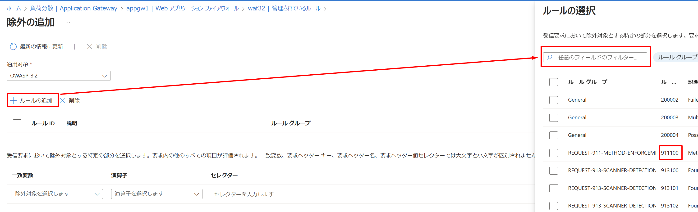
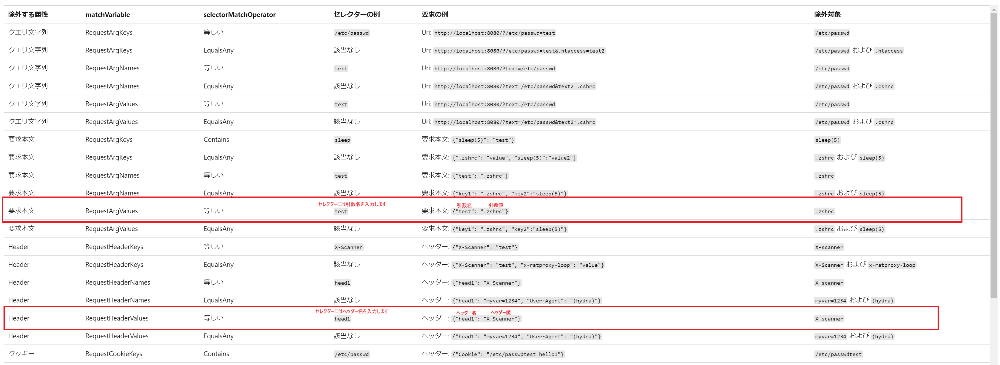
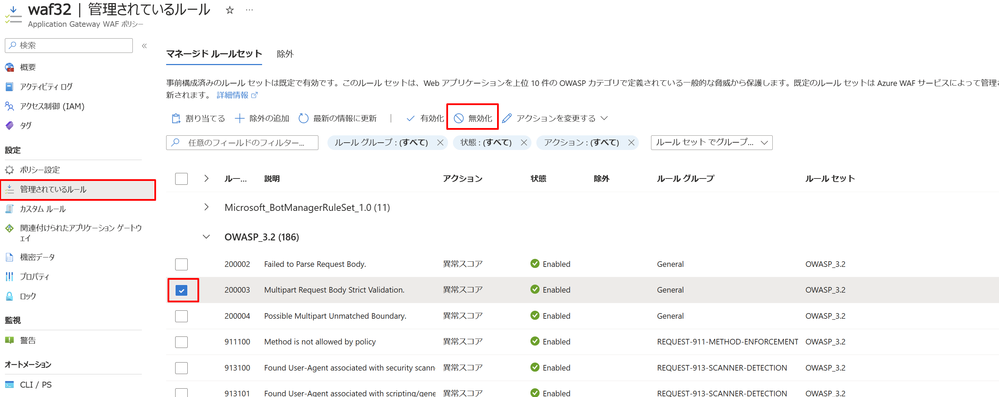

いつもお世話になっております。Azure Networking チームの庄です。

Web アプリケーションは、SQL インジェクションやクロスサイトスクリプティングなど、既知の脆弱性を悪用した攻撃のターゲットになることが多いです。Application Gateway および Azure Front Door を使用しているお客様の Web アプリケーションをそのような攻撃から保護するためには、Azure は Web アプリケーションファイアウォール（WAF）サービスを提供しています。

Application Gateway で WAF を使用する際に、本来許可されるべき通信がブロックされる事例がしばしば発生します。このような事象が発生した場合に、お客様自身がどのように初期対応を行うことができるかについて、こちらのブログではその詳細な対応方法を説明いたします。

# 誤検知が発生する際の対応方法
WAF で誤検知 (False Positive) が発生した理由は、WAF の不具合ではなく、ルールに基づく正確な検査の結果、お客様のアプリケーションにとって望ましくなく、ルール違反と判断された通信が検出されたためです。たとえば、Request Body や Header 内に攻撃と判断される文字列が存在すると、WAF によって通信がブロックされます。この結果がお客様のアプリケーションにとって望ましくない場合、その通信が WAF より誤検知されています。この記事では、WAF での誤検知が発生する際に、誤検知を回避するための対処方法につきまして紹介いたします。

## WAF 側の設定<br />
Azure WAF の設定を使って誤検知を避ける方法には、主に3つの方法があります。

### 設定方法１：除外を利用する
除外は、特定の Header や Request Body 内で誤検知が起こった部分を指定し、これらを誤検知として検出されたルールの評価から外す方法です。この方法は、本記事で紹介した 3 つの中で最も柔軟性が高いと考えられます。除外の設定は、WAF ポリシーの「管理されているルール」のページで見つけることができます。ただし、除外の設定が利用できない場合もあるので、その場合は他の設定方法の利用をご検討いただく必要があります。その具体的な設定方法については本記事他の箇所をご確認ください。
  
 

### 設定方法２：カスタム ルールを利用する
カスタム ルールを使用することで、特定の IP アドレスからの通信や特定のパスへのアクセスを WAF の評価から除外し、通信を管理されたルールから ”Bypass” するルールを作成できます。カスタム ルールは管理されたルールよりも優先され、ここで設定したルールによって通信が許可または拒否されます。カスタム ルールの設定は、WAF ポリシーの「カスタム ルール」ページで行うことができます。
  
 

### 設定方法３：特定のルールの無効化
WAF で特定のルールによる誤検知が発生した場合、そのルールを無効にすることも誤検知への対処法の一つです。ルールの無効化は、WAF ポリシーの「管理されているルール」ページで行うことができます。

 


> [!NOTE]
> これらの方法以外にも、WAF の要求本文の検査を無効にすることが考えられますが、これを行うと WAF が Request Body の検査を行わなくなり、セキュリティ リスクが高まる可能性があります。この無効化を検討する場合は、サーバー側でのセキュリティ対策の実施をお勧めします。

## アプリケーション側の対応

WAF 側の設定だけでは要件を満たさない場合、アプリケーション側での対策が解決策の一つになります。例えば、ユーザー情報をフォームで収集するアプリケーションを開発する際に、フォーム入力で「#」や「%」のような、攻撃に利用される可能性のある文字の使用を制限する設定を追加することで、ユーザーがこれらの文字を含むリクエストを送信することによる誤検知を防ぐことができます。具体的にどのような文字列が管理されたルールに一致するかについては、お客様ご自身で OWASP コミュニティのサイトや Core Rule Set の GitHub ページなどで確認する必要があります。
  
[OWASP ModSecurity Core Rule Set](https://owasp.org/www-project-modsecurity-core-rule-set/)

[Core Rule Set の GitHub](https://github.com/coreruleset/coreruleset)

# ログ

誤検知が発生した場合、その原因を理解することが最初のステップです。具体的には、どのルールによって誤検知が起きているのか、そしてその誤検知の原因が何なのかを WAF のログから把握する必要があります。この情報がなければ、誤検知を避けるための適切な対策を講じることができません。WAF のログは、WAF に関連付けられた Application Gateway のログで以下のクエリを実行することで確認できます。

```CMD
AzureDiagnostics 
| where ResourceProvider == "MICROSOFT.NETWORK" and Category == "ApplicationGatewayFirewallLog"
```
このクエリを実行すると、次のような形式のログが出力されます。誤検知を避けるためには、WAF の設定で特定のログフィールドに注意を払う必要があります。該当するフィールドは下の図の赤い枠で示されています。詳しいについては、「WAF ログのフィールド」セクションをご覧ください。
  


上記のクエリ以外にも、以下のドキュメントには様々な WAF ログのクエリ例が記載されています。ご参考いただければと存じます。
  
[Log Analytics を使用して Application Gateway Web アプリケーション ファイアウォール (WAF) のログを調べる](https://learn.microsoft.com/ja-jp/azure/application-gateway/log-analytics)

## WAF ログのフィールド
誤検知に対応するためには、以下の WAF ログのフィールドを理解する必要があります。

### フィールド１：ruleSetType & ruleSetVersion
ruleSetType と ruleSetVersion は、特定の通信がどのルールセット内のどのルールに一致しているを表示します。特に WAF ポリシーに複数のバージョンのルールセットが設定されている場合、正しいバージョンのルールセットに対して除外を作成する必要があるので、こちらのフィールドの参照が必要です。

### フィールド２：ruleId
ruleId は、特定の通信がどのルールに一致しているかを示します。OWASP 3.2 以上の WAF ポリシーを利用する際には、こちらのフィールドの参照して、除外を作成するときに正しいルールを選択する必要があります。

### フィールド３： details_data
ルールにマッチした原因は、WAF ログの details_data で確認できます。通常、以下の形式でマッチした内容を確認できます。


#### 上図 ① の部分について
① は、通常、マッチした文字列です。例えば、Request Body に「#」が含まれているためにルールによって検出された場合、①には「#」が表示されます。

#### 上図 ② の部分について
② は、通常、Request Body のどの部分にマッチする文字列が含まれているかを示します。例えば、ある Header 名に「#」が含まれている場合、② には「HeaderName」が表示されます。② に表示されるものはマッチしたルールの種類（OWASP や Bot Manager Rule など）によって異なることがあります。

#### 上図 ③ の部分について
 ③ は、② の内容と関連しています。② が要求本文フィールドの名前「xxxName」を示している場合、③ではその具体的な要求本文フィールド名が表示されます。例えば、 Header 名に不正な文字「#」が含まれてWAFによって検出された場合、③ にはその Header 名を表示します。また、「XXX : YYYY」という形式で表示される場合もあります。これは、要求本文フィールド値に不正な文字列が検出された場合のログ表示形式です。

> [!NOTE]
> details_data に「Inbound Anomaly Score Exceeded」（受信異常スコア超過）というメッセージが記載されている場合、実際の検出原因は同じ Transaction ID を持つ他のログで確認できます。詳細については、下記の異常スコアのドキュメントを参照していただければ幸いです
> [Web Application Firewall の DRS および CRS の規則グループと規則 ｜異常スコアリング](https://learn.microsoft.com/ja-jp/azure/web-application-firewall/ag/application-gateway-crs-rulegroups-rules?tabs=drs21#anomaly-scoring)
>
### フィールド ４：action
 WAF の Action は、検出された通信に対して実施された操作を示します。ログのアクションフィールドには、「Matched」と「Blocked」の二つの値がありますが、表示される値は WAF ポリシーのモードによって異なります。

#### ポリシー モード : 検出 
検出モードでは WAF は Allow や Block といったアクションを実行しませんので Detected のみが記録されます。

#### ポリシー モード : 防止
Allowed : 通信がカスタムルールなどにより、WAF から許可された場合に表示されます。
Blocked : 特定のルールに一致する要求が検出され、危険と判断されたため、通信は WAF  によってブロックされます。
Matched : 一部の条件に一致する要求がある場合、WAF はさらに評価を行い、最終的な異常スコアリングルールに基づいて、要求をブロックするかどうかを決定します。
Log : 防止モードで記録される Action です。カスタムルールの Action (結果の欄) に "トラフィックのみをログに記録する" を指定した場合に、WAF ログの Action フィールドには、Log という値が記録されます。

# 除外
除外を作成する際には、ログに検出された内容に基づいて除外を作成します。しかし、利用中の WAF ポリシーのバージョンにより、設定できる除外のパラメーターが異なります。

| 除外 | CRS 3.1 以前 | CRS 3.2 以降 |
| ------------ | ------------ |------------ |
| キーと値による要求属性の除外| × | ○ |
| ルールごとの除外 | × | ○ |
| 要求属性の大小文字区別| 区別しません |  Header 以外は区別します |

## 設定フィールド：適用対象


OWASP 3.2 以降の WAF ポリシーの除外設定では、ログの ruleSetType & ruleSetVersion フィールドに記載された内容に基づいて、適切なルールセット バージョンを選択する必要があります。例えば、誤検知が発生した際に ruleSetType & ruleSetVersion が以下の値を表示している場合、適用対象として OWASP_3.2 を選択する必要があります。

|ruleSetType  |ruleSetVersion |
| ------------ | ------------ |
| OWASP CRS |3.2|

OWASP 3.1 以前の WAF ポリシーの除外設定では、グローバル除外(すべての WAF ルールに適用するように除外)のみ設定可能です。

## 設定フィールド：ルールの追加


OWASP 3.2 以降の WAF ポリシーを利用する際には、ログに記載された ruleId フィールドに基づき、除外を適用したい特定のルールを選択します。「ルールの追加」ボタンをクリックしてルール検索ページを開き、ログに表示された ruleId フィールドに記載されたルール ID を検索することで、除外を適用する対象となるルールを選び出せます。この操作により、特定のルールに対してのみ除外を適用でき、他のルールにマッチした場合は除外が適用されません。
OWASP 3.1 以前の WAF ポリシーの除外設定では、こちらのルールの追加ができません。
  
## 一致変数
OWASP 3.2 以降の WAF ポリシーでは、以下の一致変数が設定できます。


OWASP 3.1 以前の WAF ポリシーでは、以下の一致変数が設定できます。


一致変数の選択は、details_data 内の ② の値に基づいて行います。


② の値と一致変数の対応例は以下の通りです。

|②の値  |一致変数の選択 |
| ------------ | ------------ |
| xxxKey|要求xxxキー|
| xxxName|要求xxx名|
| xxxValue|要求xxx値|
|Args|要求引数値|

## 演算子
演算子の選択には「次の値で始まる」、「次で終わる」、「次の値に等しい」、「次の値を含む」、「いずれかと等しい」といったオプションがあります。その中で特に注意が必要なオプションとして、「いずれかと等しい」を利用する場合、セレクターに設定される値に関わらず、「*」がセレクター値として適用されます。詳細は以下のドキュメントに関連記事があります。

[Web アプリケーション ファイアウォールの除外リスト](https://learn.microsoft.com/ja-jp/azure/web-application-firewall/ag/application-gateway-waf-configuration?tabs=portal#identify-request-attributes-to-exclude)

## セレクター
セレクターでは、基本的には、details_data 内の ① の値に基づいて行いますが、セレクターを設定できないものがあります。

### セレクターに使用できるのは文字、数字、句読点のみです
セレクターのフィールドでは、文字、数字、句読点以外の入力が許可されていません。そのため、details_data 内の ① の値に特殊文字が含まれている場合、セレクターにその文字を直接設定することはできません。例えば、「Hea#der」という名前の Header が WAF によって「#」の存在で検出された場合、① には「#」が表示されます。しかし、セレクター内では「#」の入力が許可されていないため、演算子として「次の値を含む」を選択し、セレクターには「Hea」や「der」といった値を選んで除外設定を行うことで、該当する Header を除外することが可能です。

### 効果がない除外設定

details_data で検出された要求 xxx 値に基づいて除外を設定する際、WAF は特定の文字列を含む値に対して除外を適用できないため、以下のような除外設定では効果がありません。

|検知内容  |
| ------------ |
|   Matched Data: **#12** found within **ARGS** : **page**: **#1234** |

|効果がない除外の設定 | 効果がある除外の設定
| ------------ |------------ |
| 一致変数：要求引数値 | 一致変数：要求引数値 |
| 演算子： 次の値を含む | 演算子： 次の値を含む |
| セレクター： 12 or 34| セレクター： page|

|検知内容  |
| ------------ |
|   Matched Data: **#** found within **CookieValue** : **co**: **#aaaa** |

|効果がない除外の設定 | 効果がある除外の設定 |
| ------------ | ------------ |
| 一致変数：要求引数値 |一致変数：要求引数値 |
| 演算子： 次の値を含む | 演算子： 次の値を含む |
| セレクター： a or aa| セレクター： co|

上記の効果がない除外の設定例と効果がある除外の設定例を比較すると、details_data に値で検出された場合、セレクターには検出された値をセレクターに入力すると、除外の効果がありません（例：Header 値がマッチした場合は、セレクターにその Header 値を入力）。

details_data に値で検出された場合、効果がある除外を作成するためには、検出された値を含んでいる要求本文フィールドの名前をセレクターに入力する必要があります（例：Header 値がマッチした場合は、セレクターにその Header 名を入力）。

上記の例以外にも、以下のドキュメントには様々な除外例が記載されています。

[要求属性の例](https://learn.microsoft.com/ja-jp/azure/web-application-firewall/ag/application-gateway-waf-configuration?tabs=portal)



## カスタム ルール

カスタム ルールを使用することで、特定のクエリ ストリングが含まれる URI、特定の IP アドレスからのアクセス、または特定のパスへのアクセスを許可することが可能ですが、具体的なルール設定はお客さんに決める必要があります。これらのカスタム ルールは、管理されたルールよりも高い優先順位を持ちます。カスタム ルールによって通信が許可または拒否された場合は、管理されたルールと他の優先度が低いカスタム ルールに評価されないことが想定された動作です。カスタム ルールの設定は、WAF ポリシーの「カスタム ルール」ページで行うことができます。カスタム ルールで設定できるフィールドにつきましては、以下のドキュメントをご参照ください。

[Azure Application Gateway の Web アプリケーション ファイアウォール v2 カスタム規則](https://learn.microsoft.com/ja-jp/azure/web-application-firewall/ag/custom-waf-rules-overview)

## 特定のルールの無効化
WAF においては、個々のルールを無効化したり、ルールごとに特定のアクションを指定したりすることが可能です。ルールを無効化することで、WAF を介した通信がそのルールに基づいて評価されなくなります。ただし、管理されたルールの中には無効化ができないルールも存在する点にはご注意ください。


# サポートからの支援
もしブログに記載されている方法でお客様の誤検知事象が解消されない場合は、サポート窓口にて調査を行うことができます。スムーズに状況を確認するために、WAF にアクセスし、通信がブロックされた際の HAR ファイルなどの基本的な切り分け情報を添付していただくことをお願いします。

[HAR ファイルの取得手順](https://learn.microsoft.com/ja-jp/azure/azure-portal/capture-browser-trace)


